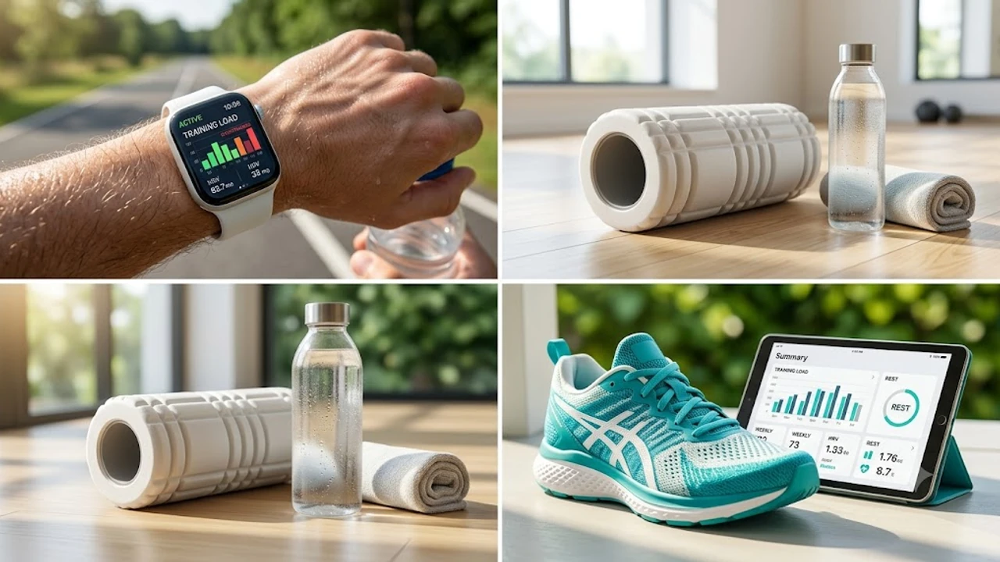

가을 마라톤 준비나 헬스장 고중량 세션을 이어가다 보면 스마트워치 화면에 붉은색 경고가 뜨는 순간을 마주합니다. **애플워치 훈련부하** 수치가 기준치를 훌쩍 넘겼을 때, 계획대로 러닝화를 신어야 할지 아니면 곧장 폼롤러 위로 직행해야 할지 판단이 서지 않기 마련입니다. 생체 신호 트래킹 데이터와 신체 피로도가 엇갈릴 때 부상 없이 컨디션을 지키는 실전 판단 기준을 정리했습니다.

## 애플워치 훈련 부하 지표의 원리와 위험 신호

### 7일간의 충격량과 28일 기준선의 비교 메커니즘
애플워치는 단순히 하루 소모 칼로리만 계산하지 않습니다. 과거 28일 동안 축적된 장기적 심장 강화 운동량을 기준선으로 삼고, 최근 7일간 신체에 가해진 단기 충격량을 비교해 훈련 부하 지수를 산출합니다.
* **급성 부하(Acute Load):** 최근 일주일간 달리기, 인터벌 트레이닝 등으로 심박수가 급상승한 세션의 가중치 합산
* **만성 부하(Chronic Load):** 한 달간 몸이 적응한 평균 체력 수준의 베이스라인

급성 부하가 만성 부하보다 1.5배 이상 가파르게 치솟으면 알고리즘은 '기준치 초과'로 판정하며 부상 위험도를 경고합니다.

### 기준치 초과 알림이 떴을 때 신체가 겪는 생리학적 변화
단순한 근육 뻐근함과 신경계 과부하는 전혀 다른 영역입니다. 급성 훈련 부하가 한계치를 넘어서면 혈중 코르티솔 농도가 급등하면서 근육 합성 효율이 급격히 떨어집니다.
> "피로는 운동 세션 도중이 아니라, 운동이 끝난 뒤 심장이 평상시 박동으로 돌아가는 속도에서 가장 먼저 드러난다."

실제로 자율신경계가 억제 모드로 전환되지 못하면 모세혈관 회복 속도가 지연되어 건염(Tendonitis)이나 족저근막염 같은 결합조직 손상으로 직결됩니다.

### 오버트레이닝 증후군을 예고하는 심박수 및 활력 징후 패턴
훈련 부하 경고와 함께 다음 세 가지 징후가 겹친다면 이미 오버트레이닝 초기 단계에 진입했을 확률이 큽니다.
* **기상 직후 안정 시 심박수(RHR):** 평소 평균치보다 5~8bpm 이상 높게 지속
* **호흡수 증가:** 수면 중 분당 호흡수가 평소보다 분당 1~2회 빨라짐
* **손목 체온 미세 상승:** 감기 증상이 없는데도 기준선 대비 0.3~0.5℃ 높은 상태 유지

## 수치에만 의존하면 생기는 문제점과 한계

### 단순 심박수 기반 측정과 근골격계 피로도의 불일치
애플워치의 부하 지표는 기본적으로 심박수와 운동 시간, 그리고 사용자가 직접 입력한 운동 노력도(1~10점)에 의존합니다. 이로 인해 심폐 지구력 훈련과 근력 운동 간의 측정 격차가 발생합니다.
- 심박수가 160bpm을 넘나드는 10km 지속주는 높은 부하 점수로 기록됩니다.
- 반면 대퇴사두근과 햄스트링 조직을 한계까지 몰아붙인 고중량 스쿼트 세션은 세트 간 휴식 시간 탓에 평균 심박수가 낮게 잡혀 부하 수치가 과소평가되기 쉽습니다.

수치가 '안정적'이라고 해서 관절과 인대까지 온전하다는 뜻은 아닙니다. 웨어러블 장비의 신호 체계를 맹신하기보다 [2026 스마트워치 운동 진짜 효과 보는 법](/posts/health/wearable-data-smart-pacing-fitness-2026/)을 참고해 데이터의 오차 범위를 이해하는 안목이 필요합니다.

### 스마트워치 지표 맹신 vs 실제 체감 피로도의 격차
수치상으로는 '적정 부하' 구간에 머물러 있어도 업무 스트레스나 수면 부족으로 인해 체감 피로도(RPE)가 바닥을 치는 날이 있습니다. 화면 속 숫자가 녹색 불이라고 해서 몸살 기운을 억누르고 트랙을 질주하는 것은 피트니스 트래커를 거꾸로 활용하는 전형적인 실수입니다. 수치는 어디까지나 보조 지표일 뿐, 기립 시 무릎 주변의 뻐근함이나 전신 무력감을 우선순위에 두어야 합니다.

### 전문 스포츠 기기 대비 애플워치 회복 알고리즘의 특성
가민이나 코로스는 심박변이도(HRV) 스트레스 테스트와 젖산 역치 값을 세밀하게 연동하는 반면, 애플워치는 일상 친화적인 추세선 제시에 초점을 맞춥니다. 세밀한 파워 미터나 페이스 조절용으로는 직관성이 뛰어나지만, 순간적인 신경계 고갈 상태를 즉각 반영하는 반응 속도는 다소 완만합니다.

## 훈련 부하 빨간불일 때 당일 운동 결정 루틴

### 1단계: 안정 시 심박수와 심박변이도(HRV) 교차 점검
화면에 훈련 부하 초과 경고가 떴다면 당일 아침 활력 징후 앱에서 **SDNN 기반 심박변이도**를 확인합니다.
1. **부하 초과 + HRV 정상 범위 유지:** 근육통만 가볍게 남아있는 상태라면 운동 강도를 20~30% 낮춰 진행 가능
2. **부하 초과 + HRV 급감(평소 대비 20% 이상 하락):** 교감신경 과항진 상태이므로 고강도 세션을 전면 취소하고 휴식 전환

### 2단계: 완전 휴식 vs 능동적 회복의 분기점
신경계 과부하 판정이 나왔을 때 침대에 가만히 누워만 있는 것이 능사는 아닙니다.
* **완전 휴식이 필요한 경우:** 관절에 찌르는 듯한 국소 통증이 있거나, 미열 및 수면 장애가 겹친 상태
* **능동적 회복이 나은 경우:** 전신 뻐근함 위주의 근육 피로라면 가벼운 산책이나 [존2 유산소 운동법, 진짜 살 빠질까?](/posts/health/zone-2-cardio-fat-burn-routine-2026/) 원리를 적용해 최대 심박수의 60~70% 선에서 30분 안팎으로 가볍게 몸을 풀어 젖산 배출을 돕는 전략이 효과적입니다.

### 3단계: 근력 운동 분할 및 유산소 인터벌 세션 재조정
당일 스케줄이 고강도 하체 운동이나 400m 인터벌 러닝이었다면 즉각 프로그램을 변경해야 합니다.
- 스쿼트, 데드리프트 대신 상체 보강용 머신 운동(케이블, 시티드 로우)으로 중추신경계 부담 분산
- 트랙 전력 질주 세션은 평지 조깅이나 실내 자전거 고정 케이던스 페달링으로 대체

## 부상 없이 운동 강도를 끌어올리는 장기 페이싱 전략

### 주간 훈련 부하 증가율 10% 룰 적용법
심폐 기능과 근육은 빠르게 강해지지만 관절, 건, 인대 같은 결합조직은 혈류 공급이 적어 적응하는 데 최소 3~4배의 시간이 더 걸립니다.
- 지난주 누적 달리기 거리가 30km였다면 이번 주는 최대 33km를 넘기지 않아야 부상 안전권에 듭니다.
- 애플워치의 7일 부하 막대그래프가 28일 기준선 밴드 상단을 완만하게 타고 올라가도록 주당 10% 이내의 점진적 과부하를 유지하는 배치가 기본입니다.

### 수면 데이터와 결합한 맞춤형 리셋 데이 설정 팁
수면 추적 기능에서 깊은 수면 비율이 전체의 15% 미만으로 떨어진 날이 이틀 연속 이어진다면, 주말 장거리 세션을 과감히 반토막 내야 합니다.
- 매주 특정 요일을 '완전 비움(Active Rest)' 요일로 고정
- 고강도 훈련 다음 날에는 취침 전 하체 모세혈관 이완과 림프 순환을 돕는 정적 스트레칭에 15분 이상 투자

지속적인 오버트레이닝 경고를 무시한 채 운동을 밀어붙이면 수 주간 운동을 아예 쉬어야 하는 건염으로 이어집니다. 무리한 운동 후 뭉친 햄스트링과 종아리 근막 피로를 빠르게 풀어주려면 전용 도구를 활용해 매일 밤 물리적인 회복 루틴을 챙기는 편이 부상 방지에 유리합니다.

[마사지건 및 근육 회복 롤러 쿠팡에서 보기](https://www.coupang.com/np/search?q=%EA%B1%B4%EA%B0%95%EA%B8%B0%EA%B8%B0%20%EB%A7%88%EC%82%AC%EC%A7%80%EA%B8%B0&sourceType=affiliate&trackingCode=AF8691300)

#애플워치훈련부하 #오버트레이닝증후군 #심박변이도 #러닝부상예방 #존2유산소 #스마트워치운동 #근육회복루틴