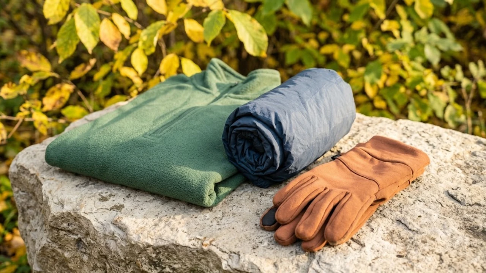

아침저녁으로 찬 바람이```markdown
가을철 선선한 공기는 야외 활동 욕구를 자극하지만, 해가 지는 순간 체온은 생각보다 훨씬 빠르게 떨어집니다. 한낮 기온만 믿고 가벼운 옷차림으로 나섰다가 땀이 식으면서 급격한 오한을 겪는 사례가 흔합니다. 환절기 야외 운동에서 안전과 컨디션을 온전히 지키는 체온 관리 실전 요령을 정리했습니다.


## 땀 배출과 방풍을 동시에 잡는 3단계 레이어링

가을 운동복은 두꺼운 겉옷 한 벌보다 얇은 옷을 겹쳐 입는 편이 체온 조절에 훨씬 효과적입니다. 움직일 때 발생하는 열과 땀의 증발 속도를 통제해야 후폭풍처럼 밀려오는 한기를 막을 수 있습니다.

### 베이스 레이어의 핵심은 빠른 건조
피부에 직접 닿는 첫 번째 층은 땀을 빠르게 흡수하고 날려 보내는 폴리에스터나 메리노 울 소재를 골라야 합니다. 면 소재 의류는 땀을 머금고 마르지 않아 피부 표면 온도를 뺏는 주원인이 되므로 야외 유산소 운동 시 피하는 것이 안전합니다.

### 미드 레이어로 데드에어 형성하기
중간층은 체온으로 데워진 공기층을 가둬두는 보온 역할을 맡습니다. 얇은 플리스나 하프 집업 형태의 기능성 티셔츠는 활동 중 더워질 때 지퍼를 내려 환기하기 수월합니다.

### 아우터는 방풍과 투습 기능 중심
바람막이는 외부 냉기를 차단하고 내부 습기를 배출하는 투습 원단을 선택합니다. 기온 변화에 맞춰 즉시 벗거나 덧입을 수 있도록 주머니나 작은 팩에 수납되는 초경량 제품이 다루기 편합니다.

## 심부 체온을 급격히 떨어뜨리는 바람과 땀의 메커니즘

몸이 젖은 상태에서 바람을 맞으면 열전도율이 마른 상태보다 20배 이상 빨라집니다. 한낮 러닝이나 라이딩을 마친 직후 찾아오는 으스스한 떨림은 단순한 피로가 아닌 초기 저체온 증상일 가능성이 큽니다.

### 땀 증발 잠열에 의한 급랭 방지
운동 강도를 낮추는 쿨다운 구간에 접어들면 열 생산은 급감하지만 피부 표면의 수분은 증발하면서 열을 계속 빼앗아 갑니다. 본 운동을 마치자마자 마른 수건으로 땀을 닦아내고 마른 겉옷을 걸치는 습관이 필수적입니다.

### 체열 손실 4대 경로 차단
전도, 대류, 복사, 증발 중 가을철에 가장 경계해야 할 요소는 찬 공기 순환(대류)과 땀(증발)입니다. 땀에 젖은 상의를 입은 채 찬 바람을 맞으며 장시간 휴식하는 행동은 피해야 합니다.



## 말초 혈관 수축을 막는 소품 활용법

손발과 목덜미는 혈관이 얇게 분포해 외부 기온 변화에 가장 취약한 부위입니다. 몸통 보온만큼이나 말초 부위를 감싸는 액세서리를 챙기면 적은 부피로도 체감 온도를 3~4도 이상 끌어올릴 수 있습니다.

### 목과 귀를 보호하는 넥워머와 헤드밴드
목은 굵은 혈관이 지나가 열 손실이 가장 크게 일어나는 길목입니다. 가벼운 버프나 넥게이터를 착용하면 목으로 파고드는 냉기를 막고 호흡기 건조까지 예방합니다.

### 찬 공기 직격을 막는 방풍 장갑
손끝은 기온이 내려가면 혈관이 수축해 가장 먼저 감각이 둔해집니다. 가을철에는 방풍 처리가 된 얇은 러닝 장갑이나 사이클링용 풀핑거 장갑을 준비해 그립감과 보온성을 함께 확보합니다.

## 운동 전후 에너지 보충과 즉각적인 수분 섭취

기온이 떨어지면 신체는 스스로 열을 내기 위해 평소보다 글리코겐을 빠르게 소모합니다. 공복 상태로 찬 바람을 맞으며 장시간 운동하면 저혈당과 저체온증이 겹쳐 신체 기능이 급격히 저하됩니다.

### 출발 전 복합 탄수화물과 전해질 보충
운동 1~2시간 전 소화가 잘되는 통곡물이나 바나나를 섭취해 에너지원을 비축해 둡니다. 찬물 대신 미지근한 이온음료를 지참해 갈증을 느끼기 전 한 모금씩 마시는 편이 내장 체온 유지에 유리합니다.

### 운동 직후 체온 복구 루틴
운동을 끝낸 후 30분 이내에 따뜻한 물로 샤워하고 가벼운 단백질 음료나 온수를 섭취해 떨어진 대사율을 끌어올립니다. 휴대용 보온병에 담아둔 따뜻한 차 한 잔은 야외 현장에서 즉각적으로 속을 덥히는 안전장치가 됩니다.

찬 바람 부는 계절 야외 운동 시 체온 저하를 효과적으로 막아주는 [기능성 러닝 방풍자켓 및 보온 용품 살펴보기](https://link.coupang.com/a/custom?trackingCode=AF8691300)를 통해 실시간 기온에 맞는 장비를 꼼꼼히 점검해 보시기 바랍니다.

#가을운동 #저체온증예방 #환절기러닝 #레이어링팁 #러닝바람막이 #야외운동보온 #가을라이딩