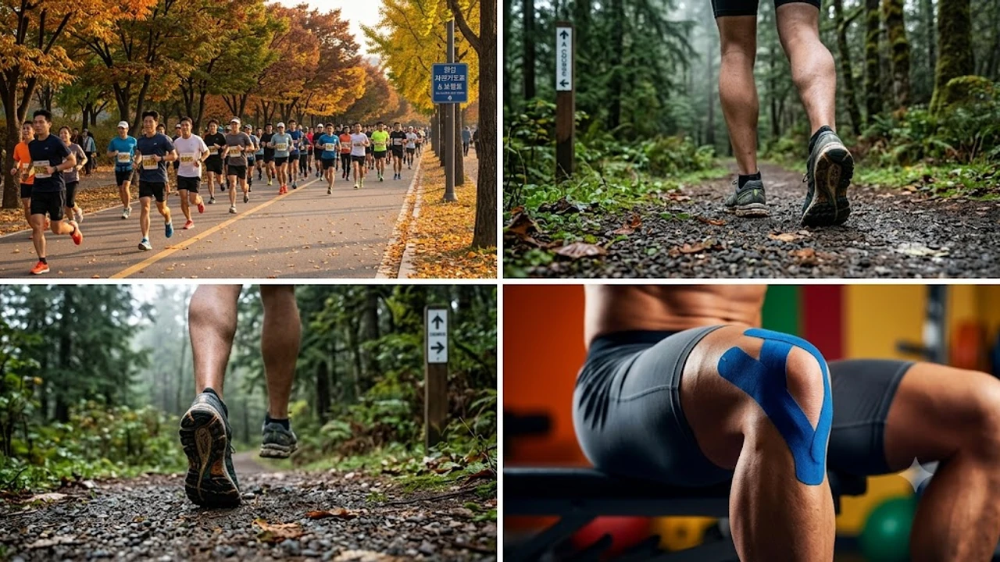

가을철 선선한 바람이 불기 시작하면 야외 러닝을 즐기는 인구가 급증하지만, 낮아진 기온에 근육이 수축된 상태에서 무리하게 달리면 **가을 러닝 부상** 위험이 급격히 높아집니다. 급격한 페이스 상승과 주행 거리 증가는 장경인대염이나 무릎 슬개건염 같은 과사용 증후군으로 직결되기 십상입니다. 체계적인 부상 방지 루틴과 관절 보호 원칙을 익혀야 선선한 날씨 속에서도 통증 없이 오래 달릴 수 있습니다.

## 가을철 러닝 인구 급증과 무릎 통증의 상관관계

### 일교차와 관절 유연성 저하가 부르는 부상 위험
기온이 10도 이상 떨어지는 환절기에는 체내 혈관과 근육이 자연스럽게 수축합니다. 관절 주변을 감싸는 인대와 힘줄의 탄성이 떨어진 상태에서 지면 착지 충격을 흡수하면 무릎 관절 내부의 압력이 평소보다 크게 증가합니다.

- 준비 운동 없이 차가운 공기를 마시며 바로 전력 질주하는 행위는 햄스트링 염좌를 유발합니다.
- 지면 온도가 낮아 노면이 딱딱하게 느껴지는 아스팔트 주로에서는 발목과 무릎으로 전달되는 반발력이 배가됩니다.
- 초기 10분간은 빠른 걸음이나 가벼운 조깅으로 심박수를 서서히 올리는 워밍업이 필수적입니다.

### 무릎 바깥쪽이 찌릿한 러너스 니 초기 증상 진단
달릴 때 무릎 바깥쪽 외측 대퇴골 돌기 부위가 마찰하듯 찌릿하다면 장경인대 마찰 증후군(Runner's Knee)을 의심해야 합니다. 계단을 내려갈 때 무릎 앞쪽이 뻐근하거나 쑤시는 증상 역시 슬개대퇴 통증 증후군의 전형적인 신호입니다.

> "약간 뻐근하지만 달리면 열이 올라 괜찮아진다"는 느낌으로 통증을 방치하면 만성 활액막염으로 진행되어 수개월간 달리기를 멈춰야 할 수 있습니다.

초기 통증이 감지되면 즉시 주행을 멈추고 얼음찜질과 소염 대책을 세워야 하며, 심박수를 안정적으로 통제하는 유산소 훈련법을 병행하는 것이 안전합니다. 평소 체력 안배와 부상 예방을 위해 [존2 유산소 운동법, 진짜 살 빠질까?](/posts/health/zone-2-cardio-fat-burn-routine-2026/) 원리를 참고해 페이스를 조절해 보세요.

## 부상 없이 주행 거리를 늘리는 10% 증량 원칙

### 지난주 기준 거리·시간 10% 제한의 과학적 근거
의욕이 앞선 러너들이 가장 흔히 범하는 실수는 날씨가 좋아졌다는 이유로 주간 누적 거리를 20~30% 이상 급격히 늘리는 것입니다. 결합조직(인대, 건, 연골)은 근육보다 혈류량이 적어 적응 속도가 현저히 느립니다.

- **점진적 과부하**: 주간 총 주행 거리는 직전 주 대비 최대 10% 이내에서만 늘려야 합니다.
- **예시 계산**: 지난주 누적 20km를 달렸다면, 이번 주는 최대 22km까지만 목표치로 설정합니다.
- 시간 기준 러너 역시 60분 지속주를 소화했다면 다음 세션은 66분을 넘지 않도록 제한합니다.

### 오버트레이닝 방지를 위한 주 3~4회 분할 달리기
매일 달리는 것보다 회복 시간을 확보하는 것이 관절 연골 재생에 훨씬 유리합니다. 주 7일 중 3~4회만 주로에 나서고, 나머지 요일은 완전 휴식 또는 관절에 체중이 실리지 않는 대체 훈련을 배치합니다.

- 월·수·토 달리기, 화·목 하체 보강 및 코어, 금·일 완전 휴식 등의 분할 루틴을 구성합니다.
- 피로가 누적된 상태에서 러닝을 강행하면 착지 시 둔근이 비활성화되면서 무릎 안쪽으로 하중이 쏠립니다.
- 통증이 발생한 뒤 쉬는 것은 늦습니다. 피로가 감지될 때 선제적으로 휴식일을 하루 추가하는 유연성이 장기 레이스의 비결입니다.

## 흔들림 잡고 관절 보호하는 싱글 레그 보강 운동

### 런지와 스텝업으로 한 발 착지 밸런스 잡기
달리기는 본질적으로 한 발로 연속해서 뛰어오르고 착지하는 '외발 지지 운동'의 연속입니다. 양발로 하는 스쿼트만으로는 달릴 때 발생하는 골반의 좌우 흔들림(트렌델렌버그 징후)을 통제하기 어렵습니다.

- **워킹 런지**: 보폭을 일정하게 유지하며 앞무릎이 발끝 앞으로 과도하게 쏠리지 않도록 둔근에 체중을 싣습니다.
- **박스 스텝업**: 30~40cm 높이의 벤치에 한 발로 올라서며 지지하는 다리의 대둔근을 강하게 수축합니다.
- 반동을 쓰지 않고 천천히 버티며 내려오는 편심성 수축 동작이 무릎 주변 건 인대 강화에 탁월합니다.

### 둔근 및 햄스트링 강화를 위한 타깃 운동
무릎 통증의 근본 원인은 대부분 무릎 자체가 아닌 고관절 주변 중둔근의 약화에 있습니다. 중둔근이 대퇴골을 단단하게 잡아주지 못하면 다리가 안쪽으로 내회전되면서 무릎 관절에 비틀림 스트레스가 누적됩니다.

- 사이드 라잉 레그 레이즈와 클램쉘 동작을 러닝 전 활성화 루틴으로 15회씩 3세트 진행합니다.
- 싱글 레그 데드리프트는 햄스트링과 둔근, 발목 고유수용감각을 동시에 강화해 지면 착지 충격을 분산시킵니다.
- 발바닥 아치(족궁) 근육을 활성화하는 쇼트풋 운동을 병행하면 족저근막염과 정강이 통증(신스프린트)을 동시에 방지합니다.

## 체온 유지와 심박수 안정을 돕는 쿨다운 루틴

### 달린 직후 급정지 방지와 3~5분 점진적 보행
목표 거리를 채운 뒤 제자리에 털썩 주저앉거나 갑작스럽게 멈춰 서면 하체로 쏠린 혈류가 심장으로 원활히 복귀하지 못합니다. 이는 어지럼증과 젖산 정체를 유발하며 근육 경련 위험을 키웁니다.

- 목표 지점에 도달한 뒤 즉시 멈추지 않고 최소 3분간 가벼운 뜀박질에서 빠른 보행으로 속도를 줄입니다.
- 가을철에는 땀이 식으면서 체온이 급격히 내려가므로 윈드브레이커를 걸쳐 몸을 보온한 상태에서 정리 운동을 진행합니다.
- 천천히 호흡을 가다듬으며 분당 심박수가 100회 미만으로 떨어질 때까지 걷기를 이어갑니다.

### 대퇴사두근 및 종아리 정적 스트레칭 가이드
체온이 유지된 상태에서 굳어지기 쉬운 주요 근육군을 20~30초간 길게 늘려줍니다. 반동을 주는 스트레칭은 근방추를 자극해 오히려 근육을 수축시키므로 지그시 호흡을 내쉬며 유지하는 방식이 안전합니다.

- **대퇴사두근 이완**: 선 자세에서 한쪽 발목을 엉덩이 쪽으로 당겨 허벅지 앞쪽을 늘려줍니다.
- **종아리 비복근·가자미근 스트레칭**: 벽을 밀며 뒷발 뒤꿈치를 바닥에 완전히 붙여 아킬레스건을 신장합니다.
- 훈련 후 굳은 하체 근육을 부드럽게 이완하고 미세 피로를 제때 풀어주는 홈케어 장비를 병행하면 회복 주기를 앞당길 수 있습니다. [무릎 및 다리 마사지기 쿠팡에서 보기](https://www.coupang.com/np/search?q=%EA%B1%B4%EA%B0%95%EA%B8%B0%EA%B8%B0%20%EB%A7%88%EC%82%AC%EC%A7%80%EA%B8%B0&sourceType=affiliate&trackingCode=AF8691300) 등을 활용해 하체 피로도를 체계적으로 관리해 보세요.

#가을러닝부상 #러너스니 #무릎통증예방 #마라톤훈련법 #러닝보강운동 #장경인대염 #쿨다운스트레칭 #러닝무릎보호