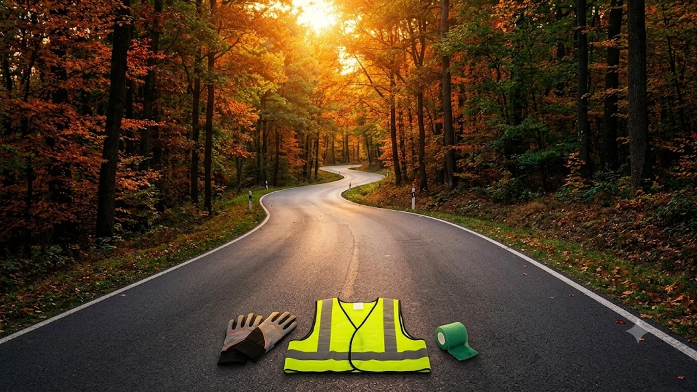

선선한 바람이 불어오는 9월은 야외 달리기에 최적의 계절이지만 갑작스럽게 늘어난 운동량 탓에 **가을 러닝 부상** 위험이 급증합니다. 여름철 무더위로 운동을 쉬다가 단풍철 마라톤 대회를 앞두고 무리하게 거리를 늘리면 하체 관절과 힘줄에 과부하가 걸리기 쉽습니다. 올바른 주법과 스트레칭 루틴을 통해 관절 손상을 선제적으로 방어해야 가을 내내 건강한 러닝 라이프를 유지할 수 있습니다.

## 가을 러닝 시작 전 체크해야 할 부상 신호

### 9월 마라톤 시즌 급증하는 정강이와 아킬레스건 통증
기온이 떨어지는 9월에 접어들면 정강이 앞쪽 안쪽에 찌릿한 압통이 생기는 **신스프린트(경골 피로성 골막염)** 환자가 크게 늘어납니다. 단단한 아스팔트 바닥의 충격이 정강이뼈 주변 골막으로 고스란히 전달되기 때문입니다. 

발뒤꿈치 위쪽 힘줄이 뻣뻣해지는 아킬레스건염 역시 대표적인 가을철 복병입니다.
* 아침에 첫발을 내디딜 때 뒤꿈치 쪽에 찌르는 듯한 통증 발생
* 달릴 때 발목 뒤쪽이 뻣뻣하고 열감이 느껴짐
* 정강이 안쪽 뼈 모서리를 손가락으로 눌렀을 때 날카로운 압통 동반

### 단순 근육통과 염증 질환을 구별하는 자가 진단법
달리기를 마친 다음 날 찾아오는 근육통은 대개 48시간 이내에 완만하게 가라앉습니다. 반면 염증성 질환이나 피로골절은 휴식을 취해도 통증이 줄어들지 않고 특정 지점을 누를 때 통증이 집중됩니다.
> **자가 진단 기준**: 제자리에서 한 발로 가볍게 3회 연속 뛰었을 때 뼈 주변에 날카로운 통증이 느껴진다면 단순 뭉침이 아닌 골막 또는 인대 염증일 확률이 높습니다. 이 경우 즉시 달리기를 멈춰야 합니다.

### 기온 하강에 따른 근육 및 관절 강직 메커니즘
외부 기온이 낮아지면 체온 손실을 막기 위해 말초 혈관이 수축합니다. 이 과정에서 관절낭액의 점도가 높아지고 근육과 건의 유연성이 떨어집니다. 뻣뻣해진 인대는 평소보다 충격을 흡수하는 완충 능력이 떨어져, 평소와 같은 강도로 뛰어도 발목 인대 염좌나 족저근막염으로 번질 위험이 커집니다.

## 초가을 러닝 부상을 부르는 3대 위험 요소

### 여름철 운동 부족 후 갑작스러운 주행 거리 증가
폭염 동안 줄어든 기초 체력을 고려하지 않고 과거 기량을 떠올리며 갑자기 주행 거리를 두 배 이상 늘리는 것은 가장 흔한 부상 요인입니다. 심폐 지구력은 빠르게 회복될 수 있으나 뼈와 인대, 건 같은 결합조직이 러닝 충격에 적응하는 데는 최소 4주에서 6주의 적응 기간이 필요합니다. 실시간 페이스와 심박수를 점검하며 달리고 싶다면 [2026 스마트워치 운동 진짜 효과 보는 법](/posts/health/wearable-data-smart-pacing-fitness-2026/)을 참고해 장비 데이터를 지혜롭게 활용하는 습관을 들이는 것이 좋습니다.

### 환절기 일교차로 인한 체온 저하와 준비운동 부족
초가을 아침·저녁은 낮과의 기온 차가 10도 안팎까지 벌어집니다. 얇은 반소매 차림으로 워밍업 없이 곧바로 스피드를 내면 차가운 바람에 노출된 햄스트링과 종아리 근육이 미세 손상을 입습니다. 
* 워밍업 시간: 최소 10분 이상 확보
* 복장: 바람막이나 암슬리브를 착용해 관절 부위 보온 유지
* 지면 체크: 이슬이 맺힌 낙엽이나 젖은 우레탄 바닥의 미끄러짐 주의

### 노면 상태 변화와 맞지 않는 러닝화 착용 위험
쿠션이 꺼진 오래된 러닝화는 충격 흡수 기능을 상실해 무릎 슬개건에 과도한 하중을 전달합니다. 통상 러닝화의 수명은 주행 거리 600~800km 수준입니다. 마모된 밑창 탓에 착지 시 발목이 안쪽으로 심하게 꺾이는 과전내전 현상이 나타나면 발목 외측 인대 손상과 장경인대 증후군이 동시에 발생합니다.

## 부상 위험을 낮추는 주간 러닝 루틴

### 부상 방지를 위한 주간 마일리지 10% 증가 원칙
부상을 원천 차단하는 가장 확실한 기준은 주간 주행 거리 증가 폭을 직전 주의 10% 이내로 묶어두는 것입니다.
* 1주 차 총 주행 거리: 15km
* 2주 차 총 주행 거리: 최대 16.5km
* 3주 차 총 주행 거리: 최대 18km
* 4주 차: 주행 거리를 20% 줄여 신체 결합조직의 회복을 유도하는 '디로드(Deload) 주간' 편성

### 달리기 전 동적 스트레칭과 달리기 후 정적 스트레칭 가이드
달리기 전에는 제자리에 멈춰 서서 근육을 늘리는 정적 스트레칭 대신 관절의 가동 범위를 넓히는 동적 스트레칭을 배치해야 합니다. 레그 스윙, 하이 니스, 런지 워킹으로 심박수를 서서히 끌어올립니다. 달리기를 마친 후에는 긴장된 종아리 비복근, 가자미근, 대퇴사두근을 20초 이상 지그시 늘려주는 정적 스트레칭으로 근섬유 정렬을 돕습니다.

### 심박수 기반 존 2 페이스 유지와 회복일 편성법
가을철 기록 단축에 대한 욕심으로 매 세션마다 전력 질주를 반복하면 만성 피로와 오버트레이닝에 직면합니다. 주 3회 러닝 중 2회는 코로 호흡하며 옆 사람과 대화가 가능한 낮은 심박수 구간을 유지해야 관절에 무리 없는 유산소 베이스를 쌓을 수 있습니다. 효과적인 심박수 통제 요령은 [존2 유산소 운동법, 진짜 살 빠질까?](/posts/health/zone-2-cardio-fat-burn-routine-2026/) 글에서 구체적인 기준을 확인할 수 있습니다.

## 통증 발생 시 즉각적인 회복 및 대처 수칙

### 급성 통증 발생 시 RICE 요법 적용 단계
발목이나 발바닥에 찌릿한 통증이 발생한 즉시 4단계 RICE 원칙을 가동해야 추가 파열을 막습니다.
* **Rest (안정)**: 통증을 유발하는 모든 체중 부하 활동 중단
* **Ice (냉각)**: 1회 15분씩, 하루 3~4회 환부 냉찜질
* **Compression (압박)**: 압박 붕대로 붓기 확산 차단 (혈류를 방해하지 않을 정도의 장력)
* **Elevation (거상)**: 누운 상태에서 환부를 심장보다 높게 올려 부종 완화

### 냉찜질과 온찜질의 타이밍별 전환 기준
부상 직후 48시간 동안은 모세혈관 수축을 통한 염증 억제를 위해 냉찜질을 고수합니다. 열감이 사라지고 붓기가 가라앉은 72시간 이후부터 온찜질이나 온욕으로 전환하여 혈액 순환을 촉진하고 경직된 근조직을 이완시킵니다. 급성 염증 단계에서 섣부르게 온찜질을 진행하면 조직 내 부종작성할 주제나 대상에 대한 구체적인 내용이 포함되어 있지 않습니다. 어떤 내용(주제, 형식, 필수 포함 요소 등)으로 마크다운 본문을 구성할지 알려주시면 요청하신 형식에 맞춰 바로 작성해 드리겠습니다.