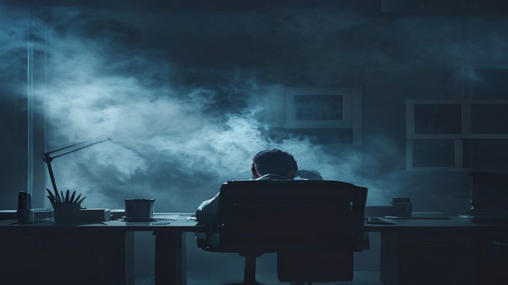

매일 아침 출근길이 도살장에 끌려가는 것처럼 괴롭고, 한때 열정을 바쳤던 업무가 이제는 숨이 막히는 짐으로 느껴진다면 단순한 피로가 아닐 수 있습니다. 의욕적으로 일에 몰두하던 사람이 극심한 신체적, 정신적 피로감을 느끼며 무기력해지는 번아웃 증후군은 현대 직장인들이 마주한 가장 흔한 건강 위기 중 하나입니다. 에너지가 고갈된 뇌를 방치하면 만성 질환으로 이어지기 쉬운 만큼, 지금 나에게 필요한 진짜 휴식이 무엇인지 정확히 짚어내야 합니다.

## 무기력증과 구별되는 고갈 상태의 신호

### 신체화 증상으로 나타나는 경고

단순히 쉬고 싶다는 마음을 넘어 몸이 먼저 반응하기 시작합니다. 아침에 눈을 떴을 때 극심한 두통이 찾아오거나 이유 없이 소화가 잘 안 되고 명치가 답답한 현상이 지속됩니다. 주말에 하루 종일 잠을 자도 피로가 전혀 풀리지 않고, 오히려 온몸이 두들겨 맞은 것처럼 아프다면 뇌가 보내는 SOS 신호로 받아들여야 합니다.

### 감정의 메마름과 냉소적인 태도

가장 두드러진 변화는 주변 사람들과 업무를 대하는 태도에서 나타납니다. 예전에는 동료의 실수에 너그럽고 협조적이었던 사람이 사소한 일에도 날카롭게 신경질을 내거나 어차피 열심히 해봐야 무슨 소용이냐는 식의 냉소적인 언행을 일삼게 됩니다. 감정적 에너지가 바닥나면서 타인과 공감할 여유가 완전히 사라진 상태를 의미합니다.

### 업무 효율성의 급격한 저하

집중력이 눈에 띄게 떨어져 평소 30분이면 끝낼 기획서 작성을 서너 시간이 지나도 붙잡고 있게 됩니다. 잦은 건망증으로 이메일 첨부파일을 빼먹거나 미팅 일정을 잊어버리는 실수가 잦아집니다. 스스로 실력이 퇴보했다고 느껴 괴로워하지만, 이는 능력의 문제가 아니라 뇌의 인지 기능이 잠시 멈춘 상태에 가깝습니다.

## 뇌를 짓누르는 스트레스 호르몬의 비밀

### 코르티솔 분비 불균형의 악순환

지속적인 업무 압박은 부신에서 스트레스 호르몬인 코르티솔을 과도하게 분비하게 만듭니다. 적당한 코르티솔은 위기 대처에 도움을 주지만, 멈추지 않고 뿜어져 나오면 뇌의 해마 조직을 손상시켜 기억력을 감퇴시키고 수면 장애를 유발합니다. 밤에 잠을 이루지 못해 낮에 각성제를 찾고, 이로 인해 다시 스트레스가 쌓이는 악순환이 반복됩니다.

### 교감신경의 과도한 활성화와 이완 불능

출근하는 순간부터 퇴근 이후 밤늦게까지 뇌는 끊임없이 전투 모드를 유지합니다. 자율신경계 중 교감신경이 비정상적으로 항진되면 심장 박동이 빨라지고 근육이 수시로 긴장합니다. 이 상태가 고착화되면 집에서 편안히 쉴 때조차 부교감신경이 활성화되지 못해 몸은 끊임없이 일을 하고 있는 것으로 착각하게 됩니다.

## 일상에서 즉시 실천하는 뇌 리셋 전략

### 마인드풀니스 기반의 미니 명상

업무 중 모니터 화면에서 눈을 돌려 단 3분만 호흡에 집중하는 시간을 가져봅니다. 코로 숨을 깊게 들이마시고 입으로 천천히 내쉬면서, 공기가 몸으로 들어오고 나가는 감각만을 고스란히 느껴봅니다. 머릿속을 가득 채운 기획서와 상사의 잔소리에서 잠시 플러그를 뽑아두는 것만으로도 뇌의 전두엽이 안식을 얻습니다.

### 디지털 디톡스로 시각 자극 차단하기

퇴근길 지하철이나 침대에 누워 스마트폰 숏폼 영상을 넘겨보는 행위는 휴식이 아닙니다. 도파민을 끊임없이 자극해 지친 뇌를 더 혹사시킬 뿐입니다. 퇴근 후 최소 2시간 동안은 전자기기를 멀리하고, 정적인 아날로그 책을 읽거나 가만히 창밖 풍경을 바라보며 시각적 공백을 만들어주는 과정이 절실합니다.

## 에너지 고갈을 막는 일과 삶의 경계선 찾기

### 완벽주의 내려놓기와 업무 우선순위 재조정

모든 과업을 완벽하게 처리하려는 강박이 스스로를 사지로 내몹니다. 오늘 당장 처리하지 않으면 회사가 무너지지 않는 일들은 과감히 내일로 미루는 결단이 필요합니다. 자신의 에너지를 70퍼센트 정도만 사용한다는 마음가짐으로 업무에 임할 때, 오히려 지치지 않고 오랫동안 일관된 성과를 유지할 수 있습니다.

### 아니오라고 말하는 건강한 거절의 기술

내 역량을 넘어선 무리한 부탁이나 추가 업무 지시에 대해 무조건 수용하는 버릇을 고쳐야 합니다. 현재 진행 중인 프로젝트 일정을 투명하게 공유하고, 추가 과업을 맡았을 때 발생할 수 있는 품질 저하를 논리적으로 설명하며 거절하는 연습을 해야 합니다. 나를 보호하는 바운더리를 세우는 일은 이기적인 행동이 아니라 생존 전략입니다.

## 잘 쉬는 것도 능력인 시대의 영양과 수면 가이드

### 멜라토닌 분비를 돕는 수면 환경 조성

양질의 수면은 뇌 속에 쌓인 찌꺼기와 노폐물을 청소하는 유일한 시간입니다. 침실 온도를 약간 서늘하게 유지하고 암막 커튼을 활용해 빛을 완벽히 차단해야 수면 호르몬인 멜라토닌이 활발히 분비됩니다. 잠들기 전 따뜻한 물로 샤워를 하면 근육 긴장이 풀리면서 한결 깊은 잠에 빠져들 수 있습니다.

### 뇌 피로를 풀어주는 맞춤형 식단

설탕이 가득한 탄산음료나 정제 탄수화물은 혈당을 급격히 올렸다가 떨어뜨려 인슐린 스파이크를 일으키고 피로감을 가중시킵니다. 대신에 견과류나 푸른 생선에 풍부한 오메가3 지방산을 섭취해 뇌세포 막을 보호해야 합니다. 신경 안정에 도움을 주는 마그네슘과 비타민 B군이 풍부한 통곡물과 채소 위주의 식사가 지친 몸에 활력을 불어넣습니다.

## 전문가의 도움을 구해야 하는 골든타임

[관련 글 보기](/posts/health/)

### 일상생활 마비와 우울증으로의 전이 징후

자가 진단과 개인적인 노력만으로 회복하기 어려운 임계점이 존재합니다. 2주 이상 무기력증이 지속되어 출근 자체를 거부하게 되거나, 일상적인 세수와 식사조차 귀찮아질 정도로 의욕이 꺾였다면 정신건강의학과를 찾아가야 합니다. 단순한 슬럼프를 넘어 임상적 우울증 단계로 진입했을 가능성이 높기 때문입니다.

### 심리상담과 약물치료에 대한 열린 시선

마음의 병을 감추고 혼자 앓는 것은 상처가 곪아 터지도록 방치하는 것과 같습니다. 상담을 통해 내면의 억압된 분노와 불안을 밖으로 끄집어내고, 전문가의 처방에 따라 일시적으로 세로토닌 재흡수 억제제 등의 도움을 받으면 생각보다 빠르게 고통의 늪에서 벗어날 수 있습니다. 몸이 아플 때 내과에 가듯 마음이 지쳤을 때도 병원을 찾는 유연함이 지혜로운 현대인의 자세입니다.

**함께 읽으면 좋은 글**
- [혈당 스파이크 막는 식사 순서 완전 정리](/posts/health/blood-sugar-spike-diet-sequence-2026/)
- [80세 이상 근감소증 경고! 손아귀 힘 줄면 위험한 이유](/posts/health/elderly-sarcopenia-grip-strength-warning-2026/)

#번아웃증후군 #직장인스트레스 #뇌휴식 #만성피로 #마인드풀니스 #디지털디톡스 #정신건강