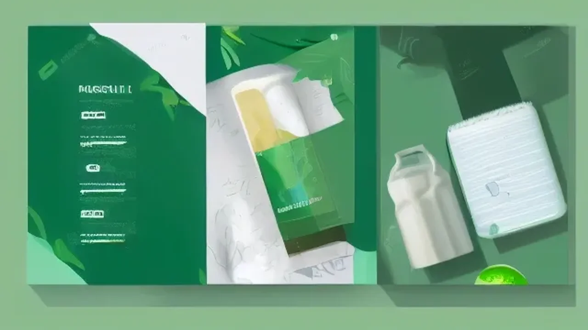
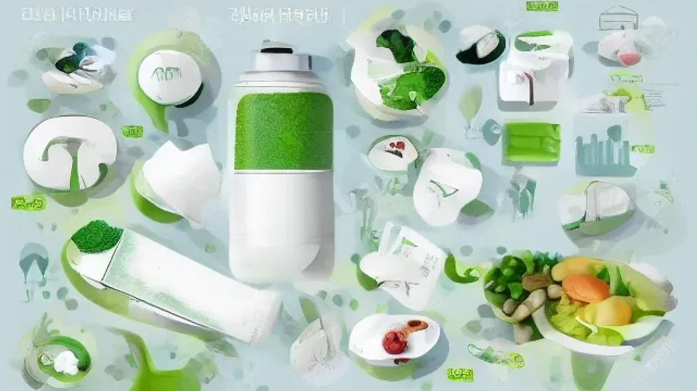

2026년 들어 의학계의 가장 뜨거운 화두는 단연 **치매 치료** 패러다임의 대전환이며, 이는 수많은 환자와 가족들에게 새로운 희망의 빛이 되고 있습니다. 기존의 증상 완화 수준을 넘어 뇌 세포의 퇴화를 직접적으로 억제하는 신약들이 잇따라 도입되면서 초기 대응의 가치가 어느 때보다 커진 상황입니다. 이러한 혁신적인 변화 속에서 우리의 소중한 기억과 뇌 건강을 온전히 지켜내기 위한 구체적인 핵심 정보를 가독성 있게 정리했습니다.

## 2026년 치매 치료 패러다임의 변화: 완화에서 억제로

### 알츠하이머 신약 레캄비와 도나레맙의 차이점
최근 미국 식품의약국(FDA) 및 국내 식약처의 승인을 통과한 레캄비(레카네맙)와 도나레맙은 뇌 속의 유해 단백질인 '아밀로이드 베타'를 표적으로 삼는 가 장 대표적인 항체 치료제입니다. 레캄비의 경우 2주에 한 번씩 정맥 주사 형태로 투여받으며, 임상 3상 시험 결과 초기 환자의 인지 기능 저하 속도를 약 27% 지연시키는 효과를 입증했습니다. 반면 한 달에 한 번 투여하는 도나레맙은 아밀로이드 플라크의 제거 속도가 상대적으로 빨라 초기 집중 치료에 유리하다는 평가를 받습니다. 두 약제 모두 뇌 부종이나 미세 출혈과 같은 'ARIA(아밀로이드 관련 영상 이상)' 부작용 가능성이 존재하므로, 정기적인 MRI 추적 관찰과 전문의의 정밀한 처방 기준 충족이 필수적입니다.

### 부작용 줄인 저함량 치료제(도네페질 3mg)의 등장 배경
기존의 대표적인 알츠하이머 약물인 도네페질 성분은 고함량(10mg 이상) 복용 시 심각한 구토, 어지러움, 소화 불량, 불면증 등의 부작용을 동반하여 초기 환자들이 복용을 중도 포기하는 사례가 빈번했습니다. 이를 보완하기 위해 2026년 의학계는 부작용을 획기적으로 줄인 **저함량 3mg 복용법**에 주목하고 있습니다. 초정밀 용량 설계를 통해 경도인지장애 및 초기 환자의 약물 순응도를 85% 이상 끌어올렸으며, 뇌 신경전달물질인 아세틸콜린의 농도를 완만하게 상승시켜 일상생활 능력을 안정적으로 유지하는 데 기여하고 있습니다.

### 국가 치매 책임제와 2026년 달라지는 지원 혜택
올해부터 전국 보건소 치매안심센터를 통해 만 60세 이상 선별검사(CIST) 비용이 전액 무상 지원될 뿐만 아니라, 기준 중위소득 140% 이하 가구를 대상으로 한 정밀 진단 검사비 지원 한도가 기존 15만 원에서 최대 30만 원까지 확대되었습니다. 치매 확진 후 처방받는 약제비와 진료비 역시 보건복지부의 '치매치료관리비 지원사업'을 통해 월 최대 3만 원(연간 36만 원)까지 실비로 환급받을 수 있습니다. 장기요양보험제도의 등급 판정 기준도 세분화되어 초기를 겪는 어르신들이 인지지원등급을 통해 주야간보호서비스를 보다 원활하게 이용할 수 있도록 제도가 개선되었습니다.

## 건망증과 초기 치매 증상 구별하는 법

### 일상에서 흔히 겪는 건망증 vs 경도인지장애 체크리스트
단순 건망증과 질병의 초기 단계인 경도인지장애를 구별하는 결정적인 기준은 **'힌트를 주었을 때 기억을 복구할 수 있는가'**에 달렸습니다. 단순 건망증은 약속 장소나 물건의 위치를 잠시 잊었더라도 대화 도중 힌트를 얻으면 "아, 맞다!" 하고 즉시 기억해내는 특징을 보입니다. 그러나 인지 기능 저하가 시작된 상태에서는 사건 자체가 뇌에 저장되지 않으므로, 힌트를 제시해도 전혀 기억하지 못하며 오히려 자신이 그런 약속을 한 적이 없다며 강하게 부인하는 양상을 나타냅니다.

> **실제 환자 가족들이 말하는 초기 이상 행동 사례**
> * 며칠 전에 나누었던 대화 내용을 기억하지 못하고 똑같은 질문을 하루에 4\~5회 이상 반복한다.
> * 평소 자주 다니던 익숙한 동네 길에서 방향을 잃고 헤매거나 먼 길을 돌아온다.
> * 요리할 때 설탕 대신 소금을 넣는 등 익숙한 가사 작업의 순서를 헷갈려한다.

### 스마트폰 앱을 활용한 디지털 뇌 건강 자가진단 튜토리얼
정식 병원 방문이 부담스럽다면 보건복지부와 중앙치매센터에서 공동 개발하여 배포한 '치매체크' 모바일 애플리케이션을 활용해 신속하게 1차 자가진단을 실시할 수 있습니다. 앱 스토어에서 다운로드 후 회원가입을 마치면 나이, 성별, 학력을 입력하는 화면이 등장합니다. 

- **1단계:** 주소 창에 생성된 '뇌 건강 검사' 탭을 선택합니다.
- **2단계:** 화면에 제시되는 문장 기억하기, 오늘 날짜 맞추기, 간단한 암산 등 15개 문항에 솔직하게 답변합니다.
- **3단계:** 검사가 완료되면 100점 만점 기준의 인지 점수가 산출되며, '정상', '추적 관찰', '정밀 검사 요망'의 3단계 결과가 제공되므로 이를 토대로 향후 행동 지침을 수립할 수 있습니다.

### 전문 병원 신경인지검사(SNSB, CERAD-K) 종류와 비용
보건소 선별검사에서 위험군으로 분류되면 대학병원 신경과 또는 정신건강의학과에서 서울신경심리검사(SNSB)나 한국판 치매평가검사(CERAD-K)를 수행하게 됩니다. 이 검사들은 주의 집중력, 언어 능력, 시공간 구성 능력, 기억력, 전두엽 집행 기능 등 인간의 5대 인지 영역을 2시간 동안 정밀 타격하여 평가하는 도구입니다. 검사 비용은 상급종합병원 기준 약 20만 원에서 40만 원 선으로 형성되어 있으나, 전문의의 소견에 따라 의학적 필요성이 인정되는 경우 건강보험 급여 항목이 적용되어 환자 본인 부담금이 50% 이하로 경감되며 실손의료보험(실비) 청구도 가능합니다.

## 뇌세포를 깨우는 식단과 영양 성분: 장단점 완전 분석

### 포스파티딜세린(PS)과 오메가3의 뇌 기능 개선 효과와 한계
식품의약품안전처로부터 '노화로 저하된 인지력 개선에 도움을 줄 수 있음'을 공식 인정받은 대두 추출 포스파티딜세린(PS)은 세포막의 유연성을 증가시켜 신경전달물질의 분비를 촉진하는 장점이 있습니다. [관련 글 보기](/posts/health/) 오메가3(EPA 및 DHA 함유 유지) 역시 뇌 혈류 공급을 원활하게 만들어 뇌세포 간의 신호 전달 체계를 강화합니다. 다만 대두 추출 성분의 특성상 콩 알레르기가 있는 체질은 피부 발진이나 설사를 유발할 수 있으며, 오메가3는 피를 맑게 하는 성질이 있어 아스피린이나 항응고제를 복용 중인 고혈압·뇌졸중 환자가 과다 섭취할 경우 지혈 지연이라는 심각한 단점이 동반될 수 있으므로 정량 복용이 요구됩니다.

### 글로벌 트렌드 'MIND 식단'의 핵심 식재료와 한 달 실천법
하버드 의과대학 연구팀이 고안한 MIND 식단은 지중해식 식단과 고혈압 예방을 위한 DASH 식단을 결합하여 인지 감퇴 속도를 최대 53% 늦추는 연구 결과를 보여주었습니다. 이 식단의 핵심은 짙은 녹색 잎채소(시금치, 케일), 통곡물, 그리고 플라보노이드가 풍부한 베리류(블루베리, 딸기)의 섭취를 늘리고 붉은 고기와 버터, 치즈를 극도로 제한하는 것입니다. 한 달 실천법으로 일주일에 최소 3회 이상 잡곡밥에 시금치나물을 곁들이고, 간식으로 하루 한 줌의 견과류와 블루베리 10알을 꾸준히 섭취하는 방식을 권장합니다. 다만 전통적인 한국식 밥상과 비교했을 때 올리브유와 아보카도 등의 식재료 비용 부담이 다소 상승한다는 단점이 있습니다.

### 최근 주목받는 뇌 영양제 해외 직구 제품 구매 시 주의사항
미국 등 해외 직구 시장에서 뇌 기능 활성화, 집중력 강화 등의 자극적인 문구로 판매되는 제품 중 일부에는 국내에서 의약품 성분으로 분류되거나 안전성 검증이 미비하여 통관이 금지된 빈포세틴(Vinpocetine)이나 휴퍼진A(Huperzine A)가 포함되어 있어 각별한 주의가 요구됩니다. 이러한 성분들은 일시적으로 각성 효과를 줄 수 있으나 체질에 따라 심박수 이상, 극심한 두통, 간 수치 상승 등 심각한 부작용을 유발합니다. 따라서 해외 직구 전 반드시 식품안전나라 웹사이트의 '해외직구식품 올바로' 서비스를 통해 금지 성분 함유 여부를 대조해야 하며, 가급적 식약처의 정식 수입 통관 검사를 거쳐 안전 씰(Seal) 부착이 완료된 제품을 선택하는 것이 안전합니다.

## 일상에서 실천하는 뇌 건강 관리 3대 핵심 습관

### 하루 20분 유산소 운동이 뇌 유래 신경영양인자(BDNF)에 미치는 영향
미국 신경학회(AAN) 학술지에 게재된 연구에 따르면 일주일에 3회 이상, 하루 20분씩 땀이 살짝 날 정도의 중강도 유산소 운동을 지속할 경우 기억력을 담당하는 뇌 해모 조직의 성장을 가속화하는 **뇌 유래 신경영양인자(BDNF)**의 분비량이 급격히 상승합니다. 

- 속보(빠르게 걷기)
- 실내 자전거 타기
- 수중 에어로빅

특히 관절이나 무릎 통증으로 고통받는 중장년층에게는 체중 부하를 줄이면서도 하체 대근육을 자극하여 뇌 혈류량을 평균 15% 이상 증가시키는 실내 자전거와 수중 걷기 운동이 뇌 자극을 극대화하는 훌륭한 대안책으로 꼽힙니다.

### 수면 질 향상을 통한 뇌 속 노폐물(글림파틱 시스템) 청소법
인간이 깊은 잠(서파 수면)에 빠져들 때 뇌 속에서는 '글림파틱 시스템(Gwynphatic System)'이라는 고도의 해독 메커니즘이 활성화되어 낮 동안 쌓인 베타 아밀로이드와 타우 단백질을 뇌척수액을 통해 체외로 말끔히 배출합니다. 만약 만성적인 수면 부족이나 수면무호흡증에 시달린다면 이 청소 시스템이 제대로 작동하지 못해 독성 단백질이 뇌 세포에 축적되는 불상사가 발생합니다. 이를 예방하기 위해 매일 정해진 시간에 취침하고 침실 온도를 20도 안팎으로 서늘하게 유지해야 하며, 취침 전 2시간 동안은 뇌의 멜라토닌 합성을 방해하는 스마트폰의 블루라이트를 철저히 차단하는 수면 위생 준수가 치매 예방의 출발점입니다.

### 인지 예비능(Cognitive Reserve)을 높이는 두뇌 스트레칭 가이드
인지 예비능이란 뇌 세포의 일부가 손상되더라도 다른 신경 회로를 활성화하여 정상적인 인지 기능을 유지해내는 뇌의 예비 능력을 의미하며, 이는 지속적인 두뇌 자극 활동을 통해 강화됩니다. 단순히 TV를 시청하는 수동적인 습관에서 벗어나 새로운 외국어 단어를 암기하거나 낯선 악기를 배우는 행동, 혹은 매일 아침 종이 신문을 읽고 요약본을 손글씨로 작성하는 행위는 좌우뇌의 신경 가소성을 최대로 자극합니다. 최신 디지털 기술을 접목하여 하루 10분씩 스마트폰의 두뇌 훈련 퀴즈 앱이나 스도쿠, 낱말 맞추기를 수행하는 습관 또한 뇌 세포 간의 시냅스 연결망을 촘촘하게 구축하여 인지 기능 저하 방어벽을 형성하는 데 일조합니다.

**함께 읽으면 좋은 글**
- [폭염 속 온열질환 예방법 진짜 핵심 3가지](/posts/health/heat-stroke-exhaustion-prevention-symptoms-2026/)
- [2026 틈새 운동: 10분으로 진짜 최대 효과? 핵심](/posts/health/micro-workout-2026/)

#치매치료 #뇌건강 #경도인지장애 #레캄비 #MIND식단 #포스파티딜세린 #치매자가진단 #인지예비능 #건강정보 #2026헬스트렌드