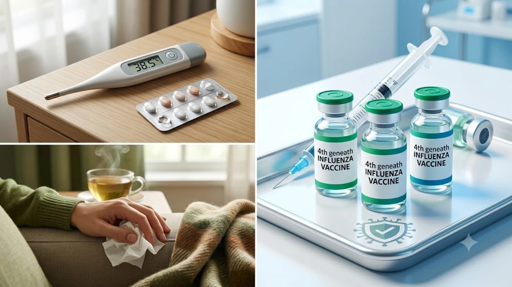

질병관리청이 전국에 **독감 유행주의보**를 발령하면서 초가을 호흡기 질환 관리에 비상이 걸렸습니다. 일반 환절기 감기로 넘겼다가 체온이 급격히 치솟고 사지가 뒤틀리는 근육통으로 응급실을 찾는 사례가 속출하는 만큼, 초기 분별과 발 빠른 약물 대응이 요구됩니다. 이번 유행주의보 발령 기준과 현장 진료실에서 체감하는 위험 신호를 명확히 짚어냅니다.

## 독감 유행주의보 발령 기준과 올해 양상

### 외래환자 1000명당 분과 기준치 초과
질병관리청 표본감시 체계는 외래환자 1,000명당 인플루엔자 의사환자(ILI) 분율이 기준치인 6.5명을 넘어서는 순간 전국에 주의보를 내립니다. 2학기 개학 직후 단체생활이 집중된 초·중·고교를 기점으로 유행 분율이 12.3명까지 치솟았으며, 예년과 비교해 발령 시계가 2주 이상 앞당겨졌습니다.

### A형과 B형의 동시 유행 가능성
통상 늦가을에 A형 독감이 휩쓸고 지나간 뒤 이듬해 봄 B형 독감이 나타나는 순차적 패턴이 무너졌습니다. 올해는 병원 선별진료 현장에서 두 바이러스가 한 번에 검출되는 혼합 양상을 보입니다.
- **A형 바이러스(H1N1·H3N2)**: 38도 이상의 급작스러운 고열, 뼈마디가 쑤시는 강한 관절통
- **B형 바이러스**: 메스꺼움, 구토, 설사, 복통 같은 소화기 이상 반응 빈번

### 변이 바이러스의 전파 속도 증가
방역 당국 유전자 분석에 따르면 변이로 인해 바이러스의 상기도 상피세포 결합력이 높아졌습니다. 밀폐된 사무실이나 만원 지하철 안에서 단 몇 분의 호흡기 접촉만으로도 전파가 일어나는 사례가 확인되고 있습니다.

## 일반 감기와 인플루엔자의 결정적 차이

### 급격한 전신 증상의 발현 속도
감기는 목 안쪽의 이물감이나 가벼운 기침으로 슬며시 시작하지만, 독감은 멀쩡하게 출근했던 사람이 불과 3~4시간 만에 침대에서 일어나지 못할 만큼 급격하게 악화합니다. 오한과 함께 체온계 숫자가 순식간에 39도를 찍는 전신 쇼크성 발열이 독감의 전형적 특징입니다.

### 호흡기 합병증 위험도
인플루엔자 바이러스는 기도 점막을 파괴하며 순식간에 폐포 깊숙이 침투합니다. 
> "고령자나 당뇨·신장질환을 앓는 만성질환자가 독감을 방치하면 2차 세균성 폐렴으로 악화해 중환자실에 입원할 확률이 4배 이상 뜁니다." - 대한감염학회 임상 보고

체내 잠재 염증 수치가 높을수록 바이러스 침투 시 합병증 위험이 급증하므로, 평소 [당뇨 전단계 식단 핵심 가이드 3가지](/posts/health/young-prediabetes-diet-prevention-2026/)를 점검해 혈관 대사 상태를 관리해 둘 필요가 있습니다.

### 잠복기와 격리 기준
독감 잠복기는 1일에서 최대 4일이며, 열이 오르기 하루 전부터 이미 타인에게 바이러스를 내뿜습니다. 해열제를 복용하지 않은 상태에서 체온이 37도 이하로 떨어진 후 최소 24시간이 경과할 때까지는 출근이나 등교를 멈추고 자택 격리를 철저히 지켜야 합니다.

## 확진 시 골든타임 치료와 항바이러스제 선택

### 48시간 이내 투약의 중요성
독감 치료의 승패는 증상 시작 후 48시간 이내에 항바이러스제를 투여하느냐에 갈립니다. 이 황금 시간을 넘기면 바이러스 복제가 정점을 찍어 약을 투여해도 고통스러운 앓는 기간을 단축하기 어렵습니다.

### 경구제 오셀타미비르와 주사제 페라미비르
이비인후과 및 내과에서 처방하는 대표 치료제는 투약 방식과 환자 상태에 따라 갈립니다.
- **오셀타미비르(타미플루 계열)**: 5일간 아침과 저녁 하루 2회씩 총 10회 복용. 이틀 만에 열이 떨어지더라도 내성균 발생을 막으려면 정해진 약을 끝까지 비워야 함.
- **페라미비르(페라미플루 계열)**: 1회 15~30분 정맥 수액 주사로 투약 종료. 위장 장애가 심해 알약을 삼키기 어렵거나 빠른 일상 복귀가 필요한 직장인에게 적합.

### 해열진통제 병용 원칙
아세트아미노펜과 이부프로펜은 4~6시간 간격 교차 복용이 가능하지만, 소아·청소년 환자에게 아스피린 성분을 복용시키면 급성 뇌증을 일으키는 라이 증후군 위험이 발생하므로 금기입니다.

## 감염 예방 수칙과 일상 속 면역 방어 체계 구축

### 백신 접종 시기와 항체 형성
인플루엔자 4가 백신은 접종 후 체내 방어 항체가 만들어지기까지 약 2주가 걸립니다. 질병관리청 역학 데이터상 유행 정점이 형성되는 11월 이전에 방어력을 갖추려면 9월 말에서 10월 중순 사이 접종을 끝내는 일정이 권장됩니다.

### 실내 습도 50% 유지와 점막 보호
호흡기 점막의 섬모는 실내 습도가 40% 밑으로 떨어지면 제 기능을 잃고 바이러스를 걸러내지 못합니다. 가습기와 환기를 통해 습도를 50~60%로 유지하고 따뜻한 물을 수시로 마셔 목 점막을 촉촉하게 적셔야 합니다.
- 2시간마다 10분씩 실내 공기 맞통풍 환기
- 외출 직후 비누 거품을 내어 손가락 사이와어떤 주제나 내용에 대한 본문 작성을 원하시는지 구체적인 내용을 알려주시면 요청하신 형식에 맞추어 작성해 드리겠습니다.