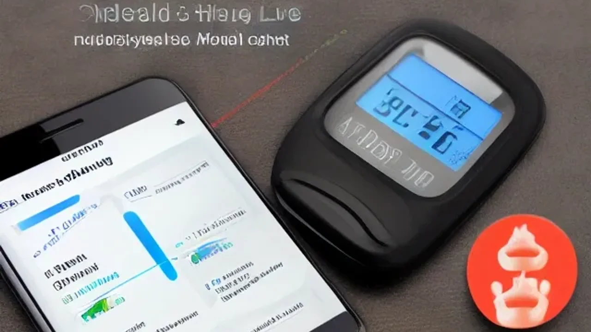

최근 2030 젊은 세대 사이에서 디저트 신드롬이 이어지며 **젊은 당뇨 초기증상**을 호소하는 환자가 급증하고 있습니다. 건강보험심사평가원 통계에 따르면 20\~30대 당뇨병 환자가 지난 5년간 연평균 11%씩 증가하는 심각한 추세를 보입니다. 식후에 극심한 피로감이 몰려오거나 갈증이 지속된다면 내 몸이 보내는 위험 신호일 수 있으므로 정밀한 진단과 관리가 필요합니다.

## 젊은 당뇨 초기증상, 노인성 당뇨와 무엇이 다를까?

### 마른 당뇨의 역설: 체중이 정상이어도 안심할 수 없는 이유
일반적으로 당뇨병은 비만 체형에서 주로 발생한다고 생각하기 쉽지만 이는 오산입니다. 한국인을 포함한 아시아인은 서양인에 비해 선천적으로 췌장 크기가 작아 인슐린 분비 능력이 30%가량 떨어집니다. 이 때문에 외견상 마른 체형이거나 정상 체중을 유지하더라도 내장 지방률이 높다면 인슐린 저항성이 커지면서 당뇨가 시작됩니다. 근육량이 부족하고 복부 비만이 있는 젊은 층이 바로 이 마른 당뇨의 사각지대에 놓여 있습니다.

### 몸이 보내는 적신호: 다음(多飮), 다뇨(多尿), 다식(多食)과 극심한 피로감
혈액 속에 과도한 포도당이 쌓이면 신장은 이를 소변으로 배출하려 부지런히 움직입니다. 이 과정에서 수분이 다량 빠져나가기 때문에 유독 입이 바짝 마르고 물을 자주 마시는 **다음(多飮)** 증상이 나타납니다. 화장실을 가는 빈도가 늘어나는 **다뇨(多尿)**가 이어지며, 세포 속으로 에너지가 제대로 흡수되지 않아 먹어도 허기가 지는 **다식(多食)**으로 연결됩니다. 특별한 이유 없이 몸이 무겁고 잠을 자도 피로가 풀리지 않는다면 췌장 기능 저하를 의심해야 합니다.

### 젊은 당뇨가 더 위험한 이유: 조기 합병증 유발 가능성 진단
노년기에 발병하는 당뇨에 비해 20대와 30대에 발병하는 당뇨는 유병 기간이 훨씬 길다는 치명적인 문제를 안고 있습니다. 30세에 당뇨 진단을 받으면 50대만 되어도 합병증 위험 노출 기간이 20년을 넘어가게 됩니다. 망막병증으로 인한 시력 저하, 신장 기능 마비로 인한 인공투석, 말초신경 질환 등 삶의 질을 송두리째 파괴하는 합병증이 40대라는 이른 나이에 찾아올 수 있어 조기 발견이 강력히 요구됩니다.

## 식후 몰려오는 식곤증, 진짜 원인은 '혈당 스파이크'였다?

### 밥만 먹으면 기절하듯 잠드는 당신, 혈당 롤러코스터의 증거
점심 식사를 마치고 사무실에 앉아 있을 때 눈을 뜨기 힘들 정도로 쏟아지는 졸음을 단순한 춘곤증이나 피로로 치부해서는 곤란합니다. 정제 탄수화물이나 당류가 가득한 음식을 먹으면 혈당이 단시간에 폭발적으로 상승했다가, 이를 낮추기 위해 인슐린이 과도하게 분비되면서 혈당이 곤두박질치는 **혈당 스파이크** 현상이 일어납니다. 이 급격한 혈당 변동성이 뇌로 가는 에너지 공급을 일시적으로 차단하여 기절할 것 같은 식곤증을 유발합니다.

### 탕후루와 요아정이 부른 비극: 액상과당이 인슐린을 망가뜨리는 과정
최근 몇 년간 젊은 층의 간식 문화를 지배한 과일 시럽 코팅 디저트나 요거트 아이스크림 토핑은 혈당을 파괴하는 주범입니다. 이러한 식품에 포함된 고과당 콘시럽(액상과당)은 식이섬유가 없어 위장에서 소화 과정을 거치지 않고 혈액으로 곧바로 흡수됩니다. 간에 직접적인 부담을 주며 지방간을 유발하고, 췌장의 베타세포를 끊임없이 자극해 인슐린 분비 시스템을 완전히 고장 냅니다.

### 병원 안 가고 체크하는 내 몸의 혈당 스파이크 자가진단 리스트
의료기관을 방문하여 당화혈색소를 측정하는 것이 정확하지만, 평소 생활 습관 속에서 위험도를 가늠할 지표들이 존재합니다. 아래 항목 중 3개 이상에 해당한다면 이미 세포가 인슐린에 저항하기 시작했다는 신호입니다.

> * 식사 후 1시간 이내에 집중력이 급격히 떨어지고 짜증이 난다.
> * 공복 상태일 때 손발이 떨리거나 가슴이 두근거리는 증세가 있다.
> * 초콜릿이나 탄산음료 같은 단 음식을 먹지 않으면 불안감을 느낀다.
> * 배가 부르게 먹었음에도 불구하고 곧바로 다른 간식거리를 찾게 된다.

[관련 글 보기](/posts/health/)

## 바나바잎부터 연속혈당측정기(CGM)까지, 내돈내산 혈당 관리템 장단점

### 혈당 케어 영양제(바나바잎, 크롬, 코엔자임Q10)의 실제 효능과 부작용
시중에는 혈당 상승을 억제한다는 건강기능식품이 넘쳐나며, 그중 바나바잎 추출물에 함유된 코로솔산 성분은 세포 내 포도당 흡수를 촉진하는 효능을 인정받았습니다. 인슐린 감수성을 높이는 크롬 역시 대중적인 선택을 받지만, 이러한 영양제는 어디까지나 보조 수단일 뿐입니다. 이미 당뇨약을 복용 중인 상태에서 임의로 과다 섭취하면 오히려 저혈당 쇼크라는 치명적인 부작용을 마주할 수 있어 주의를 요합니다.

### 바늘 없는 채혈? 연속혈당측정기(CGM) 활용의 장점과 비용적 한계
매번 손가락 끝을 바늘로 찔러 피를 보는 고통에서 벗어나게 해준 연속혈당측정기(CGM)는 혁신적인 도구로 꼽힙니다. 피부에 센서를 부착해 스마트폰으로 실시간 혈당 수치 변화를 확인하므로 어떤 음식을 먹었을 때 혈당 스파이크가 일어나는지 직관적으로 파악할 수 있습니다. 다만 센서 한 개당 유지 기간이 1\~2주에 불과하고 매달 10만 원 이상의 고정 비용이 발생한다는 경제적 부담이 따릅니다.

### 저당·대체당(알룰로스, 스테비아) 식품의 올바른 선택과 주의할 점
설탕 대신 에리스리톨, 알룰로스, 스테비아를 넣은 제로 슈거 열풍은 칼로리 부담을 덜어주었습니다. 이들은 혈당을 직접적으로 올리지 않아 당뇨 환자나 다이어터에게 유용한 대안이 됩니다. 그러나 당도가 설탕의 수백 배에 달해 뇌의 단맛 중독을 끊어내지 못하게 방해하며, 일부 인공감모료는 과다 섭취 시 장내 유익균을 죽이고 복통이나 설사를 일으키는 명확한 한계를 지니고 있습니다.

## 약 없이 혈당 잡는 일상 속 '거꾸로 식사법'과 생활 습관 튜토리얼

### [1단계] 채소-고기-밥 순서로 먹는 ‘거꾸로 식사법’ 실천 가이드
식사 순서만 바꾸어도 인슐린 분비량을 획기적으로 줄이는 효험을 볼 수 있습니다. 음식이 입으로 들어갈 때 가장 먼저 식이섬유가 풍부한 채소류를 섭취하여 위벽에 막을 형성해야 합니다. 그 뒤를 이어 두부, 생선, 육류 같은 단백질과 지방 음식을 먹고, 맨 마지막에 쌀밥이나 면 같은 탄수화물을 섭취합니다. 이 단계를 거치면 포도당이 혈액으로 흡수되는 속도가 눈에 띄게 지연되어 혈당 곡선이 완만해집니다.

### [2단계] 식후 15분 산책이 만드는 기적: 혈당 피크 막는 운동 타이밍
음식을 먹고 소화가 시작되는 식후 30분에서 1시간 사이는 혈액 속 포도당 농도가 가장 높게 치솟는 타이밍입니다. 이때 소파에 눕거나 책상에 가만히 앉아 있으면 잉여 포도당이 고스란히 지방으로 축적됩니다. 식사를 마친 직후 가볍게 동네를 15분 정도 산책하거나 제자리걸음을 하면, 근욕이 혈액 속 포도당을 에너지원으로 직접 소모하면서 췌장의 부담을 덜어줍니다.

### [3단계] 공복 혈당을 낮추는 양질의 수면과 스트레스 관리 루틴
아침에 일어났을 때 측정하는 공복 혈당은 전날 밤의 수면 질과 정신적 스트레스 수치에 정비례합니다. 수면 부족 상태가 지속되면 체내 코르티솔이라는 스트레스 호르몬이 과다 분비되는데, 이 호르몬은 간에 저장된 글리코겐을 포도당으로 분해해 혈중 농도를 높입니다. 하루 7시간 이상의 깊은 수면을 확보하고 명상이나 심호흡을 통해 자율신경계를 안정시키는 습관이 당뇨 예방의 마침표가 됩니다.

#젊은당뇨초기증상 #혈당스파이크 #당뇨초기증상 #마른당뇨 #식후식곤증 #연속혈당측정기 #거꾸로식사법 #당뇨합병증 #인슐린저항성