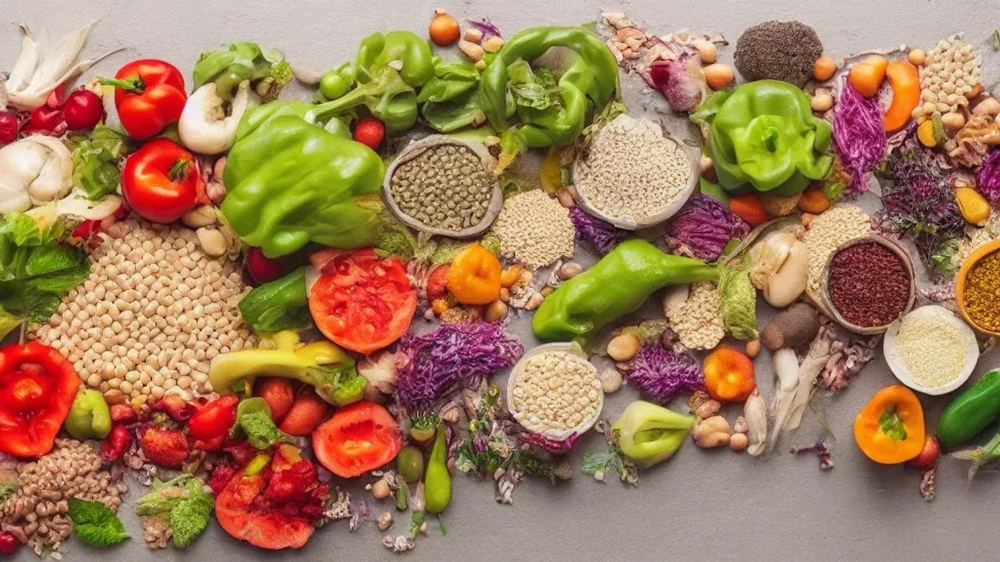
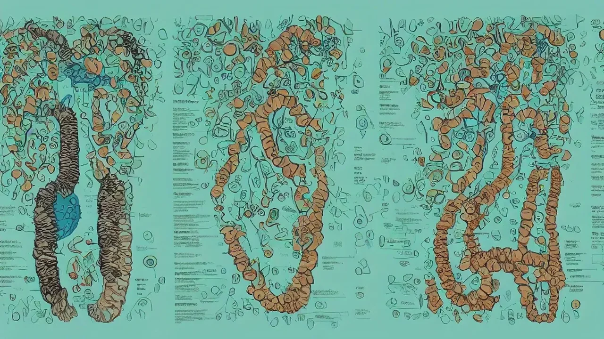

2026년 건강 트렌드의 중심축이 단백질에서 장내 미생물 케어로 급격히 이동하고 있습니다. 단순한 칼로리 제한을 넘어 장내 환경을 개선해 전신 웰니스를 달성하려는 이들이 늘면서, 효과적인 **장 건강 식단**에 대한 관심이 어느 때보다 뜨겁습니다. 이번 가이드에서는 글로벌 트렌드로 부상한 파이버맥싱의 개념과 실전 적용법을 명쾌하게 정리합니다.

## 왜 단백질보다 장내 미생물 케어일까?

### 단백질 과잉 시대의 부작용과 소화기 웰니스 전환 이유
지난 몇 년간 헬스 트렌드를 지배했던 고단백 식단은 예기치 못한 부작용을 낳았습니다. 지나친 단백질 섭취는 장내 유해균을 증식시켜 만성 가스, 복부 팽만, 변비를 유발하는 원인이 됩니다. 실제로 많은 직장인이 닭가슴살과 단백질 쉐이크를 달고 살다가 소화 불량을 호소하며 병원을 찾습니다. 이러한 배경 속에서 신체 내부의 소화기 웰니스를 먼저 챙겨야 대사 효율이 올라간다는 인식이 확산되었습니다.

### 비만 치료제 대중화가 불러온 식이섬유 열풍
글로벌 시장을 뒤흔든 GLP-1 계열 비만 치료제(위고비 등)의 대중화는 식단 트렌드까지 바꾸어 놓았습니다. 해당 치료제는 위 배출 속도를 늦춰 포만감을 주지만, 소화 불량이나 메스꺼움 같은 부작용을 동반하기도 합니다. 이를 자연스럽게 해결하고 약물 없이도 유사한 포만감을 유지하기 위해 선택한 대안이 바로 **'파이버맥싱(Fiber-maxxing)'**, 즉 식이섬유 섭취를 극대화하는 방식입니다.

### 일반 다이어트 식단 vs 마이크로바이옴 케어 식단 차이점
기본적인 다이어트 식단이 '칼로리 적자'와 '근육량 유지'에만 집착한다면, 마이크로바이옴 케어는 장내 유익균의 먹이가 되는 프리바이오틱스 공급에 집중합니다. 

- **일반 식단:** 칼로리 통제, 탄단지 비율 고수, 가공 닭가슴살 위주 섭취
- **마이크로바이옴 식단:** 통곡물·야채의 구성 요소 확보, 천연 발효 식품 포함, 혈당 안정화

---

## 실패 없는 파이버맥싱을 위한 핵심 식재료 분석

### 차전자피와 곤약: 포만감 극대화의 장점과 위장 장애 위험성
차전자피와 곤약은 물을 흡수하면 부피가 수십 배로 늘어나는 대표적인 수용성 식이섬유 식품입니다. 식사량을 줄여도 강력한 포만감을 주기 때문에 탄수화물 제한 시기에 유용합니다. 반면, 충분한 수분 섭취 없이 과도하게 먹으면 오히려 장 속에서 단단하게 뭉쳐 심각한 변비나 장폐색을 유발할 수 있어 하루 권장량(차전자피 기준 5~10g)을 철저히 지켜야 합니다.

### 오트밀과 카사바: 지속 가능한 탄수화물 섭취와 칼로리 주의점
오트밀에 풍부한 베타글루칸은 장내 유익균을 증식시키고 콜레스테롤 흡수를 막아주는 청소부 역할을 합니다. 뿌리채소인 카사바 역시 저항성 전분이 풍부해 대장까지 완벽하게 도달하는 훌륭한 에너지원입니다. 다만 이들은 가공 방식(퀵오트, 가루 형태)에 따라 혈당을 빠르게 올릴 수 있으므로, 가급적 원물에 가까운 스틸컷 오트밀이나 통카사바 형태로 섭취해야 이점을 온전히 누립니다.

### 애플사이다비네거: 식전 혈당 방어 효과와 치아 부식 예방책
해외 셀럽들의 식단에서 빠지지 않는 애플사이다비네거(애삭비)는 초산 성분이 탄수화물의 소화 속도를 늦춰 식후 혈당 스파이크를 방지합니다. 췌장의 부담을 덜어주어 장기적으로 장내 염증 환경을 개선하는 데 탁월합니다. 강한 산성을 띠므로 반드시 종이컵 한 컵 이상의 물에 희석해 빨대로 마셔야 치아 에나멜층 부식을 막을 수 있습니다.

---

## 직장인도 실천 가능한 장 건강 루틴

### 루틴 1단계: 아침 공복을 깨우는 미온수와 천연 프리바이오틱스
기상 직후 마시는 미온수 한 잔은 밤새 잠들어 있던 장의 연동운동을 깨우는 가장 저렴하고 확실한 방법입니다. 차가운 물은 장 건강 식단에 악영향을 주는 위장 경련을 일으킬 수 있으니 피해야 합니다. 물을 마신 뒤에는 가공된 유산균 알약 대신 사과 반 쪽이나 아스파라거스, 바나나 같은 천연 프리바이오틱스를 섭취해 장내 유익균에게 먹이를 먼저 공급합니다.

### 루틴 2단계: 점심 외식에서 식이섬유 비율을 2배로 늘리는 주문 팁
매번 도시락을 싸 다닐 수 없는 직장인이라면 외식 메뉴 선택과 주문 방식을 조금만 바꾸어도 충분합니다. 국밥이나 찌개류를 먹을 때는 공기밥을 반으로 줄이는 대신 반찬으로 나오는 콩나물이나 시금치나물을 두 접시 이상 리필해 먼저 먹습니다. 일반 한식당이나 샐러드 전문점에 갈 때도 쌈 채소나 토핑용 삶은 병아리콩을 추가하는 습관을 들이면 식이섬유 섭취량이 비약적으로 상승합니다.

[관련 글 보기](/posts/health/)

### 루틴 3단계: 저녁 혈당 스파이크를 막는 거꾸로 식사법
같은 음식을 먹더라도 먹는 순서만 바꾸면 장 건강과 체중 감량 효과를 동시에 거둡니다. 핵심은 식탁 위의 음식을 **'채소(식이섬유) -> 고기·생선(단백질/지방) -> 밥·면(탄수화물)'** 순서로 섭취하는 것입니다.

> "식이섬유가 위벽에 먼저 그물망을 형성하면 뒤이어 들어오는 탄수화물의 포도당 흡수 속도가 느려집니다. 이는 혈당 인슐린의 급격한 분비를 막아 지방 축적을 방지하는 원리입니다."

---

## 2주일간 직접 체험해 본 변화 가이드

### 체험 1~5일 차: 가스 차는 증상을 넘어서는 정착기 팁
장 건강 식단을 시작하고 첫 삼일 동안은 오히려 배가 더 더부룩하고 가스가 자주 차서 당황하기 쉽습니다. 이는 장내 환경이 유해균 중심에서 유익균 중심으로 재편되면서 미생물들이 식이섬유를 발효할 때 발생하는 자연스러운 현상입니다. 이 시기에는 양을 무작정 늘리기보다 평소 먹던 양의 30% 수준에서 시작해 천연 발효 식품(김치, 낫또)을 조금씩 곁들이며 적응기를 거치는 것이 현명합니다.

### 체험 6~14일 차: 아랫배 묵직함 해소와 피부 톤 개선 피드백
일주일이 넘어가는 시점부터는 배변 주기가 일정해지며 만성적인 아랫배의 묵직함이 씻은 듯 사라집니다. 장내 독소 배출이 원활해짐에 따라 염증성 트러블이 줄어들고 피부 결이 맑아지는 시각적인 변화도 동반됩니다. 아침에 일어날 때 몸이 무겁던 피로감이 줄어들며, 오후 시간에 찾아오던 지독한 식곤증 증세도 눈에 띄게 완화되는 경험을 하게 됩니다.

### 초보자를 위한 수분 섭취량 매칭 가이드
식이섬유는 스스로 몸집의 몇 배에 달하는 수분을 끌어당기는 성질이 있습니다. 따라서 파이버맥싱을 진행할 때는 평소보다 최소 500ml 이상의 물을 더 마셔야 합니다. 식이섬유 섭취량 10g당 물 250ml를 추가하는 공식만 기억해 실천하면 복통이나 변비 같은 부작용 없이 속 편하고 가벼운 하루를 완성할 수 있습니다.

#장건강식단 #파이버맥싱 #식이섬유효능 #혈당스파이크방지 #마이크로바이옴 #애플사이다비네거 #거꾸로식사법 #식단관리 #웰니스라이프