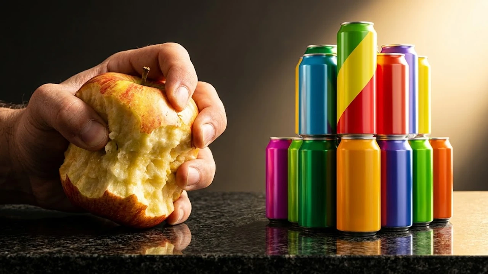

최근 한국인의 식생활에서 **과일 음료수 섭취 변화**가 극단적인 양극화를 보이며 심각한 건강 경고등을 켜고 있습니다. 보건 당국의 최신 발표에 따르면 신선한 자연식품 대신 손쉽게 당을 섭취할 수 있는 액상 음료에 의존하는 인구가 눈에 띄게 늘어났습니다. 이러한 식단 불균형은 비만뿐만 아니라 혈당 스파이크와 지방간 유병률을 단기간에 끌어올리는 주원인으로 지목받습니다.

## 10년 만에 역전된 식단, 과일 줄고 음료 늘어난 현주소

### 질병청 최신 데이터로 본 식탁의 변화
질병관리청이 최근 발표한 국민건강영양조사 심층 분석에 따르면, 지난 10년간 한국인의 하루 평균 과일 섭취량은 169g에서 107.7g으로 36% 급감했습니다. 반면 가공 음료류의 하루 섭취량은 211.8g에서 284.3g으로 무려 34% 증가했습니다. 씹어서 섭취하는 자연 과일의 자리를 공장에서 가공된 액상 캔 음료와 커피 프랜차이즈의 당류 음료가 완벽히 대체한 셈입니다.

### ‘씹는 섬유질’ 대신 ‘마시는 액상과당’을 택한 현실
과거에는 식사 후 사과나 배 한 쪽을 깎아 먹던 디저트 문화가 완전히 사라졌습니다. 대신 그 자리를 테이크아웃 카페의 대용량 아이스티, 과일 시럽 라떼, 탄산음료가 채웠습니다. 현대인들이 껍질을 깎고 보관하기 번거롭다는 이유로 생과일을 멀리하는 동안, 가공식품 제조사들은 흡수가 극도로 빠른 정제 당분을 음료 형태로 쏟아내며 소비자의 뇌를 빠르게 길들였습니다.

### 3050 남성을 중심으로 번진 대사질환 경고등
이러한 식습관 역전 현상은 성인 남성의 혈관 지표에 치명적인 타격을 입혔습니다. 동일 통계에 따르면 30대 남성의 비만율은 59%에 도달했으며, 50대 남성의 당뇨병 유병률은 24.3%, 고지혈증은 45.9%에 달했습니다. 성인 남성 2명 중 1명이 혈관 속 기름과 혈당 문제로 처방 약을 복용해야 하는 수준까지 도달했습니다.

## 생과일과 가공 음료가 혈당과 간에 미치는 결정적 차이

### 식이섬유 유무가 좌우하는 혈당 흡수 속도
생과일에도 과당이 들어있지만, 세포벽을 구성하는 풍부한 불용성 및 수용성 식이섬유가 과당을 단단하게 감싸고 있습니다. 치아로 씹고 위장에서 소화되는 과정에서 장내 포도당 흡수 속도를 지연시켜 급격한 인슐린 분비를 막아줍니다. 

반면 음료에 든 액상과당은 소화 과정 없이 십이지장과 소장 상부에서 곧바로 혈관으로 빨려 들어가 혈당 수치를 수직 상승시킵니다. 인슐린 저항성이 생기면 평소 [존2 유산소 운동법, 진짜 살 빠질까?](/posts/health/zone-2-cardio-fat-burn-routine-2026/)를 실천하더라도 지방 대사 효율이 급격히 떨어지게 됩니다.

### 간으로 직행하는 액상 당류와 비알코올성 지방간
과당은 포도당과 달리 신체 모든 세포에서 에너지로 쓰이지 못하고 100% 간에서만 대사됩니다. 

> 액상과당이 음료를 통해 체내로 쏟아져 들어오면, 간세포는 과부하를 견디지 못하고 남은 잉여 당을 즉각 중성지방으로 전환해 간 자체에 쌓아둡니다. 

술을 전혀 입에 대지 않는 직장인이 건강검진에서 중증 지방간 진단을 받는 대표적인 이유가 바로 책상 옆에 두고 습관처럼 마시는 당류 음료입니다.

### 포만감 중추를 속이는 마시는 칼로리의 함정
생과일 200g을 먹으면 턱관절을 움직이며 씹는 저작 작용과 위장의 물리적 팽창으로 인해 렙틴 호르몬이 분비되어 뇌가 배부름을 인지합니다. 그러나 같은 양의 당분이 들어간 음료는 씹는 행위가 생략되어 위장을 그대로 통과합니다. 뇌는 이를 음식 섭취로 인식하지 못해 식욕 호르몬인 그렐린 수치를 떨어뜨리지 않으며, 이는 과도한 식사량과 연속적인 간식 섭취로 이어집니다.

## ‘무설탕·제로’ 음료는 과일의 완벽한 대안이 될까?

### 제로 음료와 인공감미료의 장점과 한계
칼로리와 설탕이 없다는 제로 탄산이나 무가당 워터 제품군이 주목받고 있습니다. 당류 섭취 총량을 줄인다는 점에서는 기존 설탕 음료보다 낫지만, 이를 과일의 영양학적 대체재로 볼 수는 없습니다. 아스파탐, 수크랄로스 같은 고강도 인공감미료는 미각 신경을 끊임없이 자극해 단맛에 대한 갈망을 뇌에 지속해서 각인시키는 부작용을 낳습니다.

### 미량 영양소와 파이토케미컬 결핍 문제
- 생과일이 제공하는 필수 비타민 C, 칼륨, 플라보노이드, 안토시아닌
- 혈관 염증을 억제하고 모세혈관 탄력을 유지하는 천연 항산화 성분
- 면역 체계를 활성화하는 다양한 식물성 활성 물질

가공 음료는 칼로리를 지웠을지 몰라도 자연식품이 지닌 정교한 영양소 네트워크까지 흉내 내지는 못합니다. 가공 음료만 마시고 과일을 끊어버린 이들에게 만성 염증과 원인 모를 피로가 흔하게 관찰되는 이유입니다.

### 가공음료 습관이 장내 미생물 생태계에 미치는 영향
생과일에 들어있는 펙틴 등의 발효성 섬유질은 장내 유익균의 핵심 먹이(프리바이오틱스) 역할을 합니다. 반면 과일을 배제한 채 인공감미료와 합성 보존료가 들어간 음료만 마실 경우 장내 미생물총 다양성이 급감합니다. 유익균이 굶주리고 유해균이 우세해지면 장벽 투과성이 증가해 전신 만성 염증 수치가 치솟습니다.

## 무너진 영양 밸런스를 되돌리는 일상 실천 가이드

### 마시는 음료를 줄이는 단계별 수분 섭취 루틴
음료수를 한 번에 끊기 어렵다면 단계적 축소 전략이 현실적입니다. 첫 1주는 액상과당이 든 라떼나 탄산음료를 제로 탄산수로 교체하고, 둘째 주부터는 탄산수에 레몬 조각을 띄운 물로 전환합니다. 일상적인 갈증 신호를 단맛에 대한 갈증으로 착각하지 않도록 기상 직후와 식간에 미온수를 한 잔씩 마시는 습관을 들여야 합니다.

### 혈당 부담을 낮추며 과일을 섭취하는 골든타임
과일 속 당분이 걱정된다면 섭취 타이밍과 방식을 조절하면 됩니다. 혈당 급상승을 막기 위해 식사 직후보다는 식사 30분 전이나 공복 간식 시간대에 섭취하는 것이 좋습니다. 갈아서 마시는 스무디 형태는 식이섬유 구조가 파괴되므로 단단한 껍질째 씹어 먹는 사과나 블루베리, 키위처럼 혈당 지수(GI)가 낮은 과일을 주먹 크기 한 줌(100~150g) 이내로 제한해 섭취합니다.

### 바쁜 일상에서 생과일·채소 섭취량을 채우는 실전 팁
껍질을 깎아야 하는 대형 과일 대신 세척 후 바로 먹을 수 있는 방울토마토, 씻어 나온 미니 사과, 냉동 베리류를 냉장고 눈높이 칸에 상시 비치합니다. 아침 식단에 무가당 요거트와 함께 베리류 한 줌을 곁들이거나, 점심 식후 커피전문점 대신 편의점 세척 과일 컵을 집어 드는 작은 행동 변화가 하루 영양 밀도를 획기적으로 개선합니다.

[휴대용 미네랄 보틀 쿠팡에서 보기](https://www.coupang.com/np/search?q=%ED%9C%B4%EB%8C%80%EC%9A%A9%20%EB%AF%B8%EB%84%A4%EB%9E%84%20%EB%B3%B4%ED%8B%80&sourceType=affiliate&trackingCode=AF8691300)

#과일음료수섭취변화 #혈당스파이크 #액상과당위험성 #제로음료부작용 #식이섬유결핍 #인공감미료갈망 #비알코올성지방간 #3050대사질환 #식단관리