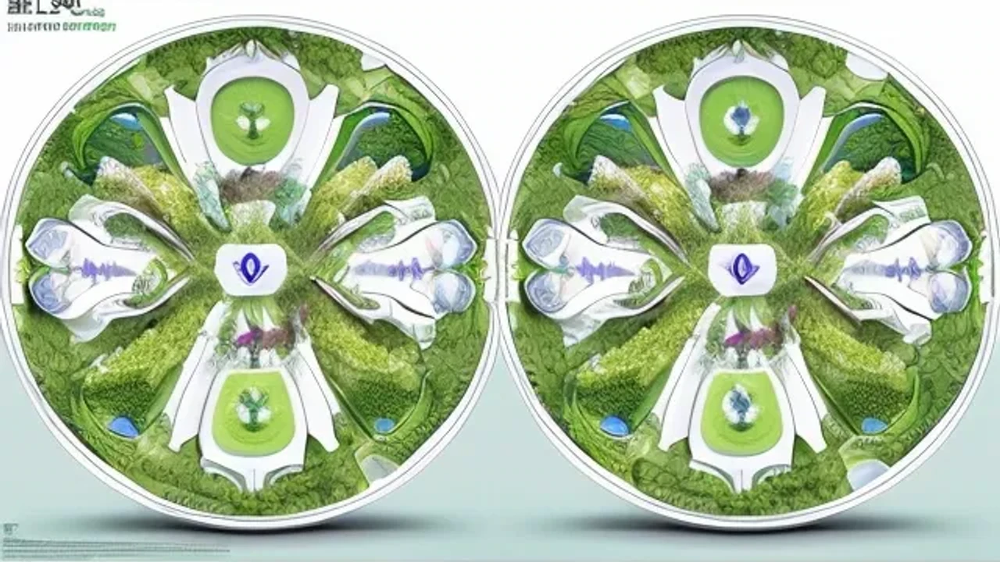

최근 위고비나 삭센다 같은 비만 치료제가 대중화되면서 체중 감량의 패러다임이 통두리째 흔들리고 있다. 하지만 주사제 투여에만 의존하면 근손실이나 소화 마비 같은 역효과를 직면하기 쉬우므로, 감량 효과를 제대로 키우고 몸을 지켜낼 **GLP-1 식단** 설계가 필수적이다. 투약 유저들이 매일 마주하는 영양학적 딜레마를 해결하고 진짜 살이 빠지는 몸을 만드는 실전 가이드를 정리했다.

## GLP-1 식단이 2026년 건강 트렌드 핵심인 이유

### 위고비·삭센다 열풍이 바꾼 새로운 식단 패러다임
과거의 체중 감량은 의지력으로 배고픔을 참아내는 고통스러운 과정이었다. 그러나 GLP-1 억제제는 호르몬 신호를 직접 조절해 뇌에 가짜 포만감을 주입하고 위장이 음식을 내보내는 속도를 늦춘다. 이 때문에 억지로 참는 스트레스는 사라졌지만, 도리어 '무엇을 채워 넣어야 하는가'에 대한 영양학적 기준이 붕괴됐다. 음식을 삼키기 싫은 상태에서 신체 유지에 필요한 필수 영양소를 압축적으로 섭취해야 하는 조력자(Companion) 개념의 식단 관리가 급부상한 배경이다.

### 왜 일반 다이어트 식단과 다르게 접근해야 할까?
기존 다이어트식은 닭가슴살과 고구마의 양을 칼로리 저울로 재며 덜 먹는 데 집착한다. 반면 비만 치료제를 쓸 때는 의지와 상관없이 하루 총섭취량이 급감한다. 칼로리를 깎아내는 노력이 아니라, 한 숟가락을 먹더라도 영양 결핍을 막는 고밀도 영양 설계로 선회해야 한다. 무작정 굶거나 시중의 흔한 저칼로리 식단을 고집하면 기초대사량이 박살 나며 탈모나 노안, 피부 처짐 같은 노화 현상이 순식간에 찾아온다.

### 약물 부작용을 상쇄하는 영양학적 접근의 필요성
메스꺼움, 구토, 극심한 변비는 GLP-1 계열 주사제를 맞을 때 흔히 겪는 소화기계 이상 반응이다. 실제 임상 데이터에 따르면 투약 유저의 30% 이상이 초기 위장관 장애를 호소한다. 이는 음식을 위장에 오래 가둬두는 약물의 고유 기전 때문이다. 이때 기름지거나 정제 탄수화물이 많이 섞인 음식을 먹으면 위장 체류 시간이 배로 늘어나 속이 뒤집힌다. 약물 효과는 고스란히 챙기면서 신체적 괴로움을 지우려면 소화 효소 분비가 줄어든 상태에서도 쏙쏙 흡수되는 식품을 골라야 한다.

## GLP-1 맞춤형 식단의 진짜 장점과 숨은 부작용 방지법

### '이것' 안 먹으면 직면하는 근손실과 마른 비만의 위험성
식사량이 바닥을 칠 때 우리 몸은 지방을 태우기 전에 근육 단백질을 쪼개 에너지로 쓴다. 이때 충분한 **단백질**을 밀어 넣지 않으면 체중계 숫자는 줄어들지언정 근육만 녹아내린 마른 비만으로 전락한다. 미국 학계의 임상 추적 연구에 따르면 비만 치료제 투여 후 줄어든 체중의 최대 40%가 근육을 포함한 제지방이라는 충격적인 결과도 존재한다. 주사를 끊은 뒤 음식을 다시 먹을 때 불어나는 요요 폭탄을 피하려면 매일 본인 체중 1kg당 최소 1.2g 수준의 단백질 공급량을 기필코 사수해야 한다.

### 구토와 메스꺼움을 가라앉히는 소화 친화적 음식 선택법
투약 초기 속 울렁거림을 잠재우려면 식재료의 조직감과 조리법을 극단적으로 단순화해야 한다. 불을 지르는 매운 양념이나 기름진 튀김류는 부어오른 위벽에 불을 지르는 격이다. 대신 부드럽게 삶아낸 흰 살 생선, 달걀찜, 두부처럼 부드러운 단백질원이 속을 편안하게 감싸준다. 탄수화물 역시 껄끄러운 잡곡밥보다는 푹 익힌 오트밀 죽이나 퀴노아 형태로 섭취해야 위장에 무리를 주지 않고 필요한 에너지를 안정적으로 흡수할 수 있다.

### 식욕 억제 상태에서도 충분한 미량 영양소를 섭취하는 전략
음식 냄새조차 맡기 싫을 때는 부피는 작고 영양소는 빽빽하게 뭉친 슈퍼푸드로 승부를 봐야 한다. 비타민 B군과 철분이 가득한 시금치나 케일을 데쳐 가볍게 갈아 마시거나, 항산화 성분이 농축된 블루베리를 무가당 요거트에 섞어 먹는 방식이 영리하다. 하루 먹는 총량이 절반 이하로 줄면 비타민과 미네랄 공급도 반 토막이 나기 때문에, 신체 세포 대사가 멈추는 것을 막기 위해 의식적으로 천연 원물을 선별하고 종합 영양제를 영리하게 배치해야 한다.

## 영양사들이 추천하는 GLP-1 실전 식단 가이드

### 아침·점심·저녁: 단백질 중심의 3단계 식단 설계 가이드
위장이 멈춰 있는 느낌이 들 때는 세 끼를 거창하게 차리기보다 소량씩 시간대를 나누어 흡수시키는 전략이 이롭다.

- **아침:** 밤새 비워진 위장에 자극을 주지 않는 구성이 알맞다. 꾸덕한 그릭 요거트 한 컵에 햄프시드 1스푼, 바나나 반 개를 으깨어 가볍게 시작한다.
- **점심:** 하루 활동을 지탱할 고밀도 단백질을 채운다. 수비드 공정으로 부드럽게 만든 닭가슴살 150g에 찐 브로콜리와 단호박을 곁들인 샐러드가 제격이다. 드레싱은 올리브유와 레몬즙만 살짝 두른다.
- **저녁:** 유실되기 쉬운 수분과 미네랄을 채우는 시간이다. 기름기를 뺀 소고기 사태 수육이나 구운 연어에 아스파라거스를 곁들여 불포화 지방산을 채우고 하루 식단을 마친다.

[관련 글 보기](/posts/health/)

### 부족한 식이섬유와 수분을 채워주는 필수 간식 리스트
GLP-1 유저들이 가장 괴로워하는 고질병이 바로 위장 운동 마비로 인한 변비다. 장내 수분이 메마르는 것을 막으려면 하루 2리터 이상의 물과 수용성 식이섬유 간식을 일과 중에 끼워 넣어야 한다. 치아씨드를 무가당 아몬드 밀크에 불린 치아푸딩은 장벽을 자극해 배변을 유도하는 훌륭한 무기다. 수분 덩어리인 오이나 방울토마토를 간식 삼아 씹는 버릇도 입 마름을 해소하고 장 환경을 쾌적하게 틔워주는 팁이다.

### 외식과 배달 음식 속에서 GLP-1 친화적 메뉴 골라내기
사회생활 속 외식 자리에서는 양념과 조리 방식을 내 의지대로 통제할 수 있는 메뉴를 골라야 속을 버리지 않는다. 샐러드나 샌드위치 매장에서는 절임 채소를 제외하고 드레싱을 따로 달라고 요청한다. 일반 한식당에 가야 한다면 나트륨과 기름이 뒤섞인 찌개 종류 대신 생선구이 백반이나 샤브샤브를 택한 뒤, 국물은 밀어내고 푹 익은 채소와 살코기 위주로 천천히 꼭꼭 씹어 먹는 습관이 안전하다.

## 직접 경험해 본 GLP-1 식단 유지 팁과 주의사항

### 초반 2주 차 식욕 저하 시기를 현명하게 넘긴 실제 후기
주사를 맞고 2주 정도 지나면 밥숟가락을 들기조차 싫은 극단적인 혐식증이 찾아온다. 이때 많은 이들이 신나서 굶는 치명적인 악수를 둔다. 직접 겪어본 바에 의하면 씹는 행위 자체가 고역일 때는 고형식을 고집하다 위경련을 부르기보다 액상 단백질이나 맑게 우려낸 사골국물을 홀짝이는 편이 기력을 보존하는 데 훨씬 유리했다. 텀블러에 맑은 프로틴 음료를 담아두고 조금씩 자주 마시는 방법이 초기 적응기를 무사히 통과하는 열쇠다.

### 시중의 'GLP-1 전용 밀키트' 돈값 할까? 현명한 소비 기준
최근 커머스 시장에 '치료제 복용자 전용'을 내걸고 값비싼 밀키트 패키지가 쏟아지고 있다. 영양 성분을 분석해 보면 일반 다이어트 도시락에서 단백질을 미량 늘리고 나트륨을 조금 줄였을 뿐, 가격표만큼의 특별한 가치는 찾기 어렵다. 값비싼 마케팅 상품에 현혹되기보다 무가당 닭가슴살 팩과 냉동 야채 믹스를 대량으로 구비해 스스로 조합하는 방식이 지갑을 지키는 길이다. 뒷면 성분표에서 **액상과당**과 **정제당**의 유무만 철저히 걸러내도 절반은 성공한 셈이다.

### 요요 현상을 방지하기 위해 반드시 기억해야 할 식습관 3가지
약물의 힘을 빌리는 시간은 단순히 살을 빼는 기간이 아니라 평생 유지할 식사 버릇을 고치는 훈련소다.

> 첫째, 입에 들어간 음식물은 무조건 30회 이상 씹어 물처럼 만들어 삼킨다. 위장 부담을 줄이고 뇌가 포만감 신호를 알아챌 시간을 벌어주는 기본 공식이다.
> 
> 둘째, 음식을 먹는 도중에는 물을 들이켜지 않는다. 소화 속도가 정체된 상태에서 물이 섞이면 음식물이 위장 안에서 부패하며 가스와 구토를 유발한다. 물은 식사 전후 30분 간격을 두고 마신다.
> 
> 셋째, 위장에서 은은한 포만감 신호가 오면 미련 없이 숟가락을 내려놓는다. 아깝다는 이유로 한 입을 더 밀어 넣는 순간 백발백중 가슴이 답답해지거나 오심이 밀려온다. 배부름의 한계선을 스스로 인지하고 멈추는 연습이 향후 주사제를 끊었을 때 요요를 막아내는 유일한 방파제다.

**함께 읽으면 좋은 글**
- [혈당 스파이크 막는 식사 순서 완전 정리](/posts/health/blood-sugar-spike-diet-sequence-2026/)
- [콜레스테롤 유전자 치료, 2026년 진짜 바뀔까?](/posts/health/gene-editing-ldl-cholesterol-therapy-2026/)

#GLP1식단 #비만치료제식단 #위고비부작용 #삭센다식단 #다이어트단백질 #근손실방지 #식욕억제식단 #체중감량영양학