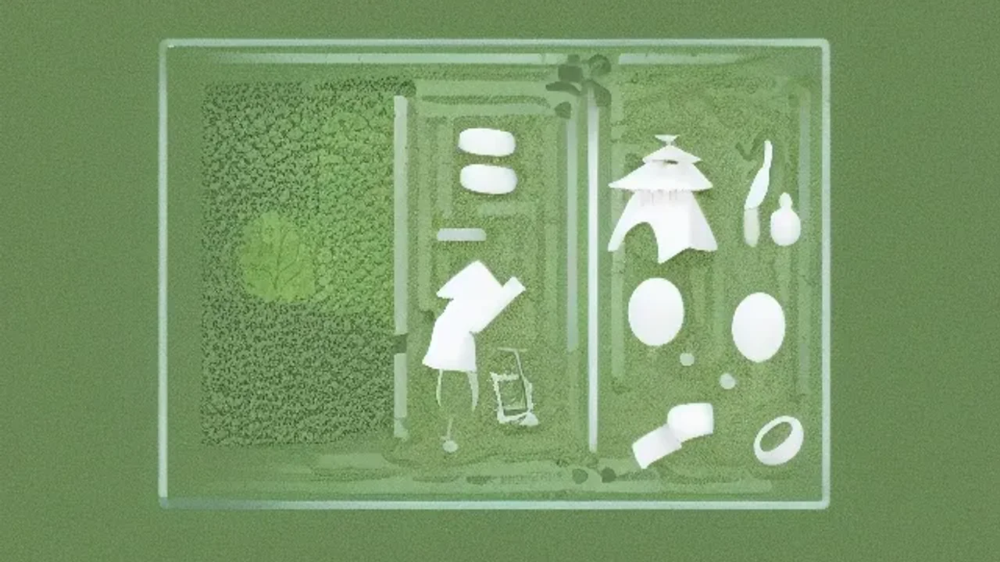
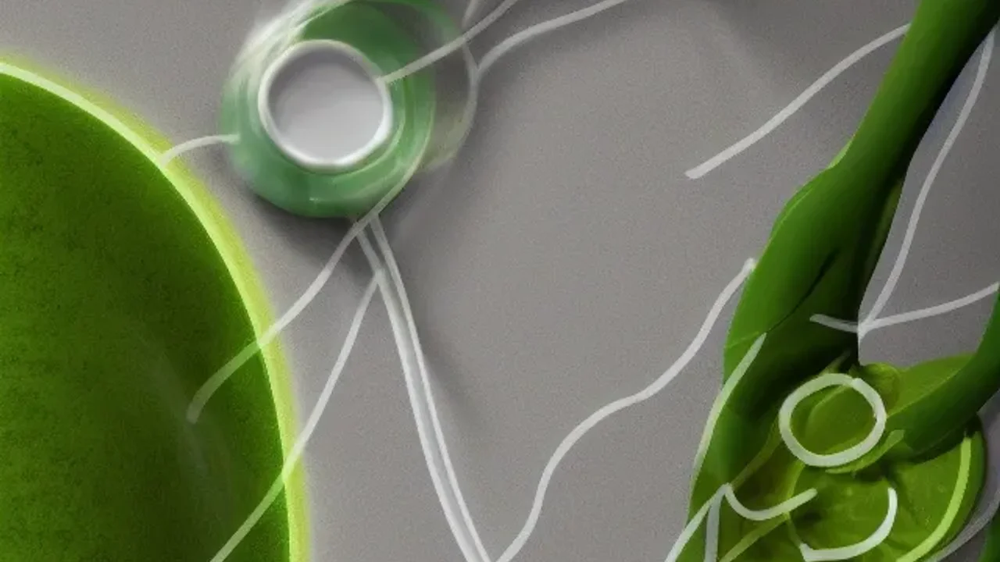

비만 치료제 열풍 속에서 체중계 숫자만 맹신하다가는 돌이킬 수 없는 건강의 위기를 맞닥뜨릴 수 있다. 진짜 다이어트의 성패는 지방을 덜어낸 자리에 얼마나 단단한 골격근을 채워 넣느냐에 달렸다. 요요를 영구적으로 차단하고 탄력 있는 체형을 완성하는 가장 현실적이고 과학적인 다이어트 근력 운동의 핵심 원리를 파헤친다.

## 체중 감소 이면의 근감소증 쇼크

### 비만 치료제 열풍과 근육의 소멸
> "감량된 체중의 40%가 근육이라면, 당신은 살을 뺀 것이 아니라 몸을 망친 것이다."

미국스포츠의학회(ACSM)의 2026년 피트니스 트렌드 분석에 따르면, '체중 관리를 위한 저항성 훈련'이 최상위권으로 꼽혔다. 위고비, 오젬픽 등 GLP-1 기반 식욕 억제제의 수요 폭발과 직결된 현상이다. 극단적으로 섭취 칼로리를 통제하면 인체는 생존을 위해 지방보다 에너지를 많이 쓰는 근육을 먼저 분해한다. 실제 임상 현장에서 무리한 약물 의존 감량자 상당수가 골밀도 저하와 심각한 근감소증을 겪는 부작용이 속출하고 있다. 결론적으로, 체형 관리는 물리적 자극을 통해 근섬유를 사수하는 치열한 방어전에 가깝다.

### 기초대사량 방어 시스템 구축
지방 1kg이 하루 4kcal를 소모하는 반면, 골격근 1kg은 하루 13\~15kcal를 태운다. 근육량이 넉넉한 사람은 같은 양의 밥을 먹어도 잉여 에너지가 체지방으로 쌓이지 않는 대사적 특권을 누린다. **다이어트 근력 운동**은 세포 내 미토콘드리아 밀도를 높여 포도당 대사 효율을 극대화하는 물리적 작업이다. 이는 식후 혈당 스파이크를 억제해 인슐린 저항성을 개선하는 근본 해결책이 되며, 요요 없는 체질은 이 강력한 대사 엔진을 장착할 때만 완성된다.

## 식단과 훈련의 하이브리드 전략

### 단백질 섭취의 맹점
훈련 직후 30분 안에 닭가슴살을 먹어야 근육이 자란다는 이른바 '기회의 창'은 최신 스포츠 영양학에서 이미 낡은 이론이 됐다. 근단백질 합성은 고강도 자극 이후 최소 24시간에서 길게는 48시간까지 이어진다. 특정 시간대의 섭취보다 압도적으로 결정적인 요소는 하루 총 단백질 섭취량이다. 체중 1kg당 1.6g에서 최대 2.2g의 단백질을 3\~4시간 간격으로 분할 섭취해 체내 아미노산 수치를 하루 종일 일정하게 유지하는 방식이 훨씬 유리하다.

### 웨이트와 유산소의 생리학적 순서
체지방 연소와 근비대라는 두 마리 토끼를 잡으려면 에너지 대사 시스템을 교묘하게 활용해야 한다.
- **저항성 훈련 선행**: 근육 내 저장된 글리코겐을 주 에너지원으로 먼저 폭발시켜, 고중량을 다루는 퍼포먼스를 온전히 발휘한다.
- **심폐 훈련 후행**: 탄수화물이 고갈된 상태에서 곧바로 유산소 운동에 돌입해 지방 산화 비율을 한계치까지 끌어올린다.

이러한 운동 순서 재조정만으로도 체지방 분해 속도는 눈에 띄게 빨라진다.

## 실패 없는 고효율 실전 루틴

### 대근육군 타겟 복합 다관절 훈련
팔뚝이나 뱃살 등 특정 부위의 지방만 골라서 태우는 국소 감량은 인체 생리학상 성립할 수 없다. 폭발적인 칼로리 소모와 테스토스테론 등 동화 호르몬 분비를 이끌어내는 유일한 길은 두 개 이상의 관절을 동시에 쓰는 복합 훈련이다.
- **하체 중심 타격**: 스쿼트와 데드리프트는 인체 근육의 70%가 몰려있는 하체와 코어를 강하게 동원해 엄청난 대사 반응을 유발한다.
- **상체 밀고 당기기**: 벤치프레스, 바벨 로우 등은 상체의 두꺼운 근막을 찢고 회복시키는 과정을 통해 전체 프레임을 키우고 기초 체력을 퀀텀 점프시킨다.

### 점진적 과부하의 철저한 적용
우리의 신경계는 동일한 자극에 소름 돋을 정도로 빨리 적응한다. 매일 똑같은 무게의 덤벨로 같은 횟수만 반복하는 안일한 루틴은 노동일 뿐 훈련이 아니다. 
- 중량을 단 1kg이라도 올리거나, 횟수를 1회라도 추가하거나, 세트 사이 휴식 시간을 줄이는 방식으로 매주 뇌를 속이는 미세한 과부하를 줘야 한다. 
[관련 글 보기](/posts/health/)

## 회복 퀄리티가 체형을 바꾼다

### 코르티솔과 수면 부족의 재앙
근육은 헬스장에서 쇳덩이를 들 때가 아니라, 집에 돌아와 깊은 잠에 빠졌을 때 자라난다. 깊은 수면 단계에서 쏟아지는 성장호르몬이 손상된 근섬유를 더 크고 단단하게 재건한다. 반면 수면이 부족하면 스트레스 호르몬인 코르티솔 수치가 치솟아 애써 만든 근육을 분해해 에너지로 낭비해 버린다. 강도 높은 훈련을 해도 7시간 이상의 숙면이 뒷받침되지 않으면 밑 빠진 독에 물 붓기에 불과하다.

### 적극적 회복과 근막 이완
훈련 다음 날 심한 근육통이 왔다고 침대에 누워만 있는 것은 젖산 분해를 늦추는 최악의 대처다. 회복 속도를 끌어올리려면 가벼운 걷기나 고정식 자전거 타기 같은 동적 휴식으로 혈류량을 늘려야 한다. 아울러 폼롤러나 마사지 건으로 굳어버린 근막을 물리적으로 풀어주면 좁아진 관절 가동 범위가 회복되어 다음 훈련의 부상 위험을 획기적으로 낮출 수 있다.

#다이어트근력운동 #근손실방지다이어트 #2026운동트렌드 #기초대사량높이는법 #점진적과부하 #다이어트정체기 #수면과다이어트