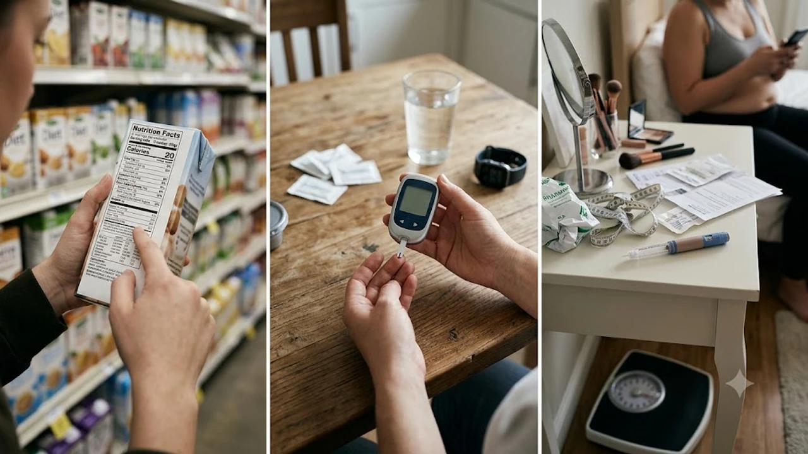

물 대신 제로 콜라를 마시며 안도하고 있다면 당장 성분표부터 뒤집어봐야 합니다. 포장지 앞면에 대문짝만하게 찍힌 '당류 0g'이라는 표기는 체내 인슐린 저항성이나 혈당 스파이크의 완전한 면죄부가 될 수 없기 때문입니다. 제로식품 당류 표기의 맹점과 진짜 다이어트 성공을 가로막는 대체당의 실체를 파헤칩니다.

## 제로 표기의 숨은 법적 기준과 실제 당류 함량

### 식품위생법상 '무당'과 '저당'의 명확한 허용 오차
식품의약품안전처 고시 기준을 들여다보면 뜻밖의 진실이 숨어 있습니다. 액체류는 100ml당 당류 0.5g 미만일 경우 제조사가 합법적으로 '제로' 혹은 '무당' 라벨을 붙일 수 있습니다. 과자나 젤리 같은 고체 식품도 100g당 당류 0.5g 미만이면 0g으로 둔갑해 소비자에게 판매됩니다. 포장지의 숫자 0은 완전한 무(無)가 아니라, 교묘하게 활용된 법적 허용치의 최솟값일 뿐입니다.

### 100ml당 0.5g 미만이 만들어내는 착시 효과
이 허용 오차를 무시하면 다이어트 정체기에 직면하게 됩니다. 500ml 제로 음료 한 페트병에는 산술적으로 최대 2.49g의 진짜 당이 들어있을 수 있습니다. 갈증이 날 때마다 제로 음료를 물처럼 마셔댄다면, 나도 모르는 사이 하루에 각설탕 한두 개 분량의 당을 고스란히 섭취하는 셈입니다. 칼로리가 없다는 마케팅에 속아 섭취량을 통제하지 않는 습관이 가장 치명적인 위험 요소입니다.

### 영양성분표에서 숨겨진 원재료 당류 찾아내는 법
장바구니에 제품을 담기 전, 제품 뒷면의 흑백 라벨을 매의 눈으로 스캔해야 합니다. 다음 세 가지 함정이 숨어 있다면 즉시 진열대에 내려놓는 편이 낫습니다.
- **말티톨**: 무설탕 단백질 바에 흔히 쓰이는 당알코올로, 설탕의 60~70% 수준까지 혈당을 치솟게 만듭니다.
- **수크랄로스**: 열량은 없으나 장내 유익균 생태계를 훼손한다는 최신 연구가 잇따르는 대표적 인공감미료입니다.
- **은밀한 액상과당**: '저당' 표기 제품의 맛을 끌어올리기 위해 소량의 과당을 슬쩍 섞어 넣는 꼼수가 자주 발견됩니다.

## 대체당의 두 얼굴, 혈당과 대사에 미치는 영향

### 수크랄로스·아스파탐·알룰로스 성분별 대사 특성
시중의 대체당은 인체 내 반응 기전이 완전히 다릅니다. 아스파탐과 수크랄로스는 혀의 감각만 자극하고 소화기를 그대로 통과해 배출됩니다. 반면 **알룰로스**는 무화과 등에 존재하는 희소당으로, 소장에서 흡수되지만 대사되지 않고 소변으로 빠져나가 혈당 방어에 상대적으로 유리한 원료로 꼽힙니다.

### 인슐린 저항성과 장내 미생물 환경에 대한 최신 연구
국제학술지 네이처(Nature)에 발표된 연구를 보면 인공감미료 장기 섭취의 끔찍한 부작용이 드러납니다. 감미료를 과도하게 섭취한 실험군은 장내 유익균 다양성이 붕괴하고 비정상적인 포도당 불내성을 보였습니다. 입으로는 단맛이 들어오는데 혈관으로 실제 포도당이 전달되지 않으니, 췌장이 혼란을 겪고 인슐린 분비 타이밍을 놓쳐 체내 인슐린 저항성이 악화되는 구조입니다.

### 뇌의 단맛 보상 체계 교란과 식욕 증가 메커니즘
식사를 마치고 제로 사이다를 마셨는데 유독 빵이나 디저트가 맹렬하게 당긴 적이 있나요? 이는 단순한 식탐 탓이 아닙니다. 혀는 강렬한 단맛을 느꼈지만 체내에 실제 칼로리가 들어오지 않자, 뇌가 영양 결핍 상태로 착각해 묵직한 진짜 탄수화물을 갈망하도록 식욕 중추를 찌르는 철저한 뇌과학적 부작용입니다.

## 다이어트와 혈당 관리를 위한 제로 식품 섭취 가이드

### 하루 안전 섭취 한도 계산과 빈도 조절법
세계보건기구(WHO)조차 비당류 감미료를 장기적인 체중 감량 수단으로 쓰지 말라고 명확히 경고했습니다. 액상과당 중독을 끊어내기 위해 하루 1~2캔 수준으로 소비하는 것은 훌륭한 탈출 전략입니다. 하지만 생수나 차를 완전히 대체하여 하루 종일 제로 음료를 입에 달고 사는 행위는 췌장을 쉴 새 없이 자극해 대사증후군의 덫을 스스로 놓는 행위입니다.

### 제로 가공식품 섭취 시 함께 먹는 탄수화물과의 상호작용
최악의 시나리오는 햄버거나 피자 같은 정크푸드에 제로 음료를 안심하고 곁들이는 식습관입니다. 정제 탄수화물 폭격으로 혈당이 치솟는 타이밍에 인공 단맛 자극까지 더해지면 혈당 조절 시스템은 완전히 망가집니다. 근본적인 체질 개선을 원한다면 [존2 유산소 운동법, 진짜 살 빠질까?](/posts/health/zone-2-cardio-fat-burn-routine-2026/) 가이드처럼 저강도 유산소를 병행해 세포 자체의 포도당 연소 능력을 극대화해 두는 전략이 필수입니다.

### 단맛 의존도를 점진적으로 낮추는 수분 보충 습관
강렬한 인공 감미료에 찌든 미각을 해독하려면 최소 3주간의 의도적인 거리두기가 요구됩니다.
- 맹물 마시기가 역겹다면 레몬이나 라임 슬라이스를 소량 첨가해 향을 덧입힙니다.
- 당류도 감미료도 없는 순수 탄산수로 톡 쏘는 식감만 취하는 훈련을 반복합니다.
- 식후 입가심은 달콤한 음료 대신 페퍼민트나 캐모마일티로 대체해 미각의 흥분을 가라앉힙니다.

## 당류 섭취 줄이기를 위한 단계별 식단 전환 루틴

### 1단계: 제로 탄산음료와 가당 음료의 단계적 감량
무작정 모든 단맛을 끊어내면 작심삼일 폭식으로 이어지기 십상입니다. 핵심은 뇌와 몸이 눈치채지 못하게 단맛을 줄이는 소프트 랜딩 전략입니다. 평소 액상과당 음료를 즐겼다면 우선 알룰로스가 함유된 제로 음료로 교체합니다. 몸이 설탕의 부재에 익숙해질 즈음, 제로 음료 마시는 빈도를 주 3회, 주 1회로 서서히 낮춰 미각 금단 현상을 방어해야 합니다.

### 2단계: 장보기 3초 식품 라벨 성분 판독법
대형 마트에서 다이어트 간식을 고를 때는 포장지 앞면의 화려한 광고 문구를 철저히 무시하십시오. 성분표의 '당류' 수치만 확인할 것이 아니라, 그 아래 깨알같이 숨겨진 '당알코올' 수치까지 더해 실질 혈당 상승분을 예측해야 합니다. 말티톨 시럽이나 아스파탐이 원재료명 첫 줄을 장식하고 있다면 미련 없이 카트에서 빼내야 합니다.

### 3단계: 자연 식재료의 천연 단맛 중심 식단 안착하기
최종 목표는 공장에서 조작된 단맛을 밀어내고 자연 식재료 본연의 묵직한 풍미에 미각을 동기화하는 것입니다. 제철 단호박을 찌거나 생 블루베리를 씹을 때 퍼지는 은은한 단맛에 만족하는 단계에 이르러야 합니다. 채소와 과일에 촘촘히 얽힌 천연 식이섬유는 포도당 흡수 속도를 완만하게 늦춰주는 가장 훌륭한 방어막이자 지속 가능한 식단의 핵심 무기입니다.

[혈당 관리용 무설탕 제로 간식 로켓배송 확인하기](https://www.coupang.com/np/search?q=%EB%AC%B4%EC%84%A4%ED%83%95+%EC%A0%9C%EB%A1%9C+%EA%B0%84%EC%8B%9D&sourceType=affiliate&trackingCode=AF8691300)

#제로식품당류 #대체당부작용 #혈당스파이크 #다이어트식단 #인슐린저항성 #무설탕음료 #제로콜라진실