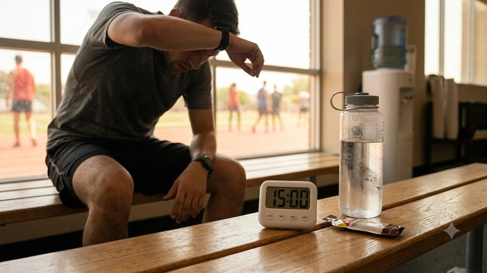

연일 기록적인 고온이 이어지는 2026년 여름, 안전한 신체 활동을 위한 **폭염 운동 수분 섭취** 수칙이 필수적입니다. 무더위 속에서 체온 조절에 실패하면 뇌와 심장에 즉각적인 과부하가 걸리므로, 탈수 증상을 막는 실전 가이드라인을 파악해 두어야 합니다. 체내 전해질 밸런스를 지키며 운동 효과를 유지하는 원칙을 정리했습니다.

## 연일 이어지는 극한 폭염, 왜 '15분 분할 수분 섭취'가 필수일까?

### 한 번에 마시는 물과 15분 간격 섭취의 차이점

운동 중간에 목이 타는 듯하다고 물을 한꺼번에 들이켜는 행동은 위험합니다. 많은 양의 수분이 위장으로 한꺼번에 들어가면 복부 팽만감으로 움직임이 둔해질 뿐 아니라, 혈액 속 나트륨 농도가 급격히 떨어지는 저나트륨혈증을 불러올 수 있습니다. 반면 **15분 간격 분할 수분 섭취**는 위장에 부담을 주지 않고 심장의 과도한 펌프질을 방지해 혈액순환을 일정하게 유지합니다.

### 체온 조절과 온열질환(열탈진·열사병) 예방의 상관관계

고온 다습한 날씨에 땀을 쏟아내면 몸속 냉각수가 순식간에 바닥납니다. 수분 공급이 끊기면 신체는 땀 배출을 중단하고, 결국 체온 조절 중추가 마비되는 열사병으로 직행합니다. 15분마다 보충하는 150~250mL의 수분은 체온 상승을 막아 열탈진을 차단하는 가장 확실한 방화벽입니다.

## 폭염 속 운동 효율 극대화: 무엇을, 얼마나 마셔야 할까?

### 맹물 vs 이온음료/전해질 음료 선택 가이드

1시간 이내의 가벼운 운동이라면 맹물로 충분하지만, 1시간을 넘기는 야외 운동에는 전해질 보충이 필수입니다. 땀과 함께 나트륨, 칼륨, 마그네슘이 빠져나가면 근육에 경련이 일어나고 수행 능력이 급격히 떨어집니다. 최신 웨어러블 기기로 심박수와 땀 배출 데이터를 체크하며 운동하는 편이라면 [2026 스마트워치 운동 진짜 효과 보는 법](/posts/health/wearable-data-smart-pacing-fitness-2026/)을 참고하여 나에게 맞는 보충 타이밍을 찾아볼 수 있습니다.

> **전해질 음료 선택 팁:** 설탕이 범벅된 일반 스포츠음료는 삼투압 때문에 수분 흡수를 방해합니다. 당 함량이 6~8% 이하인 저당 전해질 제품을 고르는 편이 훨씬 효과적입니다.

### 운동 전·중·후 단계별 골든타임 수분 보충 수칙

* **운동 시작 2시간 전:** 400~600mL의 물을 천천히 마셔 체내 수분 탱크를 채워둡니다.
* **운동 진행 중:** 15~20분마다 150~250mL의 서늘한 물(10~15℃)을 나누어 마십니다.
* **운동 종료 후:** 운동 전후 체중을 측정해 손실된 체중 1kg당 약 1.5L의 수분을 수시간 동안 나누어 보충합니다.

## 여름철 야외 및 실내 운동 시 체크해야 할 실전 안전 수칙

### 심박수와 체온 변화로 알아보는 위험 신호 체크리스트

폭염기에는 평소보다 심박수가 10~20회 이상 높게 치솟습니다. 운동 도중 아래 신호가 감지되면 즉시 그늘이나 에어컨이 나오는 실내로 들어가 휴식을 취해야 합니다.

* 어지럼증, 두통, 혹은 가슴 중앙부의 답답함
* 피부가 차갑고 끈적해지거나 반대로 건조하고 뜨거워지는 현상
* 호흡이 지나치게 가빠지거나 구토감이 몰려오는 증상

### 자외선 차단과 복장 선택으로 체열 배출 돕기

수분 보충만큼이나 몸속 열을 빠르게 내보내는 복장 선택이 강조됩니다. 통기성이 좋은 흡한속건 소재의 밝은색 옷을 입고, 머리로 쏟아지는 직사광선을 막아주는 통풍 모자를 착용합니다. 평소 식단이나 만성 염증 관리에 관심이 많다면 [초가공식품 만성 염증 유발하는 진짜 이유와 3단계 해독법](/posts/health/ultra-processed-foods-chronic-inflammation-2026/)을 확인하여 체내 염증 수치를 낮추고 여름철 열 저항력을 키워보는 것도 좋은 전략입니다.

## 내가 직접 적용해 본 폭염기 러닝·피트니스 수분 관리 루틴

### 15분 타이머 알람을 활용한 야외 러닝 실전 경험담

낮 기온이 35도를 웃도는 날, 스마트워치 타이머를 15분 간격으로 맞추고 야외 러닝에 나섰습니다. 알람이 울릴 때마다 페이스를 조절하며 러닝 벨트에 챙긴 전해질 물을 두 모금씩 상시 섭취했습니다. 갈증을 느끼기 전에 선제적으로 수분을 채우니, 러닝 후반부마다 시달리던 특유의 두통과 급격한 체력 저하가 눈에 띄게 사라졌습니다.

### 운동 후 래시(Rash) 및 탈수 증상 없이 빠른 회복을 도운 팁

* **미지근한 물 샤워:** 운동 직후 너무 찬물로 샤워하면 혈관이 급격히 수축해 체열 방출이 막힙니다. 미지근한 물로 체온을 천천히 내리는 편이 안전합니다.
* **수박 및 수분 과일 섭취:** 샤워 후 수박이나 참외처럼 수분과 천연 당분이 풍부한 과일을 섭취해 전해질과 에너지를 즉시 공급했습니다.
* **수면 환경 조성:** 실내 온도를 24~26도로 유지하고 잠들기 전 물 한 잔을 마셔 밤사이 일어나는 추가 탈수를 방지했습니다.

#폭염운동 #수분섭취 #15분분할섭취 #온열질환예방 #여름철운동 #전해질보충 #탈수증상예방