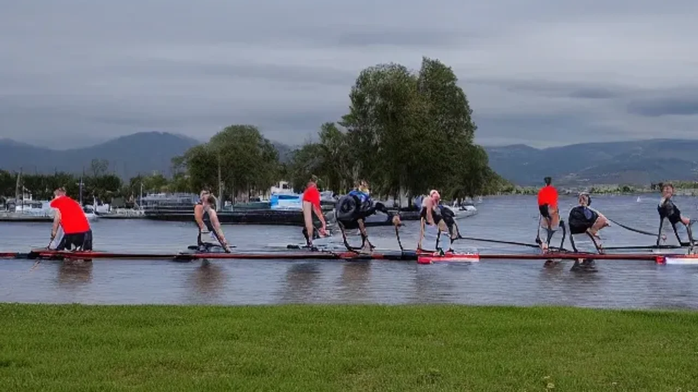
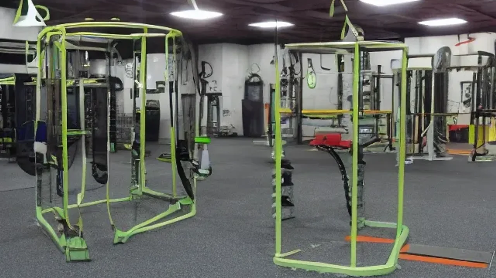

최근 피트니스 업계에서 가장 뜨거운 감자로 떠오른 복합 지구력 레이스에 참여하기 위해 **하이록스 대회 준비**를 시작하는 사람들이 급증하고 있습니다. 단순한 근비대나 단거리 달리기에서 벗어나 인간 본연의 종합적인 신체 능력을 시험하는 하이브리드 피트니스는 이제 2026년의 주류 운동 문화로 자리 잡았습니다. 이 글을 통해 신체 능력을 극적으로 끌어올리는 복합 트레이닝의 정수와 첫 대회를 성공적으로 완주하기 위한 실전 전략을 명쾌하게 정리합니다.

## 하이록스란 무엇인가? 크로스핏과의 진짜 차이점

### 하이브리드 피트니스의 정의와 하이록스의 8가지 종목
하이브리드 피트니스는 단일 목적의 운동 방식에서 탈피하여 유산소 지구력과 근력을 동시에 극대화하는 새로운 운동 패러다임입니다. 이 개념을 전 세계적인 스포츠 이벤트로 정착시킨 하이록스는 1km 달리기와 1개의 기능성 운동을 총 8회 반복하는 방식으로 진행됩니다. 참가자들은 레이스 과정에서 스키에르그(SkiErg), 슬레드 푸시(Sled Push), 슬레드 풀(Sled Pull), 버피 브로드 점프(Burpee Broad Jumps), 로잉(Rowing), 파머스 캐리(Farmer's Carry), 샌드백 런지(Sandbag Lunges), 월볼(Wall Balls)이라는 고정된 8가지 종목을 차례대로 완수해야 합니다. 모든 참가자가 동일한 환경과 동일한 순서로 경쟁하기 때문에 자신의 객관적인 체력 수준을 완벽하게 파악할 수 있는 지표가 됩니다.

### 고난도 기술 중심의 크로스핏 vs 지구력 중심의 하이록스 비교
많은 이들이 하이록스를 크로스핏과 혼동하지만 두 운동은 지향점과 구성에서 명확한 차이를 보입니다. 크로스핏은 바벨을 이용한 역도 동작(인상, 용상)이나 체조 종목(머슬업, 핸드스탠드 푸시업) 등 고도의 신체 협응성과 기술을 요구하는 동작이 주를 이룹니다. 반면 하이록스는 인간의 가장 기본적인 움직임인 '밀기, 당기기, 달리기, 운반하기'를 기반으로 설계되어 있습니다. 역도나 체조 같은 진입 장벽이 없어 부상 위험이 상대적으로 낮지만, 총 8km에 달하는 러닝을 소화해야 하므로 심폐지구력과 심혈관계의 지속 능력이 승패를 결정짓는 핵심 요소로 작용합니다.

### 나에게 맞는 종목은? 운동 성향별 선택 가이드
평소 자신이 즐기는 운동 스타일에 따라 집중해야 할 전략이 달라지가 됩니다. 마라톤이나 러닝 크루에서 활동하며 심폐 기능이 발달한 러너들은 8km의 달리기 구간에서 압도적인 시간 단축을 노릴 수 있지만, 100kg이 넘어가는 슬레드 푸시나 무거운 샌드백을 메고 하는 런지 구간에서 근력 부족으로 페이스가 급격히 저하될 위험이 있습니다. 반대로 헬스장에서 웨이트 트레이닝을 주로 해온 고중량 리프터들은 기능성 운동 구간을 빠르게 통과하더라도 각 세트 사이에 배치된 1km 러닝에서 심각한 심박수 상승을 겪으며 지체되기 쉽습니다. 따라서 본인의 강점을 파악하고 약점을 보완하는 하이브리드 형태의 접근이 필수적입니다.

## 하이록스 대회 준비를 위한 레벨별 실전 훈련 루틴

### 초보자를 위한 존2(Zone 2) 러닝과 기능성 웨이트 결합법
대회 완주를 목표로 하는 입문자라면 가장 먼저 기초 체력의 기반이 되는 존2(Zone 2) 영역의 유산소 베이스를 구축해야 합니다. 존2 훈련은 최대 심박수의 60~70% 수준을 유지하며 대화가 가볍게 가능한 강도로 최소 40분 이상 지속하는 달리기 방식입니다. 이 기초가 단단해야 고강도 운동 후 체내가 빠르게 회복됩니다. 초보자 루틴은 주 2회 5km 존2 러닝을 수행한 직후, 곧바로 헬스장으로 이동하여 스쿼트, 런지, 푸시업 같은 맨몸 및 라이트 웨이트 중심의 기능성 운동을 3세트 결합하는 방식으로 시작합니다. 몸이 달리기 직후의 피로 상태에서 저항성 운동에 적응하도록 만드는 기초 단계입니다.

### 기록 단축을 위한 인터벌 트레이닝과 로잉·스키에르그 배치법
기록 단축을 노리는 상급 동호인이라면 심박수가 요동치는 상황에서도 일정한 출력을 내는 훈련이 필요합니다. 이를 위해 1km 고강도 인터벌 러닝 후 곧바로 로잉 머신 500m 또는 스키에르그 500m를 최대 전력으로 수행하는 복합 세트를 추천합니다.
> **상급자 추천 인터벌 루틴 예시:**
> - 1km 러닝 (목표 대회의 타겟 페이스보다 15초 빠르게)
> - 스키에르그 500m (페이싱 유지)
> - 90초 휴식 후 총 4회 반복

이 훈련은 상체와 등 근육이 완전히 지친 상태에서 다시 다리를 굴려 달려야 하는 하이록스 특유의 '컴프레션(Compression)' 현상을 극복하는 데 탁월한 효과를 발휘합니다.

### 경기 후반부 체력 저하를 막는 '컴파운드 세트' 구성하기
레이스 후반부에 배치된 샌드백 런지와 월볼은 하체 근육의 극심한 불타는 느낌(젖산 축적)을 유발합니다. 이를 대비하기 위해 하체 근동작을 쉬지 않고 이어가는 컴파운드 세트 훈련을 주 1회 루틴에 포함시킵니다. 덤벨이나 케틀벨을 양손에 들고 런지를 20회 수행한 직후, 쉬지 않고 곧바로 메디신 볼을 이용해 벽면을 타격하는 월볼 샷을 20회 이어갑니다. 이처럼 동일한 근육군에 연속적인 부하를 가하는 훈련은 실제 경기 7~8번째 종목에서 마주하게 되는 한계 시점을 정신적, 육체적으로 버텨내게 만드는 원동력이 됩니다.

[관련 글 보기](/posts/health/)

## 첫 대회를 치르며 깨달은 현실적인 장단점과 솔직 후기

### 러닝 크루가 직접 도전해보고 느낀 하이록스의 강력한 장점
기존의 마라톤 대회는 개인의 고독한 레이스인 반면, 하이록스 레이스는 거대한 경기장 내부를 꽉 채운 관중들의 함성과 비트가 강한 음악 속에서 진행되어 마치 축제에 참여한 듯한 강렬한 에너지를 선사합니다. 경기 구역마다 배치된 심판과 응원단 덕분에 한계 상황에서도 초인적인 힘을 발휘하게 되며, 혼자 고립되어 운동할 때보다 훨씬 높은 성취감을 맛볼 수 있습니다. 특히 러닝 크루원들과 함께 2인조(Doubles) 종목으로 출전했을 때 서로의 부족한 점을 채워주며 피니시 라인을 통과하는 순간의 유대감은 일반적인 러닝 대회에서는 결코 경험할 수 없는 독보적인 장점입니다.

### 초보자가 간과하기 쉬운 부상 위험과 오버트레이닝의 단점
체력적인 준비가 부족한 상태에서 유행에 이끌려 무작정 대회에 참가할 경우 심각한 부상에 직면할 수 있습니다. 특히 6번째 종목인 파머스 캐리(고중량 케틀벨 들고 걷기)와 7번째 샌드백 런지 구간에서는 이미 악력과 척추 기립근이 한계에 도달한 상태이기 때문에, 급격하게 자세가 무너지면서 요추 부상이나 무릎 관절 손상을 입는 사례가 빈번하게 발생합니다. 또한, 매주 고강도 복합 운동을 무리하게 반복하다 보면 중추신경계가 피로를 회복하지 못해 만성 피로, 수면 장애, 면역력 저하 등의 오버트레이닝 증후군에 빠지기 쉬우므로 철저한 완급 조절이 요구됩니다.

### 완주자가 전하는 경기 당일 페이스 조절 및 멘탈 관리 팁
첫 번째 1km 러닝 구간에서 주변 참가자들의 빠른 페이스에 휘말려 오버페이스를 하는 것은 완주 실패로 가는 지름길입니다. 심박수가 첫 종목인 스키에르그를 타기도 전에 레드존(최대 심박수 영역)에 진입하면 남은 7개 구간은 고통의 연속이 됩니다. 경기 초반 1~3번째 종목까지는 본인의 연습 페이스보다 5~10% 정도 힘을 아낀다는 느낌으로 접근하는 유연함이 필요합니다. "레이스는 5번째 종목인 버피 브로드 점프부터 진짜 시작이다"라는 마음가짐으로 후반부를 위해 체력을 비축해두는 멘탈 관리가 당일 기록을 결정짓는 가장 강력한 팁입니다.

## 부상 없이 완주하는 하이록스 전용 장비 및 리커버리 전략

### 레이싱화 vs 트레이닝화? 하이브리드 슈즈 선택 기준과 추천 장비
신발의 선택은 하이록스 레이스의 성패를 가르는 가장 중요한 물리적 요소입니다. 일반 마라톤용 카본 러닝화는 쿠셔닝이 너무 폭신하여 100kg이 넘어가는 슬레드(썰매)를 밀 때 지면으로 힘이 제대로 전달되지 않고 발목이 흔들리는 치명적인 단점이 있습니다. 반대로 바닥이 딱딱한 역도화나 크로스핏 전용 나노 시리즈는 8km의 러닝 구간에서 발바닥과 무릎에 엄청난 충격을 주게 됩니다. 따라서 접지력이 우수한 고무 아웃솔을 가졌으면서도 적당한 미드솔 쿠셔닝과 가벼운 무게를 동시에 갖춘 하이브리드 전용 러닝화나 안정성이 보강된 트레이닝화를 선택하는 것이 부상을 방지하는 지름길입니다.

### 고강도 복합 운동 후 근육통을 줄여주는 액티브 리커버리 핵심 정리
대회 직후나 고강도 훈련 세션이 끝난 다음 날, 온몸이 쑤신다고 침대에 누워만 있는 것은 회복을 오히려 지연시킵니다. 가벼운 강도로 몸을 계속 움직여주는 액티브 리커버리(Active Recovery)가 근육 내 쌓인 대사 노폐물을 제거하는 데 훨씬 효과적입니다. 심박수 110회 이하를 유지하며 가볍게 자전거 페달을 돌리거나, 30분간 전신 스트레칭 및 폼롤러를 활용한 자가근막이완(SMR)을 수행하면 근육의 긴장도가 수월하게 낮아집니다. 또한 따뜻한 물과 차가운 물을 2~3분씩 번갈아 가며 들어가는 콘트라스트 테라피(냉온탕 샤워)는 혈액 순환을 촉진하여 근육통을 빠르게 완화해 줍니다.

### 경기 전후 리프레시를 위한 필수 영양 공급 및 수분 섭취 타이밍
엄청난 칼로리를 소모하는 하이록스 특성상 경기 전날과 당일 아침의 영양 섭취는 주유소에서 연료를 채우는 과정과 같습니다. 경기 전날에는 소화가 잘되는 탄수화물(쌀밥, 파스타 등) 중심의 식사로 근육 내 글리코겐을 가득 저장해 두어야 합니다. 경기 시작 2시간 전에는 정제된 탄수화물과 바나나 같은 가벼운 과일을 섭취하고, 전해질 음료를 지속적으로 마셔 체내 수분 밸런스를 맞춰줍니다. 경기가 끝난 직후 30분 이내에는 근육 손실을 막고 빠른 리프레시를 유도하기 위해 흡수가 빠른 유청 단백질 20~30g과 정제 탄수화물을 함께 섭취하여 고갈된 에너지를 즉각적으로 재충전해 주는 체계적인 타이밍이 요구됩니다.

#하이록스대회준비 #하이브리드피트니스 #크로스핏하이록스차이 #하이록스루틴 #존2러닝 #액티브리커버리 #하이록스운동화 #체력기르기 #직장인피트니스 #복합지구력운동