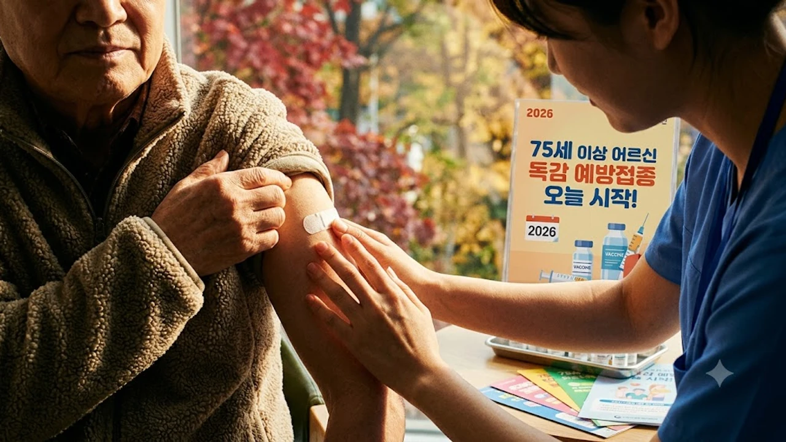

2026-2027절기 국가예방접종 지원사업이 시작되면서 **독감 백신 75세 이상** 어르신 대상 무료 접종이 10월 6일 공식 개시되었습니다. 인플루엔자 무료 예방접종을 기다려온 분들 사이에서는 오늘 바로 병원을 찾을지, 며칠 뒤 열리는 코로나19 백신 접종일까지 기다려 한 번에 맞을지 실질적인 저울질이 한창입니다. 특히 첫 주 특유의 병원 쏠림 현상과 잔여 백신 재고를 사전에 짚어두지 않으면 헛걸음하기 십상입니다.

## 2026 독감 무료 접종 시작: 오늘 당장 맞아야 할 대상과 준비

### 만 75세 이상 우선 접종 일정과 지정 의료기관 확인법
질병관리청 발표 지침에 따르면 이번 가을 절기 고령층 인플루엔자 무료 지원 대상은 연령대별로 순차 오픈됩니다.
- **만 75세 이상(1951년 12월 31일 이전 출생자)**: 2026년 10월 6일부터 접종 개시
- **만 70~74세(1952년~1956년 출생자)**: 2026년 10월 14일부터 순차 확대
- **만 65~69세(1957년~1961년 출생자)**: 2026년 10월 19일부터 접종 가능

주소지와 상관없이 전국 지정 위탁의료기관 및 보건소 어디서나 무료 접종을 지원받습니다. 다만 동네 내과나 이비인후과마다 당일 배정된 4가 백신 물량이 순식간에 동날 수 있으므로, 출발 전 **예방접종도우미 누리집(nip.kdca.go.kr)**이나 해당 병원에 직접 전화를 걸어 백신 보유 여부를 확인하는 편이 훨씬 확실합니다.

### 백신 총공급량 변동 이슈와 초기 품절 가능성 체크
올해 국내 유통 인플루엔자 백신은 WHO(세계보건기구) 권고 백신주 변동 여파로 초기 출하 물량이 지자체별로 분산 배치되었습니다. 

> "개원 첫날 오전에 대기표를 뽑고 방문했는데 11시 전에 당일 배정량 50도즈가 마감되어 발길을 돌렸다"는 용인시 수지구 이 모(78) 어르신의 실제 사례처럼, 개시 첫 주에는 진료 시작 직후 특정 병의원에 접종자가 몰려 오전 중 접수가 조기 마감되기도 합니다. 

오후 늦게 무작정 찾아가기보다는 오전 이른 시간에 내원하거나 전화로 미리 물량을 확인해 두는 전략이 안전합니다.

### 당일 방문 시 필수 준비물 및 신분증 지참 안내
무료 지원 대상자 자격을 현장에서 전산 등록해야 하므로 **주민등록증, 운전면허증, 모바일 신분증 중 하나를 반드시 지참**해야 합니다. 대리 수령이나 대리 접종은 불가능하며, 대상자 본인이 직접 예진표를 작성하고 의사의 문진을 거쳐야 바우처가 차감 없이 적용됩니다.

## 독감 vs 코로나19 백신: 단독 접종과 동시 접종 장단점 비교

### 10월 12일 개시되는 코로나19 백신과 동시 접종 안전성 기준
질병관리청과 대한감염학회 가이드라인에 따르면 인플루엔자 백신과 최신 코로나19 변이 대응 백신(XFG 계열)의 **동시 당일 접종은 의학적으로 유효하며 권장**되는 방식입니다. 10월 12일부터 65세 이상 고위험군 대상 코로나19 무료 백신이 풀리기 때문에, "오늘 10월 6일에 독감만 먼저 맞을 것인가, 아니면 6일 뒤인 10월 12일까지 기다려 양팔에 한 방씩 끝낼 것인가"를 선택해야 합니다.

동시 접종을 진행할 때는 반드시 **왼팔과 오른팔 접종 부위를 분리**해야 국소 부위 염증을 줄이고 이후 어느 쪽에서 이상반응이 생겼는지 명확히 가려낼 수 있습니다.

### 한 번에 끝내는 편의성 vs 면역 반응 부담 비교
두 가지 백신을 동시에 접종하면 의료기관을 두 번 발걸음하지 않아도 되므로 거동이 불편한 고령층에게 큰 이점이 있습니다. 반면 과거 백신 접종 후 고열이나 심한 오한을 겪었던 민감 체질이라면 면역 반응이 한꺼번에 겹쳐 신체 피로도가 급격히 올라갈 수 있습니다. 

평소 환절기 혈압 변동이 심하거나 만성 기저질환 조절이 까다로운 상태라면, 10월 6일 독감을 먼저 맞고 최소 2~4주 간격을 둔 뒤 코로나19 백신을 접종하는 분리 접근이 신체 부담을 덜어내는 대안이 됩니다. 평소 기초 체력 관리법이 궁금하다면 [건강 전체 글 보기](/posts/health/)를 통해 일상 속 컨디션 조절 수칙을 확인할 수 있습니다.

## 접종 당일과 직후 48시간 이상반응 대처 가이드

### 접종 후 20~30분 의료기관 대기 관찰의 실제 중요성
주사를 맞은 직후 곧바로 귀가해서는 안 됩니다. 아나필락시스(급성 중증 알레르기 쇼크)는 대개 주사 투여 후 15~30분 이내에 호흡 곤란, 안면 부종, 혈압 급락 형태로 나타납니다. 

- 접종실을 나온 직후 병원 대기실 의자에 앉아 20~30분간 상태를 관찰합니다.
- 어지럼증, 목 안쪽의 가려움, 식은땀, 가슴 답답함이 없는지 점검합니다.
- 이상 징후가 감지되면 즉시 간호 인력과 담당 의사를 호출해 응급 조치를 받아야 합니다.

### 발열과 근육통 발생 시 올바른 해열진통제 복용법
주사 맞은 팔의 뻐근함, 37.8도 안팎의 미열, 전신 근육통은 체내 항체가 형성되는 과정에서 나타나는 정상적인 면역 반응입니다. 

열감이 오르면 **아세트아미노펜 단일 성분 해열진통제**를 복용하는 것이 위장관 부담과 혈압 변동을 줄이는 정석입니다. 다만 예방 목적이라며 통증이 없는데도 주사 맞기 전 미리 해열진통제를 복용하는 행동은 체내 항체 생성을 방해할 수 있으므로 피해야 합니다.

### 단순 몸살을 넘어 즉시 응급실에 가야 하는 위험 신호
일반적인 미열이나 근육 뻐근함은 48시간 이내에 가라앉습니다. 그러나 아래 증상이 발생할 때는 단순 몸살로 넘기지 말고 곧바로 대형병원 응급의료센터를 찾아야 합니다.
- 해열제를 복용해도 38.5도 이상의 고열이 48시간 넘게 이어질 때
- 숨이 가빠지거나 가슴을 쥐어짜는 듯한 통증이 발생할 때
- 입술이나 손끝이 파랗게 변하는 청색증, 극심한 보행 실조, 의식 저하가 나타날 때

## 백신 맞기 전 반드시 체크해야 할 당일 건강 체크리스트

### 미열이나 급성 감기 기운이 있을 때 접종 연기 기준
접종 당일 아침 체온을 측정했을 때 37.5도 이상의 열감이 있거나 급성 인후통, 기침, 설사 증상이 있다면 접종 일정을 며칠 뒤로 미루는 결단이 필요합니다. 체내 면역계가 이미 다른 바이러스와 싸우는 상황에서 백신이 투입되면 정상적인 항체 형성을 방해하고 증상 악화의 빌미가 됩니다. 컨디션이 회복된 후 일주일 이내에 방문해도 혜택을 온전히 누릴 수 있습니다.

### 복용 중인 만성질환 약물(고혈압·당뇨) 투약 유지 방법
고혈압약, 당뇨약, 이상지질혈증약 등 매일 챙겨 먹는 만성질환 처방약은 **접종 당일 아침에도 평소 스케줄대로 정량 복용**해야 합니다. 백신 부작용을 걱정해 혈압약을 건너뛰는 일이 종종 있으나, 주삿바늘에 대한 긴장감으로 혈압이 급상승해 오히려 진료실에서 접종 불가 판정을 받는 경우가 빈번합니다. 아스피린이나 와파린 등 항응고제를 복용 중이라면 지혈이 지연될 수 있으므로 주사 부위를 문지르지 말고 5분 이상 지그시 압박해야 합니다.

### 접종 당일 사우나와 음주 금지 등 필수 생활 수칙
주사를 맞은 당일에는 샤워기 물이 주삿바늘 자국에 직접 닿지 않도록 주의하고, 뜨거운 열탕 목욕이나 사우나, 땀을 흘리는 격한 운동은 피해야 합니다. 

음주는 체내 염증 반응을 증폭시켜 고열과 알레르기 반응을 촉발하므로 접종 전후 3일간은 완전히 멀리해야 합니다. 접종 후 뻐근해진 목과 어깨 주변 근육을 무리하게 누르지 말고 부드럽게 이완해 주며 충분한 수분을 섭취하는 관리가 회복을 앞당깁니다.

[목 어깨 온열 저주파 마사지기 쿠팡에서 보기](https://www.coupang.com/np/search?q=%EA%B1%B4%EA%B0%95%EA%B8%B0%EA%B8%B0%20%EB%A7%88%EC%82%AC%EC%A7%80%EA%B8%B0&sourceType=affiliate&trackingCode=AF8691300)

#독감백신 #독감예방접종 #75세이상무료독감 #코로나독감동시접종 #인플루엔자백신 #예방접종도우미 #백신이상반응 #고령자예방접종