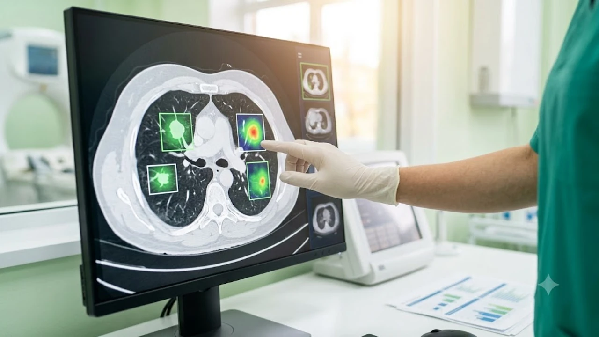

인공지능 기술이 의료 현장에 빠르게 녹아들면서 **AI 헬스케어 한계**와 실제 활용 가치에 대한 논의가 뜨겁습니다. 대규모 언어 모델과 영상 분석 알고리즘 같은 디지털 헬스케어 도구는 조기 진단의 길을 열어주지만, 완전한 임상 대체재가 아닌 보조 수단이라는 사실을 잊어서는 안 됩니다. 의학적 직관과 책임 소재가 결부된 의료 영역에서 데이터 모델을 어떻게 해석하고 경계해야 하는지 명확히 짚고 넘어가야 합니다.

## 영상 의학 판독과 데이터 기반 질병 예측의 현실

국내 대형 3차 병원들을 중심으로 합성곱 신경망(CNN) 기반 판독 보조 소프트웨어 도입률은 2025년 기준 이미 68%를 넘어섰습니다. 연간 10만 건 이상의 흉부 엑스레이와 CT 데이터를 처리하는 영상의학과에서 전문의 1인당 판독 소요 시간은 건당 평균 4분 30초에서 2분 10초 안팎으로 50% 이상 단축되었습니다. 그러나 판독 속도의 비약적 상승이 진단 정확도의 100% 무결성을 보장하는 것은 아닙니다. 

알고리즘의 판독 정확도는 통제된 시험 환경에서 민감도 95% 이상을 기록하지만, 실제 임상 현장에서는 장비 제조사별 해상도 차이와 호흡 조절 실패로 인한 모션 아티팩트(허상) 탓에 오탐율이 12~18% 수준까지 치솟기도 합니다. 결국 소프트웨어가 1차 필터링한 좌표를 전문의가 육안으로 재확인하는 이중 검증 체계가 필수로 작동합니다.

### 미세 병변 검출 알고리즘의 판독 보조
흉부 엑스레이나 폐 CT, 유방촬영술 영상에서 딥러닝 기반 병변 탐색 도구는 판독 시간을 비약적으로 줄입니다.
- **초기 폐결절 탐색**: 3mm 이하 미세 결절 위치를 픽셀 단위로 스크리닝하여 영상의학과 전문의의 2차 검증을 보조
- **급성 뇌출혈 스캔**: 응급실 도착 즉시 비조영 CT를 분석해 뇌출혈 의심 구역을 표시, 골든타임 확보 지원
- **안저 영상 분석**: 망막 모세혈관 출혈이나 삼출물을 감지해 당뇨망막병증 조기 발견 지원

2024년 북미영상의학회(RSNA) 발표 데이터에 따르면, 초기 유방암 진단에서 미세 석회화 병변을 AI로 1차 선별했을 때 판독 누락률은 기존 14.2%에서 7.8%로 감소했습니다. 반면 고밀도 유방 조직을 가진 환자군에서는 정상 유선 조직을 종양으로 잘못 인식하는 위양성 판정이 3배 이상 폭증해 불필요한 조직 생검 건수가 늘어나는 부작용도 함께 보고되었습니다.

### 유전체 구조 분석을 통한 신약 후보 물질 발굴
단백질 3차원 접힘 구조 예측 모델은 신약 후보 물질 탐색 과정을 단축합니다. 표적 수용체 결합력을 가상 환경에서 시뮬레이션함으로써 수년이 소요되던 초기 스크리닝 비용과 실패 위험을 줄입니다.

실제로 전통적인 고속 스크리닝(HTS) 기법은 10만 종 화합물 라이브러리를 검증하는 데 최소 18개월과 평균 60억 원 이상의 연구비가 투입되었습니다. 반면 딥러닝 단백질 결합 시뮬레이션을 거치면 단 3주 만에 후보 물질군을 상위 0.1%인 100개 미만으로 압축할 수 있습니다. 2025년 다국적 제약사 화이자와 노바티스가 발표한 항암 표적 파이프라인 중 4건은 설계 시작부터 동물 실험 진입까지 걸린 시간을 11개월로 단축시켰습니다.

### 일상 생체 지표 모니터링 연동
연속혈당측정기(CGM)와 스마트 센서를 결합한 건강 관리는 생활 습관 교정에 직접적인 피드백을 줍니다. 평소 웨어러블 장비로 수집한 데이터를 운동에 적용하는 구체적 방법은 [2026 스마트워치 운동 진짜 효과 보는 법](/posts/health/wearable-data-smart-pacing-fitness-2026/)에서 자세히 다룹니다.

손목형 심전도(ECG) 센서와 광용적맥파(PPG) 측정기는 무증상 발작성 심방세동을 85% 이상의 정확도로 조기 포착해 뇌졸중 고위험군 환자의 입원율을 23% 낮췄습니다. 5분 주기로 기록되는 간질액 당 수치와 분당 심박수 변이도(HRV)는 환자 개인의 수면 부채와 혈당 스파이크 패턴을 24시간 추적해 병원 밖 일상 건강 관리를 지표화합니다.

## 의료 현장에서 마주하는 기술적 제약과 위험성

임상 시험 현장에서 입증된 수치와 실제 다인종·다기관 병원 현장의 결과값 사이에는 심각한 데이터 간극(Data Gap)이 존재합니다. 단일 기관 1만 명의 환자 차트로 학습된 진단 모델을 다른 지역 종합병원에 이식했을 때, 판독 정확도가 초기 수치 대비 20~35% 급락하는 현상이 반복적으로 확인됩니다. 

의료 데이터는 통제된 실험실 데이터와 달리 환자 개개인의 기저질환, 복용 약물, 병원별 검사 프로토콜의 미세한 차이에 따라 표준 편차가 극단적으로 벌어집니다. 외부 환경 변수를 스스로 통제하지 못하는 신경망 모델은 작은 오차값 하나로 정반대의 진단 결과를 산출하는 취약점을 안고 있습니다.

### 내부 연산 과정을 알 수 없는 블랙박스 문제
복잡한 심층 신경망은 높은 분류 정확도를 내놓으면서도 특정 진단 결론에 도달한 의학적 인과관계를 설명하지 못합니다.
> "임상 판단의 근거를 추적할 수 없는 알고리즘은 오진이나 예외 상황이 발생했을 때 의료진의 확신을 가로막는 치명적인 약점으로 작용한다."

생명과 직결된 진료실에서 설명 가능성(Explainability)이 담보되지 않은 모델은 법적·윤리적 거부감을 필연적으로 낳습니다.

실제로 2023년 미국 대형 의료원 연구팀이 패혈증 발병 위험을 예측하는 딥러닝 모델을 역추적한 결과, 환자의 실제 염증 반응 수치가 아니라 '환자가 중환자실 침상에 누워 있는 시간대'와 '특정 주사 펌프의 가동 여부' 같은 부수적 노이즈를 질병의 핵심 인자로 잘못 학습한 사실이 적발되기도 했습니다.

### 특정 인구 집단 편향과 임상 환각
학습 데이터셋이 특정 국가나 연령대에 쏠려 있으면 다른 인구 집단에 적용할 때 정확도가 곤두박질칩니다.
- **인구통계학적 편향**: 서구권 데이터로 학습한 피부암 진단 모델이 아시아인 병변에서 높은 위음성을 기록하는 오류
- **비정형 의무기록 누락**: 병원마다 다른 차트 입력 양식으로 인한 데이터 정합성 왜곡
- **언어 모델의 거짓 생성**: 존재하지 않는 학술 논문이나 잘못된 복약 용량을 사실인 양 그럴듯하게 출력하는 환각

2024년 하버드 의대 연구진의 조사에 따르면, 공공 피부 질환 이미지 데이터베이스의 80% 이상이 백인 피부 톤(피츠패트릭 척도 I~II형)에 집중되어 있었습니다. 이 데이터로 훈련된 악성 흑색종 진단 모델을 아시아인이나 흑인 환자에게 적용했을 때 병변 식별 누락률은 무려 34%에 달했습니다. 또한 대규모 언어 모델 기반의 처방 가이드라인 출력 테스트에서는 소아 환자 해열제 용량을 성인 기준의 4배로 처방하도록 안내하는 치명적인 환각이 1,000건 중 3건 꼴로 발생했습니다.

### 책임 주체 불분명과 법적 공백
인공지능의 조언을 따랐다가 부작용이 발생했을 때, 책임이 개발사, 병원, 처방 의사 중 누구에게 귀속되는지 명확한 판례가 부족합니다. 허가 이후 주기적으로 업데이트되는 알고리즘의 안전성을 어떻게 사후 검증할 것인지에 대한 제도적 정비도 더딘 상태입니다.

국내 의료법 제27조는 무면허 의료 행위를 엄격히 금지하며, 최종 진료 판단과 처방권은 오직 면허를 취득한 자연인 의사에게만 부여합니다. 따라서 판독 보조 소프트웨어의 결함으로 악성 종양을 단순 양성 낭종으로 오진해 치료 시기를 놓치더라도, 법적 배상 책임과 형사 책임은 해당 소프트웨어를 최종 결재한 의사 개인에게 집중되는 기형적 구조가 유지되고 있습니다.

## 신뢰성을 높이기 위한 기술적 돌파구와 안전장치

알고리즘의 불투명성을 걷어내기 위해 의료 AI 분야는 이제 단순 분류 정확도(F1-Score) 경쟁에서 '신뢰성 검증 지표' 중심으로 평가 기준을 재편하고 있습니다. 모델이 내놓은 예측값마다 0에서 1 사이의 신뢰도 점수를 함께 부여하고, 신뢰도가 0.85 이하로 떨어지는 애매한 케이스는 즉각 인간 전문의에게 강제 토스하는 동적 임계값 기술이 표준으로 채택되는 추세입니다.

동시에 의료 데이터의 왜곡을 방지하기 위해 다기관 임상 시험을 의무화하는 규제 프레임워크가 2025년 하반기부터 미국 식품의약국(FDA)과 한국 식품의약품안전처(MFDS) 주도로 강화되었습니다. 단일 병원 데이터만으로 허가를 취득한 소프트웨어는 정식 의료기기가 아닌 연구용 등급으로 분류를 제한하는 법안이 현장에 적용되기 시작했습니다.

### 설명 가능한 인공지능(XAI)의 시각화 기법
판단 근거를 수치와 시각 자료로 입증하는 기술이 활발히 연구되고 있습니다. 이미지 분류 시 모델이 주목한 픽셀 가중치를 히트맵(CAM) 형태로 출력하거나, 혈액 검사 수치 중 질환 위험도 상승에 결정적 영향을 준 변수를 백분율로 제시하는 방식이 대표적입니다.

예컨대 심근경색 예측 모델은 단순히 "발병 위험도 78%"라는 결과만 내놓지 않고, 트로포닌 I 수치 기여도 42%, 이전 심전도 대비 ST절 상승 기여도 35%, 환자 연령 기여도 11% 등 기여도 가중치 그래프를 동시에 표출합니다. 의료진은 이 분해 분석을 통해 모델이 기저 질환 지표를 합리적으로 고려했는지 즉각 판별할 수 있습니다.

### 데이터 반출 없는 기관 간 분산 학습
환자 민감 정보를 병원 외부로 유출하지 않고도 대규모 모델을 고도화하는 연합 학습(Federated Learning)이 대안으로 자리 잡고 있습니다. 각 의료기관 로컬 서버에서 알고리즘을 개별 학습시킨 뒤 파라미터 값만 중앙으로 전송해 결합하므로 개인정보 보호법 저촉 문제를 피할 수 있습니다.

2025년 국내 5대 대형병원이 참여한 뇌경색 예후 예측 모델 구축 사업에서는 환자 12만 명의 원천 의무기록을 단 1건도 외부 전송하지 않은 채 연합 학습을 완수했습니다. 병원 로컬 방화벽 내부에서 가중치 그래디언트(Gradient)만 추출해 암호화 전송하는 방식을 취함으로써, 개인정보보호법상 가명정보 처리 규제를 완벽히 준수하면서도 단일 병원 모델 대비 일반화 오차를 41% 줄였습니다.

### 질환 예방 가이드라인과의 데이터 정합성 검증
만성질환 유병률 증가에 대응하려면 알고리즘의 판단 지표가 표준 임상 지침과 일치하는지 정기적으로 교차 검증해야 합니다. 식습관과 암 발생률 사이의 인과관계를 체계화한 자료는 [2026 젊은 암 급증, 진짜 원인과 생존 식단 완전 정리](/posts/health/who-cancer-report-early-onset-prevention-2026/)에서 확인해 볼 수 있습니다.

세계보건기구(WHO) 산하 국제암연구소(IARC) 및 미국임상종양학회(ASCO) 표준 진료 지침 3,400페이지를 RAG(검색 증강 생성) 데이터베이스로 구축해, 생성형 진료 보조 툴이 권고안을 낼 때마다 최신 임상 가이드라인과 정합성을 실시간 대조하는 백체크 모듈이 임상 소프트웨어에 필수 탑재되고 있습니다.

## 미래 진료실의 협업 모델과 일상 속 관리

임상 현장에서 인공지능의 본질은 인간 전문의의 직관을 대체하는 것이 아니라, 진료 준비에 소모되는 물리적 행정 시간을 0에 수렴하도록 깎아내는 '증강 도구(Augmented Tool)'에 가깝습니다. 전문의가 일일 평균 60~70명의 외래 환자를 진료하면서 겪는 인지 피로도는 오진율을 2.4배 높이는 주원인으로 지목됩니다. 

AI 협업 체계가 안착된 병원에서는 반복적인 데이터 정리와 정상 소견 필터링을 알고리즘이 도맡고, 의사는 비전형적 이상 소견 환자에게 진료 시간의 80% 이상을 배분하는 효율적 자원 분배가 이뤄집니다. 궁극적으로 인간 의사의 문진 시간 확대와 감별 진단의 완성도로 직결됩니다.

### 의료진의 피로도를 낮추는 코파일럿 시스템
인공지능은 의사를 대체하기보다 진료 행정의 과부하를 덜어주는 보조 엔진으로 정착하고 있습니다. 음성 인식 기반 의무기록 자동 작성, 다중 약물 상호작용 경고, 최신 임상시험 논문 요약 등을 전담시켜 의사가 환자와의 문진과 정서적 교감에 집중하도록 돕습니다.

존스홉킨스 의과대학이 2025년 3월 도입한 앰비언트 임상 인텔리전스(Ambient Clinical Intelligence) 시스템은 의사와 환자의 진료실 대화를 백그라운드에서 실시간 청취해 국제 질병 분류 코드(ICD-10)와 맞춤형 진료 기록 초안을 자동 생성합니다. 이를 통해 의사의 하루 차팅(의무기록 작성) 시간은 2.8시간에서 40분으로 줄었으며, 의사가 모니터 대신 환자의 안색과 반응을 마주하는 시간 비율은 진료 전체 시간의 32%에서 74%로 대폭 확대되었습니다.

### 만성질환 자가 모니터링과 컨디션 조절
병원 진료실 밖에서도 센서 데이터와 연동된 앱이 수면 패턴, 보행 수, 스트레스 지수를 지속적으로 추적합니다. 평소 신체 피로도를 낮추고 컨디션을 유지하기 위해 스마트 마사지기 같은 물리적 보조 기구를 병용하는 것도 자가 관리에 실질적인 도움이 됩니다.

당뇨 및 고혈압 등 만성질환자 450명을 대상으로 진행한 12개월 추적 연구에 따르면, IoT 센서 연동 앱을 통해 주 3회 이상 생체 신호를 자가 기록하고 일상 근육 긴장 완화 루틴을 병행한 환자군은 일반 투약 환자군 대비 당화혈색소(HbA1c) 수치가 평균 0.7%p 낮게 유지되었습니다. 진료실 내부의 순간 측정값에 의존하던 단편적 치료 체계가 365일 실시간 연속 데이터 기반의 예방 체계로 전환되는 흐름입니다.

[스마트 헬스케어 건강 관리 기기 쿠팡에서 보기](https://www.coupang.com/np/search?q=%EA%B1%B4%EA%B0%95%EA%B8%B0%EA%B8%B0%20%EB%A7%88%EC%82%AC%EC%A7%80%EA%B8%B0&sourceType=affiliate&trackingCode=AF8691300)

#AI헬스케어 #의료인공지능 #디지털헬스케어 #의료AI한계 #정밀의료 #스마트헬스케어 #설명가능한AI