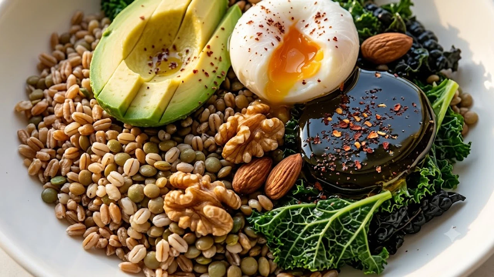

식후 급격하게 치솟는 혈당 스파이크와 오후마다 몰려오는 무기력증을 줄이기 위해 많은 이들이 **지중해 식단**을 선택하고 있습니다. 단순한 열량 제한을 넘어 풍부한 식이섬유와 불포화지방산을 중심으로 식판을 구성하면, 인슐린 저항성을 개선하고 인슐린 분비 부담을 덜어내는 데 커다란 도움을 줍니다. 정제 탄수화물 대신 올리브유와 채소를 식사의 중심에 배치하는 것만으로도 식후 혈당 곡선은 훨씬 완만해집니다.

## 혈당 스파이크를 잠재우는 영양 설계 원리

### 복합 탄수화물과 식이섬유의 완충 메커니즘
정제 백미나 밀가루는 소화관을 거치며 혈류 속으로 포도당을 빠르게 밀어 넣습니다. 반면 껍질을 벗기지 않은 통곡물과 잎채소에 응축된 불용성·수용성 식이섬유는 위장에서 젤 형태의 보호막을 만듭니다. 이 보호막이 포도당 흡수 속도를 지연시켜 급격한 혈당 상승을 물리적으로 차단합니다.

### 단일불포화지방산의 인슐린 감수성 개선 효과
올리브유에 풍부한 올레산은 세포막의 유연성을 키워 인슐린 수용체가 포도당을 원활하게 받아들이도록 돕습니다. 포화지방이 가득한 가공육 대신 엑스트라 버진 올리브유를 곁들이면 혈관 내벽의 염증 반응을 낮추고 췌장의 과도한 호르몬 분비 부담을 덜어줍니다.

### 미크로비옴 환경과 대사 경로의 연결
지중해식 메뉴에 매 끼니 들어가는 콩류와 견과류는 장내 유익균의 먹이인 프리바이오틱스로 작동합니다. 유익균이 이를 발효해 생성하는 단쇄지방산(SCFA)은 간에서 포도당이 과도하게 만들어지는 과정을 억제해 공복 혈당 수치를 안정적으로 붙잡아둡니다.

## 한국형 식판으로 전환하는 세 가지 실천 수칙

### 정제 백미 대신 귀리와 통곡물 혼합하기
서양식 퀴노아나 렌틸콩을 굳이 고집하지 않아도 됩니다. 흰쌀밥 대신 통귀리와 현미, 서리태를 5:3:2 비율로 섞어 짓는 것만으로도 식후 소화 흡수 속도를 절반 가까이 늦출 수 있습니다. 거친 곡물의 식감은 자연스럽게 씹는 횟수를 늘려 뇌의 만복 중추를 적절한 타이밍에 자극합니다.

### 나물 무침 기름을 생들기름과 올리브유로 교체하기
가공된 식용유로 채소를 볶는 대신, 살짝 데쳐낸 나물에 엑스트라 버진 올리브유나 저온 압착 생들기름을 둘러 버무리는 방식을 취합니다. 비타민 A·K 등 지용성 영양소의 흡수율을 극대화하면서도 트랜스지방과 산화된 지질 섭취를 원천적으로 배제할 수 있습니다.

### 육류 단백질을 등푸른생선과 두부로 재배치하기
붉은 육류 위주의 식사는 체내 염증 지표를 높이기 쉽습니다. 일주일에 3회 이상 고등어, 삼치, 꽁치 같은 등푸른생선을 굽거나 조림으로 올리고, 찌개나 샐러드에는 단단한 부침용 두부를 큼직하게 썰어 넣어 양질의 식물성 단백질을 채웁니다. 식단 조절과 병행해 체지방을 태우고 싶다면 [존2 유산소 운동법, 진짜 살 빠질까?](/posts/health/zone-2-cardio-fat-burn-routine-2026/)를 함께 확인해 기초대사량을 지키는 루틴을 추천합니다.

## 잘못된 방식이 부르는 혈당 역효과와 주의점

### 드레싱 속 당류와 오일의 변질 위험
지중해식을 표방하면서 시판 발사믹 글레이즈나 과일 드레싱을 듬뿍 뿌리는 것은 설탕 시럽을 붓는 것과 다를 바 없습니다. 원재료명을 꼼꼼히 확인해 액상과당이 배제된 순수 발사믹 식초와 신선한 올리브유만 골라 써야 하며, 가열 시 발연점을 넘겨 산패되지 않도록 주의해야 합니다.

> **식판 점검 체크리스트**  
> 접시의 50%는 녹색 채소, 25%는 생선이나 콩류, 나머지 25%는 거친 통곡물로 채워져 있는지 매 끼니 육안으로 확인하세요.

### 과도한 견과류 섭취로 인한 열량 과잉
견과류가 몸에 좋다고 해서 한 주먹 넘게 수시로 집어먹으면 하루 권장 섭취 칼로리를 손쉽게 초과합니다. 잉여 에너지는 간에 지방으로 쌓여 인슐린 저항성을 악화시키므로, 하루 한 줌(호두 2알, 아몬드 10알 안팎)으로 섭취량을 엄격히 통제해야 합니다.

## 지속 가능한 1주일 식단 구성과 장보기 팁

### 일주일 단위 밑준비와 밀프랩 가이드
주말에 브로콜리, 파프리카, 양배추를 한 입 크기로 썰어 밀폐용기에 보관해두면 바쁜 평일 아침에도 손쉽게 접시를 채울 수 있습니다. 통곡물밥은 한 공기 분량씩 소분해 냉동실에 얼려두었다가 데워 먹으면 저항성 전분 함량이 늘어나 혈당 방어에 더욱 유리해집니다.

### 가성비 좋은 신선 식재료 고르는 기준
산도 0.8% 이하의 냉압착 엑스트라 버진 올리브유는 어두운 유리병에 담긴 제품을 선택해야 빛에 의한 산패를 막을 수 있습니다. 생선은 제철 냉동작성할 글의 **주제나 핵심 키워드, 다루고자 하는 세부 내용**을 알려주시면 요청하신 형식(마크다운 코드블록 전용, front matter 및 군더더기 설명 배제)에 맞춰 바로 완성된 본문을 작성해 드리겠습니다. 어떤 주제로 작성을 진행할까요?