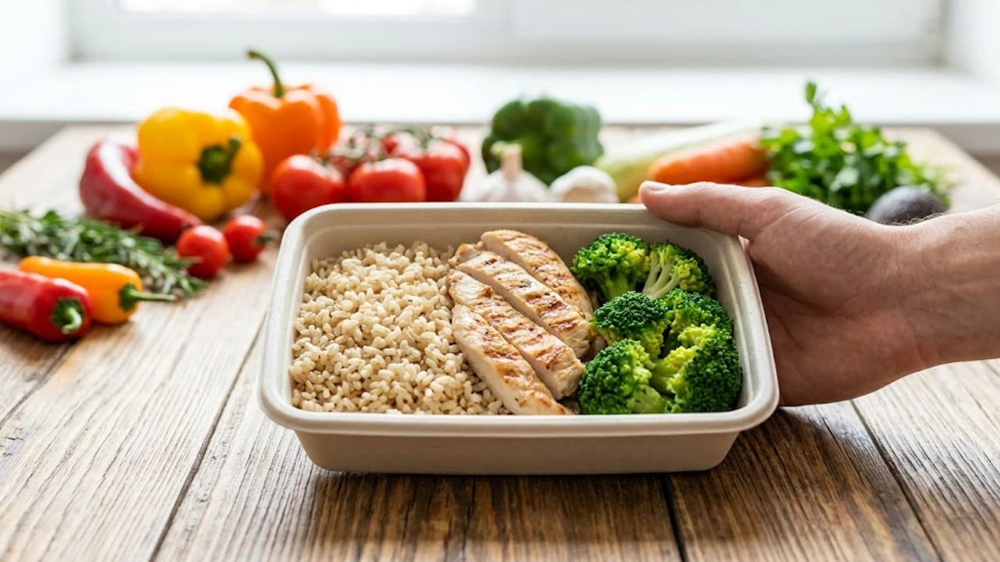

건강검진에서 간 수치 경고를 받고 무작정 굶는 방식만 고집하다 요요와 피로감에 부딪히는 경우가 흔합니다. 질병관리청 발표 기준 국내 성인 4명 중 1명을 위협하는 대사이상 지방간(MASLD)은 식단만으로 한계가 뚜렷하며, 간세포 속 잉여 중성지방을 직접 분해하는 체계적인 **지방간 없애는 운동법**을 병행해야 혈당 스파이크와 간 섬유화를 확실하게 차단합니다.

## 비알코올성 지방간의 원인과 운동의 직접적 기전

### 간세포 내 중성지방 축적과 인슐린 저항성
정제 탄수화물 과다 섭취와 신체 활동 부족이 이어지면 혈중 인슐린 수치가 만성적으로 치솟아 잉여 에너지가 간세포에 기름 형태로 엉겨 붙습니다. 간에 쌓인 유리 지방산은 산화 스트레스를 일으켜 정상 세포를 파괴합니다. 이때 골격근을 직접 수축시키는 훈련을 진행하면 혈중 포도당이 근육으로 즉각 흡수되어 망가진 인슐린 감수성이 제자리를 찾습니다.

### 골격근 수축이 촉진하는 지방 연소 메커니즘
골격근이 수축할 때 활성화되는 대사 센서 단백질(AMPK)은 간 내부의 지방 합성 경로를 차단하고 기존 중성지방을 산화 연료로 전환합니다. 근육량이 10% 늘어날 때마다 비알코올성 지방간 유병 위험이 뚜렷하게 떨어진다는 국내외 역학 데이터는 근육 조직이 단순 외형을 넘어 강력한 대사 정화 장치임을 입증합니다.

### 마이오카인 분비를 통한 간 내 염증 억제
근육은 수축 과정에서 자가 항염증 물질인 마이오카인(Myokine)을 뿜어냅니다. 혈류를 타고 간으로 직행한 이리신(Irisin)과 인터루킨 계열 물질은 간세포의 염증 반응을 억제하고 콜라겐 섬유가 들러붙는 간 섬유화 진행을 막아내는 방패 역할을 맡습니다.

## 간 속 중성지방을 직접 태우는 존2 유산소 루틴

### 지방 연소 효율을 극대화하는 심박수 설정
지방을 주 에너지원으로 집중 소모하는 최적 구간은 최대 심박수의 60~70% 대역인 존2(Zone 2) 영역입니다. 옆 사람과 헐떡이지 않고 짧은 대화는 나누되 노래는 부르기 어려운 강도로, 젖산 축적에 따른 급격한 피로 없이 미토콘드리아의 지방 연소 효율을 최고치로 끌어냅니다. 본인 나이에 맞춘 구간 설정법은 [존2 유산소 운동법, 진짜 살 빠질까?](/posts/health/zone-2-cardio-fat-burn-routine-2026/) 글에서 바로 확인할 수 있습니다.

### 인터벌 트레이닝과 실내 자전거 세팅법
체중 부하로 무릎 관절이 시린 상태라면 고정식 실내 자전거 페달링이 안전한 선택지입니다. 안장 높이를 골반 위치에 맞추고 분당 80~90RPM의 일정한 케이던스로 40분간 이어가는 저강도 지속 훈련을 주 3회 진행합니다. 주 1회는 30초 폭발적 페달링과 90초 서행을 6~8회 반복하는 고강도 인터벌(HIIT)을 더해 간세포 속 글리코겐을 완전히 고갈시키는 루틴이 효과적입니다.

> **실제 임상 사례**: 45세 사무직 남성 K씨는 식단을 크게 줄이지 않고 매일 40분씩 실내 자전거 존2 유산소를 12주간 실행한 결과, 체중은 2.8kg 감량에 그쳤으나 복부 초음파 검사상 간 내 지방 침착도가 '중등도'에서 '경증'으로 한 단계 호전되었습니다.

### 실시간 모니터링을 통한 운동 강도 조절
피로가 누적된 상태에서 고강도 구간으로 튀어버리면 지방 대신 혈중 포도당만 소모되어 간에 과부하를 줍니다. 손목 밴드로 실시간 심박수 알림을 설정해 존2 영역을 벗어나지 않도록 페이싱을 조율하는 습관을 들여야 합니다. 구체적인 장비 활용법은 [2026 스마트워치 운동 진짜 효과 보는 법](/posts/health/wearable-data-smart-pacing-fitness-2026/)을 참고하면 좋습니다.

## 인슐린 감수성을 개선하는 하체 대근육 저항 운동

### 허벅지와 둔근 중심의 복합 관절 운동
전신 근육량의 60% 이상이 몰려 있는 하체를 단련해야 식후 쏟아져 나오는 잉여 혈당을 스펀지처럼 흡수할 수 있습니다. 대퇴사두근과 둔근이 튼튼해지면 간으로 흘러 들어가는 잉여 지방산 총량이 눈에 띄게 줄어듭니다.

- **스쿼트**: 15회씩 4세트 (무릎이 발끝 방향을 향하도록 고관절 힌지 유지)
- **리버스 런지**: 좌우 각 12회씩 3세트 (체중을 앞발 뒤꿈치에 싣고 수직 하강)
- **힙 브릿지**: 20회씩 3세트 (엉덩이를 들어 올린 뒤 정점에서 2초간 강하게 쥐어짜기)

### 주간 저항 운동 분할과 점진적 과부하 원칙
주 3회 격일 패턴으로 하체와 상체 대근육을 묶어 자극하는 2분할 방식을 추천합니다. 무리한 고중량 욕심은 버리고 세트당 마지막 2회가 약간 뻐근하게 느껴지는 저항을 설정하되, 2주 단위로 반복 횟수나 무게를 미세하게 늘려 근섬유에 꾸준한 대사 자극을 줘야 합니다.

### 운동 직후 근육통 관리와 간 피로 예방
갑작스러운 고강도 근력 운동은 골격근 미세 손상으로 인해 혈액 검사 시 AST, ALT 간 수치를 일시적으로 치솟게 만듭니다. 운동 직후 충분한 수분을 섭취하고 폼롤러나 마사지로 뭉친 근육을 부드럽게 이완해 간이 피로 물질 처리에 에너지를 빼앗기지 않도록 관리해야 합니다.

## 운동 효과를 보존하는 생활 습관과 실천 전략

### 공복 운동과 식후 운동의 대사적 차이
- **기상 직후 공복 유산소**: 혈중 인슐린이 바닥을 치는 시간대이므로 간에 쌓인 지방질을 20% 이상 빠르게 끌어다 씁니다.
- **식후 30분 저항 운동**: 식사 직후 치솟는 혈당 스파이크를 근육 세포가 흡수하여 간 내 지방 합성을 차단합니다.

### 간 해독을 돕는 수면 리듬과 수분 보충
수면이 6시간 미만으로 부족해지면 스트레스 호르몬인 코르티솔이 쏟아져 나와 복부와 간 주변으로 내장지방을 밀어 넣습니다. 하루 7시간의 안정적인 수면 리듬을 지키고, 운동 전후로 시간당 미온수 200ml를 나누어 마셔 간문맥 혈류 순환을 촉진해야 합니다.

운동 후 뭉친 하체 근육을 즉각 풀어주어 다음 날 운동 수행 능력을 보전하고 간의 회복 속도를 끌어올리는 장비를 구비하는 것도 좋은 방법입니다.
[근육 피로 완화 마사지건 쿠팡에서 보기](https://www.coupang.com/np/search?q=%EA%B1%B4%EA%B0%95%EA%B8%B0%EA%B8%B0%20%EB%A7%88%EC%82%AC%EC%A7%80%EA%B8%B0&sourceType=affiliate&trackingCode=AF8691300)

#지방간 #지방간운동법 #존2유산소 #인슐린저항성 #내장지방빼는법 #하체근력운동 #간수치낮추는법 #지방간영양제