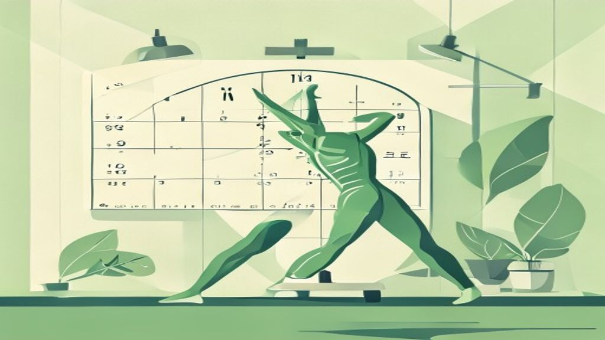
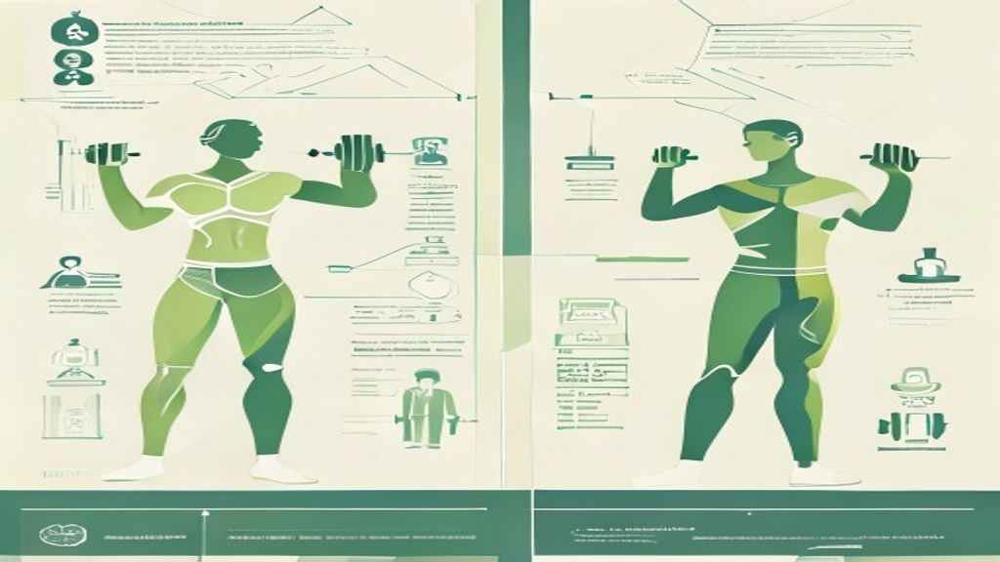

바쁜 일상에 치여 운동할 시간조차 내기 어려운 현대인들에게, '운동'은 늘 숙제로 남아있죠. 하지만 2026년에는 이 숙제를 해결할 **2026 틈새 운동**이 당신의 건강을 책임질 핵심 전략으로 떠오르고 있습니다. 짧은 시간 투자로도 놀라운 **10분 운동 효과**를 누릴 수 있다면, 더 이상 "시간이 없어서"라는 변명은 통하지 않을 거예요. 이 글을 통해 **바쁜 현대인 운동**의 새로운 패러다임을 제시하고, 과학적 근거와 실천 가능한 팁으로 여러분의 건강 습관을 바꿔놓을 방법을 알려드릴게요.

## 2026년, 왜 '틈새 운동'이 대세일까? 바쁜 현대인의 필수 전략

혹시 "운동은 무조건 헬스장에서 1시간 이상 해야 한다"고 생각하시나요? 2026년 건강 트렌드는 이런 고정관념을 깨고 '효율성'과 '개인 맞춤형'에 집중하고 있습니다. 바쁜 현대인에게는 긴 시간을 투자하기 어려운 현실적인 제약이 따르기 때문이죠. 틈새 운동은 바로 이런 제약 속에서 최대의 효과를 끌어내려는 노력의 결과입니다.

### 바쁜 현대인을 위한 '효율성'과 '개인 맞춤형' 트렌드, 틈새 운동의 다양한 형태와 주목받는 이유: 슬로우 조깅부터 몰아치기까지

현대인의 건강 관리는 '얼마나 오래'보다 '얼마나 효율적으로'에 초점을 맞춥니다. 5분에서 10분 이내의 짧고 고강도 운동 루틴, 즉 **틈새/마이크로 운동**이 인기를 끄는 것도 이 때문이죠. 출퇴근 전 7분 스트레칭, 사무실 의자 요가, 혹은 10분 홈트레이닝처럼 일상 속에 자연스럽게 녹아드는 운동 방식은 바쁜 직장인이나 MZ세대에게 특히 매력적입니다.

예를 들어, 저는 예전에 헬스장을 끊어놓고도 제대로 가지 못해 아까워했던 경험이 있어요. 하지만 아침에 눈 뜨자마자 7분 스트레칭을 시작하고, 점심시간에 잠깐 사무실 밖을 걸으며 **슬로우 조깅**을 시도했더니, 생각보다 훨씬 꾸준히 운동을 할 수 있게 되더군요. 슬로우 조깅은 옆 사람과 대화가 가능한 느린 속도로 달리는 유산소 운동인데, 심박수를 낮게 유지하면서도 심폐지구력 향상과 지방 연소에 탁월한 효과를 보인다고 합니다. 피로도가 낮아 지속하기 쉽다는 점이 가장 큰 장점이죠.

또 다른 흥미로운 트렌드는 바로 **몰아치기 운동(Weekend Workout)**입니다. 일주일 권장 운동량(중강도 150분 이상)을 주말 하루나 이틀에 집중해서 실시하는 방식인데, 매일 운동하는 것과 거의 유사하게 사망 위험이나 암, 심근경색, 치매 등 각종 질병 위험을 낮추는 효과가 확인되었다는 연구 결과도 있습니다. 주중에 시간이 도저히 나지 않는 분들이라면, 주말에 몰아서 운동하는 것도 좋은 대안이 될 수 있다는 뜻이죠. 저도 주말에는 좀 더 강도 높은 운동을 몰아서 하는 편인데, 평일에 놓친 운동량을 보충하는 기분도 들고, 한 주를 건강하게 마무리하는 느낌을 받습니다.

## 10분 운동, 정말 최대 효과를 낼 수 있을까? 과학적 근거 파헤치기

"고작 10분으로 무슨 운동 효과가 있겠어?"라고 생각할 수 있습니다. 하지만 최신 과학 연구들은 짧은 시간의 운동이 우리가 생각하는 것보다 훨씬 강력한 건강 효과를 가져올 수 있다고 말합니다. 중요한 건 '어떻게' 10분을 활용하느냐에 달려있죠.

### 10분 근력 운동의 놀라운 건강 효과: 사망 위험 감소까지?

하루 약 9\~10분, 즉 주당 약 60분 정도의 근력 운동만으로도 전체 사망, 심혈관 질환, 암 사망 위험이 모두 낮아지는 경향이 확인되었다는 연구 결과가 있습니다. 이 정도 시간이라면 충분히 투자할 만하지 않나요? 헬스장에 갈 필요도 없습니다. 팔굽혀펴기, 스쿼트 같은 맨몸 운동으로도 충분하며, 근육이 거의 지칠 때까지 반복하는 것이 중요합니다. 짧은 시간 동안 최대한 근육을 활용하는 것이 핵심이라는 점을 기억하세요.

*   **장점:**
    *   짧은 시간 투자로 높은 효율
    *   장비 없이 맨몸으로도 가능
    *   사망 위험 감소 등 전반적인 건강 증진
*   **단점:**
    *   정확한 자세와 충분한 강도 유지가 중요
    *   운동 초보자는 부상 위험에 유의

### 10분 유산소 운동으로 뇌 건강까지! 인지력 향상 비결

몸뿐만 아니라 뇌 건강에도 10분 운동이 긍정적인 영향을 미친다는 사실을 알고 계셨나요? 단 10분간의 중간 강도 달리기(조깅)만으로도 뇌의 전전두엽 피질로 통하는 혈류량이 증가하여 인지력이 향상됩니다. 이는 뇌 노화를 늦추고 치매를 예방하는 데도 도움이 될 수 있습니다. 운동이 단순히 몸을 움직이는 것을 넘어, 우리의 사고력과 기억력까지 개선할 수 있다는 점이 정말 놀랍습니다.

> 뇌 건강은 전반적인 삶의 질에 큰 영향을 미치므로, 10분 유산소 운동을 통해 뇌 기능을 활성화하는 것은 매우 현명한 선택입니다.

### 고강도 운동, 단 2분으로도 충분하다? 최소 시간 최대 효과

더 놀라운 것은, 하루 2분만 격렬한 운동을 해도 암이나 심혈관 질병과 관련된 사망 위험을 줄이는 데 도움이 된다는 연구 결과도 있다는 점입니다. 2분이라는 시간은 정말 짧게 느껴지죠. 하지만 여기서 말하는 '격렬한 운동'은 숨이 턱까지 차오르는 정도의 고강도 운동을 의미합니다. 계단을 빠르게 뛰어 오르거나, 짧은 전력 질주를 하는 것 등이 여기에 해당하죠. 이처럼 짧고 강렬한 활동도 심혈관 질환 위험 감소에 기여할 수 있습니다. 물론, 2분만 운동하고 끝내는 것보다는 꾸준히 틈새 운동을 병행하는 것이 더 효과적이겠죠.

## 나에게 맞는 틈새 운동 찾기: 유형별 비교 분석 & 경험담

틈새 운동의 개념을 알았다면, 이제 나에게 맞는 운동 방식을 찾아 실천하는 것이 중요합니다. 어떤 운동이 나에게 더 잘 맞을지 함께 비교 분석해보고, 일상 속에서 쉽게 적용할 수 있는 팁들을 알아볼까요?

### 맨몸 운동 vs. 기능적 피트니스: 어떤 운동이 더 효과적일까?

맨몸 운동은 장비 없이 어디서든 할 수 있다는 점이 큰 장점입니다. 팔굽혀펴기, 스쿼트, 런지, 플랭크 등 기본적인 동작만으로도 전신 근육을 효과적으로 단련할 수 있죠. 저도 처음에는 맨몸 스쿼트 10개로 시작해서 점차 횟수를 늘려나갔는데, 꾸준히 하니 허벅지와 엉덩이 근육이 탄탄해지는 것을 느낄 수 있었습니다.

반면, **기능적 피트니스 트레이닝**은 스쿼트, 런지, 캐리, 로테이션과 같이 일상생활의 움직임에 초점을 맞춰 근육보다는 움직임의 질을 훈련하는 방식입니다. 단순히 근육의 크기를 키우기보다는, 몸의 균형과 협응력을 향상시켜 부상 위험을 줄이고 전반적인 신체 기능을 개선하는 데 목표를 둡니다. 예를 들어, 무거운 물건을 들거나 계단을 오를 때 더 안정적이고 효율적인 움직임을 만들어낼 수 있도록 돕는 것이죠.

*   **맨몸 운동:**
    *   **장점:** 장비 불필요, 어디서든 가능, 기초 근력 향상에 용이
    *   **단점:** 특정 부위 집중 훈련 어려움, 자세 교정의 어려움
*   **기능적 피트니스:**
    *   **장점:** 일상생활 동작 개선, 부상 예방, 전신 협응력 강화
    *   **단점:** 동작 숙련에 시간 필요, 전문적인 지도가 있으면 더 효과적

둘 중 어떤 것이 더 효과적이라고 단정하기는 어렵습니다. 자신의 운동 목표와 현재 신체 상태를 고려하여 선택하거나, 두 가지를 병행하는 것도 좋은 방법입니다. 저는 맨몸 운동으로 기초 체력을 다진 후, 기능적 피트니스 동작들을 추가하여 몸의 균형을 잡는 데 도움을 받고 있습니다.

### 사무실, 출퇴근길, 집에서! 일상 속 틈새 운동 실천 가이드

틈새 운동의 가장 큰 매력은 바로 '일상 속 활동량 증대'에 있습니다. 헬스장 운동 외에 하루 동안 더 많이 걷기, 계단 이용하기, 주차를 조금 멀리하는 등 작은 변화만으로도 전체 활동량을 크게 늘릴 수 있습니다.

*   **사무실에서:**
    *   점심시간 후 10분 산책
    *   의자에 앉아 허리 스트레칭, 목 돌리기
    *   엘리베이터 대신 계단 이용
    *   책상에 앉아 다리 들어 올리기 (코어 강화)
*   **출퇴근길에서:**
    *   한두 정거장 미리 내려 걷기
    *   대중교통 이용 시 서서 균형 잡기 (코어 및 다리 근력 강화)
    *   출퇴근 전 7분 스트레칭 루틴 (유튜브 검색)
*   **집에서:**
    *   TV 시청 중 광고 시간에 스쿼트나 플랭크
    *   자기 전 10분 홈트레이닝 (요가, 스트레칭, 맨몸 근력)
    *   청소나 집안일 할 때 조금 더 활동적으로 움직이기

이처럼 일상생활 속에서 의식적으로 몸을 움직이는 습관을 들이면, 굳이 시간을 따로 내지 않아도 충분히 운동 효과를 누릴 수 있습니다. 중요한 건 '지금 당장' 시작하는 것입니다.

## 운동 효과 극대화! 2026년 건강 관리 통합 전략

틈새 운동만으로는 부족하다고 느끼실 수 있습니다. 2026년에는 운동과 함께 식단, 데이터 활용, 수면, 정신 건강 등 전반적인 라이프스타일을 통합적으로 관리하는 것이 건강 효과를 극대화하는 핵심 전략으로 떠오르고 있습니다.

### 운동만큼 중요한 식단: 2026년 식단 트렌드 분석

운동 못지않게 중요한 것이 바로 식단입니다. 2026년 식단 트렌드는 단순히 칼로리를 줄이는 것을 넘어, '무엇을 먹느냐'에 대한 깊이 있는 고민을 담고 있습니다.

*   **목적성 단백질 및 식이섬유:** 단백질 섭취의 중요성은 여전하며, 소화 및 전반적인 건강 개선을 위한 식이섬유 섭취(Fibermaxxing)가 주목받고 있습니다. 카사바, 치커리 뿌리, 귀리 같은 자연 유래 식이섬유를 식단에 포함해보세요.
*   **자연 유래 단맛 선호:** '제로 슈거' 시대를 넘어 사탕수수, 과일, 꿀, 메이플 시럽 등 자연에서 얻는 단맛을 선호하는 경향이 뚜렷합니다. 인공 첨가물뿐만 아니라 초가공 식품도 배제하려는 움직임이 나타납니다.
*   **우지(소기름) 재평가:** 과거 부정적 인식이 강했던 우지가 높은 발연점과 풍미를 지닌 건강한 지방으로 재평가되며, 가공유 및 식물성 오일의 대안으로 주목받고 있습니다.
*   **건강한 즉석식품 및 프리미엄 식초:** 간편하면서도 건강을 고려한 즉석식품의 인기가 높아지고 있으며, 다이어트 식품으로 인기 있는 식초에 으깬 과일을 넣거나 여과하지 않는 등 업그레이드된 형태가 칵테일이나 무알코올 음료로도 활용되고 있습니다.

이처럼 식단 트렌드는 단순히 유행을 따르는 것을 넘어, 우리 몸에 더 이로운 영양소를 섭취하고 불필요한 첨가물을 피하려는 노력으로 진화하고 있습니다.

### **건강지능(HQ) 시대**: 웨어러블 기기와 AI로 내 몸 데이터 활용하기

이제는 개인이 자신의 신체 데이터를 직접 수집하고 분석하여 실생활에 적용하는 **[건강지능(HQ) 시대](/posts/health/)**입니다. 웨어러블 기기, 유전자 분석, AI 챗봇 등 첨단 기술이 HQ 향상 도구 역할을 톡톡히 해내고 있죠. 스마트워치나 스마트링 같은 웨어러블 기기는 심박변이도, 산소포화도, 수면 단계까지 추적하며 우리의 활동 패턴을 파악하고 현실적인 목표 설정을 돕습니다.

저는 스마트워치를 사용하면서 제가 하루에 얼마나 걷는지, 수면의 질은 어떤지 정확히 알게 되었어요. 이 데이터를 바탕으로 "오늘은 좀 더 걸어야겠다", "어제 잠을 잘 못 잤으니 일찍 자야겠다"와 같은 구체적인 계획을 세울 수 있게 되었습니다. 단순히 운동만 하는 것이 아니라, 내 몸의 데이터를 이해하고 활용하는 것이야말로 진정한 개인 맞춤형 건강 관리의 시작이라고 할 수 있습니다.

### 수면, 장 건강, 정신 건강까지! 놓칠 수 없는 필수 요소들

운동과 식단 외에도 우리 건강을 좌우하는 중요한 요소들이 있습니다. 바로 수면, 장 건강, 그리고 정신 건강입니다.

*   **수면 건강의 중요성 (슬리포노믹스):** 충분한 수면(하루 최소 7시간 이상)은 에너지 회복, 근육 재생, 정서 안정, 면역력 강화에 기여하며 건강한 운동 습관의 기초가 됩니다. 수면의 질 관리는 여전히 중요한 트렌드로, 멜라토닌 보충제, 수면 측정 스마트워치, 수면 유도 앱 등 수면 관련 제품 및 서비스 산업이 성장하고 있습니다.
*   **장 건강 관심 증대:** '제2의 뇌'로 불리는 장 건강이 더욱 중요하게 다뤄지며, 프로바이오틱스, 발효식품, 식이섬유 섭취 증가가 핵심 포인트입니다. 장 건강이 전신 건강과 밀접하게 연결되어 있다는 점을 잊지 마세요.
*   **정신 건강과 감정 관리의 일상화:** 현대인의 불안과 스트레스 관리가 중요한 이슈로 부상하면서 마음챙김(Mindfulness), 명상, 감정 일기와 같은 마음 건강 루틴이 트렌드로 자리 잡았습니다. 한국 사회에서는 특히 '마음 회복 마켓'이 중요하게 부상하고 있습니다.

이 모든 요소들이 균형을 이룰 때 비로소 우리는 진정한 건강을 누릴 수 있습니다. 틈새 운동으로 몸을 단련하고, 건강한 식단으로 에너지를 채우고, 충분한 수면과 마음 관리를 통해 삶의 활력을 되찾아보세요.

## 틈새 운동, 지속 가능한 습관으로 만드는 비결

아무리 좋은 운동 방법이라도 꾸준히 실천하지 않으면 의미가 없겠죠. 틈새 운동을 일회성 시도가 아닌, 지속 가능한 습관으로 만드는 비결은 무엇일까요?

### 작은 목표 설정과 꾸준함의 힘: 66일의 기적

행동 과학 연구에 따르면 하나의 습관이 자리 잡기까지 평균 66일이 걸린다고 합니다. 이 '66일의 기적'을 믿고, 처음부터 무리한 목표보다는 작고 단계적인 목표를 설정하는 것이 훨씬 효과적입니다. 예를 들어, "매일 1시간 운동" 대신 "매일 10분 스쿼트 3세트" 또는 "점심시간 후 10분 산책"으로 시작해보세요.

*   **단계적으로 시작하기:** 처음에는 아주 작은 목표를 세우고, 성공 경험을 통해 자신감을 얻으세요.
*   **운동 시간을 약속처럼:** 운동 시간을 일정에 포함시켜 다른 약속처럼 지키려고 노력해보세요.
*   **함께하는 즐거움:** 가족이나 친구와 함께 실천하며 서로를 독려하는 것도 지속성을 유지하는 데 큰 도움이 됩니다. 저는 친구와 함께 '10분 챌린지'를 시작했는데, 서로에게 동기 부여가 되어 꾸준히 운동하고 있습니다.

### 정보의 홍수 속, 올바른 건강 정보 선별법

AI가 생성한 가짜 건강 정보가 급증하고 있는 요즘, 어떤 정보가 올바른지 판단하기가 쉽지 않습니다. 출처 불분명한 블로그나 SNS 정보는 반드시 공신력 있는 기관 자료(세계보건기구, 각국 보건복지부 등)와 대조하여 확인해야 합니다. 잘못된 정보는 오히려 건강을 해칠 수 있다는 점을 항상 기억하고, 비판적인 시각으로 정보를 받아들이는 습관을 들이세요.

---

2026 틈새 운동은 바쁜 현대인의 삶 속에서 건강을 지켜낼 수 있는 강력한 도구입니다. 10분이라는 짧은 시간이지만, 꾸준히 실천한다면 상상 이상의 10분 운동 효과를 경험할 수 있을 거예요. 오늘부터 작은 틈새를 활용하여 건강한 삶을 만들어나가는 첫걸음을 내디뎌 보세요!

#2026틈새운동 #10분운동효과 #바쁜현대인운동 #마이크로운동 #슬로우조깅 #몰아치기운동 #건강지능 #디지털헬스케어 #수면건강 #식단트렌드 #기능적피트니스