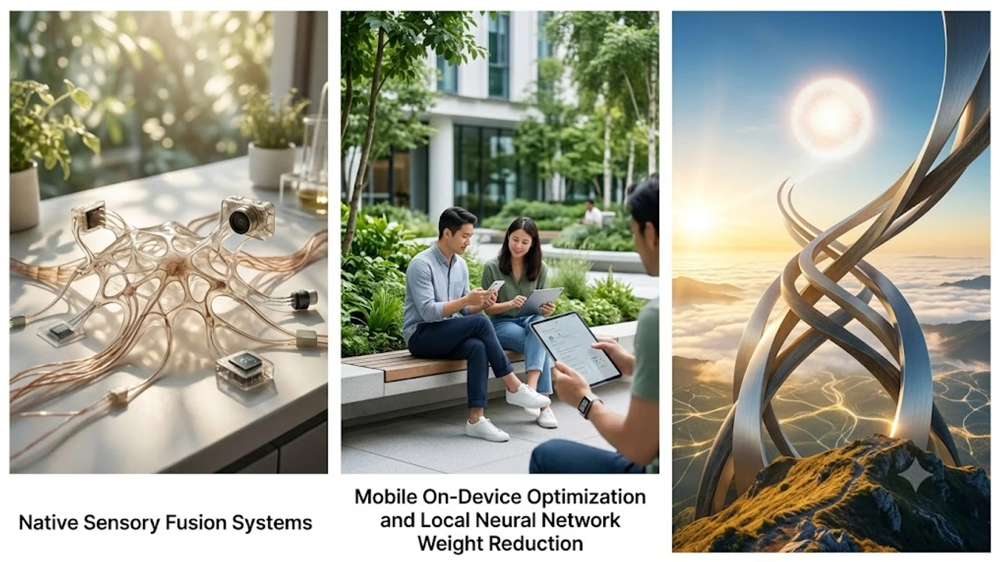

텍스트를 넘어선 시각·청각·센서 복합 데이터를 실시간으로 엮어내는 **차세대 멀티모달 AI**가 단순 대화창을 벗어나 일상과 산업 기기를 파고들고 있습니다. 파편화된 언어 모델의 한계를 뚫고 시각 프레임과 음성 파형을 한 호흡에 해석하는 아키텍처가 빠르게 자리 잡는 모양새입니다.

## 텍스트 중심 모델에서 네이티브 감각 융합 체계로

### 단일 신경망 기반의 교차 모달리티 처리
과거에는 이미지 캡셔닝 모델이 사진을 글자로 바꾸면 거대언어모델(LLM)이 이를 넘겨받아 해석하는 직렬 연결 방식을 썼습니다. 반면 최신 네이티브 멀티모달 시스템은 초기 토큰화 단계부터 비전 패치와 오디오 스펙트로그램, 텍스트 토큰을 단일 잠재 공간에 직접 사상합니다. 말의 빠르기, 목소리의 떨림, 카메라 앵글의 변화가 중간 번역 과정 없이 신경망 내부 가중치 연산으로 직결됩니다.

### 비디오 스트림과 음성 신호의 초저지연 병렬 추론
초당 수십 프레임의 영상 피드를 분할해 실시간 언어 토큰과 맞춰가는 스트리밍 추론 기술이 급진전했습니다. 지연 시간이 수백 밀리초 단위로 단축되면서 카메라로 주변 사물을 비추며 말을 건네는 즉시 기계가 시야와 음성을 대조해 반응합니다. 사용자의 시선이 머무는 피사체를 먼저 계산해 답변 우선순위를 정하는 알고리즘이 핵심 축으로 작동합니다.

### 3차원 공간 지각과 깊이 데이터 연산
단순히 화면 속 물체를 평면 박스로 감지하던 차원을 넘어, 렌즈와 물체 사이의 물리적 거리, 광원 위치, 3차원 입체 메시를 역산해 냅니다. 공간 컴퓨팅 기기나 자율주행 차량의 다중 카메라 피드를 입력받아 사물의 실제 부피와 동선 궤적을 1cm 오차 안팎으로 가늠하는 수준에 도달했습니다.

## 모바일 온디바이스 최적화와 로컬 신경망 경량화

### NPU 연산에 맞춘 서브 4비트 양자화 기술
수십억 개 파라미터를 품은 고성능 모델을 모바일 기기 안에서 직접 굴리기 위해 2비트에서 4비트 사이 정밀도로 신경망 가중치를 깎아내는 기술이 속도를 내고 있습니다. 모바일 AP 내부의 신경망처리장치(NPU) 구조에 특화된 희소성(Sparsity) 행렬 연산을 활용해, 배터리 소모와 기기 발열을 억제하면서 서버급 복합 추론을 폰 안에서 끝냅니다.

### 네트워크 단절 환경을 겨냥한 프라이빗 비전 분석
클라우드로 고화질 영상을 실시간 전송하는 방식은 데이터 통신 요금과 사생활 유출이라는 치명적 약점을 안고 있습니다. 기기 내부에서만 영상을 소화하는 온디바이스 비전 아키텍처는 공장 비밀 설비 점검이나 거주 공간 감시 시스템에서 독보적인 안전성을 확보합니다. 네트워크 신호가 끊긴 지하 주차장이나 외딴 현장에서도 카메라 렌즈만으로 상황을 식별하고 장비를 통제합니다.

## 바이오센서 융합과 실시간 헬스케어 코칭

### 연속 생체 신호와 생활 습관 데이터의 결합
스마트워치나 링이 수집하는 광혈류측정(PPG) 센서 파형, 피부 온도, 산소포화도는 단독 수치만 보면 단순 그래프에 불과합니다. 그러나 식단 사진의 칼로리 분석 결과나 활동 패턴 기록과 겹쳐 읽히는 순간 질환 예측 신호로 전환됩니다. 웨어러블 장비의 생체 지표를 실제 운동 강도에 접목하는 구체적 방법은 [2026 스마트워치 운동 진짜 효과 보는 법](/posts/health/wearable-data-smart-pacing-fitness-2026/)에서 상세한 메커니즘을 확인할 수 있습니다.

### 카메라 시각 피드와 심박 변이도 기반 자세 교정
홈 트레이닝 환경에서 스마트폰 카메라로 전신 관절 위치를 초당 60회 추적하면서 심박수 센서 데이터를 실시간 크로스 체킹합니다.

> "관절 각도의 틀어짐과 목표 심박 구간의 이탈 시점이 일치할 때, 모델은 단순한 횟수 카운팅을 멈추고 관절 부하를 경고하는 음성 피드백을 즉시 뱉어냅니다."

단순 자세 지적이 아닌, 대사 피로도와 결합된 운동 처방을 기기가 자율적으로 조율합니다. 대사 질환 관리를 위한 생활 습관 정렬은 [당뇨 전단계 식단 핵심 가이드 3가지](/posts/health/young-prediabetes-diet-prevention-2026/)의 기준과 맞물려 상호 보완 작용을 일으킵니다.

## 물리 세계와 결합하는 에이전트의 현장 적용 과제

### 자연어 명령을 조작 좌표로 바꾸는 로보틱스 인터페이스
시각-언어-행동(VLA) 통합 모델은 산업용 로봇 팔과 물류 무인 운반차(AGV)의 두뇌를 통째로 바꾸고 있습니다. 작업자가 "깨지기 쉬운 부품 상자를 골라 왼쪽 레일로 옮겨라"라고 말하면, 로봇은 카메라 피드로 깨지기 쉬운 표식을 읽어낸 뒤 그리퍼의 악력과 이동 속도를 스스로 계산해 집어 듭니다.

### 감각 정렬 오류와 시각 할루시네이션 억제
텍스트와 이미지가 충돌할 때 엉뚱한 결론을 내놓는 정렬 오류는 여전히 넘어야 할 벽입니다. 의료 영상 판독에서 배경의 반사광을 병변 조직으로 잘못 짚거나, 자율주행 센서가 터널 입구의 그림자를 장애물로 오인해 급제동을 거는 현상이 대표적입니다. 복수 센서 간 교차 검증 레이어와 신뢰도 임계값 설계를 거치지 않은 모델은 실무 현장 배치가 제한됩니다.

### 기기 단독 연산 기반의 생체 데이터 보안 장치
수면 리듬이나 신체 피로도처럼 지극히 사적인 데이터가 외부 서버로 새어 나가지 않도록 암호화 하드웨어 격리 영역을 구축하는 추세입니다. 센서 수집 데이터를 직접 다루는 헬스케어 디바이스를 고를 때도 기기 자체 처리와 안전 인증을 거쳤는지 따져보는 습관이 필요합니다.

[피로 회복 스마트 헬스케어 기기 쿠팡에서 보기](https://www.coupang.com/np/search?q=%EA%B1%B4%EA%B0%95%EA%B8%B0%EA%B8%B0%20%EB%A7%88%EC%82%AC%EC%A7%80%EA%B8%B0&sourceType=affiliate&trackingCode=AF8691300)

#차세대멀티모달AI #온디바이스AI #비전언어모델 #인공지능트렌드 #스마트헬스케어 #센서융합 #생체신호분석