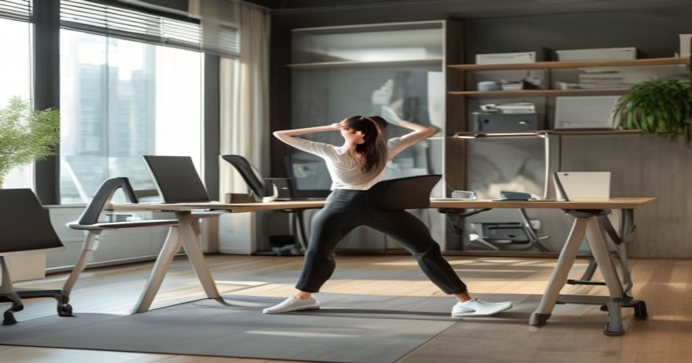
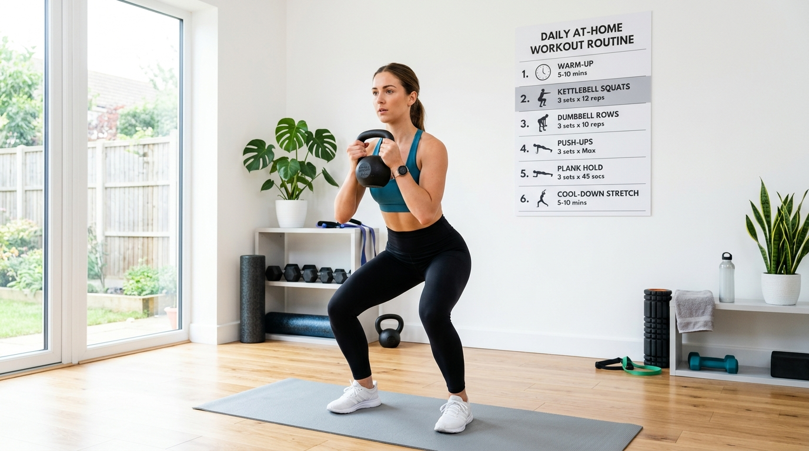

"운동할 시간이 없어요" — 가장 흔한 변명이지만, 사실은 **어떻게 쪼갤지 모르는 것**에 가깝습니다. 2026년 운동 과학 연구들이 공통적으로 말하는 메시지는 명확해요. 1시간짜리 운동 한 번보다 하루 10~15분씩 세 번이 심혈관 건강과 근력 유지에 더 효과적일 수 있다는 것. 오늘부터 바로 시작할 수 있는 직장인 틈새 운동 루틴을 시간대별로 알려드릴게요.

## 왜 틈새 운동이 효과적인가 — 과학적 근거

### NEAT(비운동성 활동 열 생성)의 중요성

하루 칼로리 소모의 15~30%는 공식 운동이 아니라 일상 활동에서 나옵니다. 이를 NEAT(Non-Exercise Activity Thermogenesis)라고 해요. 엘리베이터 대신 계단, 10분 점심 산책, 서서 회의하기 같은 작은 습관들이 쌓이면 하루 200~400kcal 추가 소모로 이어집니다.

### 미니 운동의 혈당 조절 효과

식후 10\~15분 가벼운 걷기가 혈당 스파이크를 25\~35% 낮춘다는 연구가 있습니다. 점심 식사 후 자리에 바로 앉는 것이 습관이라면 지금부터 바꿔야 해요. 혈당 관리는 체중 조절뿐 아니라 오후 집중력과도 직결됩니다.

### 짧은 운동이 장거리 선수를 만드는 이유

운동을 습관화하는 데 가장 큰 장벽은 시간이 아니라 '시작하는 것'입니다. 5분짜리 운동이라도 매일 하는 사람이 1시간 운동을 가끔 하는 사람보다 6개월 후 체력이 훨씬 좋다는 것이 연구로 확인됐어요.

## 시간대별 직장인 틈새 운동 루틴

### 출근 전 10분 — 하루를 깨우는 모닝 루틴

- **월·수·금**: 플랭크 30초 × 3세트 + 점프 스쿼트 10회 × 3세트
- **화·목**: 고양이-낙타 스트레칭 10회 + 힙 브릿지 15회 × 3세트
- **주말**: 30분 이상 조깅 또는 자전거

아침 운동의 핵심은 코어 활성화입니다. 잠에서 깨어난 몸이 하루를 준비하도록 5~10분만 투자하면 오전 내내 활력이 다릅니다.

### 점심 시간 10분 — 허리와 목을 살리는 오피스 루틴

앉아서 오래 일하는 직장인에게 가장 중요한 운동 부위는 **엉덩이와 등**입니다. 앉아 있는 동안 엉덩이 근육이 비활성화되고 등이 굽기 때문이에요.

- 책상 옆에서 10회 × 3세트 서서 하는 힙 익스텐션
- 목 회전 스트레칭 30초 × 3방향
- 흉추 스트레칭(폼롤러 또는 의자 활용)

화장실 갔다가 오는 길에 계단을 2층 이상 걸으면 10분 안에 심박수를 올릴 수 있어요.

### 퇴근 후 15분 — 하루 마무리 근력 운동

집에 도착해서 가방을 내려놓기 전에 바로 시작하는 게 핵심입니다. 옷 갈아입고 소파에 앉으면 그날 운동은 끝난 거예요.

**기본 서킷 (15분, 3세트)**:
1. 스쿼트 15회
2. 푸시업 10회
3. 런지 각 10회
4. 마운틴 클라이머 30초
5. 세트 간 휴식 1분

## 운동 효과를 극대화하는 보조 습관

### 수면 전 스트레칭 — 회복의 시간

운동 자체보다 회복이 체력 향상에 더 중요합니다. 자기 전 10분 스트레칭으로 당일 운동에서 쓴 근육을 이완시키면 다음 날 피로도가 눈에 띄게 낮아요. 특히 허벅지 앞쪽(대퇴사두근)과 가슴 스트레칭을 놓치지 마세요.

### 단백질 섭취 타이밍의 중요성

운동 후 30분\~1시간 안에 단백질 20\~30g 섭취가 근육 회복을 앞당깁니다. 닭가슴살, 그릭요거트, 달걀 2개 정도면 충분해요. 단백질 보충제가 부담스럽다면 두유 한 팩으로도 대체할 수 있습니다.

### 앱을 활용한 운동 기록의 힘

운동을 기록하는 사람이 그렇지 않은 사람보다 6개월 지속률이 2배 이상 높습니다. 스마트폰 기본 건강 앱이나 피트니스 앱으로 매일 10분씩 투자한 내역을 누적해 보세요. 숫자가 쌓일수록 동기부여가 됩니다.

[디지털 피로 탈출 트렌드](/posts/society/)에서 다룬 것처럼 스크린 시간을 줄이고 그 자리를 이 루틴으로 채우면 신체와 정신 건강 두 마리 토끼를 잡을 수 있어요. 지금 당장 10분, 시작이 전부입니다.

#직장인운동 #틈새운동 #운동루틴2026 #홈트레이닝 #건강관리 #NEAT #오피스운동
