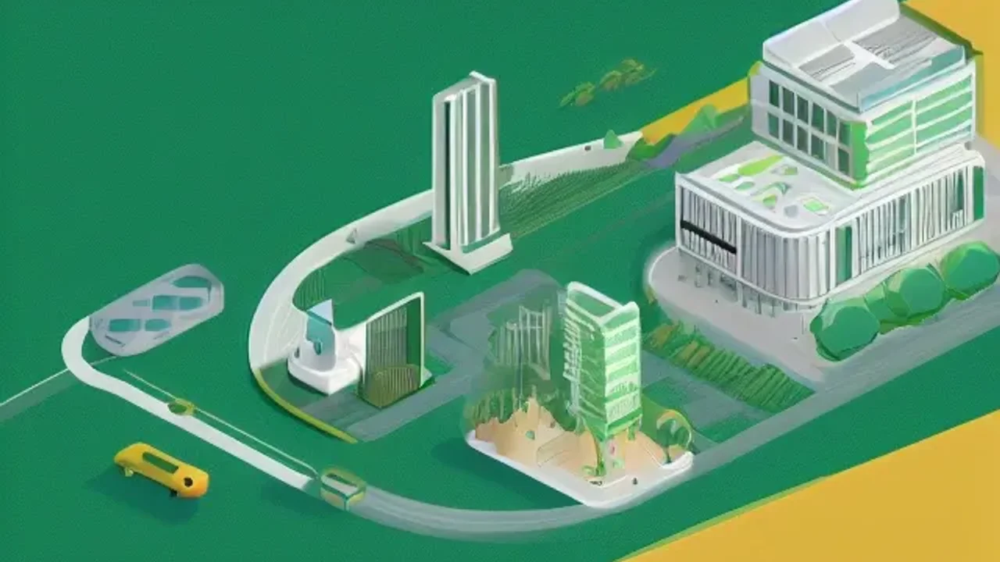

최근 몇 년간 헬스장을 가득 채웠던 고강도 땀방울의 열기가 가라앉고, 신체의 균형과 온전한 휴식에 집중하는 새로운 바람이 불고 있습니다. 무리한 다이어트와 과도한 스트레스로 지친 현대인들이 늘어나면서 **2026 운동 트렌드**는 단순한 칼로리 소모가 아닌 신체 기능의 회복을 최우선으로 삼기 시작했습니다. 이러한 패러다임의 변화는 운동을 대하는 우리의 태도를 뿌리째 바꾸어 놓았습니다.

## 왜 2026 운동 트렌드는 번아웃 대신 '회복'을 선택했을까?

### 오운완 강박이 불러온 현대인의 신체적·정신적 번아웃
'오늘 운동 완료'라는 미명 아래 매일같이 스스로를 채찍질하던 직장인들이 극심한 만성 피로와 관절 통증을 호소하고 있습니다. 근육이 회복할 시간을 주지 않고 매일 고강도 웨이트 트레이닝과 유산소 운동을 반복한 결과, 코르티솔 호르몬 수치가 치솟아 오히려 면역력이 떨어지는 역효과를 맞이한 것입니다. 미국스포츠의학회(ACSM)의 최근 조사에 따르면, 과도한 피트니스 강박으로 인해 운동 번아웃을 경험한 비율이 전년 대비 34% 이상 증가했습니다. 체력을 기르기 위해 시작한 행위가 도리어 일상을 갉아먹는 주범이 되었다는 인식이 확산된 배경입니다.

### 고강도 인터벌(HIIT) vs 마인드-바디(Active Recovery)의 차이점
심박수를 극한까지 끌어올리는 고강도 인터벌 운동은 짧은 시간 체지방 연소에 효과적이지만, 중추신경계에 가해지는 부담이 매우 큽니다. 반면 **2026 운동 트렌드**의 핵심인 '액티브 리커버리(Active Recovery)'는 신체를 완만하게 움직여 혈액 순환을 촉진하고 근육 내 젖산을 빠르게 제거하는 데 목적을 둔니다.
* **고강도 인터벌 운동:** 교감신경을 극도로 활성화, 관절 부상 위험 증가, 강한 피로감 동반
* **회복 중심 마인드-바디 운동:** 부교감신경 활성화, 근막 이완 및 유연성 향상, 스트레스 호르몬 감소

### 단순한 휴식을 넘어 '잘 쉬는 기술'이 운동이 된 이유
주말 내내 침대에 누워 스마트폰을 보는 것은 진정한 의미의 휴식이 아닙니다. 현대 피트니스 과학은 정적인 고립보다 신체를 능동적으로 조절하며 이완하는 '적극적 회복'이 근육 세포의 재생을 촉진한다는 사실을 입증했습니다. 뼈와 근육의 정렬을 바로잡고 림프 순환을 돕는 가벼운 움직임이야말로 다음 단계의 신체 활동을 가능하게 만드는 필수적인 운동 과정으로 인정받고 있습니다.

## 나에게 맞는 회복 중심 운동 종류와 장단점 완전 정리

### 체형 교정과 속근육 강화의 핵심, 리포머 필라테스
리포머 기기를 활용한 필라테스는 스프링의 저항을 이용해 척추와 골반의 미세한 정렬을 바로잡는 데 탁월한 효과를 발휘합니다. 장시간 모니터를 보며 일하는 직장인들의 고질병인 거북목과 라운드 숄더를 개선하는 데 이만한 운동이 없습니다.
> **장점:** 속근육(코어)을 강화하여 기초 대사량을 높이고, 좌우 신체 비대칭을 시각적으로 확인하며 교정할 수 있습니다.
> **단점:** 기구 사용법이 까다로워 초기 진입 장벽이 높고, 전문 강사의 지도 없이 독학할 경우 오히려 관절에 무리가 갈 수 있습니다.

### 유연성과 멘탈 케어를 동시에 잡는 하타·인요가 루틴
한 자세를 오랜 시간 유지하며 깊은 호흡을 이어가는 하타 요가와 인요가는 타이트해진 근육뿐만 아니라 관절 사이의 결합 조직까지 부드럽게 이완합니다. 
* **장점:** 정서적 안정감을 주고 뇌의 알파파를 활성화하여 불면증을 완화하는 데 뛰어난 효과를 자랑합니다.
* **단점:** 정적인 동작이 많아 역동적이고 빠른 칼로리 소모를 원하는 성향의 사람에게는 지루하게 느껴질 여지가 있습니다.

### 관절 부상 방지와 가동성 확보를 위한 모빌리티 스트레칭
모빌리티 트레이닝은 각 관절이 가진 본연의 움직임 범위를 회복시켜 주는 현대적인 스트레칭 기법입니다. 폼롤러나 라크로스 볼을 활용해 단단하게 뭉친 근막을 압박하고 풀어주는 과정이 포함됩니다.
* **장점:** 특별한 기구 없이 집에서도 손쉽게 수행할 수 있으며, 웨이트 트레이닝 전후 부상 방지에 즉각적인 도움을 줍니다.
* **단점:** 근육이 심하게 뭉친 부위를 자극할 때 일시적으로 강한 통증을 유발하므로 적절한 강도 조절이 필수적입니다.

[관련 글 보기](/posts/health/)

## 직접 경험해본 주 3회 '액티브 리커버리' 루틴의 변화

### 무조건 뛰던 루틴에서 가벼운 폼롤러 스트레칭으로 바꾼 첫 일주일
과거에는 매일 퇴근 후 5km씩 숨이 턱에 차오를 때까지 달리는 것만이 정답이라고 맹신했습니다. 하지만 다음 날 아침이면 어김없이 무릎과 발목이 뻐근했고, 업무 시간 내내 쏟아지는 졸음과 사투를 벌여야 했습니다. 과감하게 달리기 횟수를 주 2회로 줄이고, 나머지 날에는 홈트레이닝 매트 위에서 30분 동안 폼롤러로 하체 근막을 이완하는 루틴으로 전환했습니다. 첫 3일간은 운동을 제대로 하지 않았다는 불안감이 엄습했으나, 일주일이 지나자 아침에 눈을 떴을 때 느껴지던 특유의 찌푸둥함이 씻은 듯이 사라지는 경험을 했습니다.

### 만성 통증과 거북목 완화, 그리고 수면의 질 개선 효과
한 달 동안 주 3회씩 퇴근 후 리포머 필라테스와 요가 시퀀스를 병행하자 신체에 눈에 띄는 변화가 나타났습니다. 오후 4시만 되면 쑤시던 어깨 통증이 현저히 줄어들었고, 거북목 증세가 완화되면서 두통까지 자연스럽게 호전되었습니다. 가장 놀라운 변화는 수면 패턴이었습니다. 야간에 스마트워치로 측정한 깊은 수면(Deep Sleep) 시간이 기존 평균 40분에서 1시간 20분으로 두 배 가까이 늘어났습니다. 신체가 밤사이 온전히 이완되면서 숙면을 취할 수 있는 최적의 상태로 변모한 것입니다.

### 근육통이 심할 때 절대 하면 안 되는 잘못된 휴식법
많은 이들이 심한 근육통을 겪을 때 주말 내내 누워만 있는 방식을 취합니다. 겪어본 바에 의하면, 움직임이 전혀 없는 고립 상태는 오히려 근육을 더 뻣뻣하게 만들고 혈류량을 감소시켜 회복을 더디게 만듭니다. 통증이 심할수록 가벼운 동네 산책이나 온수 샤워를 통한 부드러운 전신 스트레칭이 통증 물질인 젖산을 배출하는 데 훨씬 유익합니다.

## 부상 없이 오래가는 지속 가능한 홈트레이닝 시작하기

### 내 몸의 가동 범위(Mobility) 체크하는 초간단 방법
거울을 정면으로 바라보고 선 상태에서 양발을 골반 너비로 벌린 뒤, 손을 머리 위로 곧게 뻗어 스쿼트 자세로 내려갑니다. 이때 상체가 앞으로 과도하게 숙여지거나 뒤꿈치가 바닥에서 떨어진다면 발목과 고관절의 가동성이 무너졌다는 명백한 신호입니다. 이 상태로 무거운 바벨을 들면 허리와 무릎이 고스란히 충격을 흡수하므로, 본격적인 근력 운동에 앞서 관절의 유연성부터 확보해야 합니다.

### 퇴근 후 딱 15분, 스트레스 해소를 위한 전신 이완 시퀀스
매일 저녁 시간을 내기 어렵다면 단 15분만 투자해도 충분합니다. 다음과 같은 순서로 몸을 이완합니다.
1.  **캣카우 자세 (3분):** 네발기기 자세에서 척추를 위아래로 움직이며 굳어 있던 등과 허리를 풀어줍니다.
2.  **이상근 스트레칭 (4분):** 한쪽 다리를 반대쪽 무릎 위에 올리고 가슴 쪽으로 당겨 둔근과 골반 주변 근육을 자극합니다.
3.  **아기 자세 (3분):** 무릎을 꿇고 엎드려 양손을 앞으로 길게 뻗은 채 깊은 복식 호흡을 유지하며 하루 동안 쌓인 척추의 압박을 해소합니다.

### 초보자를 위한 가성비 홈트레이닝 회복 장비 추천 목록
집에서 안전하게 회복 중심의 운동을 실천하기 위해서는 몸을 단단하게 지지해 줄 장비가 필요합니다. 최소한의 비용으로 최대의 효율을 낼 수 있는 도구들을 엄선했습니다.
* **두께 8mm 이상의 TPE 또는 천연고무 매트:** 얇은 매트는 관절에 충격을 주기 쉬우므로 푹신하면서도 밀리지 않는 재질을 선택해야 척추를 보호할 수 있습니다.
* **돌기 없는 고밀도 EVA 폼롤러:** 처음부터 딱딱한 EPP 재질이나 돌기가 있는 제품을 사용하면 근막에 과도한 상처를 남길 수 있으므로 부드러우면서도 단단한 EVA 소재가 적합합니다.
* **마사지 건 또는 라크로스 볼:** 손이 닿지 않는 등 뒤나 날개뼈 안쪽, 발바닥 아치 같은 미세한 부위의 통증을 정밀하게 타격하여 풀어주는 데 유용하게 쓰입니다.

#2026운동트렌드 #액티브리커버리 #회복중심운동 #필라테스효과 #홈트레이닝루틴 #스트레칭방법 #근막이완 #웰니스라이프 #체형교정운동 #지속가능한피트니스