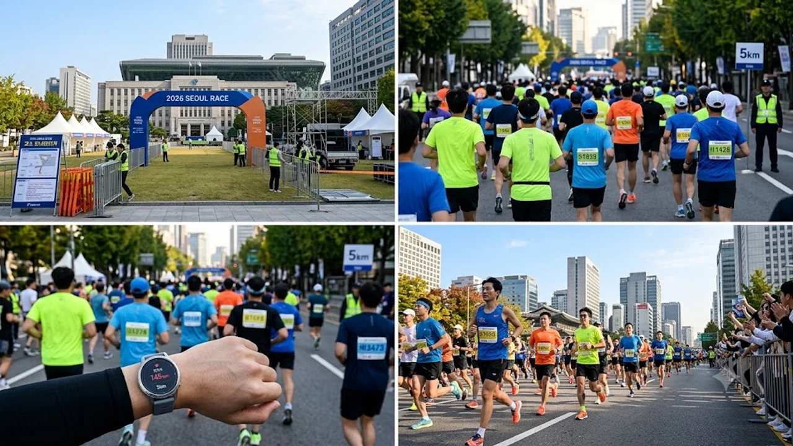

내일 아침 서울광장을 출발해 청계천 일대를 가르는 **2026 서울달리기** 개막이 코앞으로 다가왔습니다. 가을 마라톤 시즌의 정점을 알리는 이번 대회는 1만 명 이상의 러너가 도심 아스팔트를 달리는 만큼, 서늘한 날씨 속 철저한 **레이스 페이싱**과 체온 관리가 완주의 성패를 가릅니다. 현장 분위기에 휩쓸려 무리하기 쉬운 출발선에서 부상 없이 개인 최고 기록을 달성할 실전 수칙을 정리합니다.

## 서울달리기 전일 도심 레이스 현황과 점검 사항

### 대회 개요 및 광화문·청계천 도심 코스 특징

이번 대회는 서울광장에서 출발해 을지로, 청계천로, 종로 일대를 돌아오는 도심형 코스입니다. 평지 위주라 기록 단축을 노리기 좋지만, 아스팔트 노면의 강한 충격과 좁아지는 청계천 하천변 주로의 코너 구간이 복병입니다. 도로 폭이 급격히 좁아지는 병목 구간에서는 앞 사람의 뒤꿈치를 밟거나 도로 연석에 걸려 넘어지기 쉬우므로 시야를 전방 5m 이상 확보해야 합니다.

### 가을철 아침 쌀쌀한 기온이 러너 신체에 미치는 영향

10월 초가을 아침 기온은 10도 안팎까지 떨어지며, 빌딩풍이 불어닥치면 체감 온도는 한 자릿수로 곤두박질칩니다. 근육과 관절이 굳은 상태에서 신호총 소리에 맞춰 급가속하면 햄스트링이나 아킬레스건이 손상되기 십상입니다.

- **출발선 체온 보존용 우비**: 총성이 울리기 직전까지 얇은 일회용 우비나 버려도 되는 헌 겉옷을 걸쳐 체온을 붙잡습니다.
- **관절 열 내기 동적 스트레칭**: 제자리 무릎 당기기, 런지 워킹, 발목 돌리기를 10분간 쉬지 않고 이어가며 심박수를 서서히 끌어올립니다.

### 출발 전 배번표 및 준비물 최종 점검 요령

출발 당일 아침에는 인파로 정신이 산만해지므로 전날 밤 모든 장비를 가지런히 정돈해 둡니다.

- 기록 측정 칩 훼손 여부 확인 및 러닝 싱글렛 명치 부근에 단단히 고정
- 피부 마찰을 막기 위한 겨드랑이·발가락 바셀린 도포 및 쓸림 방지 밴드 부착
- 주로에서 먹을 에너지젤 2~3포를 러닝 벨트에 흔들림 없도록 결착

## 출발 직후 5km 오버페이스 방지와 심박수 관리법

### 군중 심리로 인한 초반 급가속 위험과 부상 메커니즘

출발 아치 밑에서 수천 명이 한꺼번에 쏟아져 나가면 본인의 평소 페이스보다 km당 30초에서 1분 이상 빠르게 튀어 나가는 실수를 범합니다. 초반 3km 구간에서 체내 글리코겐을 과도하게 태워버리면 젖산이 급격히 쌓여 15km 이후 치명적인 근육 경련과 퍼짐 현상을 부릅니다.

> "마라톤 레이스의 전반 5km는 기록을 앞당기는 구간이 아니라, 후반을 위해 힘을 아껴두는 저축 구간이다."

### 초반 구간 적정 목표 페이스 설정과 호흡 리듬 유지

목표 기록이 하프 기준 1시간 50분(km당 5분 13초)이라면, 첫 3km는 목표치보다 10~15초 늦은 5분 25초 안팎으로 몸을 달구듯 가볍게 달려야 합니다. 발걸음 두 번에 들이마시고 두 번에 내쉬는 '2-2 호흡 리듬'을 일정하게 유지하며 가슴을 펴고 시선을 정면에 고정합니다.

평소 심폐 지구력을 키우며 기초 체력을 다져온 러너라면 [존2 유산소 운동법, 진짜 살 빠질까?](/posts/health/zone-2-cardio-fat-burn-routine-2026/)에서 다룬 저강도 심박 제어 훈련의 원리를 그대로 대입해 초반 페이스를 안정적으로 묶어둘 수 있습니다.

### 러닝워치 심박수 존(Zone)을 활용한 실시간 페이스 조절

손목 위 GPS 러닝워치의 실시간 알림을 길잡이로 삼습니다. 초반 레이스에서는 심박수가 최대 심박의 80%(Zone 3 상단) 선을 넘지 않도록 다잡아야 합니다. 코너링이나 맞바람 구간을 만났을 때 억지로 속도를 올리지 말고, 심박수를 기준으로 케이던스를 180spm 안팎으로 촘촘하게 쪼개며 체력 누수를 막습니다.

## 청계천 반환점 전후 수분·에너지 공급 및 부상 대응

### 10km·하프 코스 급수대 활용과 에너지젤 섭취 타이밍

목마름을 체감하는 순간은 이미 체내 수분의 2%가 빠져나간 탈수 상태입니다. 매 5km마다 나타나는 급수대를 그냥 지나치는 행동은 후반 자멸의 지름길입니다.

- **안전한 급수 요령**: 종이컵 입구를 V자로 접어 주둥이를 좁힌 뒤, 고개를 뒤로 젖히지 않고 한두 모금씩 끊어 마십니다.
- **에너지젤 흡수 타이밍**: 출발 45분 경과 시점(약 8km 지점)과 1시간 30분 지점(약 15km 지점) 급수대 바로 앞에서 삼킨 뒤, 물을 들이켜 위장 트러블을 줄이고 흡수 속도를 끌어올립니다.

### 아스팔트 주로 충격을 줄이는 착지 밸런스와 무릎 보호 요령

콘크리트와 아스팔트 노면은 흙길이나 우레탄 트랙보다 관절에 가해지는 충격 하중이 훨씬 큽니다. 발뒤꿈치로 쿵쿵 내리찍는 오버스트라이드는 무릎 슬개건염(러너스 니)과 장경인대 통증의 직격탄이 됩니다.

- 무게중심 바로 아래로 발바닥 중앙이 닿는 미드풋 착지 유지
- 보폭을 억지로 넓히지 말고 발바닥을 바닥에서 빠르게 굴리는 롤링 동작 의식
- 미세한 내리막길에서는 상체를 뒤로 젖혀 브레이크를 걸지 말고 수직 축을 유지하며 보폭을 10% 좁히기

### 후반부 쥐(경련) 발생 시 현장 응급 스트레칭 및 대처법

15km 이후 종아리나 햄스트링에 찌릿한 근육 경련 신호가 스치면 지체 없이 주로 가장자리로 안전하게 빠져나옵니다.

- **종아리 경련**: 가로수나 가드레일을 짚고 아픈 다리를 뒤로 길게 뻗어 발뒤꿈치를 바닥에 꾹 누르는 비복근 스트레칭을 20초간 버팁니다.
- **극심한 통증 시**: 응급 부스에 비치된 냉각 스프레이를 분사해 근막 열감을 식힌 뒤, 200m가량 가볍게 걸으며 뭉친 다리 혈류를 풀어냅니다.

## 결승선 통과 직후 저체온증 방지와 부상 제로 쿨다운

### 완주 직후 급정지 금지: 가벼운 쿨다운 워킹

기록 매트를 밟았다고 해서 그 자리에 주저앉거나 멈춰 서면 낭패를 봅니다. 다리 근육의 펌프질이 단번에 끊기면 심장과 뇌로 가는 혈류량이 급감해 현기증이나 미주신경성 실신을 부릅니다. 결승선을 지나서도 거친 숨이 가라앉을 때까지 물품 보관소 방향으로 5~10분간 천천히 걸으며 심박수를 안전하게 떨어뜨립니다.

### 땀 식기 전 보온 유지와 윈드브레이커 착용

완주 직후 흠뻑 젖은 싱글렛이 찬 바람에 노출되면 체온이 걷잡을 수 없이 떨어져 심한 오한에 시달립니다.

- 지급받은 완주 타월로 땀을 털어내고 보온용 은박 블랭킷이나 패커블 바람막이를 즉각 걸치기
- 젖은 양말과 레이싱화를 벗고 마른 양말과 쿠션 슬리퍼로 발의 피로 해소
- 전해질 음료를 입안에 머금듯 천천히 섭취해 전해질 불균형 복구

### 귀가 후 근육통 완화를 위한 하체 정적 스트레칭 루틴

집에 복귀한 당일 저녁에는 긴장된 하체 근막을 부드럽게 이완하는 작업에 집중합니다. 대퇴사두근, 햄스트링, 둔근을 차례로 늘려주는 정적 스트레칭을 동작당 30초씩 3회 반복합니다. 젖산과 대사 부산물이 엉겨 붙어 굳어버린 종아리와 발바닥 아치를 진동 폼롤러나 마사지건으로 가볍게 두드려주면 다음 날 찾아오는 지연성 근육통(DOMS)의 강도를 눈에 띄게 덜어냅니다.

[러너 근육통 완화 마사지건 쿠팡에서 보기](https://www.coupang.com/np/search?q=%EA%B1%B4%EA%B0%95%EA%B8%B0%EA%B8%B0%20%EB%A7%88%EC%82%AC%EC%A7%80%EA%B8%B0&sourceType=affiliate&trackingCode=AF8691300)

#2026서울달리기 #서울달리기대회 #마라톤완주 #러닝페이싱 #마라톤부상방지 #가을러닝 #마라톤에너지젤 #러닝쿨다운 #러너스니