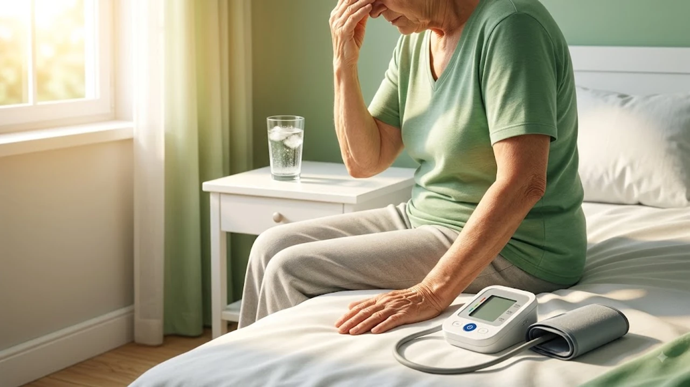

연일 계속되는 폭염 속에 머리가 핑 도는 어지럼증을 겪을 때 흔히 에어컨 바람 때문인 냉방병을 먼저 떠올린다. 하지만 체온 조절을 위해 혈관이 과도하게 확장되면서 나타나는 **여름 저혈압 원인**이 실제 주범인 경우가 대다수다. 실신이나 낙상 사고로 이어질 수 있는 자율신경계 반응을 단순 피로로 오인해 방치하면 건강에 치명적인 위협이 된다.

## 2026 폭염 속 냉방병으로 오인하기 쉬운 여름철 저혈압의 경고

### 기립성 저혈압과 단순 냉방병 증상 비교
실내외 온도 차이로 발생하는 냉방병은 주로 두통, 콧물, 소화불량, 전신 몸살 기운을 동반한다. 반면 기립성 저혈압은 앉아 있거나 누워 있다가 갑자기 일어설 때 순간적으로 뇌로 가는 혈류량이 줄어들며 시야가 까맣게 변하거나 시커먼 반점이 보이는 특징을 보인다. 

질병관리청 통계에 따르면 여름철 응급실을 찾는 어지럼증 환자의 약 35%가 기립성 저혈압 관련 증상으로 확인됐다. 단순히 몸이 나른하고 기력이 없는 느낌과 달리, 일어선 직후 3초 이내에 균형을 잡기 힘들 정도의 현기증이 발생한다면 즉시 자율신경계 이상이나 혈압 강하를 의심해야 한다.

### 탈수가 혈관 확장에 미치는 치명적 영향
체온이 올라가면 우리 몸은 열을 방출하기 위해 피부 표면의 미세혈관을 넓힌다. 이때 혈관의 수축력이 떨어지면서 순환 혈액량이 배간으로 쏠리게 된다. 

> **혈류량 감소의 악순환**
> 고온 환경 노출 → 피부 혈관 확장 → 땀 배출로 인한 체수분 손실 → 혈액량 감소 → 수축기 혈압 급격한 하강

수분 섭취가 부족한 상태에서 야외 활동을 지속하면 혈액의 농도가 짙어지고 혈류 속도가 느려진다. 심장이 뇌까지 충분한 산소를 보내지 못하면서 순간적인 뇌 허혈 상태가 찾아오며 심할 경우 의식을 잃고 넘어진다.

### 고혈압 환자도 방심할 수 없는 여름철 혈압 변동성
평소 고혈압 약을 복용 중인 만성질환자 역시 여름철 저혈압의 고위험군이다. 겨울철에 맞춰 처방받은 혈압약 용량을 그대로 유지한 채 여름철 혈관 확장이 가속화되면, 혈압이 기준치 이하(수축기 90mmHg, 이완기 60mmHg 미만)로 지나치게 떨어지는 수치 역전 현상이 일어난다.

실제로 평소 수축기 혈압 130mmHg를 유지하던 60대 환자가 여름철 땀 배출 급증과 기존 강압제 작용이 중첩되어 수축기 혈압이 85mmHg까지 떨어져 응급실로 이송된 사례가 빈번하게 보고된다. 몸속 만성 염증 상태나 대사 장애가 심할수록 이러한 혈압 조절 능력은 더욱 저하되므로, 체내 염증 관리를 위해 [초가공식품 만성 염증 유발하는 진짜 이유와 3단계 해독법](/posts/health/ultra-processed-foods-chronic-inflammation-2026/)을 참고해 식습관을 정비할 필요가 있다.

## 푹푹 빠지는 기운과 어지럼증, 저혈압 유발 요인 분석

### 고온 다습한 날씨로 인한 체온 조절과 혈관 확장
외부 기온이 30도를 웃도는 날씨에는 자율신경계가 체온을 낮추기 위해 혈관을 확장하는 일에 과부하가 걸린다. 확장된 혈관 내부에 담길 수 있는 혈액의 용적은 늘어나지만, 정작 혈관 내부를 채우는 혈액의 절대량은 늘어나지 않으므로 혈압이 자연스럽게 하강한다. 

이러한 상태에서 에어컨이 강하게 가동되는 실내로 갑자기 이동하면 확장되었던 혈관이 급격히 수축하면서 혈압이 날뛰는 등 심혈관계에 극심한 스트레스를 가한다.

### 식사 후 피가 쏠리는 식후 저혈압의 위험성
여름철 탄수화물 위주의 찬 국수나 탄산음료, 자극적인 음식을 섭취한 직후 나른함과 함께 심한 어지럼증이 나타난다면 식후 저혈압을 의심해야 한다. 음식을 소화하기 위해 소화기관으로 다량의 혈액이 쏠리면서 뇌나 다른 주요 장기로 가는 혈액량이 상대적으로 급감하기 때문이다.

- **탄수화물 과다 섭취:** 인슐린이 급격히 분비되며 혈관 확장을 유발
- **과식 및 과음:** 위장관 운동을 위해 전신 혈액의 20% 이상이 집중됨
- **식후 즉시 이동:** 소화기 계통으로 혈액이 쏠린 상태에서 갑자기 움직이면 뇌혈류 감소 극대화

### 땀 배출 급증에 따른 혈류량 부족 및 전해질 불균형
체온 조절을 위해 배출되는 땀은 단순한 물이 아닌 나트륨, 칼륨, 칼슘 등 필수 전해질을 포함한다. 야외 활동 중 전해질 보충 없이 맹물만 과도하게 마실 경우 혈액 내 나트륨 농도가 낮아지는 저나트륨혈증이 발생해 혈압 조절 기능이 무너진다. 체내 삼투압 균형이 깨지면 세포 외액이 줄어들면서 혈관 내부의 수분이 세포 안으로 이동해 실제 혈액량이 더 줄어드는 악순환에 빠진다.

## 실신 예방을 위한 일상 속 즉각적인 체조 및 습관 변화

### 누웠다 일어날 때 필수적인 '30초 단계별 동작'
갑작스러운 기립성 저혈압으로 인한 낙상 및 뇌손상을 막기 위해서는 동작을 단계적으로 나누는 습관이 필수적이다.

1. **아침에 눈을 뜬 직후:** 기상 후 바로 일어나지 말고 침대에 누운 채로 손가락과 발가락을 10회 이상 잼잼 하듯 쥐었다 편다.
2. **앉은 자세 유지:** 침대 가계에 걸터앉아 다리를 번갈아 가며 들었다 내리는 동작을 15초간 실시해 하체에 쏠린 혈액을 위로 올린다.
3. **천천히 기립:** 주변 가구나 벽을 잡고 천천히 일어서며, 어지럼증이 느껴지면 즉시 제자리에 다시 앉거나 쪼그려 앉는다.

### 여름철 순환기 질환을 막는 올바른 수분·염분 섭취법
하루 최소 1.5~2리터의 미온수를 나누어 마시는 것이 혈액량을 유지하는 가장 확실한 방법이다. 땀을 많이 흘린 날에는 맹물 대신 전해질 음료나 소금을 아주 살짝 탄 물을 마시는 것이 좋다.

- **아침 공복 수분 보충:** 자는 동안 땀으로 손실된 수분을 채우기 위해 미온수 1컵 섭취
- **카페인·알코올 제한:** 커피와 술은 이뇨 작용을 촉진해 체수분 배출을 가속화하므로 자제
- **적정 염분 유지:** 평소 저혈압 진단을 받았다면 적절한 간이 된 음식을 섭취해 체액량 유지

### 혈압계 측정 기록을 활용한 자가 건강 모니터링 노하우
정확한 혈압 변화를 파악하기 위해 아침 기상 직후와 저녁 잠들기 전 하루 2회 정해진 시간에 자가 혈압을 측정하는 습관을 들인다. 최근 출시된 웨어러블 기기나 스마트워치를 활용해 심박수와 혈압 변동 추이를 정밀하게 기록하는 것도 유용한 방안이다. 체계적인 운동과 심박수 관리에 관심이 있다면 [2026 스마트워치 운동 진짜 효과 보는 법](/posts/health/wearable-data-smart-pacing-fitness-2026/)을 살펴보고 데이터를 기반으로 한 신체 상태 조절법을 습득하는 것을 권장한다.

> **올바른 저혈압 측정 기준**
> - **수축기 혈압:** 90mmHg 이하
> - **이완기 혈압:** 60mmHg 이하
> - **기립성 검사:** 누웠을 때보다 일어섰을 때 수축기 혈압이 20mmHg 이상 하강하는 경우

## 병원 진료가 필요한 응급 경고 신호와 분류 기준

### 즉각적인 응급실 방문이 필요한 레드 플래그 증상
단순 어지럼증을 넘어 다음과 같은 치명적 신호가 동반된다면 단순 저혈압이 아닌 뇌혈관 질환이나 심근경색, 부정맥 등 심각한 합병증일 가능성이 크므로 즉시 119에 신고해야 한다.

- **가슴 통증 및 쥐어짜는 듯한 압박감**
- **한쪽 팔다리의 마비나 감각 이상, 발음 어눌함**
- **시야가 둘로 보이거나 뚜렷한 복시 현상**
- **식은땀을 흘리며 의식을 잃고 쓰러짐**

### 순환기내과 및 가정의학과 방문 시 체크리스트
병원 방문 전 자신의 증상 패턴을 정리해 두면 정확한 진단에 큰 도움이 된다. 일상에서 어지럼증이 발생하는 특정 시간대, 식사 여부, 복용 중인 영양제 및 약물 목록을 서면으로 작성해 담당 의료진에게 제시한다. 기립경 검사(Tilt Table Test)나 24시간 활동혈압 검사를 통해 자율신경계 이상 여부를 종합적으로 확인받을 수 있다.

### 계절성 약물 용량 조절을 위한 전문의 상담 가이드
기존에 고혈압, 당뇨, 전립선 비대증 약을 복용 중인 환자가 여름철 저혈압 증상을 느꼈다고 해서 임의로 약 복용을 중단하거나 감량해서는 절대 안 된다. 약물을 갑자기 중단할 경우 반동성 고혈압이나 부정맥 등 더 위험한 상황에 직면할 수 있다. 반드시 주치의와 상담을 통해 계절적 특성을 고려한 용량 조절이나 약물 종류 변경을 진행해야 안전하다.

#여름저혈압원인 #여름철어지럼증 #기립성저혈압증상 #식후저혈압 #냉방병차이점 #여름철탈수증상 #혈압관리방법