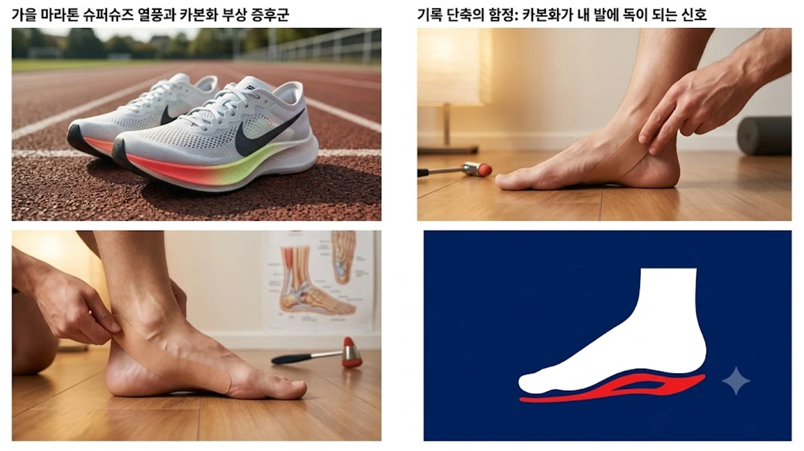

가을 마라톤 시즌이 개막하면서 1초라도 기록을 줄이려는 주자들 사이에 탄소섬유판이 들어간 슈퍼슈즈 착용이 필수 장비처럼 굳어졌습니다. 하지만 발목 인대와 종아리 지지력이 받쳐주지 않는 상태에서 고반발 폼을 장착한 신발을 길들이려다 예기치 못한 **카본화 부상**을 겪는 사례가 속출하고 있습니다. 엘리트 선수의 가속력을 따라잡으려다 족저근막염이나 아킬레스건염 같은 러닝 부상으로 정형외과 신세를 지는 주자들이 급증하는 흐름입니다.

## 가을 마라톤 슈퍼슈즈 열풍과 카본화 부상 증후군

### 아마추어 러너에게 족저근막염·비골근건염이 급증하는 배경
선수들의 경기용 신발이었던 탄소섬유 러닝화가 빠르게 보급되면서, 주 2~3회 로드 러닝을 즐기는 일반 주자들 사이에서 발목 통증 호소가 급증했습니다. 시속 15km 이상 질주하는 엘리트 선수는 견고한 둔근과 햄스트링으로 착지 충격을 흡수하지만, 근력이 부족한 동호인은 반발력을 관절과 인대로 고스란히 받아냅니다. 그 결과 발바닥 아치를 떠받치는 족저근막이 미세하게 찢어지거나 바깥쪽 복사뼈 뒤편을 지나는 비골근건에 만성 과부하가 걸립니다.

### 탄소섬유 플레이트와 고반발 폼이 발목 안정성에 미치는 역학적 영향
카본화의 기본 메커니즘은 40mm 안팎의 초경량 PEBA 폼 사이에 스푼 형태의 탄소섬유 플레이트를 끼워 넣은 지렛대 구조입니다.
- **강제 지렛대 작용:** 착지 순간 발가락 관절의 자연스러운 굽힘을 억제하고 강제로 전방 롤링을 일으켜 밀어냅니다.
- **좌우 롤링 폭증:** 신발 밑창이 지나치게 두꺼워 지면과의 거리가 멀어지므로 착지 각도가 1도만 틀어져도 발목이 바깥이나 안쪽으로 크게 꺾입니다.
- **비골근의 과긴장:** 푹신한 쿠션이 푹 꺼졌다가 튀어 오르는 찰나에 좌우 균형을 잡으려고 비골근건이 쉴 새 없이 수축하면서 급성 염증으로 번집니다.

### 일반 쿠션화 대비 족부 피로도가 2배 빠르게 누적되는 이유
일반 안정화는 지면 반력을 자연스럽게 흩뿌리며 발의 고유 감각을 깨워줍니다. 반면 고반발 레이싱화는 지면을 딛는 감각을 차단한 채 탄성 반환율을 80% 이상으로 끌어올립니다. 발바닥 감각 신경이 둔해진 상태에서 10km 이상 속도를 내면, 근육 피로를 미처 체감하기도 전에 족부 인대와 건의 피로 한계선이 먼저 무너집니다.

## 기록 단축의 함정: 카본화가 내 발에 독이 되는 신호

### 착지 시 발목 흔들림(과회내)과 아킬레스건 찌릿한 통증 감별법
달리는 도중 뒤축이 헛돌거나 주행 후 발목 뒤편이 뻣뻣하다면 장비가 몸을 갉아먹는 적신호입니다.
- **착지 시 안쪽 무너짐:** 발바닥이 땅에 닿을 때 발목이 안쪽으로 과도하게 꺾이는 과회내가 관찰된다면 내측 인대가 한계에 도달했다는 뜻입니다.
- **기상 직후 첫 발 통증:** 아침에 침대에서 내려와 첫 발을 디딜 때 뒤꿈치 안쪽에 송곳으로 찌르는 듯한 통증이 스친다면 족저근막 손상이 시작된 상태입니다.
- **주행 후 발등 압박통:** 단단한 카본 플레이트가 발등 뼈(중족골)를 지속적으로 짓눌러 미세 피로골절 전조 증상을 유발합니다.

> "카본화가 튕겨내는 탄성을 내 몸의 근육이 흡수하지 못하면, 그 에너지는 발목 인대와 무릎 연골을 때리는 해머로 돌변합니다."

### 훈련 강도 대비 회복 속도가 현저히 떨어질 때 나타나는 전조 증상
평소 달리는 거리와 속도를 유지했는데도 종아리 깊은 곳이 뭉쳐 48시간 넘게 풀리지 않거나, 걷는 내내 족궁 중앙부가 욱신거린다면 과부하 상태입니다. 심폐 지구력보다 족부 관절이 먼저 지쳐 페이스가 무너진다면 심박수 기반 유산소 훈련을 다룬 [존2 유산소 운동법, 진짜 살 빠질까?](/posts/health/zone-2-cardio-fat-burn-routine-2026/) 글을 확인해 기초 체력과 회복 주기를 재점검할 필요가 있습니다.

### 내 페이스와 주력에 카본 플레이트가 맞지 않음을 알리는 자가진단 3단계
자신의 발목 조건과 장비 궁합을 짚어보는 자가 검증 기준입니다.
- **1단계 (페이스 기준):** 1km당 5분 30초보다 느린 페이스에서는 플레이트가 눌려 탄성을 뿜어내지 못해 뻣뻣한 밑창을 끌고 달리는 것에 불과합니다.
- **2단계 (착지 패턴):** 뒤꿈치부터 쿵 닿는 힐스트라이크 주자라면 뒤축 접지 면적이 좁고 불안정한 레이싱화보다 지지력이 탄탄한 훈련화가 훨씬 안전합니다.
- **3단계 (외발 버티기):** 맨발로 눈을 감고 한 발로 서서 30초 이상 버티지 못한다면 발목 주변 고유수용성 감각과 안정근이 미완성 상태임을 나타냅니다.

## 카본화 부상을 원천 차단하는 핵심 보강 운동 3가지

### 발목 안정성과 아치 지지력을 높이는 숏풋(Short Foot) 트레이닝
발바닥 자체 완충 능력을 살려주는 족저 내재근 강화법입니다.
- 맨발로 평평한 바닥에 서서 발가락이 위로 들리거나 굽어지지 않게 고정합니다.
- 엄지발가락 뿌리 관절을 뒤꿈치 쪽으로 끌어당긴다는 느낌으로 발바닥 아치 중앙을 위로 조여 세웁니다.
- 족궁을 높인 상태를 10초간 힘껏 유지한 뒤 천천히 풀어주는 방식을 양발 각각 15회씩 3세트 진행합니다.

### 고반발 반작용을 견뎌내는 비복근·가자미근 편심성(신장성) 강화 루틴
착지할 때 밑으로 꺼지는 충격을 받아내는 종아리 제동력을 키워야 아킬레스건을 지킵니다.
- 계단 끝 모서리에 발 앞꿈치만 디디고 뒤꿈치를 끝까지 밀어 올립니다.
- 올라설 때는 양발 힘으로 가볍게 치고 올라간 뒤, 체중을 한쪽 발에 싣고 4초에 걸쳐 뒤꿈치를 계단 밑으로 지그시 내립니다.
- 근육이 길게 늘어나며 버티는 자극을 종아리 아랫단(가자미근)까지 깊숙이 느끼면서 발당 12회씩 3세트 반복합니다.

### 지면 접촉 시간 단축을 돕는 싱글 레그 밸런스 및 둔근 활성화 드릴
골반 흔들림을 막아 발목으로 쏟아지는 하중을 원천 차단하는 동작입니다.
- 한 다리로 서서 반대쪽 허벅지를 지면과 평행하도록 들어 올립니다.
- 디딤발 무릎을 살짝 굽히고 엉덩이 측면(중둔근)에 힘을 꽉 준 채 상체가 흔들리지 않게 45초간 버팁니다.
- 중심 잡기가 수월해지면 쿠션이나 밸런스 패드 위에 올라서서 발목 안정근을 깨웁니다.

## 안전하게 기록을 줄이는 실전 카본화 착용·마일리지 배분 공식

### 주간 러닝 거리 중 카본화 착용 비율을 20% 이내로 제한하는 원칙
카본 레이싱화는 결코 매일 신는 데일리 조깅화가 아닙니다. 주간 러닝 총량이 40km인 주자라면 대회 페이스 점검주나 인터벌 훈련을 포함해 주당 8km 이상 카본화를 신지 않아야 인대 손상을 막습니다. 훈련 거리의 80%는 발목 안정성을 해치지 않고 족부 피로를 덜어주는 스탠다드 쿠션화로 마일리지를 쌓는 구성이 정석입니다.

### 조깅용 쿠션화·템포런화·대회용 카본화의 최적 로테이션 배치법
신발 3켤레를 성격에 맞춰 교대로 신으면 특정 관절 부위에 피로가 쏠리는 것을 막아냅니다.
- **회복 조깅 및 거리주:** 힐 카운터가 단단하고 발목을 안정적으로 잡아주는 쿠션 트레이너를 신어 관절을 보호합니다.
- **스피드 인터벌:** 플레이트가 없는 가벼운 무탄소 템포런화로 발목 자체의 반발 반응 속도를 단련합니다.
- **월 1~2회 대회 페이스 실전주:** 몸이 카본화의 반발력에 적응할 수 있도록 실전 감각을 맞출 때만 꺼내 신습니다.

### 레이스 당일 발바닥 테이핑과 인솔 세팅으로 부상 확률 낮추기
장거리 레이스 출발 직전 키네시오 테이프를 발뒤꿈치에서 발바닥 아치를 거쳐 앞꿈치 쪽으로 팽팽히 감아주면 족저근막의 과도한 신장을 물리적으로 막아냅니다. 발목 뒤틀림이 잦은 주자라면 뒤꿈치 컵이 깊고 아치를 받쳐주는 탄탄한 인솔로 교체해 힐 슬립을 잡는 것만으로도 발바닥 안쪽 통증을 크게 줄일 수 있습니다.

고강도 러닝을 마친 뒤에는 마사지 볼이나 롤러로 족저근막과 아킬레스건 주변을 풀어주어야 만성 염증으로 굳는 현상을 방지합니다.
[발목 아치 지지 인솔 및 마사지기 쿠팡에서 보기](https://www.coupang.com/np/search?q=%EB%A7%88%EC%82%AC%EC%A7%80%EA%B8%B0+%EC%A1%B1%EC%A0%80%EA%B7%BC%EB%A7%89%EC%97%BC&sourceType=affiliate&trackingCode=AF8691300)

#카본화부상 #족저근막염예방 #러닝부상방지 #마라톤훈련법 #비골근건염 #슈퍼슈즈러닝화 #발목보강운동 #러닝화로테이션