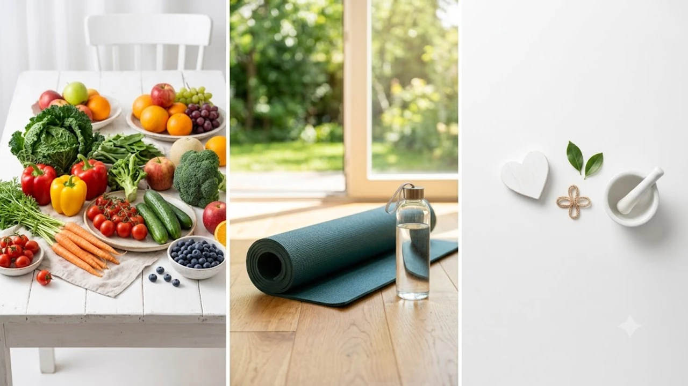

무심코 집어 든 가공 스낵 한 봉지나 캔 음료가 우리 몸의 대사 체계를 소리 없이 무너뜨립니다. 최근 대규모 역학 조사를 통해 **초가공식품 하루 100g** 증량이 만성 염증 반응을 촉진하고 조기 사망 위험을 가파르게 끌어올린다는 사실이 드러났습니다. 일상 속에서 식단 관리를 시도하더라도 가공식품 유화제와 합성 첨가물을 꼼꼼히 가려내지 못하면 헛수고로 끝나기 일쑤입니다.

## 882만 명 코호트가 밝힌 초가공식품 '100g의 경고'

### 하루 100g 섭취 증가가 부르는 심혈관·사망 위험 수치
싱가포르 듀크-NUS 의과대학 연구팀이 성인 882만 명을 추적 관찰한 51개 전향적 코호트 메타분석 결과를 2026년 9월 국제 학술지 *가정의학과 지역사회 보건(FMCH)*에 발표했습니다. 

연구진이 밝혀낸 핵심 데이터는 매우 구체적입니다.

- **심혈관 질환 발생 위험**: 하루 100g 섭취량 증가당 **14% 상승**
- **모든 원인에 의한 조기 사망 위험**: 하루 100g 증가당 **3% 상승**
- **제2형 당뇨병 유병률**: 섭취 비중이 가장 높은 그룹이 가장 낮은 그룹 대비 **12% 증가**

소시지 한 개(약 70g)와 가공 음료 반 캔(약 125ml)만 먹어도 기준치인 100g을 훌쩍 넘깁니다. 섭취량이 늘어날수록 위험 곡선이 정비례해 치솟는 '용량-반응 관계'가 명확히 확인되었습니다.

### 가공식품과 초가공식품(UPF)을 가르는 결정적 차이점
국제 표준 영양학 기준인 **NOVA 시스템**은 식재료를 가공 단계별로 4등급으로 나눕니다.

> - **1단계 (미가공·최소가공)**: 채소, 과일, 생고기, 달걀, 볶은 견과류
> - **2단계 (가공 요리 재료)**: 압착 식물성 오일, 버터, 천일염, 원당
> - **3단계 (일반 가공식품)**: 소금물에 절인 생선 통조림, 발효 천연 치즈, 전통 방식 바게트
> - **4단계 (초가공식품)**: 산업 추출물(분리대두단백), 인공 착향료, 화학 유화제, 증점제가 범벅된 공장제 완제품

일반 가정집 부엌 찬장에 없는 화학 성분(말토덱스트린, 카라기난, 잔탄검 등)이 적힌 순간 모조리 4단계 초가공식품으로 분류됩니다.

### 소화관과 혈당을 망가뜨리는 산업용 식품첨가물의 작동 기전
초가공 처리를 거친 식품은 본래 자연물이 지닌 세포벽 망(매트릭스 구조)이 산산조각 난 상태입니다. 입에 닿자마자 씹을 필요도 없이 혈관으로 직행해 혈당을 요동치게 만듭니다.

더 치명적인 복병은 **유화제(폴리소르베이트-80, 카르복시메틸셀룰로오스)**입니다. 유화제는 마치 세제가 기름때를 지우듯 장 점막의 끈적한 점액 보호막을 벗겨냅니다. 방어벽이 뚫려 장 누수(Leaky Gut)가 터지면 장내 독소가 혈관을 타고 온몸으로 퍼져 미세 염증을 일으킵니다. 이는 [당뇨 전단계 식단 핵심 가이드 3가지](/posts/health/young-prediabetes-diet-prevention-2026/)에서 강조하는 인슐린 저항성 파괴로 직행하는 지름길입니다.

## 일상에서 무심코 먹는 숨은 초가공식품 체크리스트

### 건강식으로 착각하기 쉬운 편의점 단백질 바·시리얼의 배신
헬스장 갈 때 가볍게 챙기는 '웰빙 간식' 라벨을 들여다보면 실상이 전혀 다릅니다.

- **단백질 바**: 퍽퍽한 분리단백 분말을 굳히고 맛을 내기 위해 액상포도당, 인공 감미료(수크랄로스), 보습제(소르비톨)를 가득 붓습니다.
- **통곡물 그래놀라**: 원물 귀리보다 당밀 시럽과 경화 팜유 코팅 비중이 높아 칼로리 밀도가 초코바 못지않습니다.
- **다이어트 쉐이크**: 걸쭉한 목 넘김을 연출하는 합성 점증제와 착향료가 베이스를 채웁니다.

포장지 앞면에 적힌 '고단백', '무설탕' 문구 대신 뒷면 원재료 함량을 확인해야 합니다.

### 배달 음식과 냉동 HMR 제품 속 초가공 비율 점검
전자레인지로 3분 만에 차려내는 냉동 볶음밥, 떡볶이 밀키트, 양념 배달음식은 고도로 조작된 화학 첨가물의 집약체입니다.

- **변성 전분**: 소스가 굳거나 물처럼 분리되지 않도록 분자 구조를 바꾼 화학물
- **향미증진제**: 혀의 미각 수용체를 속여 뇌에 가짜 식욕 신호를 보내는 합성 복합염
- **산도조절제**: 상온 및 냉동 보관 기간을 억지로 늘려놓는 화학 보존제

자연 재료를 썰어 냄비에 끓여낸 찌개와 포장지를 뜯어 데운 공장식 레토르트는 장내 미생물 환경에 전혀 다른 타격을 가합니다.

### 식품 성분표에서 3초 만에 유화제·인공감미료 걸러내는 법
마트에서 장을 볼 때 뒷면 성분표를 빠르게 거르는 3원칙을 기억해 둡니다.

- **원재료명이 5개 단어를 훌쩍 넘어가는가?**
- **'-산나트륨', '-제', '-검'으로 끝나는 암호 같은 성분이 박혀 있는가?**
- **단맛을 흉내 내는 대체감미료(아세설팜칼륨, 아스파탐, 수크랄로스)가 들어있는가?**

이 중 2개 이상 눈에 띈다면 망설임 없이 선반에 되돌려놓는 습관이 필요합니다.

## 완벽한 절제 대신 성공률 높이는 3단계 점진적 대체법

### 1단계: 액상 과당·탄산음료를 천연 발효 탄산수로 전환하기
초가공 식품군 중 혈관을 가장 무자비하게 망가뜨리는 주범은 액상 과당입니다. 물처럼 흡수된 액체 당분은 간으로 직행해 지방간을 만들고 포만 신호(렙틴)를 단칼에 꺼버립니다.

- **퇴출 대상**: 콜라, 사이다, 가당 과즙주스, 시럽을 듬뿍 탄 카페 라테
- **대체 선택**: 플레인 탄산수에 생레몬즙 띄우기, 천연 발효 콤부차, 직접 우린 보리차나 히비스커스 티

목을 긁는 탄산의 쾌감은 고스란히 챙기면서 인슐린 폭격을 피하는 최우선 관문입니다.

### 2단계: 정제 탄수화물 간식을 견과류·통곡물 자연식품으로 교체
오후 4시만 되면 손이 떨리고 단 음식이 당기는 건 인슐린 스파이크 후 찾아온 가짜 허기 때문입니다. 밀가루 과자나 젤리 대신 씹는 맛과 건강한 지방을 채워 혈당 곡선을 완만하게 다스려야 합니다.

- 소금기 없는 구운 아몬드·호두 한 줌(30g 안팎)
- 껍질째 썬 사과 몇 조각과 첨가물 없는 100% 땅콩버터
- 찐 병아리콩이나 볶은 서리태

평소 끼니에서 [통곡물 48g 식단 진짜 바뀌는 3가지](/posts/health/whole-grains-48g-metabolic-diet-2026/) 실천법을 곁들이면 허기짐 자체를 뿌리 뽑을 수 있습니다.

### 3단계: 가공육을 원물 단백질(달걀·생선·두부)로 1:1 리플레이스
햄, 베이컨, 비엔나소시지 같은 훈제 가공육은 발암 추정 물질인 아질산나트륨을 품고 있어 세포 재생을 가로막습니다.

- 샌드위치 햄 대신 완숙 달걀 2알이나 수비드 닭가슴살 찢어 넣기
- 찌개 속 부대찌개용 햄 대신 단단한 촌두부 듬뿍 넣기
- 냉동 너겟 대신 에어프라이어에 구운 생선 토막 올리기

모양이 정형화된 공장 성형육 대신 원물의 결이 그대로 살아있는 단백질을 밥상의 중심에 둡니다.

## 작심삼일 끝내는 일주일 클린 식단 루틴과 장보기 가이드

### 퇴근 후 10분 만에 끝내는 최소가공 원팬 식단 레시피
녹초가 된 퇴근길에 배달 앱 유혹을 이겨내려면 칼과 도마조차 최소한으로 써야 합니다. 프라이팬 한 장으로 끝내는 고단백 원팬 구이가 현실적인 답입니다.

- **식재료**: 엑스트라 버진 올리브유 1스푼, 생선 필렛(연어/고등어)이나 냉장 닭다리살 150g, 방울토마토 한 줌, 주먹 크기 브로콜리
- **조리 순서**: 팬을 달군 뒤 올리브유를 두르고 고기나 생선을 올린 다음, 옆 빈자리에 토마토와 채소를 던져 넣고 뚜껑을 덮어 익힙니다. 간은 굵은 소금과 통후추만 씁니다.
- **포인트**: 인공 조미료 없이도 재료 자체의 수분과 올리브유의 향미만으로 훌륭한 클린 한 끼가 완성됩니다.

### 마트 장보기 동선만 바꿔도 장바구니가 바뀌는 외곽 공략법
대형 마트 중앙 복도는 유통기한이 수개월씩 되는 정제 스낵, 라면, 통조림이 빽빽하게 유혹하는 구역입니다.

카트를 밀 때는 무조건 매장 가장자리 벽면만 시계 방향으로 돕니다.