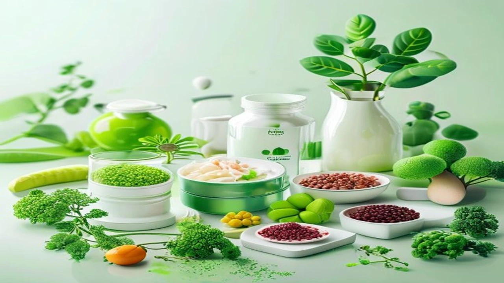
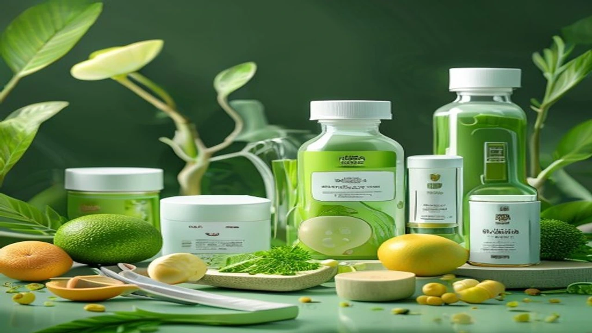

바쁜 현대 사회에서 편리하게 한 끼를 해결해 주는 간편식들이 세포를 천천히 망가뜨리고 있습니다. 최근 연구에 따르면 편리함 뒤에 숨은 **초가공식품 만성 염증** 유발 기전이 명확히 밝혀지면서 건강에 민감한 이들 사이에서 경각심이 매섭게 치솟는 중입니다. 일상적인 식습관을 날카롭게 점검하고 세포 수준의 치유를 이끌어내기 위한 구체적인 해독 원리와 단계별 실천법을 명확하게 정리했습니다.

## 초가공식품과 만성 염증의 위험한 상관관계

### 가공식품과 초가공식품(UPF)을 구분하는 명확한 기준
국제 보건 기구와 학계가 신뢰하는 식품 분류 체계인 **노바(NOVA) 분류법**은 식품의 형태를 기준으로 삼습니다. 1단계인 신선 식품, 2단계 조미료, 3단계 일반 가공식품을 넘어선 4단계가 바로 초가공식품(Ultra-Processed Foods)입니다. 일반 가공식품은 통조림이나 단순 염장 식품처럼 원물의 형태를 유지하지만, 초가공식품은 원형을 완전히 분해하고 화학적으로 재조합한 결과물입니다. 탄수화물, 지방, 단백질을 고도로 정제한 성분에 감미료, 착색료, 유화제, 보존제 등 오직 실험실에서만 합성해 내는 물질을 대량 투여하여 제조합니다.

### 첨가물이 장벽을 뚫고 '만성 저강도 염증'을 일으키는 메커니즘
초가공식품의 치명적인 독성은 장내 미생물 생태계(마이크로바이옴)를 무참히 파괴하는 데서 출발합니다. 유화제와 인공 감미료는 장 점막을 보호하는 유익균을 사멸시키고 장벽 세포 사이의 단단한 결합을 느슨하게 만듭니다. 이로 인해 장벽에 미세한 틈이 생기는 **'장 누수 증후군(Leaky Gut Syndrome)'**이 발생합니다. 분해되지 않은 음식물 입자와 박테리아 독소(LPS)가 혈액 속으로 직접 침투하면, 면역 시스템은 이를 외부 침입자로 인식해 무차별적인 공격을 개시합니다. 이 과정이 전신에서 소리 없이 번지는 현상이 바로 만성 저강도 염증의 실체입니다.

### 2026년 최신 의학 저널이 경고하는 초가공식품 유발 질병 리스트
세계적인 의학 저널 란셋(The Lancet)에 발표된 최신 메타 분석 자료에 따르면, 초가공식품 섭취량이 10% 증가할 때마다 전반적인 암 발생 위험이 12%씩 유의미하게 상승합니다. 특히 대장암과 췌장암의 발병률이 급증했으며, 신체 대사 기능을 마비시켜 제2형 당뇨병 위험을 24% 높인다는 통계가 제시되었습니다. 혈관벽에 지속적인 염증 반응을 유도하여 뇌졸중 및 심근경색을 포함한 심혈관 질환 사망률을 촉진한다는 점도 명확한 데이터로 증명되었습니다.

## 내 몸을 망가뜨리는 초가공식품 의존도 자가진단

### "혹시 나도?" 쉽게 피로하고 붓는 사람들을 위한 염증 시그널
충분한 수면을 취했음에도 아침에 눈을 뜨기 힘들거나 전신이 묵직하게 붓는 느낌이 가라앉지 않는다면 체내 염증 수치를 의심해야 합니다. 초가공식품에 포함된 고농도의 액상과당과 정제염은 세포 내 수분 정체를 유발하고 대사 효율을 떨어뜨립니다. 뚜렷한 원인 없이 피부 트러블이 반복되거나 관절 마디마디가 뻣뻣해지는 증상 역시 면역계가 과부하 상태에 빠졌음을 알리는 신호입니다. 머릿속에 안개가 낀 것처럼 멍한 '브레인 포그' 현상도 장-뇌 축(Gut-Brain Axis)을 통해 전달된 염증 물질이 뇌 세포에 영향을 미친 결과입니다.

### 일상에서 놓치기 쉬운 '가짜 건강 초가공식품'의 배신
많은 이들이 탄산음료나 햄버거만을 유해 식품으로 생각하지만, 건강을 위해 선택하는 제품 중에도 초가공식품이 상당수 숨어있습니다. 대표적으로 설탕을 뺐다고 광고하는 **제로 슈거 음료**에는 수크랄로스나 아스파탐 같은 인공 감미료가 다량 함유되어 장내 유익균을 교란합니다. 바쁜 아침 대용으로 먹는 **단백질 바(Protein Bar)**나 식물성 고기로 만든 대체육 제품 역시 단백질을 추출·가공하는 과정에서 화학 유화제와 향미증진제가 첨가되는 전형적인 초가공식품입니다.

### 초가공식품을 일주일간 끊었을 때 나타나는 신체 정화 경험 데이터
실제 임상 실험에서 참가자들을 대상으로 일주일간 모든 초가공식품을 차단하고 원물 중심의 식단을 제공한 결과, 혈액 내 염증 표지자인 C-반응성 단백질(CRP) 수치가 평균 15% 이상 감소했습니다. 참가자들은 사흘째까지 극심한 당류 갈망과 두통 같은 일종의 금단 증상을 겪었으나, 5일 차를 기점으로 만성적인 소화불량이 사라지고 가벼운 아침을 맞이하는 긍정적인 신체 변화를 경험했습니다. 식후에 급격하게 졸음이 쏟아지는 혈당 스파이크 현상도 눈에 띄게 완화되었습니다.

[관련 글 보기](/posts/health/)

## 장내 미생물을 살리는 만성 염증 해독 3단계 루틴

### [1단계] 비우기: 세포 독소를 유발하는 3대 유해 성분 차단하기
체내 독소 유입을 막는 첫걸음은 식품 라벨을 읽는 습관에서 시작합니다. 가공식품을 구매할 때 뒷면의 원재료명 표기란을 확인하여 **액상과당(고과당콘시럽), 쇼트닝(경화유), 합성착향료**가 포함된 제품을 식단에서 완전히 제외해야 합니다. 이 세 가지 성분은 세포막을 딱딱하게 만들고 인슐린 저항성을 극도로 끌어올리는 주범입니다. 성분표에 이름이 복잡하고 일상적인 요리에서 쓰이지 않는 화학 명칭이 5개 이상 적혀 있다면 과감히 내려놓는 단호함이 필요합니다.

### [2단계] 채우기: 장벽을 복구하는 천연 식이섬유 및 항염 식품 배치
비워낸 자리는 장내 유익균의 먹이가 되는 프리바이오틱스와 강력한 항산화 물질로 채워야 장벽이 빠르게 복구됩니다. 매일 최소 한 끼는 가공되지 않은 채소와 통곡물 위주의 식단을 구성합니다.
* 브로콜리, 양배추 같은 십자화과 채소: 설포라판 성분이 간의 해독 대사를 촉진
* 블루베리, 아로니아 등 베류 과일: 안토시아닌이 혈관 염증을 직접적으로 억제
* 들기름, 올리브유: 오메가-3 및 오메가-9 지방산이 세포막을 부드럽게 재생

### [3단계] 유지하기: 바쁜 직장인을 위한 현실적인 주간 밀프레프(Meal Prep) 루틴
시간적 여유가 부족한 직장인들은 주말을 활용한 **밀프레프**로 초가공식품의 유혹을 차단할 수 있습니다. 일요일 저녁, 3\~4일 분량의 탄수화물(현미밥, 찐 고구마)과 단백질(삶은 달걀, 닭가슴살 구이)을 미리 조리하여 밀폐 용기에 소분해 둡니다. 신선한 쌈채소나 파프리카는 세척 후 물기를 완전히 제거해 보관하면 평일 아침과 저녁 시간에 조리 과정 없이 5분 만에 완벽한 항염 식단을 완성할 수 있어 배달 음식과 간편식에 의존하는 나쁜 습관을 물리적으로 통제하게 됩니다.

## 초가공식품 감량 시 맞닥뜨리는 현실적 문제와 솔루션

### 자연식 위주 식단의 경제적·시간적 비용 부담과 대안
유기농 원물 위주의 식단이 건강에 이롭다는 점을 인지하면서도 실천하지 못하는 원인은 비용과 번거로움에 있습니다. 그러나 가공되지 않은 제철 채소와 냉동 원물 제품을 적절히 활용하면 비용을 획기적으로 낮출 수 있습니다. 신선 보관이 까다로운 블루베리나 아스파라거스는 화학 첨가물 없이 원물 그대로 급속 냉동한 냉동 제품을 대량 구매하는 편이 훨씬 경제적입니다. 요리 시간을 줄이기 위해 시판 유기농 토마토 퓨레나 순수 100% 견과류 버터를 소스로 활용하는 것도 훌륭한 대안입니다.

### 금단 증상(당 흡수 욕구)을 안전하게 극복하는 대체 간식 가이드
초가공식품에 들어간 정제당과 유화제는 뇌의 보상회로를 자극해 마약과 유사한 강한 중독성을 발휘합니다. 오후 3\~4시경 찾아오는 극심한 가짜 허기와 당류 갈망을 무조건 참아내면 결국 폭식으로 이어지기 마련입니다. 이때는 인공 감미료가 들어간 제로 음료 대신 따뜻한 녹차나 루이보스티를 마셔 입안을 정돈해야 합니다. 씹는 욕구를 충족하고 싶다면 첨가물이 전혀 없는 생아몬드, 호두 같은 견과류를 한 줌 섭취하거나, 카카오 함량이 85% 이상인 다크 초콜릿을 한 조각 녹여 먹는 방법으로 뇌를 안전하게 달래줄 수 있습니다.

### 완벽주의를 버린 '80:20 법칙'으로 지속 가능한 건강 관리 전략 수립
식단을 100% 완벽하게 통제하겠다는 강박 관념은 오히려 스트레스 호르몬인 코르티솔을 분비시켜 체내 염증을 악화시키는 역효과를 낳습니다. 지속 가능한 건강 관리를 위해서는 일주일 식사의 80%를 가공되지 않은 청정 자연식으로 채우고, 나머지 20%는 사회생활이나 개인적인 즐거움을 위해 유연하게 허용하는 **'80:20 법칙'**을 적용하는 편이 이롭습니다. 회식이나 외식으로 어쩔 수 없이 초가공식품을 섭취했다면 다음 날 한두 끼를 가볍게 단식하거나 채식 위주로 구성하여 신체가 스스로 독소를 배출할 수 있는 충분한 휴식 시간을 부여하면 됩니다.

**함께 읽으면 좋은 글**
- [치매 치료 신약, 뇌 건강 지키는 숨은 핵심만](/posts/health/early-dementia-treatment-brain-health-2026/)
- [장 건강 식단 2026년 완전 정리](/posts/health/fiber-maxxing-gut-health-2026/)

#초가공식품 #만성염증 #장누수증후군 #항염식단 #해독루틴 #밀프레프 #자연식물식 #인공감미료 #새해건강 #식단관리 #면역력강화 #질병예방