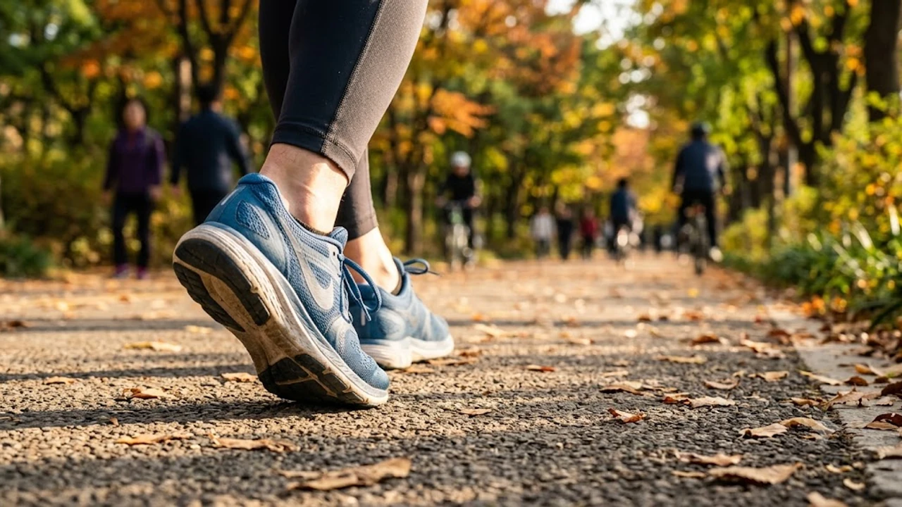

매일 스마트폰 만보기로 만 보를 꼬박꼬박 채워도 뱃살은 그대로이고 무릎 앞쪽만 시큰거린다면 보행 방식 자체를 완전히 뜯어고쳐야 합니다. 최근 스포츠 의학계와 재활 현장에서 검증된 **워커스하이**(Walker's High)는 단순 산책을 넘어 뇌 속 보상 체계를 깨우고 관절 마모 없이 체지방을 빠르게 태우는 고효율 **인터벌 보행법**입니다. 지면을 딛는 리듬과 심박수 구간을 정밀하게 제어하면 하루 20~30분의 짧은 시간만으로도 강력한 전신 대사 활성 효과를 얻을 수 있습니다.

## 만보 걷기 효과 없을 때 찾는 워커스하이의 원리

### 러너스하이와 워커스하이의 뇌 신경계 작용 차이
30분 이상 전력으로 달릴 때 체감하는 러너스하이는 관절 하중이 체중의 3~5배에 달해 초보자에게는 연골 손상 위험이 큽니다. 반면 워커스하이는 착지 충격을 러닝의 30% 수준으로 묶어두면서도 일정한 스텝 리듬과 흉곽 호흡을 통해 뇌 내 카나비노이드 및 도파민 분비를 효과적으로 유도합니다. 무릎과 발목에 가해지는 부담을 덜어내면서도 코르티솔 수치를 가라앉히고 뇌파를 안정화하는 신경학적 이점이 돋보입니다.

### 관절 부담 없이 엔도르핀과 도파민을 분비시키는 메커니즘
워커스하이 상태에 진입하려면 발바닥 족저근막과 아킬레스건이 지면을 탄력 있게 밀어내는 고유수용성 감각을 쉼 없이 일깨워야 합니다. 
> 수직 낙하 충격을 최소화한 채 대퇴사두근과 둔근의 수축·이완 주기를 일정하게 맞출 때 뇌 시상하부에서 엔도르핀 생성이 활성화됩니다.

근육 내 젖산이 과하게 쌓이지 않아 피로 누적 없이 상쾌한 각성 상태를 오래 유지하게 만듭니다.

### 단순 걷기 대비 체지방 연소율이 급증하는 신체적 조건
같은 속도로 터덜터덜 걷는 방식은 시작 15~20분만 지나도 대사 적응이 일어나 에너지 소모량이 급감합니다. 반면 심박수에 기복을 주는 인터벌 보행은 지질 대사 경로를 지속해서 흔들어 체지방 연소 스위치를 켭니다. 글리코겐 고갈에 따른 피로감 없이 순수 지방 산화율을 높이려면 [존2 유산소 운동법, 진짜 살 빠질까?](/posts/health/zone-2-cardio-fat-burn-routine-2026/) 기준에 맞춘 목표 심박수를 유지해야 합니다.

## 관절을 완벽히 보호하는 워커스하이 인터벌 보행 루틴

### 보폭과 케이던스를 조절하는 3분 속보 2분 완보 세트법
임상 현장에서 권장하는 기본 주기는 **'3분 파워 속보 + 2분 회복 완보'**를 5~6회 되풀이하는 패턴입니다.
- **파워 속보 구간 (3분)**: 평소 걸음보다 보폭을 주먹 하나(약 10cm) 정도 넓히고, 분당 120~130보 속도로 대화 시 숨이 약간 가쁜 상태를 유지합니다.
- **회복 완보 구간 (2분)**: 코로 깊게 들이마시고 입으로 내쉬는 복식호흡과 함께 분당 80~90보 템포로 하체 긴장을 가볍게 털어냅니다.
- **총 소요 시간**: 웜업 3분과 쿨다운 2분을 더해 정확히 25~30분 안에 끝냅니다.

### 척추 정렬을 유지하며 골반 회전을 살리는 파워 보행 자세
자세가 흐트러진 채 속도만 올리면 허리와 슬개골에 충격이 쏠립니다.
1. 시선은 정면 10~15m 지점에 고정하고 턱끝을 목 쪽으로 1cm 당겨 경추를 정렬합니다.
2. 어깨 힘을 빼고 팔꿈치를 L자로 90도 굽힌 채 뒤쪽으로 강하게 찌르듯 흔듭니다.
3. 착지할 때마다 골반을 앞뒤로 부드럽게 5도씩 교차 회전시켜 대둔근 상부를 강하게 수축시킵니다.

### 스마트워치 심박수 존(Zone 2)을 유지하는 실시간 팁
속보 구간에서 최대 심박수의 60~70% 선을 오르내리는지 실시간으로 점검해야 유산소 효율이 극대화됩니다. 기기 조작이 번거롭다면 [2026 스마트워치 운동 진짜 효과 보는 법](/posts/health/wearable-data-smart-pacing-fitness-2026/)을 참고해 목표 심박 이탈 시 진동 알림을 걸어두는 방법이 효과적입니다. 숨은 가쁘되 끊기지 않고 서너 마디 말을 이어갈 수 있는 강도가 이상적인 기준점입니다.

## 일상에서 실패 없이 지속하는 워커스하이 실천 전략

### 신발 쿠셔닝 및 아치 서포트 선택 시 필수 체크포인트
굽이 딱딱한 스니커즈나 밑창이 지나치게 푹신한 맥스쿠션 신발은 족관절 정렬을 무너뜨립니다.
- 뒤꿈치와 앞발바닥의 지상고 차이(힐드롭)가 6~8mm 안팎인 단단한 워킹 전용화를 고릅니다.
- 발가락이 안쪽에서 자연스럽게 펴질 수 있도록 토박스(Toe Box) 공간이 넉넉한 모델을 챙깁니다.
- 보행 중 발 아치가 안쪽으로 무너지지 않도록 단단하게 받쳐주는 지지형 인솔을 조합합니다.

### 출퇴근 시간 15분을 활용하는 미니 워커스하이 인터벌
바쁜 일상에서 따로 헬스장에 갈 여유가 없다면 출퇴근길 지하철 한 정거장 구간을 적극적으로 이용합니다. 역에서 직장까지 걸어가는 15분 동안 **1분 초속보 + 1분 보통 걸음**을 번갈아 실천하는 것만으로도 뇌 혈류량이 급증하고 도파민 분비가 촉진됩니다.

### 야간 고온다습 날씨 속 체온 조절과 수분·전해질 보충법
열대야나 늦여름 습한 저녁에는 체온 조절이 더뎌지므로 폴리에스터 계열의 기능성 통기 의류를 입어야 합니다. 출발 10분 전 미온수 200ml를 마셔두고, 30분 루틴 후에는 이온 음료나 식염수 한 모금으로 나트륨과 칼륨을 채워 근육 경련을 막습니다.

## 초보자가 흔히 저지르는 걷기 실수와 예방책

### 뒤꿈치 과충격 및 앞꿈치 쓸림을 방지하는 착지 교정
발을 디딜 때 '쿵' 소리가 날 정도로 뒤꿈치 모서리로 찍어 누르면 무릎 연골에 직접적인 마찰이 생깁니다.
- 뒤꿈치 바깥쪽부터 부드럽게 닿아 발바닥 전체로 체중을 분산한 뒤 엄지발가락으로 지면을 튕겨내는 **'3점 롤링'** 기법을 적용합니다.
- 발가락 끝으로만 딛거나 바닥을 질질 끄는 걸음걸이는 족저근막을 빠르게 손상시키므로 즉시 바로잡아야 합니다.

### 허리 젖힘과 거북목을 막아주는 코어 활성화 동작
속도를 높이려다 상체를 뒤로 젖히거나 턱을 앞으로 내밀면 요추 4~5번에 압박이 누적됩니다. 아랫배를 명치 쪽으로 가볍게 밀어 넣는 느낌으로 복압을 20% 유지한 채 걸으면 척추 기립근이 단단한 지지대 역할을 해냅니다.

### 운동 후 족저근막과 아킬레스건을 보호하는 필수 스트레칭
보행 직후에는 계단 턱이나 벽을 이용해 발뒤꿈치를 아래로 지그시 내리며 아킬레스건을 20초씩 늘려줍니다. 운동 후 잔뜩 뭉친 족저근막과 종아리 가자미근을 방치하면 만성 족저근막염으로 번지기 쉬우므로, 폼롤러나 마사지 도구로 하체 긴장을 즉각 풀어주는 사후 관리가 필수입니다.

[종아리 발바닥 릴리즈 롤러 쿠팡에서 보기](https://www.coupang.com/np/search?q=%EA%B1%B4%EA%B0%95%EA%B8%B0%EA%B8%B0%20%EB%A7%88%EC%82%AC%EC%A7%80%EA%B8%B0&sourceType=affiliate&trackingCode=AF8691300)

#워커스하이 #인터벌걷기 #존2유산소 #걷기자세교정 #유산소운동루틴 #족저근막염예방 #무릎안아픈운동 #체지방연소걷기