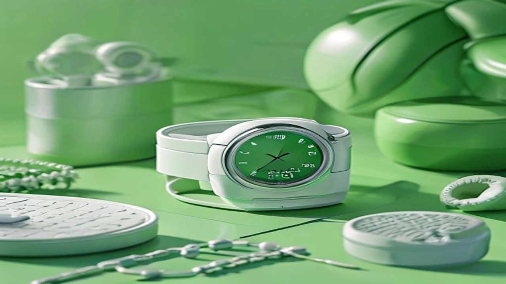
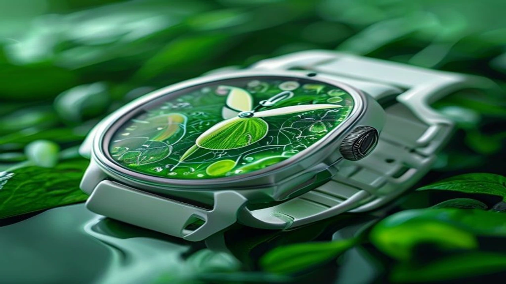

2026년 피트니스 시장의 패러다임은 무조건 무거운 무게를 들거나 오래 달리는 과거의 방식에서 완전히 벗어났습니다. 많은 직장인이 체중 감량이나 체력 증진을 목적으로 **스마트워치 운동**을 시작하지만, 정작 기기가 제공하는 방대한 생체 데이터를 제대로 해석하지 못해 단순한 만보기 수준으로 활용하는 데 그치고 있습니다. 매일 아침 손목 위에서 제공되는 정밀한 데이터 지표를 이해하고 이를 운동 부하 관리에 적용한다면 부상 없이 신체 능력을 비약적으로 끌어올릴 수 있습니다.

## 스마트워치 운동, 왜 데이터에 주목해야 할까?

### 열심히 운동해도 살이 안 빠지고 피곤한 진짜 이유
매일 1시간씩 땀을 흘리는데도 체중계 바늘이 움직이지 않거나 낮 시간 내내 극심한 피로감에 시달린다면 세포가 보내는 경고 신호에 귀를 기울여야 합니다. 신체 회복 속도를 고려하지 않은 과도한 트레이닝은 스트레스 호르몬인 코르티솔 분비를 촉진하여 오히려 지방을 축적하고 근육을 분해하는 역효과를 낳습니다. 손목 위 장비가 경고하는 오버트레이닝 수치를 무시한 채 의지력만으로 밀어붙이는 운동은 몸을 망치는 지름길입니다.

### 2026년 피트니스 메가 트렌드: '스마트 페이싱'이란?
미국스포츠의학회(ACSM)의 최근 보고서에 따르면 웨어러블 테크놀로지는 수년째 글로벌 피트니스 트렌드 최상위권을 유지하고 있으며, 그 중심에는 **'스마트 페이싱(Smart Pacing)'**이 자리 잡고 있습니다. 스마트 페이싱은 심박수, 수면 패턴, 활동량을 실시간으로 분석하여 매일 아침 개인 맞춤형 운동 강도를 자동으로 제안하는 기술을 뜻합니다. 무조건적인 고강도 운동 대신 신체 컨디션에 맞춰 휴식과 운동의 완급을 조절하는 것이 핵심 가치입니다.

### 직장인 운동 권태기를 극복해 주는 데이터의 힘
매일 눈으로 확인하는 정량적인 수치는 지치기 쉬운 직장인들에게 강력한 시각적 보상을 제공합니다. 체중 변화는 정체기가 길지만, 심폐 지구력이 향상되면서 나타나는 '안정 시 심박수(Resting Heart Rate)'의 하락이나 '최대 산소 섭취량(VO2 Max)'의 상승은 숫자로 즉각 확인됩니다. 지루한 루틴에 지친 순간 데이터가 보여주는 미세한 신체 변화는 운동을 지속하게 만드는 확실한 촉매제가 됩니다.

## 핵심 데이터 파헤치기: HRV와 수면 점수 비교분석

### 내 몸의 회복 탄력성 지표, 심박변이도(HRV) 분석 방법
심박변이도(HRV, Heart Rate Variability)는 전체 건강 상태와 자율신경계의 균형을 보여주는 가장 객관적인 지표입니다. 심장 박동과 박동 사이의 시간 간격이 미세하게 계속 변하는 상태가 건강한 전신 컨디션을 의미하며, 이 변동성이 클수록 자율신경계가 외부 스트레스에 유연하게 대처하고 있다는 방증입니다. 

> **HRV 수치 해석 기준**
> * **높은 HRV:** 교감신경과 부교감신경이 조화를 이루는 상태로, 고강도 웨이트 트레이닝이나 인터벌 러닝을 소화하기에 적합한 날입니다.
> * **낮은 HRV:** 신체가 정신적·육체적 스트레스를 과도하게 받고 있음을 의미하므로, 당일은 가벼운 산책이나 스트레칭으로 대체해야 부상을 예방합니다.

### 운동 효율을 결정짓는 수면 효율성 데이터 읽는 법
단순히 침대에 누워있던 시간보다 중요한 것은 깊은 수면과 렘(REM) 수면의 비율을 나타내는 수면 효율성 점수입니다. 근육의 성장과 미세 손상 세포의 회복은 대부분 깊은 수면 단계에서 분비되는 성장호르몬을 통해 이루어집니다. 총수면 시간이 8시간으로 넉넉했더라도 깊은 수면 주기가 15% 미만으로 떨어졌다면 근육 세포의 피로 물질인 젖산이 제대로 배출되지 않아 다음 날 운동 수행 능력이 급격히 떨어집니다.

### 스트레스 지수 vs 운동 부하: 오늘 운동 강도 정하기
정신적 스트레스와 육체적 운동 부하는 동일한 신경계를 공유하므로 두 지표를 동시에 비교해야 정확한 컨디션 파악이 가능합니다. 회사 업무로 인해 낮 동안 스트레스 지수가 한계치에 도달했다면, 아무리 육체적 근육 피로도가 낮더라도 고강도 운동을 피해야 합니다. 자율신경계가 이미 과부하 상태이기 때문에 이때는 신체 밸런스를 맞추기 위한 저강도 유산소 영역(Zone 2) 위주의 세팅이 좋습니다.

[관련 글 보기](/posts/health/)

## 기기별 내 몸 맞춤형 부하 관리 기능 장단점

### 애플워치 활력 징후 및 운동 부하 기능의 명과 암
애플워치는 '활력 징후' 앱을 통해 야간 심박수, 호흡수, 손목 온도 등을 측정하여 평소 범위를 벗어난 이상 징후를 직관적으로 알려줍니다. 최근 업데이트된 '운동 부하' 기능은 지난 7일간의 운동 강도와 28일간의 장기 트렌드를 비교하여 현재 훈련량이 적절한지 그래픽으로 명확하게 보여줍니다. 다만 서드파티 앱을 추가로 설치하지 않으면 구체적인 HRV 원형 데이터를 실시간으로 모니터링하고 가공하기 어렵다는 아쉬움이 남습니다.

### 갤럭시 워치 및 갤럭시 링 기반 헬스 데이터의 실용성
삼성의 웨어러블 생태계는 갤럭시 워치와 손가락에 착용하는 갤럭시 링을 동시에 활용하여 측정 정밀도를 극한으로 끌어올렸습니다. 두 기기가 연동되어 계산해 내는 '에너지 점수'는 직장인들이 아침에 컨디션을 직관적으로 판단하는 데 무척 유용합니다. 그러나 수면 중 링이 돌아가거나 워치 밀착도가 떨어질 경우 간헐적으로 데이터 공백이 발생하여 주간 평균값에 오차가 생기는 현상이 간혹 발견됩니다.

### 전문 운동인을 위한 가민(Garmin) 보디 배터리 기능 평가
러너들과 철인 3종 선수들이 애용하는 가민은 피트니스 데이터 분석 분야에서 가장 독보적인 신뢰도를 자랑합니다. 신체의 잔여 에너지를 1부터 100까지의 숫자로 표현하는 '보디 배터리(Body Battery)' 기능은 실제 체감 피로도와 거의 완벽하게 일치한다는 평가를 받습니다. 단, 기기 자체의 가격 진입장벽이 높고 UI가 텍스트 위주로 구성되어 있어 스마트 기기 조작에 서툰 초보자에게는 다소 복잡하게 느껴질 수 있습니다.

## 초보자를 위한 스마트워치 활용 운동 튜토리얼

### 1단계: 아침에 눈떠서 '오늘의 회복도' 확인하기
매일 아침 침대에서 일어나기 전 스마트워치 화면에 표기된 수면 점수와 HRV 상태를 확인하는 습관을 들여야 합니다. 전날 과음을 했거나 수면 환경이 불량했다면 기기는 어김없이 주의 신호를 보냅니다. 기기가 표시하는 종합 회복도 점수가 60점 미만이라면 그날은 무리한 고중량 스쿼트나 장거리 러닝 계획을 과감히 수정하는 결단력이 필요합니다.

### 2단계: 회복도 점수별 맞춤형 운동 루틴 세팅 가이드
데이터 확인이 끝났다면 수치에 맞춰 당일 운동 목표를 3단계로 분류하여 실행에 옮깁니다.
- **80점 이상 (그린 존):** 신체 능력이 최상의 상태이므로 새로운 개인 기록(PR)에 도전하거나 고강도 인터벌 트레이닝(HIIT)을 배치합니다.
- **50점\~79점 (옐로 존):** 일반적인 컨디션이므로 평소 소화하던 세트 수와 중량을 그대로 유지하며 일정한 자극을 주는 데 집중합니다.
- **50점 미만 (레드 존):** 부상 위험이 높은 상태이므로 근력 운동을 전면 중단하고 30분 안팎의 가벼운 걷기나 요가로 몸을 이완합니다.

### 3단계: 부상과 오버트레이닝을 막는 실시간 심박수 모니터링법
실제 운동을 시작하면 화면의 '심박수 구간(Heart Rate Zone)'을 지속적으로 모니터링해야 효율을 극대화할 수 있습니다. 체지방 연소가 목적인 경우 최대 심박수의 60\~70% 수준인 Zone 2 영역을 유지하는 것이 가장 이상적입니다. 운동 중 심박수가 Zone 5(최대 심박수의 90% 이상) 구간에 진입한 상태가 2분 이상 지속되면 심장에 무리가 갈 수 있으므로, 세트 사이 휴식 시간을 늘리거나 호흡을 가다듬으며 안전 페이스를 유지해야 합니다.

**함께 읽으면 좋은 글**
- [폭염 아침 운동 진짜 괜찮을까? 위험성 3가지](/posts/health/heatwave-morning-workout-safety-2026/)
- [80세 이상 근감소증 경고! 손아귀 힘 줄면 위험한 이유](/posts/health/elderly-sarcopenia-grip-strength-warning-2026/)

#스마트워치운동 #웨어러블피트니스 #스마트페이싱 #심박변이도 #HRV #수면점수 #애플워치운동부하 #갤럭시링에너지점수 #가민보디배터리 #오버트레이닝예방