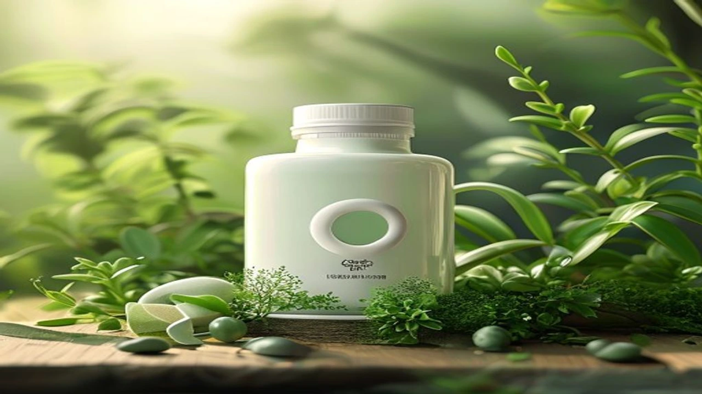

세계보건기구(WHO)가 발표한 최신 글로벌 보고서에 따르면 전 세계적으로 20대부터 40대 사이의 **젊은 암 원인**이 급격한 증가세를 보이며 현대인의 건강을 심각하게 위협하고 있습니다. 과거 노년층의 전유물로 여겨졌던 악성 종양이 젊은 층을 중심으로 빠르게 확산되는 현상은 더 이상 간과할 수 없는 사회적 문제입니다. 이번 글에서는 2026년 보건 의료계의 가장 뜨거운 화두인 청년기 암 급증의 실태를 면밀히 분석하고, 세포를 살리는 구체적인 예방 전략을 제시합니다.

## WHO가 경고한 2026 젊은 암 급증 실태와 통계적 진실

### 대장암과 유방암의 하향 평준화: 2040 세대를 노린다
세계보건기구(WHO) 산하 국제암연구소(IARC)의 2026년 7월 공식 발표에 따르면, 50세 미만 성인에게서 발병하는 '조기 발병 암(Early-Onset Cancer)'의 빈도가 지난 10년간 연평균 **3.2%씩 지속해서 상승**했습니다. 특히 대장암과 유방암의 발병 연령대가 급격히 낮아지는 추세입니다. 기존의 의학적 상식선에서는 60대 이상에서 주로 발견되던 진행성 대장암이 이제는 30대 직장인의 정기 검진에서 빈번하게 포착되며 의료계에 충격을 주고 있습니다. 

### 초가공식품과 미세 염증: 젊은 소화기계가 무너지는 이유
젊은 세대의 소화기계를 망가뜨리는 주범은 일상화된 초가공식품 섭취입니다. 가공 호르몬, 인공 보존제, 정제당이 범벅된 음식을 지속해서 섭취하면 장내 미생물 생태계(마이크로바이옴)가 완전히 파괴됩니다. 장벽이 무너지면서 체내로 유입된 독소들은 혈관을 타고 돌며 만성 미세 염증을 유발합니다. 이 지속적인 염증 반응이 세포의 DNA 복제 오류를 일으키고, 결국 면역계가 제어할 수 없는 암세포의 증식으로 이어집니다.

### 2050 암 발병률 2배 증가 예측이 지금 우리에게 주는 경고
WHO는 현재의 식습관과 환경적 요인이 통제되지 않을 경우, 오는 2050년까지 전 세계 신규 암 환자 수가 현재 대비 77% 이상 급증할 것이라는 정량적 예측을 내놓았습니다. 이는 단순한 미래의 경고가 아니라, 지금 당장 개인의 라이프스타일을 전면 수정해야 한다는 강력한 데이터 기반의 프레임워크입니다. 젊다는 이유만으로 건강을 과신하는 태도는 세포의 돌연변이를 방치하는 것과 다름없습니다.

## 내가 설마 암일까? 젊은 층이 놓치기 쉬운 초기 전조증상 위험 신호

### "단순한 과민성 대장 증후군인 줄 알았다" — 대장암 신호
실제 34세의 나이에 대장암 3기 진단을 받은 한 IT 기업 직장인의 사례는 시사하는 바가 큽니다. 그는 평소 겪던 복부 팽만감과 불규칙한 배변 습관을 흔한 과민성 대장 증후군으로 여겨 1년 이상 방치했습니다. 대장암 초기에는 통증이 거의 없으므로 잦은 설사, 변비, 혹은 대변의 굵기가 급격히 가늘어지는 현상이 발생해도 대수롭지 않게 넘기기 쉽습니다. 변에 피가 섞여 나오는 혈변을 인지했을 때는 이미 병증이 상당 부분 진행된 경우가 많습니다.

> "스트레스성 위염이나 과민성 대장 증후군이라는 자가 진단은 치명적인 결과를 초래합니다. 뚜렷한 이유 없이 배변 패턴이 한 달 이상 바뀌었다면 즉시 내시경을 받아야 합니다."

### 만성 피로와 갑작스러운 체중 감소가 보내는 몸속 경고음
업무 과중으로 인한 피로와 암세포가 유발하는 악액질(Cachexia) 성 피로는 근본적으로 다릅니다. 주말에 충분히 휴식을 취했음에도 불구하고 몸을 일으키기 힘들 정도의 무기력감이 지속된다면 체내 면역 세포가 암세포와 사투를 벌이고 있다는 증거일 수 있습니다. 특별한 다이어트를 하지 않았음에도 6개월 이내에 평소 체중의 5% 이상이 갑작스럽게 감소했다면, 이는 세포가 영양소를 흡수하지 못하고 종양이 체내 에너지를 고갈시키고 있다는 강력한 적신호입니다.

### 2030 직장인들이 정기 건강검진에서 반드시 추가해야 할 필수 항목
국가에서 제공하는 기본 공단 검진만으로는 젊은 층의 암을 잡아내기 어렵습니다. 20대와 30대라 하더라도 가족 중 암 환자가 있거나 평소 배달 음식 섭취가 잦다면, 비급여 항목을 추가해서라도 내시경 검사를 주기적으로 진행해야 합니다. 특히 대장 내시경은 5년에 한 번, 위 내시경은 최소 2년에 한 번씩 필수적으로 리스트에 넣어야 조기 선종 단계에서 싹을 잘라낼 수 있습니다.

[관련 글 보기](/posts/health/)

## 일반 식단 vs 항염증 저속 노화 식단: 무엇이 암 세포를 굶기는가

### 서구식 식단의 치명적 단점: 당독소와 종양 미세환경 형성
배달 전문점의 자극적인 양념, 튀김류, 액상과당이 가득한 음료는 체내에서 최종당화산물(AGEs), 일명 '당독소'를 대량 생성합니다. 당독소는 세포를 노화시키고 돌연변이를 촉진하는 핵심 물질입니다. 혈당을 급격하게 올리는 정제 탄수화물 위주의 서구식 식단은 인슐린 유사성장인자(IGF-1)를 과도하게 분비시켜, 암세포가 자라기 가장 좋은 비옥한 토양인 '종양 미세환경'을 체내에 조성하게 됩니다.

### 지중해식 및 저속 노화 식단의 장점: 파이토케미컬의 면역 활성화
반면 신선한 채소, 통곡물, 올리브유, 생선 중심의 지중해식 식단과 탄수화물 흡수를 늦추는 저속 노화 식단은 완전히 반대의 메커니즘으로 작동합니다. 식물성 식품에 풍부한 세포 보호 물질인 '파이토케미컬(Phytochemical)'은 강력한 항산화 작용을 수행하여 체내 자유 라디칼을 제거합니다. 이는 암세포의 신생 혈관 형성을 억제하고, 비정상 세포가 스스로 사멸하도록 유도하는 방어벽을 구축합니다.

- **서구식 식단:** 높은 혈당 변동성, 만성 염증 유발, 암세포 에너지원(글루코스) 과잉 공급
- **항염증 식단:** 일정한 혈당 유지, 장내 유익균 증식, 면역 T세포 활성화 기반 마련

### 영양제 맹신의 맹점: 영양제 한 알보다 원물 식품이 강력한 이유
바쁜 현대인들은 불규칙한 식습관을 고치기보다 고용량 비타민이나 항산화 영양제 섭취로 건강을 통치하려는 경향을 보입니다. 그러나 정제된 알약 형태의 영양소는 자연 상태의 원물 식품이 가진 복합적인 시너지 효과를 결코 따라가지 못합니다. 오히려 특정 성분의 과도한 고용량 섭취는 체내 균형을 깨뜨리고 간 대사에 부담을 줄 수 있으므로, 진짜 식품을 입으로 씹어 삼키는 매일의 밥상이 최고의 항암제입니다.

## 암을 예방하는 일상 속 세포 리셋 및 항암 식단 실천 튜토리얼

### [1단계] 냉장고에서 초가공식품과 액상과당 퇴출하기
항암 라이프의 시작은 몸에 좋은 것을 먹는 것보다 해로운 것을 끊어내는 것에서 출발합니다. 냉장고와 펜트리에 진열된 라면, 냉동식품, 탄산음료, 가공 소시지를 과감하게 정리해야 합니다. 성분표를 확인했을 때 액상과당, 합성착향료, 말토덱스트린 등 평소 들어보지 못한 화학 합성 물질이 3개 이상 기재되어 있다면 그 즉시 섭취 목록에서 제외하는 프로세스를 고수합니다.

### [2단계] 매일 아침을 바꾸는 '항염증 다색(Color) 채소·식단' 구성법
매일 최소 한 끼는 접시의 절반 이상을 가공되지 않은 다채로운 색상의 채소로 채우는 규칙을 적용합니다. 붉은색의 토마토(라이코펜), 브로콜리와 양배추 같은 십자화과 채소(설포라판), 보라색의 블루베리(안토시아닌)를 식탁에 자주 올립니다. 채소를 먼저 먹고, 그다음 단백질, 마지막에 통곡물(현미, 귀리) 순서로 섭취하는 '거꾸로 식사법'을 튜토리얼 삼아 훈련하면 혈당 스파이크를 원천 차단할 수 있습니다.

### [3단계] 세포 자가포식을 유도하는 간헐적 공복 및 수면 루틴 가이드
우리 몸은 일정 시간 음식을 먹지 않을 때 세포 내 쓰레기를 스스로 청소하고 재생하는 '자가포식(Autophagy)' 시스템을 가동합니다. 저녁 식사를 마친 후 다음 날 아침까지 최소 12시간에서 14시간 동안 공복 상태를 엄격하게 유지해야 합니다. 공복 시간에는 순수한 물이나 맹물 외의 간식 섭취를 철저히 금하며, 세포 재생이 가장 활발하게 일어나는 밤 11시 이전에는 반드시 침대에 누워 7시간 이상의 양질의 수면을 확보함으로써 몸속 면역 시스템이 암세포를 추적하고 파괴할 시간을 부여합니다.

**함께 읽으면 좋은 글**
- [폭염 아침 운동 진짜 괜찮을까? 위험성 3가지](/posts/health/heatwave-morning-workout-safety-2026/)
- [2026 웰에이징 운동, 안 늙는 몸 만드는 숨은 비결](/posts/health/active-ageing-longevity-fitness-2026/)

#젊은암원인 #WHO암보고서 #조기발병암 #항염증식단 #저속노화 #암예방 #대장암초기증상 #초가공식품 #세포자가포식 #건강검진필수