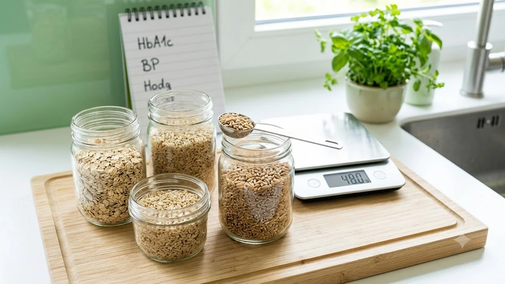

매일 삼시 세끼 먹는 밥공기에서 정제 탄수화물을 덜어내고 **통곡물 48g 식단**을 채우는 것만으로도 혈관과 허리둘레에 뚜렷한 반전이 일어납니다. 평소 대사증후군 위험을 낮추기 위해 [당뇨 전단계 식단 핵심 가이드 3가지](/posts/health/young-prediabetes-diet-prevention-2026/)를 실천하려 애썼지만 극단적인 식단 제한에 번번이 실패했다면, 먹는 종류를 완전히 바꾸기보다 정량의 통곡물을 더하는 접근법이 훨씬 실질적입니다.

## 통곡물 하루 48g이 만든 대사 지표의 반전

### 87개 임상시험 메타분석이 증명한 변화
이란 타브리즈 의과대학 연구팀이 발표한 대규모 메타분석 결과에 따르면, 총 87건의 무작위 배정 임상시험을 종합 분석했을 때 일상 식단에 하루 48g의 통곡물을 꾸준히 추가한 집단은 대조군 대비 허리둘레와 체질량지수(BMI)가 뚜렷하게 줄어들었습니다. 단순 체중 감량을 넘어 수축기·이완기 혈압이 동반 강하하고, 공복 혈당과 인슐린 저항성 지표가 안정권으로 진입하는 경향을 나타냈습니다.

### 체중과 허리둘레를 줄이는 통곡물 섭취량의 기준
하루 48g이라는 수치는 밥숟가락으로 환산하면 대략 3~4스푼, 일반적인 오트밀이나 잡곡 1회 제공량(약 16g) 기준 3회 분량에 해당합니다. 
* 섭취량이 지나치게 적으면 식이섬유와 파이토케미컬의 유효 농도에 도달하지 못합니다.
* 무작정 통곡물 비중만 늘리면 위장관 내 가스 생성과 복부 팽만감을 부를 수 있습니다.
* 연구진이 제안하는 48g은 소화기에 무리를 주지 않으면서 내장지방 분해 호르몬 분비를 자극하는 최적의 역치입니다.

### 백미·정제 탄수화물 식단과의 대사 반응 차이
정제 백미는 도정 과정에서 겨층과 배아가 제거되어 섭취 직후 포도당으로 빠르게 분해됩니다. 반면 통곡물은 외피의 불용성 섬유질 덕분에 소화 효소의 접근 속도가 완만합니다. 식후 인슐린이 폭발적으로 분비되는 사태를 차단하므로, 간에서 잉여 당류가 중성지방으로 합성되는 경로 자체를 틀어막습니다.

## 혈관과 인슐린을 살리는 3대 핵심 기전

### 식후 급격한 혈당 스파이크 억제 원리
통곡물에 함유된 수용성 식이섬유는 위장 안에서 수분을 흡수해 젤 형태로 변합니다. 이 젤 장벽은 장 점막에서 단당류의 흡수 속도를 지연시켜 식후 혈당 곡선의 정점을 낮춥니다. 인슐린 낭비를 막아 췌장 베타세포의 피로도를 낮추고, 가짜 식욕을 부르는 혈당 롤러코스터를 멈추는 핵심 열쇠입니다.

### 나쁜 LDL 콜레스테롤과 중성지방 배출 메커니즘
통곡물 속 베타글루칸 성분은 소장에서 담즙산을 흡착해 체외로 배출시킵니다.
> 간은 손실된 담즙산을 새로 만들기 위해 혈중 순환 중인 나쁜(LDL) 콜레스테롤을 원료로 끌어다 씁니다. 결과적으로 혈액 내 끈적한 지질 입자가 자연스럽게 줄어들고 혈관 내피 손상 위험이 억제됩니다.

### 혈관 탄력성을 회복시키는 단쇄지방산의 작용
대장까지 도달한 난소화성 전분은 장내 미생물의 먹이가 되어 아세트산, 프로피온산, 부티르산 같은 단쇄지방산(SCFA)을 다량 만들어냅니다. 이 대사 물질들은 장벽 누수를 방지하고 전신 염증 수치를 낮추며, 혈관 내피세포의 산화질소 생성을 촉진해 뻣뻣해진 혈관벽을 부드럽게 이완시킵니다.

## 나에게 맞는 최적의 통곡물 조합 찾기

### 귀리·오트밀 vs 현미·카무트 영양 성분 분석
* **귀리(오트밀):** 베타글루칸 함량이 독보적이라 공복 혈당과 혈중 지질 개선에 직효를 보입니다.
* **현미:** 가바(GABA) 성분이 풍부해 자율신경 안정과 혈압 관리에 유리하지만 피틴산으로 인해 미네랄 흡수가 다소 저해될 수 있습니다.
* **카무트(호라산밀):** 셀레늄과 단백질 밀도가 높아 항산화 효과가 뛰어나며 씹는 질감이 탄탄해 천천히 먹는 습관을 유도합니다.

### 소화 흡수율과 포만감 기준 곡물 선택 가이드
평소 위장이 차고 소화력이 약하다면 압착 귀리를 불려 따뜻하게 조리한 오트밀 죽 형태로 시작하는 편이 안전합니다. 반대로 식후 헛헛함을 자주 느끼는 편이라면 찰기가 적고 씹는 횟수를 강제하는 카무트나 메밀 통곡을 백미에 섞어 저작 시간을 늘리는 구성이 식사 만족도를 높입니다.

### 위장 장애를 예방하는 정제 곡물 대비 섭취 주의점
정제 곡물에 길들여진 장내 환경에 갑자기 통곡물 48g을 쏟아부으면 복통이나 묽은 변을 볼 수 있습니다. 처음 일주일은 백미 밥에 15~20g 수준으로 섞어 시작하고, 물 섭취량을 평소보다 하루 300~500ml가량 늘려 식이섬유가 장내 수분을 지나치게 빨아들여 생기는 변비를 막아야 합니다.

## 실패 없는 하루 48g 통곡물 실전 식단 루틴

### 아침 퀵 오트밀과 점심 귀리 혼합밥 구성법
바쁜 평일 아침에는 롤드 오트 30g에 무가당 두유를 붓고 전자레인지에 1분 30초 데운 뒤 아몬드 몇 알을 곁들입니다. 점심에는 회사 도시락이나 구내식당 밥에 현미·귀리가 섞인 잡곡밥을 선택해 나머지 18g가량을 채우면 오전 업무 집중도 유지와 오후 식곤증 예방을 동시에 잡을 수 있습니다.

### 외식 및 배달 음식에서 통곡물 방어 전략
외식 메뉴를 완전히 통제하기 어려울 때는 휴대용 통곡물 팩이나 볶은 통메밀 스틱을 챙겨 식사 10분 전 물과 함께 섭취합니다. 뱃속에 미리 식이섬유 그물망을 깔아두면 기름진 외식 메뉴나 단짠 양념이 흡수되는 속도를 늦춰 혈당 급상승 충격을 덜어냅니다.

### 지속 가능한 습관을 만드는 계량 팁
주방 저울로 매번 무게를 달 필요 없이 흔히 쓰는 종이컵이나 밥숟가락 기준을 외워두면 간편합니다. 
* 깎은 밥숟가락 기준으로 오트밀은 약 4스푼, 생현미나 볶은 귀리는 약 3스푼이 48g 안팎입니다. 
* 주말에 3일 치 분량을 밀폐용기에 미리 덜어두면 바쁜 출근길에도 고민 없이 한 통씩 꺼내 식사에 바로 투입할 수 있습니다.

[통곡물 전용 귀리·잡곡 상품 쿠팡에서 보기](https://www.coupang.com/np/search?q=%ED%86%B5%EA%B3%A1%EB%AC%BC%20%EA%B7%80%EB%A6%AC&sourceType=affiliate&trackingCode=AF8691300)

#통곡물식단 #혈당관리 #대사증후군 #귀리효능 #식이섬유식단 #콜레스테롤개선 #내장지방감소