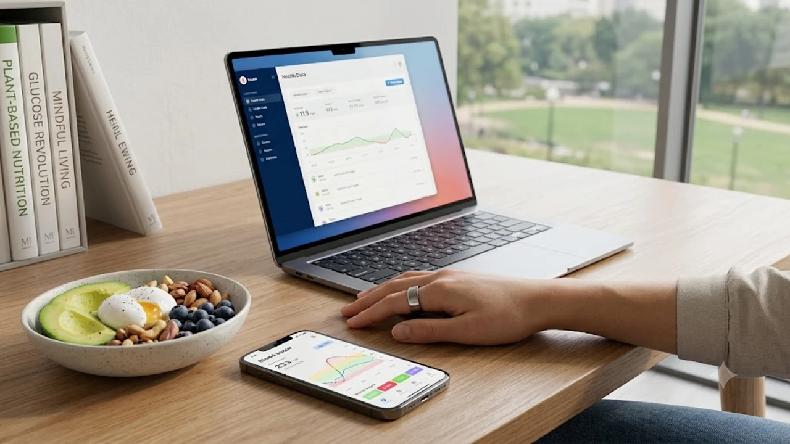

건강검진 통보서에서 공복혈당 수치가 100~125mg/dL 사이를 찍어 당황한 2030 청년들이 눈에 띄게 늘었습니다. 최근 방송에서 유명인이 고백해 화제가 된 당뇨 전단계는 겉으로 드러나는 통증이 없어 방심하기 쉬우나, 제대로 짠 **당뇨 전단계 식단**과 식사 순서만 바꿔도 췌장 기능을 정상으로 되돌릴 수 있는 결정적 골든타임입니다. 혈당 롤러코스터를 멈추고 인슐린 감수성을 살리는 현실적인 밥상 관리법을 모았습니다.

## 2030 청년층을 위협하는 당뇨병 전단계의 실체

### 침묵의 살인자 공복혈당장애와 내당능장애
대한당뇨병학회의 'Diabetes Fact Sheet' 통계를 보면 19~39세 청년 5명 중 1명이 당뇨병 전단계에 걸쳐 있습니다.

- **공복혈당장애**: 8시간 공복 후 측정한 수치가 100~125mg/dL 사이
- **내당능장애**: 75g 포도당 섭취 2시간 뒤 측정한 혈당이 140~199mg/dL 사이
- **당화혈색소(HbA1c)**: 3개월 평균 혈당 척도가 5.7~6.4% 구간

청년층 태반이 젊음만 믿고 검사를 건너뛰지만, 이 구간에 진입한 순간 췌장 속 인슐린 분비 세포(베타세포) 기능은 이미 절반가량 손상된 상태입니다. 

### 마른 비만과 잦은 액상과당 섭취의 덫
팔다리는 가는데 배만 볼록 나온 '마른 비만' 체형은 근육량이 적어 혈액 속 당분을 처리하는 스펀지 구실을 못 합니다. 탕후루, 버블티, 달달한 바닐라 라떼에 든 액상과당은 소화 과정 없이 간으로 직행해 지방간을 만들고 인슐린 신호 체계를 순식간에 망가뜨립니다. 배달 음식 특유의 설탕·물엿 범벅 소스와 야식 습관이 겹치면 아침 공복혈당은 속절없이 치솟습니다.

### 초기 신호 식곤증과 잦은 피로감
자각 증상이 없다는 통념과 달리 몸은 끊임없이 신호를 보냅니다.
> 밥을 먹고 1~2시간 뒤 머리가 멍해지며 눈꺼풀이 무겁게 가라앉는다면 단순한 졸림이 아니라 급상승한 혈당을 잡으려 인슐린이 과다 분비되며 일어나는 급격한 저혈당(혈당 롤러코스터) 증상입니다. 물을 평소보다 유독 많이 들이켜거나 야간뇨가 잦아졌다면 대사 이상을 의심해야 합니다.

## 식단 구성의 절대 원칙 채·단·탄 순서

### 식이섬유로 혈당 방어벽 쌓기
수저를 들었을 때 입에 넣는 첫 술이 식후 혈당 곡선의 높이를 결정합니다. 식판에서 가장 먼저 손을 뻗을 대상은 **식이섬유(채소·해조류)**입니다.
- 양배추 쌈, 데친 브로콜리, 파프리카 같은 생채소를 밥 먹기 전 5분 동안 꼭꼭 씹어 넘깁니다.
- 위벽에 달라붙은 섬유질 그물망은 탄수화물이 포도당으로 쪼개져 핏속으로 쏟아지는 속도를 늦춰줍니다.
- 미역과 다시마의 끈적끈적한 알긴산은 위 배출 시간을 늦춰 포만감을 서너 시간 이상 이어지게 돕습니다.

### 근육 유지와 혈당 안정을 돕는 단백질·지방
채소를 비운 다음엔 **단백질과 질 좋은 불포화지방**으로 포만감을 채웁니다. 단백질은 혈당을 직접 자극하지 않으면서 췌장의 완충 역할을 해줍니다.
- 찐 달걀, 부친 두부, 닭안심, 고등어구이, 기름기 적은 소 우둔살이 훌륭한 선택지입니다.
- 올리브유를 두른 샐러드나 호두·아몬드 한 줌을 곁들이면 지방 성분이 위장관 운동을 조절해 급격한 당 흡수를 틀어막습니다.

### 정제 탄수화물 줄이고 통곡물로 전환
식사의 맨 마지막 순서에 비로소 **복합 탄수화물**을 떠먹습니다. 이미 앞선 단계에서 배가 반 이상 차 있기 때문에 밥그릇을 굳이 다 비우지 않아도 허기가 지지 않습니다.
- 백미밥, 밀가루 면, 떡 대신 귀리, 현미, 파로, 렌틸콩을 섞은 잡곡밥을 식단 기본형으로 삼습니다.
- 탄수화물 1회 섭취 분량은 본인 주먹 크기(공깃밥 2/3 수준)를 넘지 않도록 제한합니다.

## 혈당 스파이크를 막는 실전 생활 습관

### 식후 15분 가벼운 걷기의 마법
식사를 마치자마자 의자에 기대앉거나 소파에 눕는 습관은 혈당을 체지방으로 굳히는 지름길입니다. 수저를 내려놓은 직후 15~30분간 제자리걸음이나 동네 산책을 하면 허벅지와 엉덩이 근육이 인슐린 도움 없이도 핏속 포도당을 바로 끌어다 땔감으로 태웁니다.

식사 순서 교정과 더불어 인슐린 저항성을 빠르게 낮추고 심폐 효율을 끌어올리고 싶다면 [존2 유산소 운동법, 진짜 살 빠질까?](/posts/health/zone-2-cardio-fat-burn-routine-2026/)를 주 3회 곁들이는 조합이 효과적입니다.

### 연속혈당측정기(CGM) 활용한 맞춤형 음식 찾기
사람마다 혈당을 치솟게 만드는 유발 식품은 제각각입니다. 누구에게는 바나나가 무난하지만, 누군가에게는 고구마 반 개만으로도 혈당이 180mg/dL을 뚫고 올라갑니다. 2주가량 팔뚝에 연속혈당센서를 붙이고 식사 일기를 써보면 내 췌장이 유독 버거워하는 위험 식단을 족집게처럼 가려낼 수 있습니다.

### 충분한 수면과 스트레스 호르몬 조절
잠을 설치면 코르티솔 분비량이 널을 뛰면서 간에 저장된 당을 혈관으로 쏟아냅니다. 밤샘이나 불규칙한 수면이 사흘만 이어져도 세포의 인슐린 수용체 반응성은 평소보다 20% 이상 둔해집니다. 밤 12시 이전 취침과 하루 7시간 수면 확보는 식단표를 지키는 것만큼이나 공복혈당 수치 안정에 직결됩니다.

## 4주 만에 공복혈당 잡는 실전 루틴

### 주간 식단표와 저당 식자재 구성 팁
아침을 굶어 점심 폭식으로 이어지면 혈당 변동 폭이 극대화됩니다. 손이 많이 가지 않는 담백한 저당 구성이 꾸준함의 핵심입니다.

- **아침**: 무가당 그릭요거트 + 블루베리 10알 + 삶은 달걀 2개
- **점심**: 쌈채소 듬뿍 + 잡곡밥 1/2공기 + 닭가슴살구이나 제육볶음(설탕 배제)
- **저녁**: 구운 채소 샐러드 + 부침 두부 1/2모 + 흰살생선구이

장을 볼 때는 영양성분표에서 '총 당류' 숫자를 점검해 1회 제공량 기준 5g 이하인 식재료 위주로 바구니를 채웁니다.

### 외식 및 배달음식 주문 시 대체 전략
약속이나 회식 자리에서도 몇 가지 원칙만 세우면 무너지지 않습니다.
- 중식당에서는 짬뽕이나 짜장면 면발 대신 잡채밥의 당면과 밥을 반만 덜어내고 채소 위주로 건져 먹습니다.
- 양식당에서는 설탕이 들어간 토마토·크림 파스타를 피하고 목살 스테이크나 리코타 치즈 샐러드를 택합니다.
- 패스트푸드점에 들를 때는 세트 메뉴의 감자튀김을 코울슬로로 바꾸고 음료는 탄산수나 제로 음료로 대체합니다.

[혈당측정기 쿠팡에서 보기](https://www.coupang.com/np/search?q=%ED%98%88%EB%8B%B9%EC%B8%A1%EC%A0%95%EA%B8%B0&sourceType=affiliate&trackingCode=AF8691300)

#당뇨전단계식단 #공복혈당낮추기 #혈당스파이크 #2030청년당뇨 #인슐린저항성 #혈당관리식단 #식사순서법 #내당능장애