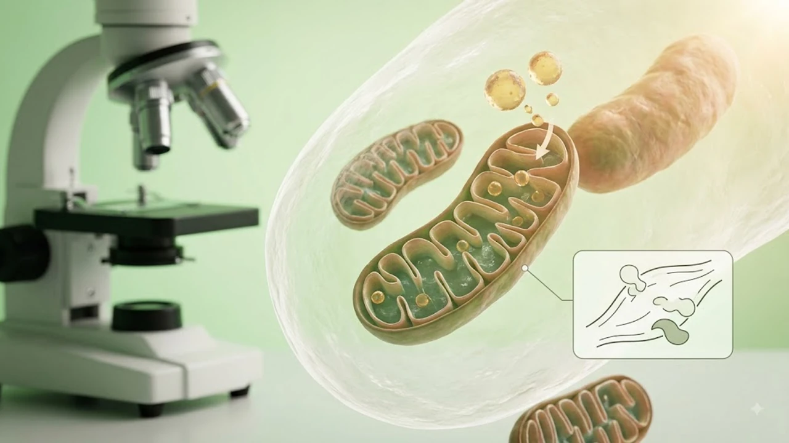

숨이 턱 끝까지 차오르도록 달려야만 지방이 탄다고 믿는 사람이 많습니다. 하지만 최근 운동 생리학계와 러너들 사이에서는 대화가 가능한 강도를 유지하는 **존2 유산소** 트레이닝이 체지방 연소와 기초 대사 효율을 극대화하는 최적의 심폐 훈련법으로 꼽힙니다. 젖산 축적을 억제하면서 미토콘드리아의 지방 대사 능력을 끌어올리는 원리를 파악하면 무작정 지치는 운동에서 벗어날 수 있습니다.

## 젖산 역치 직전에서 일어나는 지방 대사의 비밀

### 탄수화물 대신 지방을 주 연료로 쓰는 구간
우리 몸은 운동 강도에 따라 주 에너지원을 바꿉니다. 고강도 인터벌 트레이닝 구간에서는 빠른 에너지 공급을 위해 탄수화물(포도당)을 주로 태우지만, 최대 심박수의 60~70% 수준인 존2 영역에서는 체내 지방산 산화 비율이 최고점에 도달합니다. 숨이 차서 말을 잇지 못하는 순간, 몸은 이미 지방 연소를 멈추고 당분을 분해해 젖산을 쌓기 시작합니다.

### 세포 내 발전소 미토콘드리아의 증식
존2 트레이닝의 핵심 가치는 단순 칼로리 소모를 넘어 미토콘드리아의 크기와 개수를 늘리는 데 있습니다. 지속적인 저강도 자극은 근육 세포 내 미토콘드리아 막을 강화하고 산소 공급 능력을 키웁니다. 이는 평상시 가만히 쉬고 있을 때조차 기초 대사로 소모하는 지방량을 늘려 살이 잘 찌지 않는 체질로 바꾸는 결정적 계기가 됩니다.

### 피로 누적 없는 빠른 회복력
고강도 무산소성 운동은 코르티솔 수치를 급격히 높이고 중추신경계 피로를 유발해 회복에 최소 48시간 이상이 걸립니다. 반면 존2는 젖산 축적량(1.5~2.0 mmol/L 이하)이 극히 적어 관절이나 근육 손상 위험이 현저히 낮습니다. 매일 또는 주 4~5회 이상 꾸준히 이어갈 수 있는 지속성이야말로 장기적인 감량 성공을 결정짓습니다.

## 내 몸에 딱 맞는 존2 심박수 정밀 계산법

### 카르보넨 공식으로 산출하는 목표 심박수
단순히 `220 - 나이`로 최대 심박수를 계산하는 방식은 개인별 안정 시 심박수를 반영하지 못해 오차가 큽니다. 여유 심박수(HRR)를 활용한 카르보넨(Karvonen) 공식을 쓰면 훨씬 정밀합니다.

> **존2 목표 심박수 산출 공식:**  
> `(최대 심박수 - 안정 시 심박수) × 0.6~0.7 + 안정 시 심박수`

*예시:* 40세 성인 기준(최대 심박수 180, 안정 시 심박수 60bpm):
- 하한선: `(180 - 60) × 0.6 + 60 = 132 bpm`
- 상한선: `(180 - 60) × 0.7 + 60 = 144 bpm`

정확한 심박수를 실시간으로 확인하며 구간을 유지하려면 웨어러블 기기 세팅이 필수적입니다. 페이스 조절과 심박존 설정에 관한 구체적인 팁은 [2026 스마트워치 운동 진짜 효과 보는 법](/posts/health/wearable-data-smart-pacing-fitness-2026/)을 함께 참고하면 좋습니다.

### 기기 없이 체감하는 토크 테스트(Talk Test)
스마트워치가 없더라도 호흡 상태만으로 존2 영역을 판별할 수 있습니다. 콧노래를 흥얼거리기는 어렵지만, 옆 사람과 완전한 문장으로 끊김 없이 대화를 나눌 수 있는 수준이어야 합니다. 

- **정상 존2 상태:** "오늘 날씨가 꽤 선선해서 뛸 만하네"처럼 문장을 온전히 말할 수 있음
- **존3 초과 상태:** 몇 마디 하다가 숨을 들이마시기 위해 말을 끊어야 하는 상태 (강도 하향 필요)

## 초보자를 위한 주간 실전 루틴 구성

### 주 3~4회, 회당 45분~60분 기준 설계
존2 효과는 최소 30분 이상 지속했을 때 본격적으로 발현됩니다. 초기 15~20분 동안은 근육 내 글리코겐이 함께 연소되다가, 30분을 넘어서면서 지방 산화 효율이 급격히 치솟기 때문입니다.

- **1~2주차 (적응기):** 주 3회 / 회당 35분 / 빠른 걷기 또는 가벼운 조깅
- **3~4주차 (안정기):** 주 4회 / 회당 45분 / 경사도 트레드밀 걷기, 실내 자전거
- **5주차 이후 (확장기):** 주 4~5회 / 회당 60분 / 러닝 및 야외 사이클링 혼합

### 실내 머신별 최적의 세팅값
야외 러닝 시 페이스 조절이 어렵다면 실내 기구를 활용해 일정한 심박수를 강제 유지하는 편이 유리합니다.

- **트레드밀 인클라인 걷기:** 속도 4.5~5.5km/h, 경사도 4~7% 설정 (무릎 부담을 줄이며 심박수를 일정하게 올리는 방법)
- **실내 사이클:** 케이던스(분당 회전수) 75~85 RPM 유지, 저항은 가볍게 설정
- **스텝퍼/천국의 계단:** 최저 속도에서 시작해 심박수가 존2 상한선을 넘지 않도록 속도 고정

## 흔히 저지르는 3가지 치명적 실수와 해결책

### 너무 빨리 뛰어 존3로 넘어가는 오류
가장 흔한 실수는 "이렇게 느리게 뛰어서 운동이 될까?"라는 조급함에 페이스를 올리는 행위입니다. 조금만 속도를 높여도 심박수는 존3(무산소 역치 접근)로 진입하며, 이때부터 지방 연소율은 급락하고 피로 물질이 쌓입니다. 존2 트레이닝의 성패는 **철저하게 느린 속도를 견뎌내는 자제력**에 달려 있습니다.

### 수분과 전해질 보충 소홀
저강도 운동이라도 45분 이상 지속하면 체온 조절을 위해 땀으로 상당량의 수분과 나트륨이 배출됩니다. 탈수가 발생하면 혈액량이 줄어 심장이 더 빠르게 뛰게 되고, 같은 속도에서도 심박수가 존3 이상으로 튀는 **심박수 드리프트(Cardiac Drift)** 현상이 일어납니다. 15~20분 간격으로 소량씩 미온수를 섭취해야 합니다.

### 고강도 무산소 운동과의 균형 실패
존2 유산소가 지방 감량과 심폐 지구력의 든든한 밑바탕을 만들지만, 근손실 방지와 성장호르몬 분비를 위해서는 주 2회의 근력 운동(웨이트 트레이닝)이나 주 1회의 고강도 인터벌 세션을 병행해야 신체 대사 밸런스가 완성됩니다.

#존2유산소 #유산소운동법 #체지방연소 #심박수계산법 #카르보넨공식 #러닝루틴 #미토콘드리아 #지방대사