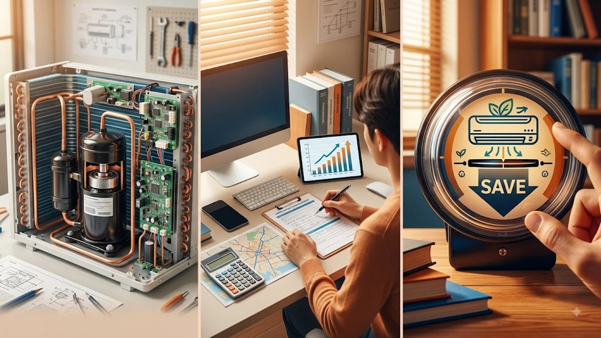

8월 중순을 넘어서도 꺾이지 않는 폭염 탓에 에어컨 리모컨을 내려놓지 못하는 가정이 늘면서 **늦더위 전기요금 절약 3가지** 실전 팁이 주목받고 있습니다. 누진 구간 상단에 진입해 고지서 폭탄을 맞지 않으려면 무조건 참기보다 냉방 장치의 메커니즘을 꿰뚫고 새나가는 전력을 잡아야 합니다. 실제 계량기 수치를 떨어뜨리는 구체적인 설정법과 제도를 정리했습니다.

## 인버터 에어컨의 압축기 작동 원리와 가동법

### 정속형과 인버터형의 구동 차이
최근 10여 년간 보급된 제품은 대부분 실내 온도에 맞춰 실외기 모터 속도를 유연하게 조절하는 **인버터 컴프레서 방식**입니다. 목표 온도에 도달하면 최소한의 전력만 쓰며 냉기를 유지하므로, 춥다고 껐다가 더워지면 다시 켜는 식의 작동은 매번 모터를 최대 출력으로 몰아붙여 전기 소모를 키웁니다.

- **인버터형**: 목표 온도 안착 후 최저 전력 유지 (장시간 연속 운전 유리)
- **정속형**: 가동 내내 실외기가 100% 전출력 회전 (목표 도달 시 수동 차단 유리)

### 초기 강풍 가동 후 26도 안착
처음 가동할 때 바람세기를 최대로 올려 실내 열기를 빠르게 밀어내는 편이 누적 전력 면에서 유리합니다. 실내 온도가 26도 안팎에 도달했을 때 자동 풍량으로 전환하면 압축기 부하가 급감하면서 소비전력이 정격 출력의 20~30% 수준으로 떨어집니다.

### 서큘레이터 대각선 배치를 통한 냉기 순환
에어컨 송풍구 앞이나 대각선 맞은편에 공기순환기를 두고 45도 상향 각도로 쏘아주면 바닥에 머물던 냉기가 천장까지 빠르게 섞입니다. 공기 대류가 활발해지면 체감 온도가 1~2도 낮아져 에어컨 설정 온도를 무리하게 23~24도로 낮추지 않고도 쾌적함을 유지합니다.

## 한국전력 한전 에너지캐시백 제도의 신청과 환급 기준

### 전년 동월 대비 절감률 산정 구조
한국전력공사의 **한전 에너지캐시백**은 직전 2개년 동일 월 평균 사용량과 비교해 최소 3% 이상 전기를 줄였을 때 차등 지급하는 제도입니다. 절감 구간에 따라 다음 달 전기요금 청구서에서 직접 차감되는 직관적인 감면 방식을 취합니다.

> **절감률 구간별 환급 단가 기준 (한전 공시)**
> - 3% 이상 5% 미만: 1kWh당 30원
> - 5% 이상 10% 미만: 1kWh당 70원
> - 10% 이상 30% 이하: 1kWh당 100원

### 온라인 간편 신청 절차와 주의사항
'한전ON' 포털이나 모바일 앱에서 세대주 또는 세대원이 본인 인증을 마치면 바로 등록됩니다. 다만 아파트 단지의 경우 관리사무소가 한전과 맺은 계약이 종합계약인지 개별 세대 단일계약인지에 따라 신청 창구가 갈리므로 거주지 계약 형태를 먼저 확인할 필요가 있습니다.

## 스마트 플러그와 타이머를 이용한 대기전력 차단

### 숨은 전력 누수원과 셋톱박스 관리
가전제품 전원을 꺼두어도 콘센트에 연결된 플러그에서 줄줄 새는 대기전력은 가정 총 소비량의 상당 부분을 갉아먹습니다. TV 본체는 대기전력이 미미하지만 셋톱박스는 켜져 있을 때와 맞먹는 전력을 24시간 내내 소모하므로 취침 시 전원 차단이 효과적입니다.

- **셋톱박스**: 대기 상태에서도 10~15W 상시 소모 (방치 시 연간 불필요한 누수 발생)
- **인터넷 공유기 및 오디오 앰프**: 상시 전력 소모 가전

### 자동 스케줄링을 활용한 스마트 홈 루틴
스마트 플러그를 활용해 새벽 1시부터 6시까지 심야 시간대 비필수 기기 전원을 원천 차단하는 스케줄을 걸어두면 손쉽게 전력 누수를 막습니다. 자동화 기술로 생활의 편리함을 챙기는 것은 합리적인 선택이지만, 기술에 대한 맹목적 의존과 인간 주체성에 대해 돌아보고 싶다면 [제로 클릭 2026, 내 자유의지는 진짜 살아있을까?](/posts/humanities/zero-click-era-autonomy-2026/) 글도 함께 읽어볼 만합니다.

## 실외기실 열기 배출과 필터 세척 루틴

### 실외기실 루버셔터 개방 각도와 공기 순환
실외기는 실내에서 흡수한 열기를 외부로 방출하는 핵심 설비입니다. 아파트 실외기실의 루버셔터가 지면과 수평(90도)으로 활짝 열려 있지 않거나 후면에 물건이 쌓여 있으면 열 방출이 막혀 냉방 효율이 급락합니다. 이는 실외기 과열을 초래해 콤프레셔 수명을 갉아먹는 주원인입니다.

- 루버셔터 날개를 90도 수평으로 완전 개방
- 실외기 주변 50cm 반경 내 적치물 전면 제거
- 실외기 상판에 은박 차광막을 부착해 직사광선 차단

### 2주 주기 극세사 필터 세척 효과
실내기 흡입구의 프리필터에 먼지가 엉겨 붙으면 공기 유입 저항이 커져 송풍팬 모터의 전력 소모량이 급증합니다. 2주에 한 번 미온수에 중성세제를 풀어 솔로 살살 문질러 씻어낸 뒤 그늘에서 바짝 말려 장착하면 냉방 효율이 온전히 회복됩니다.

#늦더위에어컨 #전기요금절약 #한전에너지캐시백 #인버터에어컨작동법 #실외기열기배출 #스마트플러그활용 #전기세누진구간 #누진세절감