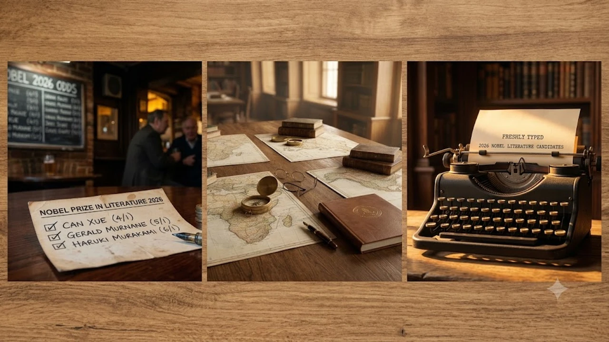

매년 가을 전 세계 문학계의 시선이 집중되는 2026 노벨문학상 발표 시기가 다가오면서 유력 후보와 배당률 순위에 관한 관심이 최고조에 달하고 있습니다. 스웨덴 아카데미가 지향하는 문학적 깊이와 시대정신을 담아낸 유력 작가군이 베팅 사이트 나이서오즈(Nicer Odds)와 래드브록스(Ladbrokes)를 중심으로 윤곽을 드러내는 중입니다. 순수 문학의 거장부터 대중적 파급력을 지닌 스토리텔러까지 각축전을 벌이는 가운데 올해의 수상 향방을 가를 핵심 기준을 정리했습니다.

## 베팅 사이트 배당률로 읽는 유력 후보군 지형도

### 영미권 베팅 마켓의 초기 예측 데이터
해외 주요 베팅 플랫폼에서는 수년 전부터 상위권을 유지해 온 단골 후보들이 여전히 강세를 보이고 있습니다. 배당률 수치는 대중의 선호도와 유럽 현지 평론가들의 관측이 결합된 직관적인 지표입니다.

- **찬쉐 (Can Xue)**: 특유의 초현실주의적 서사 구조를 앞세워 수년째 최상위권 배당률을 점유
- **제럴드 머네인 (Gerald Murnane)**: '호주 문학의 비밀'로 통하며 기억과 공간에 대한 집요한 탐구를 이어온 거장
- **토마스 핀천 계열**: 전통적인 미국 현대문학 진영의 숨은 강자들 역시 꾸준한 배당률을 방어

### 아시아 문학계의 지속적인 주목도
동아시아 문학은 최근 몇 년간 글로벌 번역 프로젝트 지원을 등에 업고 입지를 단단히 굳혔습니다. 서구권 중심의 세계관을 깨부수는 탈중심적 서사가 힘을 얻는 추세입니다.

- 중국의 찬쉐 외에도 옌롄커(Yan Lianke)가 신화적 리얼리즘을 바탕으로 높은 순위에 랭크
- 일본의 무라카미 하루키(Murakami Haruki)는 여전히 전 세계 독자층의 전폭적인 지지를 받으며 상위 후보군에 포진

### 유럽 대륙의 전통 강호와 다크호스
유럽 순수 문학 진영에서는 모국어의 한계를 실험하는 작가들이 리스트 전면에 포진해 있습니다.

- 프랑스의 미셸 우엘베크(Michel Houellebecq)는 서구 문명의 균열을 날카롭게 포착하며 논쟁의 중심에 위치
- 루마니아의 미르체아 커르터레스쿠(Mircea Cărtărescu)는 압도적인 환상 문학의 깊이를 증명하며 평단의 탄탄한 지지를 확보

## 스웨덴 아카데미의 심사 기조와 대륙별 안배

### 대륙과 언어권의 순환 배치 메커니즘
스웨덴 아카데미는 공식적으로 지역 안배를 부인하지만, 역대 수상 기록을 살펴보면 지리적 균형 감각이 뚜렷하게 드러납니다. 동일 대륙이나 동일 언어권이 2년 연속으로 호명된 사례는 손에 꼽힙니다.

> "노벨문학상은 개별 작가의 문학적 성취를 기리는 상이지만, 세계 문학의 지평을 넓혀온 역사적 궤적과 궤를 같이한다."

- 탈서구 중심주의: 아프리카, 아시아, 라틴아메리카 작가들에 대한 조명 작업 가속화
- 번역 완성도: 스웨덴어 및 영어로 텍스트의 결이 온전히 번역되어 심사위원단 서재에 닿았는지가 실질적인 분수령

### 젠더 다양성과 소수자 목소리의 반영
최근 10년간의 결과는 여성 작가와 소수자 정체성을 다룬 텍스트를 향한 시선이 매우 정교해졌음을 보여줍니다.

- 백인 남성 중심의 서구 정전(Canon)에서 벗어난 문학적 지평 확장
- 식민지 역사, 이주민의 고단한 삶, 억압받는 여성의 현실을 예술적으로 승화한 작가군에 높은 가산점 부여

### 장르와 매체 경계를 허무는 파격
전통 장편소설에만 갇히지 않고 시, 희곡, 르포르타주까지 끌어안는 포용성은 아카데미 고유의 색채입니다.

- 다큐멘터리 문학(스베틀라나 알렉시예비치), 대중음악 가사(밥 딜런)의 전례
- 그래픽 노블이나 희곡 중심 작가의 깜짝 수상 가능성 역시 열려 있는 배경

## 2026년 주목해야 할 핵심 작가 3인의 작품 세계

### 찬쉐의 초현실주의와 내면 탐구
찬쉐는 현실과 환상의 경계를 해체하며 독보적인 영토를 개척한 작가입니다. 외부 환경의 억압을 앙상하게 고발하기보다, 인간 무의식과 원초적 공포를 기괴하고 아름다운 문체로 건져 올립니다.

- 대표작: *오향거리*, *마지막 연인*
- 문학적 색채: 카프카적 악몽과 중국 고유의 민담 상상력이 결합된 전위적 서사

### 제럴드 머네인의 고립과 사유의 미학
호주 멜버른 외곽을 거의 벗어나지 않고 평생 글을 지어온 은둔 작가 제럴드 머네인은 언어 자체의 투명성을 끝없이 실험합니다. 바깥 세계와의 단절 속에서 기억과 풍경의 이미지를 세공하듯 조탁합니다.

- 대표작: *평원*, *국경 지구*
- 문학적 색채: 극단적인 절제미와 사유의 엄밀성을 통해 언어가 포착할 수 있는 지각의 한계를 시험

### 응구기 와 시옹오의 탈식민주의 문학
케냐 출신의 응구기 와 시옹오는 아프리카 탈식민주의 문학의 살아있는 상징입니다. 지배자의 언어인 영어를 내려놓고 모국어 기쿠유어로 창작을 이어가며 언어 독립과 민족 정체성 회복을 온몸으로 실천해 왔습니다.

- 대표작: *피의 꽃잎들*, *탈식민화와 언어*
- 문학적 색채: 제국주의의 상흔과 독재 권력에 맞서는 치열한 저항 정신

## 문학적 깊이를 더하는 독서와 수상 발표 관전법

### 수상자 발표 일정과 확인 채널
스웨덴 아카데미는 매년 10월 첫째 주 혹은 둘째 주 목요일 한국 시간 오후 8시에 수상자를 공표합니다.

- 공식 홈페이지(Nobelprize.org) 유튜브 라이브 스트리밍을 통한 실시간 중계 확인
- 수상 소감과 함께 발표되는 한 줄 선정 사유(Citation)를 통해 한림원이 던지는 화두 파악
- 발표 직후 국내 출판계의 판권 계약과 긴급 인쇄 동향 확인

### 문학적 사유를 확장하는 도서 선택 기준
세계 문학의 최전선을 체감하려면 배당률 상위 작가들의 대표작을 원작 고유의 호흡대로 읽어내는 시간이 필요합니다. 활자가 주는 묵직한 사유는 정보 과잉 시대에 인간 본연의 주체성을 지켜내는 든든한 버팀목입니다.

문학적 사유와 기술 사회의 변화를 함께 짚어보고 싶다면 [제로 클릭 2026, 내 자유의지는 진짜 살아있을까?](/posts/humanities/zero-click-era-autonomy-2026/) 글에서 다룬 시선도 함께 확인해 보길 권합니다. 좋은 책과 함께 몰입을 돕는 환경을 갖추는 것도 훌륭한 출발점입니다.

[독서용 문구용품 및 북스탠드 쿠팡에서 보기](https://www.coupang.com/np/search?q=%EB%8F%84%EC%84%9C%20%EB%AC%B8%EA%B5%AC%EC%9A%A9%ED%92%88&sourceType=affiliate&trackingCode=AF8691300)

#2026노벨문학상 #노벨문학상후보 #노벨문학상배당률 #찬쉐 #제럴드머네인 #무라카미하루키 #스웨덴아카데미 #세계문학