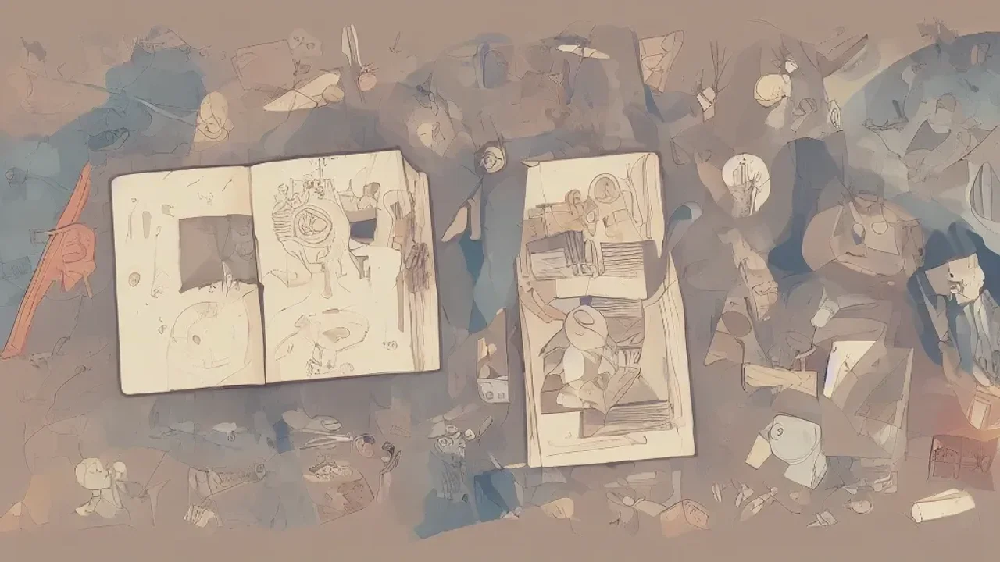
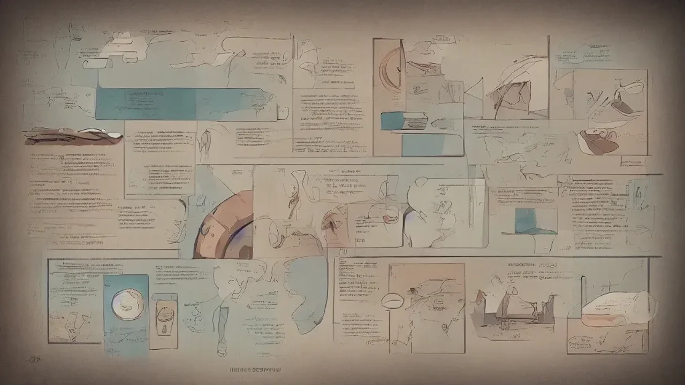

인공지능이 인간 고유 영역이라 여겨졌던 창작과 사유의 영역을 빠르게 점령하면서, 정보 시장은 극심한 텍스트 과잉과 복제의 홍수를 맞이했습니다. 이러한 기술적 변곡점에서 역설적으로 인간 고유의 날것과 원조의 가치를 탐구하는 **근본이즘** 트렌드가 강력한 생존 무기로 부상하고 있습니다. 알고리즘이 짜깁기한 무색취취의 콘텐츠에 피로감을 느낀 대중이 진짜 인간의 숨결이 닿은 오리지널리티에 반응하기 시작한 것입니다.

## AI가 복제 못 하는 근본이즘의 부상 배경

### 생성형 AI 피로감과 원조의 가치
매일 수억 건씩 쏟아지는 AI 생성 콘텐츠는 겉보기엔 완벽하지만, 결국 기존 데이터의 통계적 확률을 조합한 껍데기에 불과합니다. 정보의 희소성이 완전히 사라지자 시장은 다시 복제 불가능한 '최초의 소스'에 주목하기 시작했습니다. 가짜가 정교해질수록 진짜를 향한 대중의 갈망은 깊어집니다. 

### 데이터 학습이 흉내 낼 수 없는 인간의 역사적 맥락
AI는 텍스트를 학습하지만 그 속에 담긴 인간의 고통, 시대적 고뇌, 삶의 궤적까지 체화하지는 못합니다. **근본이즘**의 핵심은 단순한 정보의 습득이 아니라, 그 지식이 탄생하게 된 역사적 맥락과 인간적 서사를 이해하는 데 있습니다. 이것이 바로 기계가 결코 따라잡을 수 없는 인간만의 독점적 영역입니다.

## 인문학에서 말하는 오리지널리티의 장단점

### 깊이 있는 사유와 텍스트 밀도가 주는 뇌 과학적 이점
고전 원전을 직접 읽고 사유하는 과정은 파편화된 디지털 정보를 소비할 때와 전혀 다른 뇌 부위를 자극합니다. 실제 뇌과학 연구에 따르면, 긴 호흡의 오리지널 텍스트를 심층 독해할 때 인간의 뇌는 전두엽의 작업 기억과 비판적 사고 능력을 극대화합니다. 
* **사고의 입체화:** 단편적인 요약본이 주지 못하는 텍스트 맥락의 흐름을 파악
* **문해력의 복원:** 알고리즘이 훼손한 긴 글 읽기 능력의 회복

### 트렌드 변화에 뒤처질 수 있는 고전 탐구의 한계점과 극복법
반면 고전과 역사라는 본질에만 지나치게 몰두할 경우, 빠르게 변하는 현대 사회의 흐름과 동떨어질 위험성이 존재합니다. 강단 학학이나 정통 철학 연구가 대중과 격리되는 현상이 대표적입니다. 이 한계를 극복하려면 옛 선인들의 지혜를 현대의 문제 의식과 연결 짓는 통섭적 시각이 필수적입니다.

> "과거를 기억하지 못하는 자는 그 과거를 되풀이하는 저주를 받는다." - 조지 산타야나

## 마케터와 크리에이터가 근본이즘을 활용하는 방법

### 알고리즘을 이기는 진짜 날것의 스토리텔링 기획법
소비자는 더 이상 완벽하게 정제된 광고에 지갑을 열지 않습니다. 오히려 완벽하지 않더라도 브랜드가 가진 고유한 철학, 창업자의 날것 그대로의 실행 스토리 같은 오리지널리티에 열광합니다. 매끄러운 AI 그래픽보다 거친 아날로그 감성이 섞인 기획이 더 높은 전환율을 기록하는 이유입니다.

### 역사와 고전 철학에서 뽑아낸 콘텐츠가 롱런하는 이유
유행을 타는 휘발성 키워드는 수명이 짧습니다. 반면 인간의 본성을 꿰뚫는 고전 철학이나 역사적 사건을 기반으로 구축한 콘텐츠는 시간이 흐를수록 자산 가치가 상승합니다. 유행에 흔들리지 않는 튼튼한 뿌리를 갖춘 콘텐츠만이 롱런의 기회를 거머쥡니다.

[관련 글 보기](/posts/humanities/)

## 초보자를 위한 인문학적 오리지널리티 강화 튜토리얼

### [1단계] 2차 가공본을 버리고 원전 직접 읽기
유튜브 요약 영상이나 블로그의 짜깁기 글을 소비하는 습관에서 벗어나야 합니다. 얇은 해설서 대신 얇더라도 철학자의 원전이나 가공되지 않은 역사적 사료를 직접 마주하는 훈련이 필요합니다. 처음에는 낯설고 투박하게 느껴지지만, 가공되지 않은 텍스트를 스스로 해석하는 과정에서 비로소 자신만의 관점이 형성됩니다.

### [2단계] AI 프롬프트에 나만의 인문학적 시선과 맥락 주입하기
생성형 AI를 도구로 활용할 때도 인문학적 깊이는 차이를 만들어냅니다. 단순한 명령어 대신, 자신이 고전 독서를 통해 얻은 독창적인 시선과 역사적 배경지식을 프롬프트에 녹여내야 합니다. 도구가 아무리 발전해도 그 도구를 움직이는 방향타는 결국 인간의 사유 깊이에 지배당하기 마련입니다.

### [3단계] 넘쳐나는 정보 속에서 가짜 뉴스와 진짜 지식 구별하는 법
정보의 홍수 속에서 사실(Fact)과 맥락(Context)을 분리하여 정밀하게 교차 검증하는 태도를 기릅니다. 출처가 불분명한 인용구나 가짜 인문학 지식에 현혹되지 않도록, 원전의 출처를 추적하고 비판적으로 사유하는 능력을 체화하는 것이 근본이즘 실천의 완성입니다.

#근본이즘 #인문학트렌드 #AI시대 #오리지널리티 #고전독서 #스토리텔링 #브랜딩전략 #사유의힘 #비판적사고 #2026트렌드