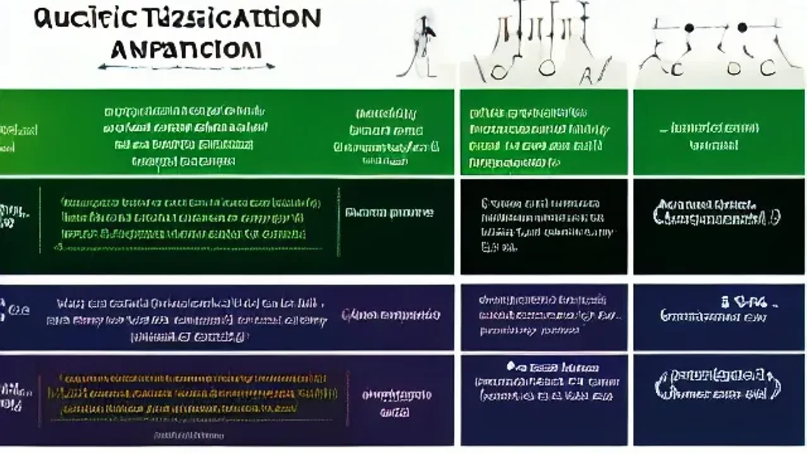

생성형 AI가 쏟아내는 정형화된 텍스트 속에서 단순한 명령어 조합만으로는 더 이상 독창적인 성과를 내기 어렵습니다. 지금 시장에서 요구하는 핵심 역량은 단순히 기술을 다루는 테크닉이 아니라, 본질을 꿰뚫는 **질문의 인문학**적 사고력입니다. 기술 평준화 시대에 대체 불가능한 존재로 살아남기 위해 철학적 사유를 어떻게 AI 프롬프트와 기획에 녹여낼 수 있는지 실무 관점의 생생한 인사이트를 전합니다.

## 코딩하는 AI 위의 철학자: '질문의 인문학'이 진짜 핫한 이유

### 생성형 AI 시대, 왜 기술보다 '질문 능력'이 먼저인가
코딩과 문서 작성, 데이터 분류 같은 실무 영역은 AI가 완벽하게 대체하는 시대가 되었습니다. 기술 장벽이 허물어지면서 역설적으로 '무엇을 만들 것인가', '왜 이 문제가 발생했는가'를 정의하는 능력이 인간의 몸값을 결정합니다. 단단한 인문학적 배경지식을 갖춘 기획자는 AI에게 단순 기능 구현을 넘어, 맥락과 깊이를 가진 고차원적 지시를 내릴 수 있습니다. 명령어 한 줄에 담기는 사유의 깊이가 결과물의 격차를 만듭니다.

### "코드는 AI가, 영혼은 인간이" 테헤란로 스타트업의 철학 열풍
최근 정보기술(IT) 업계와 스타트업 경영자들 사이에서 니체나 칸트 같은 고전 철학 스터디가 붐을 이루고 있습니다. 기술적 완성도는 상용 LLM(대형언어모델)을 통해 누구나 상향 평준화할 수 있기 때문입니다. 제품과 서비스에 차별화된 영혼을 불어넣고 사용자 경험의 본질을 설계하기 위해, 인간의 본질을 탐구해 온 인문학적 접근법을 비즈니스에 강제로 이식하는 시도가 늘어나는 추세입니다.

### 빅테크 기업들이 인문학 전공자를 다시 주목하는 이유
단순히 코드만 잘 짜는 엔지니어보다, 문맥을 이해하고 인간 심리를 읽어내는 인문학적 소양이 결합된 인재의 가치가 급상승했습니다. 생성형 AI가 내놓는 수많은 결과물 중 어떤 것이 인간에게 진정으로 가치 있는지를 판별하는 필터링 능력은 철학적 기준에서 나오기 때문입니다. 데이터 사이의 숨은 의미를 포착하고 사회적 맥락을 읽어내는 능력이 미래 생존을 가르는 핵심 지표로 꼽힙니다.

## 뻔한 프롬프트 vs 철학적 프롬프트: AI 지휘력의 격차

### 단어 몇 개로 끝나는 명령어의 한계와 단점
"블로그 글 써줘", "마케팅 문구 뽑아줘" 같은 단편적인 명령어는 인터넷에 떠도는 뻔한 정보의 무덤을 복제할 뿐입니다. 맥락이 거세된 프롬프트는 영혼 없는 텍스트를 무한 양산하며, 이는 검색 엔진에서도 가치 없는 문서로 분류되어 철저히 외면받습니다. 인간의 깊이 있는 사유 과정이 생략된 인공지능 결과물은 결국 브랜드를 평범하게 만드는 독이 됩니다.

### 칸트의 논리학과 니체의 관점으로 AI에게 지시했을 때의 장점
철학적 프레임을 프롬프트에 주입하면 AI는 완전히 다르게 움직입니다. 예컨대 '칸트의 정언명령 관점에서 이 마케팅 윤리를 분석하라'거나 '니체의 아모르파티 개념을 적용해 실패를 겪는 20대를 위한 카피를 작성하라'고 지시하는 방식입니다. 인문학적 개념을 조건으로 설정하면 AI는 상투적인 답변을 거부하고, 뇌 과학적 자극과 인간 심리의 본질을 찌르는 독창적이고 날카로운 텍스트를 도출합니다.

### 똑같은 LLM을 쓰고도 완전히 다른 아웃풋을 뽑아내는 '기획의 한 끗'
성공적인 프로젝트와 실패하는 프로젝트의 차이는 사용하는 인공지능 툴의 종류가 아니라 기획자의 머릿속에 든 지식의 깊이에서 갈립니다. 역사, 문화, 철학적 레퍼런스를 자유자재로 인용하며 AI의 사유 범위를 강제로 확장하는 기획자는 획일화된 디지털 환경에서 독보적인 존재감을 드러냅니다. 도구를 지휘하는 인간의 교양이 곧 결과물의 퀄리티를 결정짓는 본질입니다.

[관련 글 보기](/posts/humanities/)

## 인문학적 사고로 AI와 협업하여 성과 내는 법

### Step 1. 문제의 본질을 파악하는 '소크라테스식 대화법' 적용하기
업무를 시작하기 전, AI에게 일방적으로 지시를 내리기보다 질문을 통해 문제를 좁혀가는 역질문 방식을 도입해야 합니다. "이 타깃이 겪는 진짜 결핍은 무엇일까?", "우리가 놓치고 있는 논리적 오류는 무엇인가?"를 연속적으로 던지며 AI가 스스로 모순을 찾아내고 정교한 논리를 구축하도록 유도합니다. 이 과정에서 가짜 문제 뒤에 숨은 진짜 비즈니스 기회가 명확히 드러납니다.

### Step 2. AI의 답변을 구조적으로 비판하고 확장하는 사유 프로세스
인공지능의 답변을 무조건 수용하는 태도는 금물입니다. 텍스트가 도출되면 그것이 지닌 한계와 편향을 인문학적 잣대로 날카롭게 비판해야 합니다. 
> "인간은 늘 합리적으로 소비하지 않는다. 감정과 결핍, 질투라는 심리가 작용한 실제 행동 패턴을 고려해 이 대안을 다시 수정하라." 
이처럼 인간에 대한 깊은 이해를 바탕으로 답변을 지속적으로 교정하고 확장할 때 비로소 시장을 흔드는 기획이 완성됩니다.

### Step 3. 인문학적 스토리텔링을 결합한 독창적인 비즈니스 콘텐츠 생산 루틴
가장 효과적인 협업 루틴은 프레임과 철학은 인간이 공급하고, 고단한 데이터 취합과 초안 작성은 AI에게 맡기는 형태입니다. 고전 문학의 서사 구조(영웅의 여정 등)를 마케팅 퍼널에 대입하여 인공지능에게 뼈대를 잡게 한 뒤, 인간이 최종적으로 감성적인 터치와 현장의 생생한 경험을 입힙니다. 이러한 융합 루틴은 콘텐츠의 생산 속도와 질을 동시에 끌어올립니다.

## 6년 차 마케터가 현업에서 깨달은 AI와 인문학의 시너지

### 모든 업무를 자동화했을 때 마주한 '콘텐츠의 획일화' 슬럼프
실무에서 n8n 같은 자동화 툴과 LLM을 연동해 매일 수십 개의 콘텐츠를 기계적으로 발행하던 시기가 있었습니다. 초반에는 압도적인 생산량에 만족했으나, 얼마 지나지 않아 조회수와 전환율이 처참하게 급감하는 슬럼프를 겪었습니다. 인공지능이 뱉어낸 매끄럽지만 차가운 텍스트에는 독자의 마음을 움직이는 '진정성'과 '인간적 매력'이 결여되어 있었기 때문입니다. 기술 과잉이 부른 처절한 실패였습니다.

### 고전 읽기와 데이터 분석을 결합했을 때 일어난 성과 변화
슬럼프를 극복하기 위해 모니터를 끄고 인간의 욕망과 심리를 다룬 역사서와 고전 문학을 다시 펼쳤습니다. 인간이 결핍을 느끼는 순간과 행동을 유도하는 심리적 기제를 분석해 이를 마케팅 프롬프트에 결합했습니다. 단순한 키워드 나열이 아닌 인간의 본질적 고뇌를 건드리는 질문을 AI에게 던져 콘텐츠를 뽑아내자, 이탈률이 눈에 띄게 줄어들고 페이지 체류 시간이 기존 대비 2배 이상 상승하는 유의미한 성과를 확인했습니다.

### 미래의 커리어 시장에서 끝까지 살아남을 인간 고유의 영역
AI가 인간보다 글을 더 빠르고 정교하게 쓰는 시대일수록, 역설적으로 글에 담길 가치와 방향을 결정하는 인간의 철학적 깊이가 강력한 무기가 됩니다. 데이터는 과거의 발자취일 뿐, 새로운 가치를 창조하고 인간의 마음에 울림을 주는 영역은 오직 사유하는 인간의 몫입니다. 기술의 속도에 함몰되지 않고 자신만의 단단한 인문학적 시선을 유지하는 기획자만이 대체 불가능한 커리어 생존자가 될 것입니다.

#질문의인문학 #AI시대생존법 #프롬프트엔지니어링 #철학적사유 #비즈니스인문학 #스타트업트렌드 #콘텐츠기획 #대체불가인재