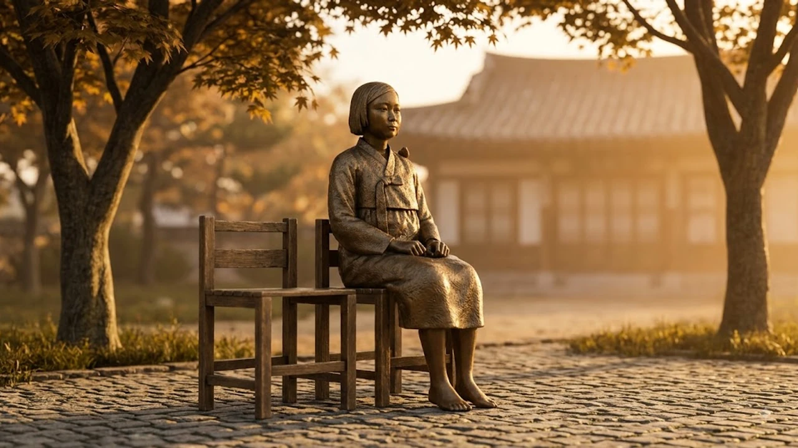

매년 8월 14일은 국가기념일로 지정된 **8월 14일 위안부 기림의 날**이다. 은폐될 뻔했던 참혹한 전시 여성 인권 침해 역사를 사회적 공론장으로 끌어올린 용기를 되새기는 날이다. 오늘날 살아있는 증언자의 수가 급격히 줄어드는 상황에서, 이 날이 가지는 역사적 연대와 인문학적 성찰의 가치를 재조명할 필요가 있다.

---

## 8월 14일 '일본군 위안부 피해자 기림의 날'의 인문학적 시작과 의미

### 1991년 故 김학순 할머니의 용기 있는 증언이 바꾼 역사

1991년 8월 14일, 고(故) 김학순(1924~1997) 할머니는 기자회견을 통해 일본군 '위안부' 피해 사실을 세상에 최초로 공개 증언했다. 반세기 가까이 침묵 속에 묻혀 있던 전시 여성 폭력 실상을 고백한 이 결단은 한국 사회는 물론 국제 인권 지형에 거대한 파장을 일으켰다.

개인의 참담한 상처를 역사적 진실로 전환한 이 증언은 피해자들을 시혜의 대상이 아닌 **주체적인 역사 증언자**로 바로 세우는 결정적 계기가 되었다.

### 국가기념일 제정 배경과 8월 14일이라는 날짜의 무게

정부는 피해자들의 존엄과 명예를 회복하고 미래세대에 올바른 역사관을 정립하기 위해 2017년 12월 '일제하 일본군위안부 피해자에 대한 보호·지원 및 기념사업 등에 관한 법률'을 개정했다. 

이에 따라 김학순 할머니가 최초 공개 증언을 한 8월 14일이 국가 공식 기념일로 지정되었으며, 2018년부터 매년 정부 차원의 공식 기념행사가 개최된다.

### 개인의 침묵을 공공의 기억으로 전환한 사회적 울림

철학자 한나 아렌트가 강조했듯, 개인의 경험이 공적인 영역에서 말해질 때 비로소 정치적·인류학적 의미를 획득한다. 위안부 피해 증언은 단순한 과거사의 고발에 그치지 않는다. 전시 여성 인권과 보편적 인간 존엄성을 확립하기 위한 **인문학적 고백**이자 시민사회의 역사 의식을 깨운 촉매제 역할을 했다.

---

## 생존자 5명 시대, 직접 증언을 넘어선 '기억의 승계' 과제

### 증언자 부재라는 역사적 전환점에 선 현재의 한계

여성가족부 등록 기준, 과거 240명에 달했던 일본군 위안부 피해자 중 현재 생존자는 단 **5명**(2026년 기준)에 불과하다. 생존자 대다수가 90대 후반의 고령으로, 생전 직접 목소리를 들을 수 있는 시간이 얼마 남지 않았다.

> "역사를 기억하지 않는 자는 그 역사를 되풀이할 운명에 처한다." — 조지 산타야나

직접 증언에 의존하던 기존의 추모 방식을 넘어, **제2의 증언자로서 시민사회가 기억을 이어받는 시스템** 구축이 시급하다.

### 구술 기록 보존과 디지털 아카이빙의 중요성

피해자들의 생전 음성과 증언 체계는 디지털 아카이브로 영구 보존되는 중이다. 3D 스캔 기술, 고화질 구술 영상, AI 기반 증언 검색 시스템 등 첨단 기술을 결합한 기록화 작업이 활발히 진행된다.

이러한 디지털 기록은 텍스트에 갇힌 역사를 입체적 생명력으로 살려내어, 미래세대가 피해자의 목소리를 직관적으로 체험하도록 돕는다. 현대 사회의 정보 소비 방식 변화 속에서 자율적인 역사 탐구가 어떻게 이루어지는지는 [제로 클릭 2026, 내 자유의지는 진짜 살아있을까?](/posts/humanities/zero-click-era-autonomy-2026/) 연구에서도 주요하게 다루어지는 화두다.

### 인문학·여성학 관점에서 재조명하는 역사적 진실

위안부 문제는 단순한 한일 간의 외교적 대립 구도에 국한되지 않는다. 가부장제, 군국주의, 국가 폭력과 여성 인권의 교차점을 분석하는 **인문학적·여성학적 학술 탐구**가 지속되어야 한다. 과거의 사실을 규명하는 단계를 지나 인류가 타파해야 할 보편적 폭력 구조를 진단하는 학문적 유산으로 자리매김해야 한다.

---

## 미래세대가 평화와 인권을 실천하는 3가지 인문적 방향

### 피해자 명예회복을 위한 지속적인 사회적 연대

피해자들의 요구는 단순한 금전적 보상이 아닌 **공식적인 사과와 진실 규명**에 있다. 시민사회가 주도하는 수요집회와 학술 연대는 진실을 향한 의지를 입증하는 장이다. 세대를 초월한 사회적 연대는 올바른 역사 정립의 단단한 토대가 된다.

### 청소년 역사 교육과 공모전 등 문화적 승계 방식

미래세대가 역사를 상투적인 외우기 대상이 아닌 삶의 문제로 받아들이도록 돕는 문화 프로그램이 확대되는 추세다. 청소년 대상 콘텐츠 제작 공모전, 문학 작품 읽기, 미술 전람회 등 여러 매개체가 활용된다. 

책과 인문학을 접하는 청년층의 트렌드 변화는 [텍스트힙 진짜 트렌드인가? 완전 정리](/posts/humanities/text-hip-independent-humanities-2026/)에서도 확인할 수 있듯, 능동적인 문화 소비가 역사적 감수성 확장으로 이어지는 선순환을 만든다.

### 국경을 넘어 글로벌 인권 가치로의 외연 확장

일본군 위안부 문제는 전시 여성 성폭력 근절이라는 글로벌 인권 의제와 결합할 때 강력한 공감대를 형성한다. 유엔 인권이사회(UNHRC)를 비롯한 국제기구에서 지속적으로 언급되듯, 이 사안은 세계 시민이 함께 지켜야 할 **인권의 표준**으로 승화되어야 한다.

---

## 침묵을 깨는 용기에서 평화의 미래로 나아가는 인문학적 성찰

### 단순한 추모를 넘어선 기억의 재구성과 역사적 책임

기림의 날을 맞아 진행되는 추모는 과거에 대한 상심에 그쳐선 안 된다. 당시 피해자들이 느꼈을 고통에 공감하고, 그 고통을 증언으로 승화시킨 용기를 **현재의 인권 실천**으로 연결하는 재구성이 필요하다.

* **역사적 진실의 지속적 기록**: 왜곡 시도에 대응하는 사료 검증과 공유
* **연대의 외연 확장**: 전시 폭력 피해 여성들과의 국제적 연대
* **세대 간 소통**: 디지털 매체를 활용한 젊은 층과의 접점 확대

### 오늘을 사는 우리가 잊지 말아야 할 존엄성의 가치

8월 14일은 한 여성이 낸 용기 있는 목소리가 세상의 거대한 침묵을 깨뜨린 날이다. 생존자가 줄어드는 현실은 우리에게 그 목소리를 대신 전해야 할 무게감 있는 과제를 안긴다. 역사적 진실을 바로 세우고 타인의 아픔에 깊이 감응하는 태도야말로 인문학이 지향하는 궁극적인 지향점이다.

#8월14일위안부기림의날 #일본군위안부피해자기림의날 #김학순할머니 #역사기억 #인권과평화 #평화의소녀상 #역사승계 #인문학성찰 #전시여성인권