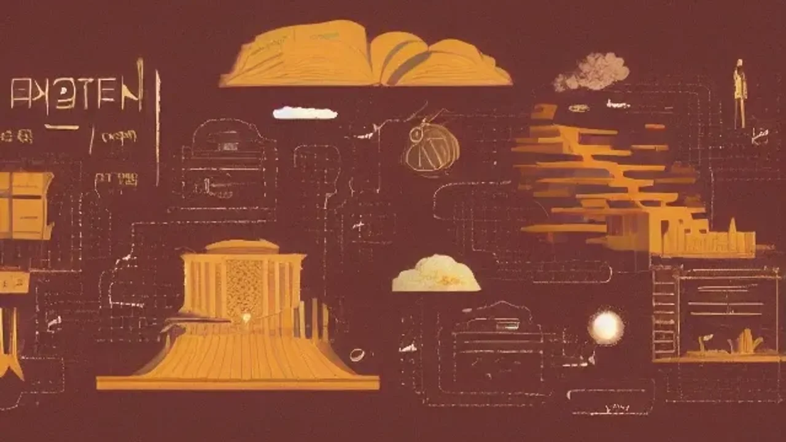
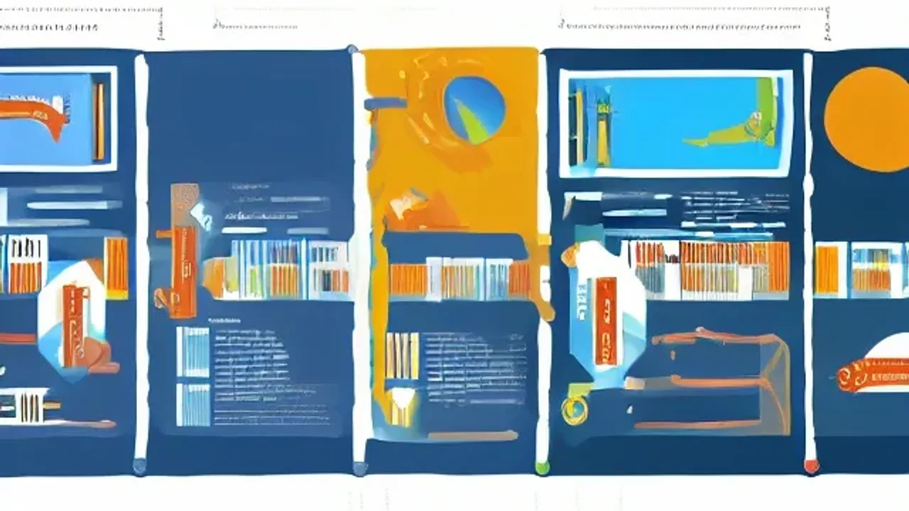

복잡한 인간관계 속에서 상처받지 않고 내 의견을 명확히 전달하는 **소통 심리학**이 2026년 현재 가장 실용적인 생존 지식으로 떠올랐다. 단순히 타인의 마음을 읽는 단계를 넘어, 나 자신의 감정을 보호하며 건강한 관계를 구축하는 무기가 되기 때문이다. 이론에 머물지 않고 즉시 일상에 적용할 수 있는 구체적인 대화의 기술과 실전 노하우를 담았다.

## 소통 심리학이 2026년 진짜 대세가 된 이유
### 전통 인문학 vs 실용 심리학의 차이점 비교
과거의 인문학이 '인간이란 무엇인가'라는 거대 담론에 집중했다면, 최근의 흐름은 철저히 생존과 실용에 맞춰져 있다. 고전 철학서는 깊은 통찰을 주지만, 당장 내일 출근해서 마주칠 까다로운 거래처나 불만을 품은 고객을 대처하는 구체적인 화법을 알려주지 않는다. 반면 실용 심리학은 인지 행동 치료 같은 명확한 학문적 배경을 토대로, 지금 당장 입 밖으로 꺼낼 수 있는 대화 스크립트를 제공해 독자들의 폭넓은 공감을 얻고 있다.

### 디지털 시대, 대면 소통 능력이 더 중요해진 역설적 이유
인공지능 도구와 비대면 업무 환경이 일상을 지배할수록, 아날로그 방식의 대면 소통 능력은 오히려 희소성을 띤다. 화면 너머의 텍스트로는 전달하기 힘든 미묘한 표정 변화, 목소리의 떨림, 제스처를 읽어내는 능력이 곧 사회적 신뢰와 직결된다. 
> 완벽하게 계산된 텍스트가 넘쳐나는 시대일수록, 인간 고유의 감정을 매끄럽게 조율하는 공감 능력은 그 어떤 기술보다 강력한 차별화 포인트가 된다.

### 숏폼 시대에 맞춘 '1일 1교양' 트렌드 분석
도파민을 자극하는 짧은 숏폼 콘텐츠의 홍수 속에서 무언가를 길게 읽어낼 집중력은 갈수록 줄어든다. 두꺼운 이론서를 펼치기 힘든 현대인들은 출퇴근길 10분, 혹은 자기 전 15분을 활용해 핵심만 흡수하는 '1일 1교양' 포맷에 열광한다. 소통 심리학은 짧은 챕터 하나만 읽어도 오늘 하루 만나는 사람들에게 즉각 적용해 볼 수 있어 가성비 높은 지식 소비 트렌드와 정확히 맞물린다.

## 일상에서 바로 써먹는 소통 심리학 대화법

### 갈등을 부드럽게 줄이는 '쿠션어' 활용 3단계
상대방의 기분을 상하게 하지 않으면서 내 요구를 관철하려면 '쿠션어' 활용이 필수다. 무턱대고 본론을 꺼내기보다 감정의 완충 지대를 만드는 화법이다.
- **1단계 (인정):** "바쁘신 와중에 요청을 확인해 주셔서 고맙습니다."
- **2단계 (양해):** "번거로우시겠지만, 이 부분만 한 번 더 검토해 주실 수 있을까요?"
- **3단계 (대안 제시):** "만약 오늘 일정이 촉박하시다면, 내일 오전까지 기다리겠습니다."
이 3단계를 거치면 상대방은 무의식적인 방어기제를 내리고 훨씬 수용적인 태도로 대화에 임한다.

### 상대의 숨은 의도를 파악하는 능동적 경청 기술
대부분의 사람은 대화할 때 상대방을 이해하기보다 내가 다음에 무슨 말을 할지 속으로 먼저 계산한다. 능동적 경청은 상대방의 말속에 숨겨진 감정의 키워드를 낚아채는 고도의 기술이다. 누군가 "요즘 업무가 쏟아져서 정신이 없네"라고 할 때, "나도 진짜 바빠"라고 받아치는 것은 관계를 닫는 화법이다. 대신 "일이 몰려서 많이 지쳤구나. 어느 파트가 제일 버거워?"라고 질문을 던지면, 상대는 자신이 온전히 존중받는다고 느끼며 마음의 문을 연다.

### 내 감정을 다치지 않게 하는 현명한 거절의 법칙
거절을 못 해 혼자 끙끙 앓는 성향이라면 '나 전달법(I-message)'을 반드시 익혀야 한다. "네 부탁은 들어줄 수 없어"라며 상대를 탓하거나 미안해하는 대신, "내가 지금 진행 중인 프로젝트 마감 때문에 물리적인 시간이 부족하네. 이번 일정은 맞추기 어려울 것 같아"라고 순전히 나의 상황에 초점을 맞춰 말하는 방식이다. 불필요한 죄책감 없이 건강한 선을 지킬 수 있다.

## 직접 적용해 본 소통 심리학의 놀라운 효과
### 껄끄러웠던 직장 상사와의 관계가 편안하게 바뀐 썰
9개 지점의 마케팅 통합 보고를 앞두고 사사건건 트집을 잡던 실무진 때문에 극심한 스트레스를 받던 시기, '미러링(Mirroring)' 기법을 적용해 보았다. 지시를 내릴 때 핵심 단어를 그대로 한 번 더 따라 말하며 고개를 끄덕이는 단순한 행동이었다. "이 기획안, 내일까지 타기팅 데이터 보강해서 가져와"라는 말에 "네, 내일까지 타기팅 데이터 보강해서 보고하겠습니다"라고 명확히 피드백을 주자, 뾰족했던 말투가 눈에 띄게 누그러졌다. 내 말을 주의 깊게 듣고 있다는 시그널이 상대의 통제 욕구를 충족시켜 준 결과다.

### 가족 간의 만성적인 대화 단절을 극복한 과정
가장 가까운 사이일수록 필터링 없이 날 선 말이 오가기 쉽다. 이사 후 낯선 동네에서 주말 외식을 나갈 때마다 메뉴 선정으로 벌어지던 신경전을 공감형 질문으로 바꾼 것만으로도 분위기가 달라졌다. 섣부른 해결책을 제시하려는 강박을 버리고, "이번 주 많이 피곤했지? 따뜻한 국물 요리가 당길까?"라며 상대의 컨디션을 먼저 살피는 침묵과 질문의 심리학이 관계 회복의 마중물이 되었다.

### 심리적 안정감이 업무 성과로 이어진 실제 사례
인간관계에서 발생하는 감정 노동이 줄어들자, 그 에너지는 고스란히 업무 집중력으로 전환되었다. [관련 글 보기](/posts/humanities/) 동료와의 사소한 언쟁으로 강남 뱅뱅사거리 인근의 사무실에서 몇 시간씩 속앓이를 하던 버릇을 고치고 나니, 하루 평균 2시간 이상의 잉여 시간이 확보되었다. 불필요한 감정 소모를 차단하는 심리적 방어막이 생기면서 트렌드 분석과 기획에 몰입하는 밀도가 높아졌고, 이는 결국 객관적인 마케팅 성과 지표 상승으로 이어졌다.

## 시중 소통 심리학 베스트셀러 특징과 장단점
### 전통적인 심리학 이론서가 가지는 현실 적용의 한계
정통 심리학자가 집필한 두꺼운 이론서들은 인간 본성에 대한 깊은 통찰을 제공하지만, 당장의 현실 적용에는 뚜렷한 한계가 존재한다. 방대한 임상 데이터와 복잡한 전문 용어들을 소화하다 보면 정작 오늘 오후 미팅에 써먹을 실전 팁을 찾기 어렵다. 바쁜 일상에서 즉각적인 솔루션이 필요한 독자에게는 자칫 지루하고 무거운 학문적 탐구로 끝날 우려가 크다.

### 즉시 따라 할 수 있는 실전 워크북 형태 도서의 유용성
최근 서점가를 휩쓰는 책들은 철저하게 실전 워크북 형태를 띤다. 갈등 상황별 대화 스크립트가 명시되어 있고, 직접 자신의 언어로 문장을 완성해 보는 코너가 포함된 책들이 많다. 당장 말하기 습관을 교정해야 하는 직장인이나 프레젠테이션을 앞둔 사람들에게 구체적인 가이드를 제시한다.

### 현재 나의 인간관계 스트레스 상황에 맞는 책 고르는 꿀팁
수많은 서적 중에서 길을 잃지 않으려면 나의 핵심 스트레스 요인을 명확히 정의해야 한다. 직장 내 수직적 위계가 문제라면 비즈니스 화술에 특화된 책을, 가까운 지인과의 정서적 교류가 고프다면 애착 유형과 공감 대화를 다룬 책을 고르는 편이 유리하다. 책의 목차를 훑어볼 때, 현재 내 상황과 정확히 일치하는 소제목이 3개 이상 포함된 책을 선택하면 실패 확률을 현저히 낮출 수 있다.

#소통심리학 #대화법 #인간관계 #인문학트렌드 #자기계발 #마인드셋 #심리테라피