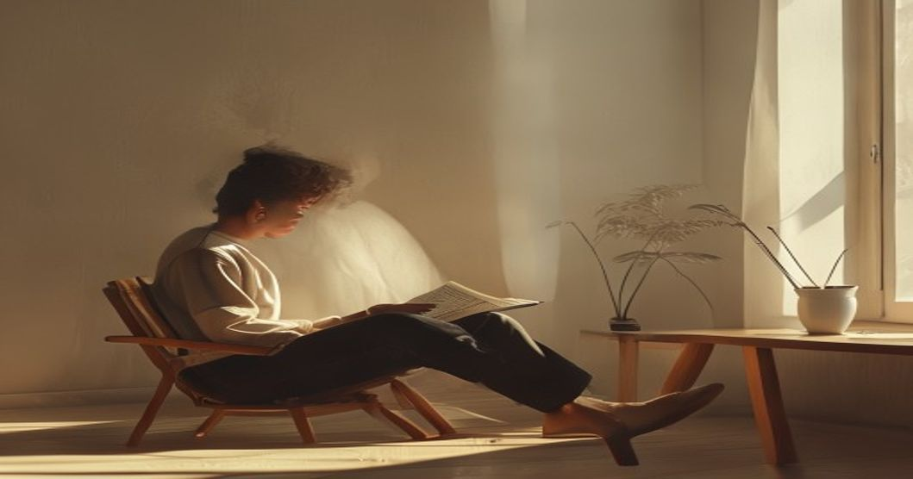

숏폼 콘텐츠와 실시간 알림이 쉴 새 없이 쏟아지는 현대 사회에서, 역설적이게도 수많은 현대인이 스마트폰을 내려놓고 있습니다. 가속의 시대 속에서 스스로 브레이크를 밟는 이 현상의 중심에는 2026년 현재 가장 뜨거운 키워드인 '도파민 디톡스'와 '인문학 트렌드'가 자리 잡고 있습니다. 기술이 고도로 발달하고 인공지능(AI)이 일상화될수록, 우리는 오히려 인간 본연의 가치와 정신적 중심을 잡기 위해 고전과 철학으로 고개를 돌리고 있습니다. 자극 과잉의 시대에서 주체적인 삶을 회복하고자 하는 현대인들의 움직임을 철학적 관점에서 짚어봅니다.

## 초연결 시대의 역설과 도파민 디톡스

### 끊임없는 자극에 지친 뇌

디지털 기기가 주는 즉각적인 보상 체계는 우리의 뇌를 끊임없이 자극합니다. 인스타그램 릴스, 유튜브 쇼츠, 틱톡 등 1분 미만의 짧은 영상에 익숙해진 현대인들은 이제 몇 분짜리 글을 읽는 것조차 지루해하는 집중력 결핍을 겪고 있습니다. 이러한 뇌의 피로감은 만성적인 불안과 무기력으로 이어졌고, 결국 대중은 스스로 자극을 차단하는 '의도적 쉼'을 선택하기 시작했습니다.

### 고독을 선택하는 현대인들

최근 SNS에서는 화려한 일상을 공유하는 대신, '로그아웃' 인증이나 전자기기 없이 며칠간 사찰에 머무는 템플스테이 후기가 트렌드로 떠올랐습니다. 외부의 소음을 끄고 자신의 내면에 집중하려는 시도는 단순한 유행을 넘어 하나의 문화적 현상으로 자리 잡았습니다. 외로움을 두려워하던 사람들이 이제는 자발적 고독을 통해 정신적 에너지를 충전하고 있습니다.

### 인문학이 제시하는 처방전

이러한 상황에서 철학과 문학은 훌륭한 해독제가 되어줍니다. 고대 스토아철학부터 근대 실존주의까지, 시대를 초월한 사상가들은 외부 환경에 흔들리지 않고 내면의 평온을 유지하는 방법을 논해왔기 때문입니다. 현대인들이 서점가로 향해 철학서를 집어 드는 이유는 즉각적인 위로가 아닌, 삶을 지탱할 단단한 뼈대를 찾기 위함입니다.

## 니체의 위버멘쉬, 가치 전복의 삶

### 왜 지금 다시 니체인가

2026년 현재 국내 베스트셀러 상위권에는 프리드리히 니체의 철학을 재해석한 도서들이 당당히 이름을 올리고 있습니다. 세상이 정해놓은 기준과 알고리즘이 추천하는 취향에 길들여진 현대인들에게, "너 자신의 삶을 살라"고 외친 니체의 목소리가 강력한 울림을 주기 때문입니다. 타인의 시선과 사회적 성공 방정식에 지친 이들이 니체에게서 답을 찾고 있습니다.

### 위버멘쉬(초인)의 현대적 정의

니체가 말한 '위버멘쉬(Übermensch)'는 단순히 능력이 뛰어난 초능력자를 뜻하지 않습니다. 이는 기존의 관습과 가치관을 뛰어넘어, 스스로 삶의 가치를 창조하고 어떤 고난이 와도 자신의 운명을 사랑하는(Amor Fati) 주체적인 인간을 의미합니다. 트렌드에 휩쓸리지 않고 자신만의 속도로 삶을 개척하는 사람이 바로 오늘날의 위버멘쉬입니다.

### 알고리즘으로부터의 독립

AI가 우리의 다음 행동과 취향까지 예측하고 제안하는 시대에, 위버멘쉬 철학은 우리에게 '알고리즘으로부터의 독립'을 요구합니다. 추천 시스템이 이끄는 대로 소비하는 수동적인 인간에서 벗어나, 자신이 진정으로 원하는 것이 무엇인지 끊임없이 질문하고 선택하는 태도가 그 어느 때보다 중요해졌습니다.

## AI 시대에 부활한 '느린 독서'의 가치

### 생성형 AI와 문해력의 위기

질문 한 줄이면 몇 초 만에 완벽한 요약본을 만들어내는 생성형 AI의 등장으로 지식을 얻는 과정은 극도로 단축되었습니다. 그러나 아이러니하게도 정보의 홍수 속에서 텍스트의 맥락을 파악하고 비판적으로 사고하는 '인간 고유의 문해력'은 급격히 저하되었습니다. 요약된 정보만 소비하다 보니 스스로 사유하는 근육이 퇴화한 것입니다.

### 텍스트를 씹어 삼키는 사유의 시간

이러한 위기감 속에서 인문학계와 독서가들 사이에서는 책 한 권을 몇 달에 걸쳐 천천히 읽는 '느린 독서(Slow Reading)' 열풍이 불고 있습니다. 단순히 페이지를 빠르게 넘기는 것이 아니라, 문장 행간에 숨겨진 의미를 음미하고 저자의 생각에 반론을 제기하며 읽는 방식입니다. 이 과정에서 뇌는 깊은 사색의 단계로 진입하게 됩니다.

### AI가 대체할 수 없는 인간의 영역

아무리 뛰어난 인공지능이라 할지라도 인간이 책을 읽으며 느끼는 감정의 파동, 개인적 경험과의 결합을 통한 영감의 순간까지 대체할 수는 없습니다. 느린 독서는 단순한 지식 습득의 수단이 아니라, AI 시대에 인간으로서의 정체성을 지키고 창의적인 사유 능력을 기르는 가장 확실한 훈련법입니다.

## 일상에서 실천하는 인문학적 삶의 태도

### 마인드풀니스와 철학의 결합

인문학 트렌드는 책상 위 명상에만 머무르지 않고 일상적 실천으로 확장되고 있습니다. 아침에 눈을 떠서 스마트폰을 확인하는 대신 고전의 글귀를 필사하거나, 하루를 마감하며 자신의 감정을 객관적으로 기록하는 저널링이 대표적입니다. 이는 동양의 마음챙김(Mindfulness)과 서양의 철학적 성찰이 결합한 형태입니다.

### 나만의 속도를 유지하는 법

세상이 아무리 빠르게 변하고 주변 사람들이 앞서가는 것처럼 보여도, 불안해하지 않고 중심을 잡는 힘은 결국 깊은 인문학적 소양에서 나옵니다. 자신의 가치 기준이 명확하다면 외풍에 쉽게 흔들리지 않기 때문입니다. 무조건 트렌드를 쫓아가기보다는 잠시 멈춰 서서 인생의 본질적인 질문들을 던져야 할 때입니다.

### 내면의 단단함을 기르는 이정표

결국 2026년의 인문학 열풍은 불안한 시대를 살아가는 현대인들이 생존을 위해 선택한 내면의 방어기제와 같습니다. 외부의 소음을 줄이고 고전이 주는 지혜에 귀를 기울일 때, 우리는 비로소 타인이 아닌 나로서 온전히 존재할 수 있습니다. 지금 내 삶의 속도가 너무 빠르다고 느껴진다면, 잠시 화면을 끄고 철학자들의 오래된 지혜를 펼쳐보시길 권합니다. 불안한 시대를 버티는 구체적인 마음 관리법이 궁금하다면 [현대 사회의 불안과 스토아 철학의 지혜](/posts/humanities/stoic-philosophy-anxiety-2026/)도 함께 읽어보세요.

#인문학트렌드 #도파민디톡스 #니체 #위버멘쉬 #느린독서 #AI시대 #철학공부 #마음챙김 #자아성찰
