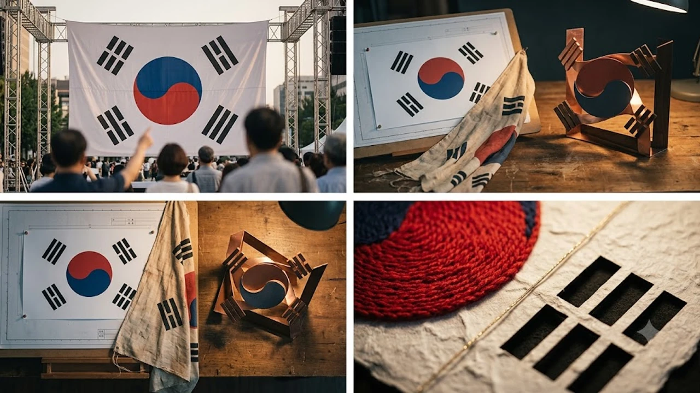

제81주년 광복절을 일주일 앞두고 시청 건물에 내걸린 대형 기념 현수막을 두고 **광복절 태극기 거꾸로** 연출 논란이 뜨겁게 달아올랐습니다. 시민들의 거센 항의에 지자체가 현수막을 전격 철거하는 사태로 번졌는데, 이는 단순한 제작 실수를 넘어 공공 디자인의 직관성과 **시각 기호학**적 소통이 왜 치명적인지 직관적으로 보여줍니다. 대중이 왜 그토록 분노했는지, 지자체의 3차원 해명이 왜 통하지 않았는지 세 가지 핵심 지점으로 짚어냅니다.

## 광복절 현수막 '거꾸로 태극기' 논란의 전말과 시각적 착시

### 81주년 광복절 현수막 철거 사태의 발단
인천광역시는 8월 6일 시청 후면에 대형 광복절 기념 현수막을 설치했습니다. 하지만 게재 직후부터 독립운동가가 든 태극기의 괘와 음양 문양이 반대로 뒤집혀 있다는 시민 제보가 빗발쳤습니다. 여론이 악화하자 인천시는 게시 사흘 만인 8월 8일 해당 현수막을 부랴부랴 내렸습니다.

### 온라인 커뮤니티와 대중 반응의 파장
주요 커뮤니티와 SNS에는 "광복절을 상징하는 공식 현수막에서 어떻게 이런 장면이 나올 수 있느냐"는 거센 비판이 이어졌습니다. 서경덕 교수를 비롯한 문화계 인사들이 이를 조명하면서 이슈는 일파만파 퍼졌고, 대중은 일러스트 해상도나 완성도를 넘어 공공기관의 역사의식 부재를 정조준했습니다.

### 인천시의 구도 해명과 서경덕 교수의 기호학적 진단
인천시는 "태극기를 평면에 그린 게 아니라 아래에서 위로 올려다보는 입체 구도로 연출한 것"이라고 밝히며, 바람에 휘날리는 깃발의 뒤쪽 면이 들어간 것이라 해명했습니다. 그러나 기호학 전문가들은 대중이 상징을 받아들이는 '직관성'을 무시한 채 무리한 예술적 연출을 고집하다 벌어진 미스매치라 지적합니다.

## 평면 디자인 대 입체 구도: 시각 기호학적 분석

### 올려다보는 앵글(Low-angle)이 만든 시각적 반전
디자이너는 독립운동가의 역동성을 극대화하려고 역각도인 '로우 앵글'을 선택했습니다. 문제는 이 입체 구도를 2차원 평면 현수막에 그대로 옮겨 오면서 깃발의 뒤집힌 면만 도드라졌고, 결과적으로 시청 건물에 태극기를 180도 거꾸로 달아놓은 듯한 착시를 일으켰다는 점입니다.

### 대중 상징물에서 직관성이 예술적 연출보다 중요한 이유
공공 디자인의 핵심은 예술적 파격이 아니라 **즉각적인 정보 전달과 왜곡 없는 해석**입니다. 특히 국기 같은 국가 상징물은 대중의 집단지성 속에 철저히 고정된 규칙으로 작동합니다. 입체적 각도라는 이유로 이 규칙을 비틀면 대중은 이를 창의성이 아닌 '오류'로 간주합니다.

### 태극 문양의 음양 배치와 국민적 정서의 충돌
> "상징물은 기획자의 해명이 필요한 순간 이미 그 기능을 상실한 것이다."

건곤감리 4괘와 빨강·파랑의 음양 배치는 국민 모두에게 각인된 절대적 약속입니다. 시각적 기교가 아무리 뛰어난들 기본 상징성이 깨졌다고 느껴지면 대중은 거부감을 일으킵니다. 시각 기호의 직관성을 요구하는 이러한 대중 심리는 최근 유행하는 [텍스트힙 진짜 트렌드인가? 완전 정리](/posts/humanities/text-hip-independent-humanities-2026/) 문화처럼 명확한 텍스트와 맥락을 소비하려는 신세대 취향과도 닿아 있습니다.

## 역사 상징물 연출을 둘러싼 공간과 맥락의 인문학

### 깃발 상징물이 가지는 사회적 약속과 기호성
기호학에서 국기는 강력한 사회적 약속입니다. 역사적으로 국기를 반대로 매다는 행위는 군대의 항복이나 국가적 위기를 뜻하는 강렬한 기호로 쓰였습니다. 그렇기에 광복절이라는 축제의 장소에서 드러난 태극기의 반전은 대중에게 심리적 충격과 불쾌감을 안겨줄 수밖에 없었습니다.

### 3차원 예술 표현과 2차원 매체 표출 사이의 Gap
원화나 3D 그래픽 화면에서는 입체적 앵글이 그럴듯해 보였을지 모릅니다. 그러나 이를 대형 2차원 천에 인쇄해 건물 외벽에 내걸었을 때 3차원적 맥락은 모두 증발하고 '거꾸로 된 태극기'만 남았습니다. 전달 매체의 특성을 오판한 기획의 전형적인 한계입니다.

### 공공 게시물 제작 시 세심한 맥락 검토의 필요성
지자체가 내걸어 공유하는 상징물은 도시의 얼굴이자 역사적 정체성의 표출입니다. 시각적 도전에만 몰두해 검수 시스템을 소홀히 돌리면 의도와 상관없이 커다란 사회적 비용을 치르게 됩니다. 연출 이전에 다각도의 교차 검증 절차가 자리 잡아야 하는 이유입니다.

## 국가 상징 표현과 대중 소통의 바람직한 방향

### 불필요한 오해를 줄이는 공공 디자인 가이드라인
이번 파장을 계기로 공공기관의 원색적 상징물 활용 지침을 강화해야 합니다. 창의적 표현은 권장하되, 국기처럼 변형에 민감한 기호는 원형과 직관성을 유지하도록 규정을 명확히 세우는 작업이 시급합니다.

### 역사적 기억을 올바르게 전달하는 문화 기획
광복절의 본질은 독립운동가들의 숭고한 희생을 되새기는 데 있습니다. 자극적인 연출 논란으로 행사 본래의 가치가 빛바래지 않으려면 기획 초기부터 시민들의 시각적 수용성과 역사적 맥락을 면밀히 고려하는 정교함이 요구됩니다.

### 시민사회와 지자체 간 상징물 소통의 개선점
시민들의 날카로운 지적을 빠르게 수용해 현수막을 내린 인천시의 조치는 소통의 측면에서 타당했습니다. 오늘날 대중은 상징의 오용을 즉각 발견해 바로잡는 능동적 주체입니다. 타성이나 타인의 시선에 휘둘리지 않고 스스로 판단하고 행동하는 이러한 대중의 모습은 [MZ가 스토아 철학에 빠진 이유, 2000년 전 지혜가 2026년에 통하는 법](/posts/humanities/stoicism-modern-life-2026/)에서 말하는 주체적 삶의 자세와도 맥을 같이 합니다.

#광복절 #태극기거꾸로 #인천시현수막 #시각기호학 #광복절논란 #공공디자인 #태극기구도 #역사상징물 #광복81주년 #인문학분석