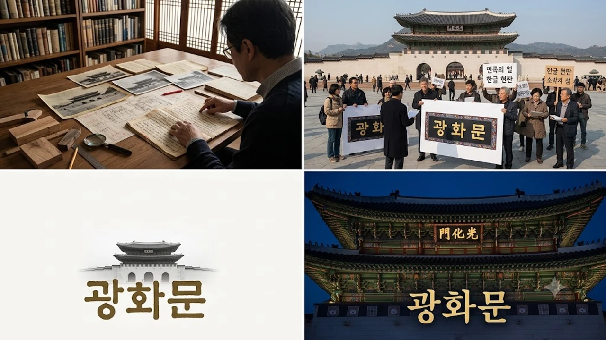

한글날 100주년을 맞은 오늘날, 광화문 현판 한글 교체 문제는 단순한 글자 선택을 넘어 역사관 충돌로 번지고 있다. 1865년 흥선대원군 중건 당시의 한자 원형을 고수해야 한다는 보존론과 대한민국 정체성을 담아 훈민정음체 한글로 바꿔야 한다는 주장이 팽팽히 맞선다. 광화문 한자 현판이 왜 매년 뜨거운 감자로 떠오르는지 본질적인 쟁점을 짚어야 할 때다.

## 원형 복원 원칙과 고증의 딜레마

### 1865년 훈련대장 임태서의 글씨와 문화유산 보존 원칙
국가유산청이 채택한 기본 방침은 철저한 '원형 복원'이다. 현재 걸려 있는 현판은 고종 2년(1865년) 경복궁 중건 당시 훈련대장 임태서가 쓴 한자 필체를 디지털 분석과 미세 복원을 거쳐 검은 바탕에 금박 글씨로 재현한 결과물이다. 

- 유네스코 세계문화유산 헌장 및 문화재 복원 국제 규범(베니스 헌장)의 핵심은 창건 또는 특정 역사적 시점의 물적 증거 보존이다.
- 문화유산 보존 전문가들은 "역사적 유적물에 후대의 민족적 염원을 자의적으로 덧씌우는 순간 기록 유산으로서의 진정성이 훼손된다"고 못 박는다.
- 조선왕조 법궁의 정문이라는 건축학적 맥락에서 당대 문자인 한자 배치가 역사적 실체에 부합한다는 분석이 힘을 얻는다.

### 흑저금박 복원 과정에서 불거진 고증 논란
복원 과정 자체가 순탄했던 것만은 아니다. 2010년 광복절에 복원된 흰 바탕 검은 글씨 현판은 설치 석 달 만에 목재 균열이 발생해 전면 재제작에 들어갔다. 

이후 도쿄 국립박물관 소장 유리건판 사진을 적외선·자외선 분석한 끝에 검은 바탕에 금색 글씨가 본래 모습이었음을 밝혀내고 재설치했다. 물리적 복원에만 10년이 넘는 세월과 막대한 국가 예산이 투입된 만큼, 이제 와서 글자 체계를 전면 뒤집는 것은 행정적 자원 낭비라는 지적이 적지 않다.

### 왕조 유산과 민주공화국 상징 공간의 괴리
경복궁은 조선 왕실의 궁궐이지만, 광화문 앞 월대와 광장은 3·1운동부터 4·19혁명, 현대 시민 집회에 이르기까지 공화국 시민들의 정치·문화적 중심지로 기능해 왔다. 

> "왕조의 유물이라는 박제된 시각에 갇히면, 오늘날 광화문이 지닌 주권재민의 광장이라는 공간적 생명력을 설명할 수 없다."

이처럼 왕조 시대의 물리적 복원과 현대 민주공화국의 상징성 사이에서 발생하는 간극은 쉬이 좁혀지지 않고 있다.

## 한글 전용론의 근거와 민족적 정체성

### 세종대왕 동상 앞 한자 현판이 빚어내는 모순
광화문 광장 중심에는 세종대왕 동상이 자리 잡고 있으며, 지하에는 한글가온길과 세종이야기 전시관이 운영 중이다. 

- 외국인 관광객과 시민들이 세종대왕 좌상 바로 뒤편 경복궁 정문에 걸린 한자 현판을 마주할 때 상징적 충돌을 체감한다.
- 한글 단체들은 대한민국을 대표하는 랜드마크이자 한글 창제자의 공간에 한자 표기를 고집하는 것은 문화 주권을 외면한 처사라고 비판한다.
- [도요토미 포토존 논란, 진짜 숨은 문제 3가지](/posts/humanities/toyotomi-hideyoshi-photozone-controversy-2026/) 사례처럼 역사 유적과 기념 공간의 시각적 배치는 대중의 역사 인식에 결정적 영향을 미친다.

### 박정희 친필 한글 현판의 기억과 정치적 굴곡
1968년 철근 콘크리트로 광화문을 재건할 당시 박정희 전 대통령이 쓴 한글 현판이 내걸렸다. 이는 한글 전용 정책과 민족주의적 열망을 담은 상징물로 40년 가까이 광화문을 지켰다. 

하지만 군사정권의 정치적 기념비라는 비판과 콘크리트 복원의 졸속성 문제가 겹치며 2006년 철거 수순을 밟았다. 당시 한글 현판 철거가 남긴 감정적 앙금은 지금까지도 한글단체와 보존론자 사이의 날 선 설전으로 이어지는 뿌리가 됐다.

### 훈민정음 해례본체 집자라는 현실적 대안
한글화를 요구하는 진영은 특정 정치인의 글씨가 아닌 국보 《훈민정음 해례본》의 목판 글꼴을 집자(集字)해 새 현판을 달자고 제안한다. 

- 세종대왕이 창제한 원형 글꼴을 사용하면 역사적 정통성과 예술적 완성도를 동시에 확보할 수 있다는 설명이다.
- 훈민정음체는 기하학적 균형미와 독창성이 뛰어나 현대 건축물과의 조화에서도 높은 시각적 가치를 지닌다.
- '광화문' 세 글자를 해례본체로 구현한 시안은 이미 여러 차례 학계에 공개되며 기술적 타당성을 검증받았다.

## 해외 문화유산 복원 사례와 시사점

### 프랑스 루브르 박물관 피라미드의 전통과 혁신
과거의 원형만을 복원의 유일한 잣대로 삼지 않은 대표적 사례는 프랑스 파리 루브르 박물관의 유리 피라미드다. 1989년 건축 당시 고전 르네상스 양식 궁전에 현대적 유리 구조물을 덧대는 파격에 거센 반발이 일었다. 

그러나 현재 유리 피라미드는 과거와 현대가 공존하는 프랑스 문화의 독창적 아이콘으로 평가받는다. 역사적 공간에 당대 시대정신을 결합하는 실험이 성공적인 문화적 자산으로 안착할 수 있음을 보여준다.

### 중국 천안문 광장 현판 교체의 정치사
베이징 천안문 정면의 명칭과 표어는 명·청 왕조를 거쳐 신중국 수립 이후까지 권력 주체와 시대적 요구에 따라 여러 차례 바뀌었다. 

중국 정부는 전통 궁궐 문루라는 유산적 성격 위에 사회주의 국가의 공식 구호를 배치해 체제 정통성을 각인시켰다. 문화재의 텍스트가 시대에 따라 가변성을 띨 수 있음을 증명하는 동시에, 정치 권력에 의해 유산의 본질이 변형될 위험성도 함께 시사한다.

### 베를린 훔볼트 포럼의 역사 재해석 방식
독일 베를린 중심부에 재건된 베를린 궁전(훔볼트 포럼)은 바로크 양식의 외벽 3면을 복원하고, 나머지 1면은 과감히 현대적 콘크리트 건축으로 마감했다. 과거 프로이센 왕국의 영광을 무비판적으로 복제하지 않고, 전쟁과 분단의 상처를 건축물 자체에 새겨 넣은 선택이다. 

전통의 단순 복제가 능사가 아니라 유산이 현세대에 전하는 질문을 물리적 공간에 어떻게 녹여낼 것인가에 대한 해답을 던진다.

## 공존을 위한 제3의 해법과 방향성

### 디지털 미디어아트와 계절별 교체 전시
물리적 현판을 완전히 떼어내지 않고도 대립을 해소할 기술적 대안이 거론된다. 광화문 월대와 문루의 야간 조명을 활용해 훈민정음 해례본체 디지털 미디어파사드를 투사하는 방식이다.

- 주간에는 1865년 한자 현판의 원형성을 유지하고 야간에는 빛으로 한글 현판을 구현해 양측 요구를 절충할 수 있다.
- 한글날 주간이나 국가 주요 기념일에는 특수 제작된 한글 현판 덮개를 가설하는 유연한 운영 방식도 제안된다.
- 고정관념을 탈피한 유연한 전시 기법