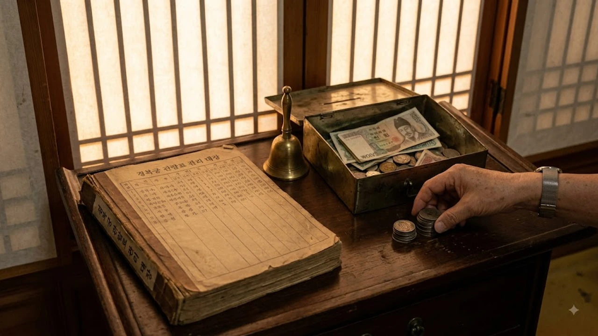

2026년 8월, 국가유산청이 발표한 궁궐 및 조선왕릉 관람료 현실화 방안이 화제의 중심에 섰습니다. 무려 2005년 이후 22년 만에 추진되는 **경복궁 관람료 인상** 이슈는 문화재 보존 재원 확충이라는 명분과 문화 공공성 확보라는 가치가 맞닿아 있습니다. 서울 중심부의 역사적 공간을 찾는 관람객들의 발길이 이어지는 가운데, 이번 요금 체계 개편이 대중의 문화 접근성에 미칠 파장에 관심이 쏠립니다.

## 22년 만의 요금 개편, 왜 지금인가?

### 2005년 동결 이후 유지되어 온 관람료 현주소
현재 경복궁의 성인(만 24세~64세) 입장료는 3,000원, 창경궁과 덕수궁은 1,000원으로 고정되어 있습니다. 2005년 설정된 이후 단 한 차례도 손대지 않은 금액입니다. 그동안 쌓인 물가 상승률과 정교해진 시설 유지비 부담을 고려하면, 현행 요금표로는 기와 한 장 고치거나 최신 방재 장비를 도입하기조차 버거운 실정입니다.

### 문화유산 보존 비용 증가와 재정 현실화 필요성
국가유산청에 따르면 최근 목조건축물 보수, 첨단 방재 시스템 구축, 관람객 편의시설 확충에 들어가는 연간 예산은 매년 8~10% 이상 치솟았습니다. 반면 관람료 수입이 전체 유지 관리비에서 차지하는 비중은 15% 안팎에 불과합니다. 세금 투입에만 의존하기보다 실제 유적지를 즐기는 관람객이 적정 부담을 나누어야 한다는 주장이 힘을 얻는 배경입니다.

### 해외 주요 역사 유적지 대비 관람료 수준 비교
해외의 이름난 세계유산과 비교하면 한국 궁궐의 입장료는 턱없이 낮습니다. 프랑스 베르사유 궁전은 입장료가 약 21유로(한화 3만 원 이상), 일본의 주요 사찰이나 성곽도 500엔~1,000엔(한화 4,500원~9,000원) 수준을 받습니다. 이 때문에 우리 국보급 문화유산이 지닌 가치에 비해 너무 낮은 가격표가 붙어 있다는 지적도 나옵니다.

## 관람료 인상이 가져올 주요 변화와 이슈

### 인상 예정 시기와 11월 최종 공표 계획
국가유산청은 관계 부처 협의와 공청회를 거쳐 2026년 11월경 최종 개편안을 확정 발표합니다. 실제 인상안 적용은 유예 기간을 거친 뒤 단계적으로 이루어집니다. 이에 따라 궁궐별, 관람 대상별 요금 구조가 대대적으로 개편될 전망입니다.

### 외국인 관람객 수가 문화재 관리에 미치는 영향
K-컬처 열풍을 타고 2026년 상반기 경복궁을 찾은 외국인 수치는 역대 최대치를 찍었습니다. 관람객 몰림 현상으로 인한 훼손 위험을 낮추고 쾌적한 관람 환경을 만들기 위해, 일각에서는 외국인 대상 차등 요금제나 사전 예약제 전면 확대를 대안으로 꼽습니다.

### 무료 관람 대상 및 할인 혜택 유지 여부
만 24세 이하 청소년 및 만 65세 이상 어르신, 한복 착용자에 대한 무료 입장 혜택이 유지될지가 가장 뜨거운 관심사입니다. 청년들의 문화 경험을 지원하는 [청년문화예술패스 도서 확대! 바뀐 3가지](/posts/humanities/youth-culture-pass-book-expansion-2026/) 정책처럼, 계층별 문화 복지 문턱을 낮추는 안전장치는 반드시 지켜져야 한다는 목소리가 큽니다.

## 문화재 보존인가 시민 권리인가: 문화 공공성 논쟁

### Cultural Commons(문화 공공재)로서의 궁궐 가치
궁궐과 왕릉은 단순한 관광 상품이 아니라 시민 누구나 누려야 할 '문화 공공재'입니다. 요금이 급격히 뛰어오르면 주머니 사정이 팍팍한 시민부터 발길을 끊게 될 위험이 있습니다.

> "문화유산은 과거의 유물이 아니라 현재를 사는 모든 시민이 동등하게 누려야 할 공공의 자산이다."  
> — 문화연대 정책 논평 중

### '지불 의사액' 조사에 반영된 대중적 여론 분석
최근 진행된 한국문화재재단 조사 결과를 보면 응답자의 62.4%가 "문화유산의 제대로 된 보존과 관리를 위한 요금 인상에 동의한다"고 밝혔습니다. 적정 금액으로는 5,000원~6,000원대를 가장 많이 선택해, 파격적인 인상보다는 납득할 수 있는 선에서의 현실화를 원하고 있음을 보여줍니다.

### 관람료 인상이 문화 양극화에 미칠 영향 성찰
도심 속 단비 같은 휴식처이자 역사 배움터인 궁궐이 문턱을 높이면 문화적 소외 계층이 가장 먼저 타격을 입습니다. 이 같은 문화 접근권 논의는 비용 계산을 넘어 우리 사회가 지향해야 할 가치를 묻는 인문학적 질문과 맞닿아 있습니다. 세상을 바라보는 고전과 인문학적 시선은 [인문 전체 글 보기](/posts/humanities/)에서 확인할 수 있습니다.

## 관람객이 알아두어야 할 실전 방문 가이드

### 인상 전 꼭 방문해야 할 주요 궁궐 및 왕릉 코스
요금표가 바뀌기 전 도심 속 고궁을 오롯이 즐겨보는 것도 좋은 방법입니다. 경복궁, 창덕궁, 덕수궁, 창경궁을 묶어 둘러보는 '4대궁 통합관람권'을 챙기면 개별 구매보다 훨씬 가성비 높게 고궁 산책을 즐길 수 있습니다.

### 야간 개장 및 특별 관람 예약 팁
티켓팅 전쟁이 벌어지는 경복궁 야간 관람이나 창덕궁 달빛기행은 사전 준비가 필수입니다.
- **예매 오픈일:** 관람 시작 1~2주 전 공식 예매처를 통해 티켓 오픈
- **1인당 수량 제한:** 1인당 최대 2매~4매로 제한되므로 사전 본인 인증 완료 필수
- **현장 판매 대상:** 만 65세 이상 어르신과 외국인에 한해 현장 잔여권 발권 지원

### 한복 착용 등 기존 우대 제도의 활용 방안
전통 격식에 맞춘 한복이나 생활 한복을 착용할 때 제공되는 무료 입장 혜택은 여전히 유효합니다. 다만 가이드라인에 어긋나는 개량 한복은 현장에서 입장이 제한될 수 있으니, 방문 전 국가유산청 한복 착용 가이드라인을 확인해 두는 것이 좋습니다.

#경복궁관람료인상 #국가유산청 #경복궁입장료 #문화공공재 #서울궁궐투어 #문화재보존 #경복궁야간개장