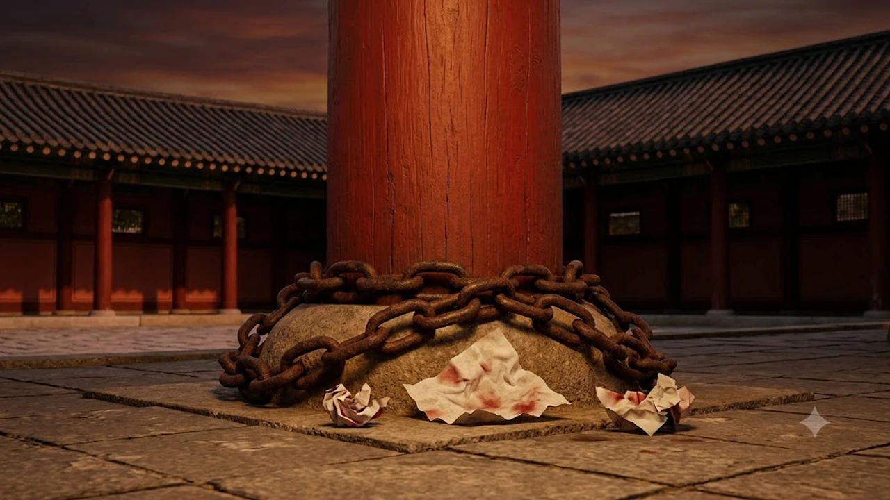

조선의 왕이 일상을 보내던 공간이자 보물 제1759호로 지정된 경복궁 강녕전에서 창호지가 손가락으로 뚫리는 훼손 사태가 발생했습니다. 최근 현장 사진과 언론 보도를 통해 고의적인 **경복궁 창호지 훼손** 정황이 적나라하게 드러나면서 궁궐 관람 질서와 국가유산 보호를 둘러싼 공분이 커지고 있습니다. 현행 법 체계가 이 같은 고의 훼손 행위를 제대로 단죄하지 못한다는 사실이 밝혀지며 법 개정 요구까지 빗발치는 중입니다.

## 경복궁 강녕전 창호지 구멍 사태의 전말

### 잇따른 고의 훼손 흔적과 관리소의 고충
강녕전 행각과 대청마루를 둘러싼 전통 한지 창호 여러 곳에서 사람 손가락 크기의 구멍이 연달아 발견되었습니다. 바람이나 자연 노후화로 찢어진 형태가 아니라 외부에서 안쪽을 들여다보거나 장난삼아 강하게 찔러 뚫은 고의적 파손 흔적이었습니다.

현장 관리 인력들은 매일 수천 명이 드나드는 개방 구역에서 사각지대를 틈탄 돌발 행위를 일일이 적발하기란 사실상 불가능하다고 호소합니다.

> "안을 들여다보려고 뚫거나 단지 만져보고 싶다는 호기심에 손을 대는 순간, 수백 년 전 숨결을 품은 목조 건축물의 품격은 한순간에 흉물로 전락합니다."

### 창호지 교체 비용과 관람객 통제의 물리적 한계
전통 창호는 일반 공산품 문풍지가 아니라 전통 방식으로 쑨 찹쌀풀과 수제 닥종이를 사용해 수작업으로 바릅니다. 창호 한 칸을 보수하는 작업조차 전문 기능인의 손길을 거쳐야 하므로 행정력과 혈세가 지속적으로 소모됩니다.

- **전통 방식 보수 필요:** 천연 재료 배합 및 건조 공정 수반
- **보수 기간 내 관람 차질:** 가림막 설치로 인한 전각 미관 저해
- **관리 인력 부족:** 광활한 궁궐 전역을 실시간으로 감시할 물리적 경비 인력 부족

## 국가유산인데 왜 처벌하지 못하는가?

### 문화유산법상 '문화재 손상' 성립 요건과 법적 공백
국가유산기본법 및 문화유산보존및활용에관한법률에 따르면 지정문화유산을 손상하거나 효용을 해친 자는 징역형 등 중형에 처해집니다. 문제는 창호지 자체를 목조 건축물 본체와 동일한 효용 가치로 볼 것인지에 대한 사법적 해석입니다.

법조계에서는 창호지를 건축물의 골격이나 원형 구조물과 달리 주기적으로 덧대고 뜯어내는 '소모성 부속물'로 판단하는 경향이 강합니다. 건축물 고유의 구조적 효용을 영구히 상실시키지 않았다는 이유로 중범죄 혐의를 적용하기 까다롭다는 허점이 존재합니다.

### '원형 보존 유산'과 '소모품' 사이의 제도적 괴리
유럽 유적지에서 벌어진 대형 사건들을 다룬 [빈 박물관 보석 도난, 진짜 보안 뚫린 이유 3가지](/posts/humanities/vienna-museum-jewel-heist-security-2026/) 사례를 보더라도, 유적과 유물 보안의 핵심은 사후 단속보다 명문화된 규범과 물리적 차단선 구축에 있습니다.

국내 법령 체계는 창호지, 기와 파편, 흙벽 찰흙 등 떼어내기 쉬운 부속 재료를 경미한 소모품으로 치부해 보호 사각지대에 방치해 왔습니다. 결과적으로 수백 년 된 전각의 일부를 망가뜨려도 일반 재물손괴죄나 경범죄 수준의 벌금형에 그치는 제도적 모순이 반복됩니다.

### 손해배상 청구와 경범죄 처벌법 적용의 실효성 한계
가해자를 특정해 내더라도 청구할 수 있는 손해배상액은 창호지 시공 실비 수준에 불과합니다. 형사처벌 역시 경범죄처벌법상 자연공원 및 공공시설 훼손 조항에 기대어 10만 원 안팎의 과태료 처분에 머무는 구조입니다.

가벼운 처벌 수위는 예방 효과를 전혀 발휘하지 못하며, 오히려 "걸려도 얼마 안 낸다"는 도덕적 해이를 조장하는 악순환을 낳습니다.

## 해외 주요 궁궐·유적지의 훼손 대응 방식

### 영국·프랑스의 '무관용 원칙'과 징벌적 손해배상
영국 왕실 역사궁전관리기구(HRP)와 프랑스 국립유적센터(CMN)는 문화유산 구역 내 미세한 파손에 대해서도 가차 없는 무관용 원칙을 관철합니다.

- **징벌적 배상금:** 복구 비용 외에 유적 가치 훼손에 따른 징벌적 손해배상 청구
- **영구 출입 금지:** 적발 즉시 해당 국가 내 전체 국립 박물관 및 유적지 입장 블랙리스트 등재
- **형사 기소 원칙:** 경미한 낙서나 긁힘도 공공기물 중손괴 혐의로 즉각 기소

### 일본 목조 문화재 보존 구역의 물리적 차단 및 동선 분리
교토의 니조성이나 주요 신사 등 전통 목조 양식이 보존된 일본의 유적지는 관람객 동선과 창호벽 사이에 엄격한 이격 거리를 둡니다.

얇은 창호지나 미닫이문이 설치된 구역에는 센서형 가이드라인과 투명 아크릴 차단벽을 전면 배치해 방문객의 손이 직접 닿는 행위 자체를 원천 차단합니다. 훼손 가능성을 사전 차단하는 인프라 구축이 유적의 수명을 연장하는 실질적 해법임을 증명합니다.

### 처벌 수위 강화 vs 접근성 제한, 무엇이 정답인가
처벌 수위를 높여 법적 경각심을 주는 방안과 관람 동선을 제한해 유산을 물리적으로 격리하는 방안은 상호 충돌하는 면이 있습니다. 

접근성을 과도하게 막으면 시민들이 궁궐의 공간 미학을 체감하기 어려워지고, 접근을 전면 개방해 두면 훼손의 위험을 감내해야 합니다. 두 축 사이의 균형점을 제도적으로 명문화하는 입법 노력이 시급합니다.

## 관람객 시민의식과 지속 가능한 궁궐 보존의 길

### 촉각적 호기심과 파괴 행위의 인문학적 경계
전통 한옥의 창호는 안과 밖의 빛을 은은하게 투과하며 공간의 깊이를 엮어내는 철학적 장치입니다. 문풍지를 손가락으로 뚫어 안을 엿보려는 심리는 타인의 내밀한 영역을 엿보려는 관음증적 호기심과 파괴 본능의 결합에 불과합니다.

유산을 만지고 훼손하면서 느끼는 일차원적 쾌감은 공공이 함께 누려야 할 역사적 숭고미를 정면으로 훼손하는 미성숙한 태도입니다.

### 예약제 강화·감시 카메라 증설이 가져올 관람 문화의 변화
무분별한 훼손이 지속된다면 경복궁 역시 전면 사전예약제나 전각 밀착 관람 금지 조치를 피할 수 없습니다. 고해상도 폐쇄회로(CC)TV 증설과 사각지대 인공지능 감시 체계 도입은 관람객의 자유로운 이동을 제약하는 결과를 부릅니다.

일부 몰지각한 행위로 인해 지불해야 할 사회적 비용이 모든 시민의 문화 향유권 축소로 돌아온다는 경각심을 가져야 합니다.

### 우리가 조선의 궁궐을 대하는 최소한의 문화적 태도
궁궐은 박제된 세트장이 아니라 과거와 현재가 교감하는 살아 숨 쉬는 역사 공간입니다. 보존이란 제도의 강제가 아닌 현장을 방문하는 개개인의 성숙한 거리두기에서 출발합니다.

법 개정을 통해 미비한 처벌 근거를 다잡는 일과 함께, 눈으로 감상하고 마음에 담는 관람 예절이 정착될 때 비로소 우리의 국가유산도 온전한 모습으로 다음 세대에 전해집니다.

[조선 궁궐 역사 도서 쿠팡에서 보기](https://www.coupang.com/np/search?q=%EC%A1%B0%EC%84%A0%20%EA%B6%81%EA%B8%84%20%EC%97%AD%EC%82%AC%20%EB%8F%84%EC%84%9C&sourceType=affiliate&trackingCode=AF8691300)

#경복궁 #경복궁창호지훼손 #강녕전 #문화유산법 #국가유산청 #문화재보호 #궁궐관람에티켓 #조선궁궐역사