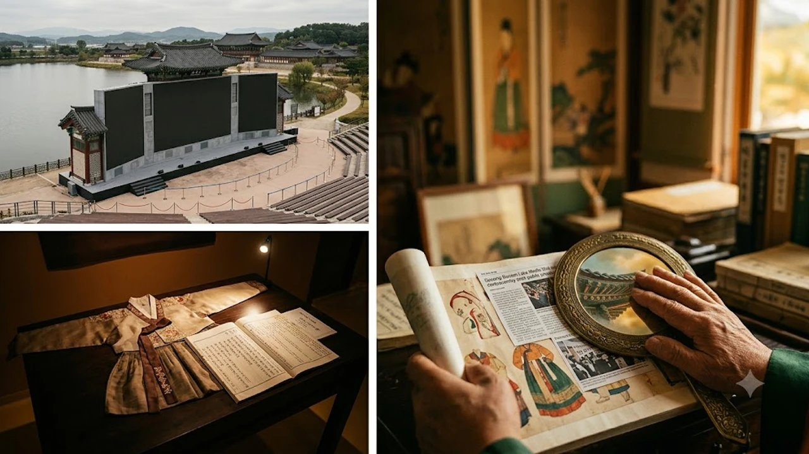

경북 경주 보문관광단지 한복판에 세워진 15억 원짜리 공공 미디어월 전광판 영상에서 중국풍 전통의상이 등장해 논란이 불거졌습니다. 신라의 도읍을 상징해야 할 대형 스크린 속 인물 의복에 한글과 영문으로 버젓이 '한복(HANBOK)' 표기가 붙으면서, **경주 미디어월 한복 논란**은 단순한 자막 오기를 넘어 국가적 문화 주권과 공공 조형물 검수 실태를 향한 날 선 비판으로 번졌습니다.

## 15억 투입된 경주 보문단지 미디어월, 전면 가동 중단 사태

### 시운전 영상서 드러난 치명적 오류: 중국 전통 복식이 '한복'으로 둔갑
경상북도와 경북문화관광공사가 'POST APEC' 랜드마크로 조성한 대형 미디어월 시운전 영상에서 심각한 시각 왜곡이 포착되었습니다. 영상 속 여인들은 소매가 넓게 퍼지고 깃이 깊게 교차하는 전형적인 중국 명·청대 계열 의상을 착용하고 있었으나, 화면 자막에는 영문 'HANBOK'과 한글 '한복'이 나란히 송출되었습니다. 신라 고유의 가선(깃과 소매 끝 선)이나 포(袍)의 구조와는 완전히 동떨어진 모습이 현장 방문객들의 카메라에 잡히며 파장이 커졌습니다.

### 경북도와 개발사의 즉각적인 송출 올스톱 및 전수 재검수 착수
영상이 공개된 직후 비판이 쏟아지자 경상북도는 미디어월 송출을 즉시 전면 중단했습니다. 발주처인 공사와 외주 제작사는 단순 제작 착오라는 입장을 내놓았지만, 사전 시운전 단계에서조차 기초적인 복식 오류를 걸러내지 못한 채 대중에게 노출했다는 책임론을 피하지 못했습니다. 도 측은 현재 송출 예정이던 모든 미디어아트 콘텐츠를 원점에서 재검토하고 있습니다.

### 서경덕 교수의 공개 비판과 문화계에 번진 거센 후폭풍
서경덕 성신여대 교수는 SNS를 통해 "중국의 이른바 '한복공정'이 전 방위로 이어지는 와중에 국내 대표 역사문화 도시가 앞장서서 빌미를 안겨줬다"며 강하게 질타했습니다. 학계와 문화계 전문가들 역시 지자체 미디어아트 사업이 기술적 화려함에만 치중한 나머지, 역사적 고증이라는 기초 뼈대를 완전히 망각한 결과라고 입을 모았습니다.

## 한중 문화 충돌의 뇌관: 왜 단순 실수로 치부할 수 없는가

### 깃·소매·결구 방식의 결정적 차이: 복식 구조 대조
전통 복식사에서 한복과 한푸는 구조적으로 확연히 갈립니다. 
- **한복의 원형**: 북방 기마민족 계통에 뿌리를 둔 저고리와 바지·치마의 이분형 구조이며, 활동성을 확보하기 위해 품과 소매의 배래선이 자연스러운 곡선을 이룹니다.
- **중국풍 한푸**: 긴 통짜형 옷자락과 과장된 넓은 소매, 깊게 겹치는 교령(交領)이 특징입니다.

미디어월 영상은 신라 고분 벽화나 토우에서 확인되는 한국 고유의 양식을 송두리째 무시하고 중국 웹드라마에서 흔히 볼 수 있는 판타지 복식을 그대로 베껴왔습니다.

### '동북공정' 프레임에 스스로 빌미를 제공한 외교적 패착
주변국이 김치와 한복을 자국 문화의 갈래로 왜곡하려는 시도를 이어가는 민감한 시기에, 한국 공공기관의 공식 스크린에서 중국풍 의상에 '한복' 딱지를 붙여준 셈이 되었습니다. 이러한 시각적 착오는 해외 관광객에게 왜곡된 정보를 심어줄 뿐 아니라, 왜곡 논리를 펴는 측에 역이용당할 수 있는 빌미가 됩니다.

### APEC 유치 도시 경주라는 장소성이 지닌 상징적 무게
경주는 삼국통일을 이룬 신라 천년의 수도이자 국제회의를 앞둔 글로벌 문화 거점입니다. 전 세계의 이목이 쏠리는 도시 한가운데에 국가 문화유산의 기본조차 지키지 못한 콘텐츠를 걸어두었다는 사실은 지자체 문화 브랜딩의 뼈아픈 실책으로 남을 수밖에 없습니다.

## 공공 미디어 콘텐츠 제작 시스템의 구조적 허점

### 외주 제작과 하청 구조 속 '전문가 감수'의 실종
이번 사태의 핵심 원인은 공공 프로젝트 전반에 만연한 다단계 외주 하청 구조입니다. 발주 기관은 기획과 기술 규격만 관리할 뿐 실제 화면에 들어가는 시각 자료의 고증에는 관여하지 않았고, 하청 제작사는 촉박한 납기를 맞추기 위해 검증되지 않은 그래픽 에셋을 무분별하게 차용했습니다. 역사학자나 복식 전문가의 사전 감수 절차는 계약서 어디에도 명시되어 있지 않았습니다.

### 생성형 AI 도입이 낳은 데이터 왜곡과 시각 오염
제작 과정에서 상용 생성형 AI 모델이 활용되었을 가능성도 짙습니다. 영미권과 중국어 데이터셋 비중이 압도적인 이미지 생성 AI에 '동양 전통의상'이나 '고대 아시아 의복'을 입력하면, 알고리즘은 필연적으로 데이터 모수가 큰 중국풍 실루엣으로 편향된 결과를 뱉어냅니다. 기계가 만들어낸 왜곡된 시각 정보에 무비판적으로 의존할 때 주체적 사고와 진실이 어떻게 훼손되는지는 [제로 클릭 2026, 내 자유의지는 진짜 살아있을까?](/posts/humanities/zero-click-era-autonomy-2026/) 포스팅에서도 깊이 짚어본 대목입니다.

### 사후약방문식 행정 검증의 한계
문제가 터지기 전까지 누구도 위화감을 느끼지 못했다는 점은 행정 모니터링 체계가 완전히 붕괴했음을 방증합니다. 수억, 수십억 원의 예산이 들어간 조형물임에도 불구하고 정작 핵심 알맹이인 콘텐츠 검증은 담당 공무원 몇 명의 형식적인 육안 확인에 그쳤습니다. 결국 시민들의 문제 제기와 언론 보도가 터지고 나서야 가동을 멈추는 구태의연한 방식이 반복되었습니다.

## 문화유산 디지털화 시대, 반복되는 오류를 막기 위한 대안

### 공공 문화 콘텐츠 '역사·복식 전문가 검수 인증제' 의무화
지자체나 국가기관이 주관하는 모든 디지털 미디어아트 사업에는 전통문화 전문가의 자문 및 전수 검수를 의무화해야 합니다.
- **4단계 교차 검증**: 콘티, 3D 모델링, 텍스처 작업, 최종 렌더링 단계마다 복식사 전문가 확인 필수화
- **전문가 실명제**: 자문에 참여한 학자의 이름을 크레딧에 공개해 검수 책임성 부여
- **하자 보수 기준 강화**: 고증 오류 발생 시 즉각 재작업 및 납품업체 페널티 조항 신설

### 한국 문화유산 공공 3D 데이터셋 구축
AI 툴과 3D 그래픽 기술을 현장에서 배제하기 어려운 만큼, 정부 차원에서 박물관 수장고의 유물과 복식을 정밀 스캔한 고해상도 공공 데이터셋을 전면 개방해야 합니다. 알고리즘에 한국 고유의 곡선, 직물 질감, 결구 방식을 학습시켜 상용 AI의 편향을 바로잡는 디지털 인프라 투자가 시급합니다.

역사적 실체를 눈으로 확인하고 왜곡을 바로잡는 안목을 기르려면 [전통 복식 및 한국 고대사 도서 쿠팡에서 보기](https://www.coupang.com/np/search?q=%ED%95%9C%EA%B5%AD+%EC%A0%84%ED%86%B5%EB%B3%B5%EC%8B%9D+%EA%B3%A0%EB%8C%80%EC%82%AC&sourceType=affiliate&trackingCode=AF8691300)를 통해 실물 사료와 연구 기록을 직접 확인해보는 것도 큰 도움이 됩니다.

#경주미디어월 #한복논란 #보문단지미디어월 #역사왜곡논란 #신라복식 #공공미디어아트 #AI데이터편향