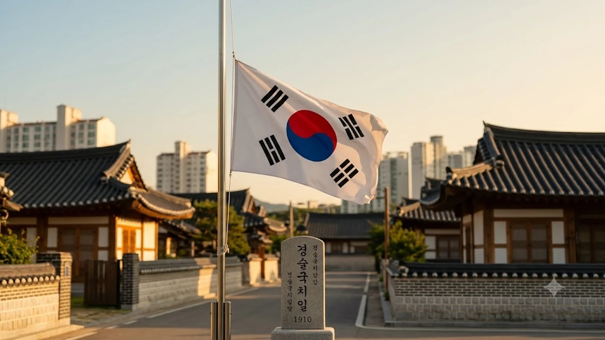

매년 8월 29일은 국권을 통째로 빼앗긴 뼈아픈 역사를 되새기는 날이며, 주권 의식을 다잡기 위해 **경술국치일 조기게양** 실천이 요구되는 시점이다. 과거 일제가 강요한 '한일병합'이라는 식민 통치 프레임을 걷어내고 '국권피탈'이라는 실증적 역사 용어를 바로잡는 일은 왜곡된 역사 인식을 정화하는 첫걸음이다. 치욕의 날을 잊지 않고 미래를 지키는 방패로 삼기 위해 알아두어야 할 쟁점과 실천법을 짚는다.

## 8월 29일 경술국치일의 역사적 배경과 조기 게양 유래

### 1910년 8월 29일 대한제국 국권피탈의 전말
1910년 8월 29일 대한제국은 통치권을 강제로 빼앗겼다. 친일 내각 총리대신 이완용과 제3대 통감 데라우치 마사타케가 결탁해 체결한 조약이 공포되면서 500년 넘게 이어진 조선과 대한제국의 명맥이 끊겼다. 순종 황제는 조약 체결을 거부했으나 일제 헌병의 삼엄한 포위 속에서 옥새가 강탈되었고, 우리 민족은 35년간 이어질 식민 통치의 암흑기에 접어들었다.

### 국가 추념일로서 조기를 게양하는 법적·역사적 의미
광복절이나 개천절 같은 경축일에는 깃봉 끝에 바짝 붙여 태극기를 달지만, 국권을 잃은 날에는 조의를 표하기 위해 **조기(弔旗)**를 게양한다. 현재 전국 대다수 지방자치단체는 조례를 제정해 8월 29일을 조기 게양일로 지정했다. 이는 단순한 슬픔의 표현을 넘어, 뼈아픈 실책을 되짚고 주권의 가치를 망각하지 않겠다는 국가적 약속이다.

### 조기 게양 시간과 올바른 태극기 게양 방법 가이드
조기는 깃봉에서 깃면의 세로 너비만큼 깃면을 아래로 내려서 다는 것이 올바른 방법이다.
- **게양 시간**: 관공서 및 공공기관은 오전 7시부터 자정까지, 일반 가정과 민간 기업은 오전 7시부터 오후 6시까지 게양한다.
- **게양 위치**: 밖에서 바라보았을 때 대문이나 아파트 베란다의 중앙 또는 왼쪽에 설치한다.
- **날씨 기준**: 심한 비바람이나 태풍으로 태극기가 훼손될 우려가 있다면 게양을 피하고, 맑게 갠 후 다시 단다.

## '한일병합'과 '국권피탈' 용어가 지닌 결정적 차이

### 일제 식민사관이 주입한 한일합병·한일병합의 기만성
'한일합병'이나 '한일병합'은 대등한 두 주권 국가가 자발적인 합의를 거쳐 통합했다는 뉘앙스를 담은 일제의 정치적 조작 용어다. 1910년 당시 일제는 국제사회의 비판을 피하고자 강제 점령을 합법적 외교 절차로 포장했다. 이 용어를 비판 없이 수용하면 가해자가 짜놓은 식민사관 논리에 그대로 휘말리는 꼴이 된다.

### 늑약의 원천 무효를 증명하는 경술국치와 국권피탈
반면 **'국권피탈(國權被奪)'**은 주권을 강제로 빼앗겼다는 침탈의 성격을 분명히 드러낸다. 경술년에 일어난 국가적 치욕이라는 뜻의 **'경술국치(庚戌國恥)'** 역시 피해자 관점에서 굴욕과 분노를 잊지 않겠다는 주체적 선언이다. 단어 하나가 역사의 성격을 규정짓는다. 텍스트에 내포된 의도를 비판적으로 해체하는 작업은 인문학의 본령이며, 최근 청년층 사이에서 주목받는 [텍스트힙 진짜 트렌드인가? 완전 정리](/posts/humanities/text-hip-independent-humanities-2026/) 현상 또한 문맥을 주체적으로 독해하려는 흐름과 맞닿아 있다.

### 공공 문서 및 교육 현장의 올바른 역사 용어 표준화
최근 역사 교과서와 공공기관 공식 표기에서는 '한일합병'이라는 식민지적 용어를 배제하고 '국권피탈'과 '경술국치'로 명칭을 일원화하고 있다. 조약 자체가 황제의 비준권 결여와 군사적 강요로 체결되어 법적 효력이 전혀 없음을 분명히 하는 조치다. 일상 대화와 디지털 공간에서도 정확한 용어를 정착시키는 노력이 필요하다.

## 광복절과 경술국치일로 짚어보는 8월의 역사적 인문학

### 빛을 되찾은 환희와 주권을 잃은 비극의 교차
8월은 15일 광복의 환희와 29일 국권피탈의 비극이 교차하는 달이다. 빼앗긴 역사가 존재했기에 되찾은 빛의 가치가 더욱 무겁게 다가온다. 두 사건을 분리하지 않고 연결된 역사적 맥락으로 바라볼 때 비로소 근현대사를 관통하는 주권 의식이 뚜렷해진다.

### 역사를 잊은 민족에게 미래가 없는 이유와 교훈
단재 신채호 선생의 경고처럼 과거의 과오를 은폐하거나 잊어버린 집단은 필연적으로 동일한 위기 앞에서 무너진다. 치욕을 기록하고 기억하는 작업은 자기 비하나 자학이 아니라, 외교와 국방의 주도권을 유지하기 위한 강력한 정신적 백신이다.

### 현대 사회에서 과거의 치욕을 기억하는 성숙한 방식
> "상처를 정면으로 응시하는 공동체만이 온전한 회복을 이룬다."

단순한 감정적 배척이나 소모적인 적대감에 머물러서는 안 된다. 당시 급변하던 동아시아 정세 속에서 구한말 지배층이 왜 국가를 지키지 못했는지 시스템적 결함을 냉철하게 분석하는 자세가 요구된다. 과거의 실패를 디딤돌 삼아 현대의 국가 전략을 다듬는 것이 성숙한 인문학적 태도다.

## 일상에서 실천하는 경술국치일 추념과 올바른 태도

### 가정 및 공공기관의 조기 게양 자가 점검표
실천 없는 기억은 금세 휘발된다. 8월 29일 당일 실천할 점검 항목은 다음과 같다.
- 깃면의 세로 너비만큼 깃봉 아래로 내려 조기를 달았는가?
- 오염되거나 구겨진 태극기를 그대로 달지 않았는가?
- 주변 이웃이나 구성원에게 8월 29일 조기 게양의 의미를 알렸는가?

### 역사 왜곡 방지를 위한 디지털 사료 아카이브 활용법
왜곡된 정보에 흔들리지 않으려면 1차 사료를 확인하는 습관을 들여야 한다. '국사편찬위원회 한국사데이터베이스'나 '동북아역사재단' 포털을 이용하면 순종 황제의 비준 거부 증거와 일제의 불법적 조약 강제 과정을 원문 자료로 직접 검증할 수 있다.

### 국권의 소중함을 되새기는 인문학적 실천 3가지
첫째, 무의식중에 사용하던 '한일합병' 표현을 '국권피탈'로 고쳐 쓴다. 둘째, 8월 29일 조기 게양에 동참하여 주권 수호의 뜻을 가시적으로 드러낸다. 셋째, 우리 근현대사 기록을 다룬 역사 도서를 탐독하며 시대적 교훈을 사유한다. 이러한 실천이 누적될 때 국가와 개인의 자존감은 흔들림 없이 유지된다.

[경술국치 관련 한국사 도서 쿠팡에서 보기](https://www.coupang.com/np/search?q=%ED%95%9C%EA%B5%AD%EC%82%AC+%EC%97%AD%EC%82%AC%EB%8F%84%EC%84%9C&sourceType=affiliate&trackingCode=AF8691300)

#경술국치일 #국권피탈 #조기게양 #올바른역사용어 #한일병합무효 #태극기다는법 #8월29일