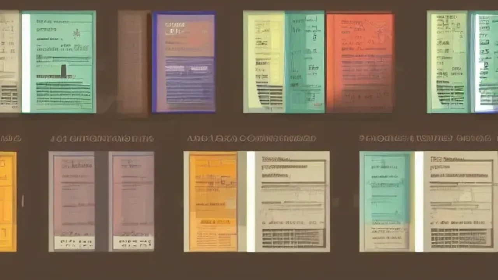

생성형 인공지능이 일상과 업무 깊숙이 침투한 오늘날, 단순한 명령어 입력을 넘어 AI의 결과물을 조율하고 통제하는 **AI 지휘력**은 시장에서 생존하기 위한 필수 역량입니다. 기술의 발전 속도가 인간의 적응력을 앞지르는 상황에서, 시스템의 결함과 환각을 보완하는 인간 중심의 기획력은 그 어느 때보다 강력한 무기가 됩니다. 인공지능을 하급 직원처럼 부리며 최고의 퍼포먼스를 도출하는 지휘관의 관점이 요구되는 시점입니다.

## 2026년 왜 'AI 지휘력'이 생존의 무기가 되었는가

### 생성형 AI의 한계와 휴먼인더루프(Human-in-the-loop)의 부상
초기 생성형 인공지능 시장이 단순한 프롬프트 엔지니어링, 즉 '명령어를 얼마나 정교하게 입력하는가'에 집중했다면 현재는 인공지능의 연산 과정과 최종 판단 사이에 인간이 개입하는 **'휴먼인더루프(Human-in-the-loop)'** 모델로 패러다임이 전환되었습니다. 거대언어모델(LLM)이 생성하는 결과물은 그럴듯하지만 치명적인 오류를 포함하는 경우가 잦기 때문입니다. 데이터의 무결성을 검증하고, 비즈니스의 최종 방향성을 결정하는 주체는 결코 기계가 될 수 없으며 오직 독창적인 통찰을 가진 인간만이 수행 가능한 영역입니다.

### 단순 맹신과 통제의 차이: 기술을 부리는 인간의 시선
인공지능이 도출한 결괏값을 검증 없이 그대로 복사하여 붙여넣는 사용자는 도구에 종속된 일차원적 작업자에 불과합니다. 반면, 지휘 역량을 갖춘 인재는 인공지능의 논리 구조를 비판적으로 바라보며 맹점을 파고듭니다. 시스템이 제시한 대안의 허점을 날카롭게 지적하고, 비즈니스 맥락에 맞게 맥락을 재구성하는 통제력을 발휘할 때 비로소 기술은 인간의 생산성을 극대화하는 강력한 비서로 기능합니다.

### 2026년 기업이 원하는 파이형 인재의 정의
현대 비즈니스 환경이 요구하는 **파이형 인재**는 두 개의 전문 지식과 이를 연결하는 넓은 인문학적 소양을 갖춘 사람을 뜻합니다. 단순히 코딩을 잘하거나 마케팅 데이터만 볼 줄 아는 단편적 전문가에서 벗어나, 기술적 메커니즘을 이해함과 동시에 인간과 사회에 대한 깊은 사유를 결합하는 리더입니다. 기업들은 인공지능 기술 자체를 다루는 스킬보다, 조직의 철학과 방향성에 맞게 기술을 부리는 기획형 인재 확보에 사활을 걸고 있습니다.

## 인문학적 통찰이 AI의 결괏값을 바꾼 실제 사례

### 질문의 격이 답의 격을 만든다: 철학적 접근의 힘
> "기술은 언제나 도구일 뿐이며, 그 도구가 향할 목적지를 지정하는 것은 인간의 철학적 질문이다." 

실제 국내 한 브랜딩 컨설팅 프로젝트에서 인공지능에게 단순한 카피라이팅을 주문했을 때는 상투적인 문구만 출력되었습니다. 그러나 **정의(Justice)와 소외**라는 사회철학적 담론을 프롬프트의 전제 조건으로 주입하자, 타겟 고객의 페르소나를 정교하게 파고드는 깊이 있는 문장이 도출되었습니다. 질문자가 축적한 지식의 깊이가 인공지능의 잠재력을 깨우는 방제선 역할을 한 셈입니다.

### 역사와 심리학 데이터를 활용한 마케팅 문구 혁신 사례
한 가구 스타트업은 신제품 출시 과정에서 인공지능에게 1920년대 바우하우스 디자인 철학과 현대 1인 가구의 고립 심리를 연계한 콘텐츠 기획을 명령했습니다. 역사적 맥락과 심리학적 메커니즘을 명확히 명시하자, 시스템은 단순 편의성을 강조하는 광고를 넘어 '공간이 주는 위로와 연대'라는 고차원적인 마케팅 스토리를 생성했습니다. 이처럼 인문학적 뼈대를 먼저 구축하는 역량은 정량적 데이터가 주지 못하는 폭발적인 전환율을 만들어냅니다.

### AI의 환각(Hallucination) 현상을 잡아낸 인간의 편집력
미국 로펌과 IT 기업의 협업 연구에 따르면, 전문 법률 서적을 학습한 인공지능조차 판례를 임의로 조작하는 환각 현상이 발생했습니다. 이를 최종 스크리닝하고 논리적 허점을 도출한 것은 수십 년간 고전 문헌을 해독하며 **비판적 텍스트 분석력**을 길러온 전문 편집자 그룹이었습니다. 텍스트의 행간을 읽고 교차 검증을 수행하는 인간의 감각은 기술이 모방할 수 없는 최후의 보루입니다.

## 기술에 대체되지 않는 'AI 지휘력' 개발 튜토리얼

### 맥락과 의도를 설계하는 '구조적 기획서' 작성법
인공지능에게 업무를 지시하기 전, 반드시 인간의 머릿속에서 완벽한 구조화가 선행되어야 합니다. 명령어 한 줄을 던지는 나태함에서 벗어나, 아래와 같은 구조적 프레임을 먼저 설계하는 훈련이 필요합니다.
- **배경(Context):** 이 프로젝트가 발의된 구체적인 비즈니스 상황과 목적
- **제약 조건(Constraints):** 절대 포함해서는 안 되는 단어나 브랜드 기조
- **출력 형식(Format):** 단순 텍스트가 아닌 타겟 독자의 심리를 고려한 전개 방식

### 논리적 오류를 잡아내는 코칭형 피드백 기술
인공지능의 1차 결과물이 만족스럽지 않을 때 "다시 작성해 줘"라는 무의미한 명령을 반복하는 것은 최악의 접근입니다. 훌륭한 인사권자처럼 결괏값의 논리적 허점을 구체적으로 짚어내야 합니다. "A 문단에서 제시한 근거는 B라는 전제와 모순되니, 인과관계를 명확히 해라" 혹은 "감정적인 수식어가 과도하니 객관적인 지표 중심으로 어조를 변경하라"와 같이 **교정형 피드백**을 제공하는 루틴을 일상화해야 합니다.

### 고전 문학 독서를 통한 비판적 사고력 루틴 만들기
기술을 통제하는 거시적 안목은 매일 마주하는 숏폼 콘텐츠나 단편적인 정보 검색으로는 결코 길러지지 않습니다. 인간의 본질을 다룬 고전문학과 철학 서적을 심층적으로 읽으며 문맥을 파악하고 행간에 숨겨진 의미를 도출하는 훈련을 반복해야 합니다. 일주일에 단 한 장이라도 저자의 주장을 반박해 보거나 나만의 언어로 요약하는 글쓰기 연습은 인공지능의 논리를 단숨에 압도하는 비판적 사고력의 원천이 됩니다.

[관련 글 보기](/posts/humanities/)

## AI 지휘 역량이 가져올 커리어의 장단점과 미래 전망

### 대체 불가능한 기획자로 거듭나는 확실한 장점
이 역량을 완전히 체화한 기획자는 단순 반복 업무에서 완벽히 해방됩니다. 기존에 수일이 소요되던 자료 조사와 초안 작성 과정을 단 몇 분 만에 끝마치고, 오직 **전략 수립과 크리에이티브 디렉션**에만 온전한 에너지를 쏟아부을 수 있습니다. 업무 생산성이 기하급수적으로 증가함에 따라 시장에서 대체 불가능한 고연봉 리더로 자리매김하는 발판이 마련됩니다.

### 과도한 검수 피로감과 인간 소외감을 극복하는 방법
반면 인공지능의 결과물을 끊임없이 의심하고 검증하는 과정에서 극심한 정신적 피로감이 발생할 우려가 있습니다. 기계가 쏟아내는 수많은 텍스트 속에서 가짜 정보를 가려내는 작업은 고도의 집중력을 요구하기 때문입니다. 업무 시스템과의 적절한 심리적 거리를 유지하고, 온전한 아날로그 사유의 시간을 확보하여 검수 번아웃을 예방하는 자기통제 장치가 수반되어야 합니다.

### 향후 5년, AI 지휘력이 바꿀 대한민국 직무 지형도
앞으로 단순 오퍼레이터나 매뉴얼 기반의 직군은 급격히 소멸할 예정입니다. 그 자리는 기술을 도구 삼아 거대한 비즈니스 아키텍처를 설계하는 소수의 **'디렉터'**들이 차지하게 됩니다. 기술이 고도화될수록 오히려 역설적으로 인간의 가치관, 인문학적 지혜, 그리고 결단력이 비즈니스의 성패를 가르는 핵심 변수로 작용하는 시대가 도래할 것입니다.

**함께 읽으면 좋은 글**
- [AI윤리 해답, 진짜 불교 철학인가](/posts/humanities/ai-ethics-buddhism-philosophy-2026/)
- [8월 14일 위안부 기림의 날, 꼭 알아야 할 핵심 3가지](/posts/humanities/august-14th-comfort-women-memorial-day-2026/)

#AI지휘력 #휴먼인더루프 #파이형인재 #인문학적통찰 #비판적사고 #2026트렌드 #커리어전략 #생성형AI역량 #기술통제력