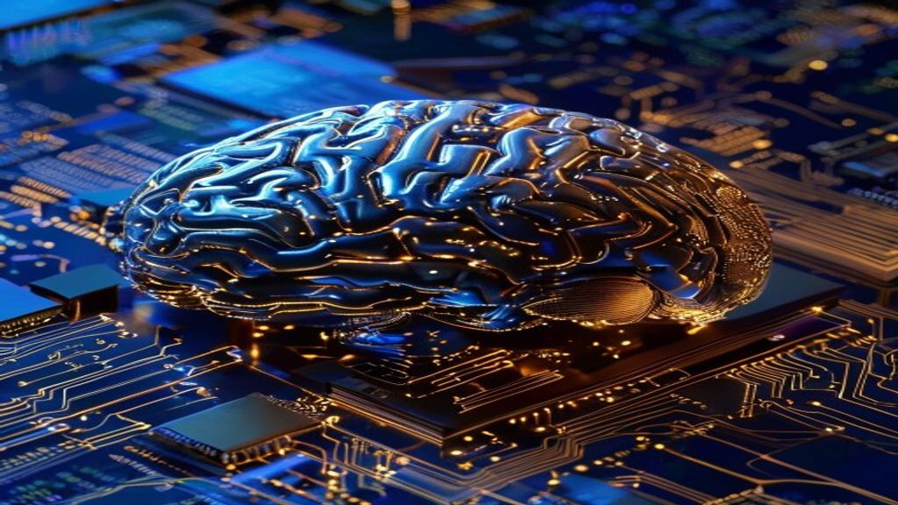
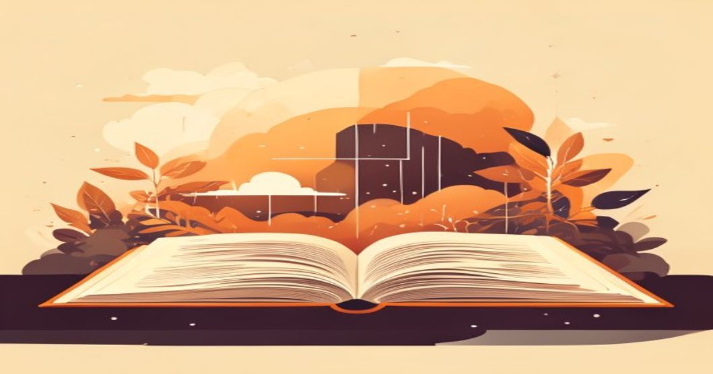

인공지능 기술이 인간의 지적 노동을 완벽히 대체할 것처럼 위세를 떨치면서 수많은 이들이 커리어의 한계와 미래에 대한 공포를 호소합니다. 이러한 기술 만능주의의 폭주 속에서 역설적으로 인간 고유의 통찰력을 길러주는 AI 시대 인문학이 생존을 위한 최고의 치트키로 급부상했습니다.

## AI 시대 인문학, 왜 지금 다시 주목받는가?

### 생성형 AI의 치명적 맹점과 휴먼 인 더 루프(Human-in-the-Loop)

생성형 인공지능이 논문을 쓰고 코딩을 척척 해내는 시대이지만, 인간이 중심에서 통제하는 '휴먼 인 더 루프'의 가치는 오히려 독점적인 위상을 갖습니다. 인공지능은 기존 데이터를 짜깁기하여 통계적 확률로 결론을 뱉어낼 뿐, 스스로 윤리적 가치를 판단하거나 새로운 철학적 가조를 창조하지 못하기 때문입니다. 인공지능이 도출한 수많은 결과물 중에서 어떤 정보가 진실이며 조직에 유익한지 검증하는 최종 판단권은 언제나 인간의 몫입니다. 기계의 맹점을 간파하고 올바른 방향타를 잡는 철학적 안목이 몸값을 결정하는 핵심 지표가 된 이유입니다.

### 지식 암기족의 몰락과 질문·맥락의 지배력

단순한 지식과 사실을 머릿속에 집어넣는 전통적인 학습 방식은 인공지능의 등장과 함께 완전히 파산했습니다. 필요한 정보와 가이드라인은 고도화된 프롬프트를 통해 몇 초 만에 추출할 수 있습니다. 이제 시장에서 살아남는 역량은 방대한 데이터 속에서 '어떤 날카로운 질문을 던질 것인가'와 '이 지식이 어떤 맥락에서 작동하는가'를 파악하는 능력입니다. 고대 그리스 철학자들이 행했던 집요한 문답법처럼, 사물의 본질을 꿰뚫는 오리지널 질문을 던지는 힘은 오직 깊이 있는 철학적 사유를 통해서만 길러집니다.

### 기술 과잉 사회가 불러온 뇌의 고장과 대중의 결핍

알고리즘이 추천하는 도파민 자극형 콘텐츠에 갇혀 정신적 공황을 겪는 현대인이 폭발적으로 늘어났습니다. 기술이 편리해질수록 인간은 고립감과 심리적 피로감을 더 크게 느끼는 모순에 직면합니다. 대중은 화면 속 가상 세계가 아닌, 변하지 않는 삶의 진리와 인간다운 온기를 마침내 갈구하기 시작했습니다. 2026년 현재 서점가에서 니체의 거친 문장이나 스토아철학 입문서가 역주행하며 베스트셀러를 차지하는 현상은, 삶의 중심을 잡고자 하는 이들의 처절한 생존 본능을 대변합니다.

## 챗GPT가 못 하는 인간만의 독보적인 3가지 핵심 역량

### 비판적 사고를 통한 데이터 사기 검증 능력

인공지능은 그럴듯한 거짓말을 진짜처럼 지어내는 '환각 현상(Hallucination)'이라는 치명적인 결함을 숨기고 있습니다. 무비판적으로 기계의 결과물을 수용하다가는 비즈니스와 학문에서 회복 불가능한 타격을 입게 됩니다. 철학적 훈련을 거친 인간은 텍스트의 이면에 숨겨진 의도를 단번에 파악하고 논리적 오류를 잡아내는 비판적 사고력을 발휘합니다. 데카르트가 모든 것을 의심하며 진리를 찾아갔던 것처럼, 인공지능의 출력물을 끊임없이 의심하고 벼려내는 능력은 인간만의 독점적 영토입니다.

### 타인의 마음에 주파수를 맞추는 감성적 연결

인공지능은 인간의 감정을 그럴듯하게 흉내 낼 수는 있지만, 실제로 슬픔을 느끼거나 타인의 고통에 공감하지 못합니다. 인문학의 핵심은 문학과 역사를 통해 내가 경험해보지 못한 타인의 삶을 간접적으로 체험하고 이해하는 데 있습니다. 마케팅, 서비스 기획, 조직 관리 등 전 세계 모든 비즈니스의 종착지는 결국 인간의 마음을 사로잡는 일입니다. 타인의 마음에 깊이 동조하고 정서적인 유대감을 형성하는 능력은 인공지능이 결코 침범할 수 없는 인간의 무기입니다.

### 윤리적 판단과 가치관 정립: 책임을 지는 주체의 힘

의료, 법률, 자율주행 등 생명과 직결된 분야에서 인공지능이 결정을 내릴 때, 그 책임은 결코 코딩 덩어리에 물을 수 없습니다. 알고리즘은 도덕적 책임감이 없으므로 잘못된 선택에 대해 후회하거나 반성하지 않습니다. 오직 인간만이 자신의 선택에 책임을 지며, 사회 공동체를 위한 도덕적 가치 기준을 세울 수 있습니다. 무엇이 정의롭고 무엇이 지속 가능한 미래를 위한 길인지 고민하는 철학적 윤리 의식은 기술 사회를 지탱하는 뼈대와 같습니다.

## 기술을 지휘하는 리더가 되는 진짜 인문학 공부 3단계

### 진짜 가치를 깨우는 원전 정독 훈련

유행하는 얄팍한 짜깁기 도서를 읽는 수준을 넘어, 수천 년의 세월을 버텨온 고전 원전을 정독하는 일부터 시작해야 합니다. 플라톤의 《국가》나 아우렐리우스의 《명상록》 같은 책들은 문장이 촘촘하고 깊어 읽는 과정 자체만으로도 뇌의 전두엽을 강하게 자극합니다.

- 하루에 단 3페이지라도 좋으니 문장을 꼭꼭 씹어 읽으며 저자의 숨은 의도를 파악합니다.
- 마음에 와닿는 구절을 필사하며 나만의 언어로 칼날처럼 재해석하는 버릇을 들입니다.
- 화려한 디지털 기기를 잠시 전원 오프하고 아날로그 텍스트가 주는 느린 사유의 전율을 경험합니다.

### AI 출력물을 의심하고 반박하는 디베이트(Debate) 습관

챗GPT나 클로드와 같은 인공지능 툴을 사용할 때, 단순히 답을 구하는 자판기로 쓰지 말고 훌륭한 논쟁 파트너로 활용하는 방법입니다. 인공지능이 어떤 주장을 펼치면 그 논리의 취약점을 찾아내어 반박하는 프롬프트를 입력해봅니다.

> "네가 방금 제시한 논리는 지나치게 효율성만 강조하고 있어. 만약 소외 계층의 관점에서 이 문제를 바라본다면 어떤 부작용이 생길까?"

이처럼 인공지능의 답변에 꼬리를 무는 반론을 제기하는 과정에서, 독자는 자연스럽게 입체적이고 다각적인 시선을 확보하게 됩니다.

### 철학적 프레임워크를 비즈니스와 일상 문제에 대입하기

책 속의 지식을 머리로만 이해하는 데 그치지 않고, 자신이 직면한 현실의 난제에 대입하여 해결책을 도출하는 단계입니다. 예를 들어 회사에서 새로운 프로젝트의 방향성을 잡아야 할 때, 아리스토텔레스의 수사학 3요소를 적용해볼 수 있습니다.

- **로고스(Logos)**: 인공지능이 수집한 철저한 데이터와 정량적 분석
- **파토스(Pathos)**: 소비자의 감성을 자극하고 결핍을 채워줄 스토리텔링
- **에토스(Ethos)**: 우리 브랜드가 제공하는 신뢰성과 사회적 가치

이러한 철학적 프레임워크를 비즈니스에 투영할 때, 경쟁사들이 모방할 수 없는 독창적이고 본질적인 기획안이 탄생합니다.

## 평범한 직장인이 인문학 통찰로 커리어 위기를 극복한 이야기

### AI 도입 후 업무 효율은 늘었지만 찾아온 극심한 정체기

외국계 IT 기업에서 마케팅 기획자로 근무하던 30대 중반의 한 직장인은 사내에 생성형 AI 마케팅 솔루션이 도입되면서 큰 위기감을 느꼈습니다. 과거에 며칠 밤을 새우며 작성하던 시장 분석 보고서와 카피라이팅 초안을 프로그램이 단 몇 분 만에 완벽하게 뱉어냈기 때문입니다. 업무 효율은 극대화되었지만, 역설적으로 '내가 없어도 회사가 돌아가겠구나'라는 극심한 정체기와 고립감이 찾아왔습니다. 언제든지 기계로 대체될 수 있다는 공포심에 밤잠을 설치는 날이 늘어만 갔습니다.

### 하루 15분, 철학 서적을 읽으며 기획의 본질을 깨닫다

불안감을 달래기 위해 우연히 펼쳐든 스토아 철학자들의 문장 속에서 그는 돌파구를 발견했습니다. 타인의 시선이나 통제할 수 없는 외부 환경(기술의 발전)에 연연하지 말고, 오직 내가 통제할 수 있는 내면의 사유에 집중하라는 조언이었습니다. 이후 출퇴근 길에 스마트폰을 보는 대신 하루 15분씩 고전 철학 책을 읽기 시작했습니다. 철학자들의 치열한 사유 과정을 추적하면서, 그동안 자신이 해왔던 기획이 단순히 트렌드를 쫓아 짜깁기한 '껍데기'에 불과했다는 사실을 뼈저리게 깨달았습니다.

### 대체 불가능한 기획자로 거듭나게 한 인간 중심의 관점 전환

그는 인공지능이 제안하는 정량적 지표 뒤에 숨겨진 소비자들의 '진짜 심리적 결핍'에 주목하기 시작했습니다. 기술적 수치만으로는 설명할 수 없는 인간의 외로움, 소속감에 대한 욕구, 자아실현의 의지를 마케팅 기획의 본질로 삼았습니다.

- AI가 추천한 자극적인 광고 문구를 전면 폐기하고, 인간의 감성을 건드리는 스토리텔링 중심의 캠페인을 전개했습니다.
- 그 결과 해당 프로젝트는 전년 대비 전환율이 140% 이상 성장하는 기록적인 성과를 거두었습니다.
- 기계의 노예에서 기술을 도구로 활용해 인간의 마음을 움직이는 대체 불가능한 핵심 인재로 거듭난 순간이었습니다.

[관련 글 보기](/posts/humanities/)

**함께 읽으면 좋은 글**
- [광복절 태극기 거꾸로 진짜 논란인 이유 3가지](/posts/humanities/gwangbokjeol-taegeukgi-upside-down-controversy-2026/)
- [AI시대 바뀌는 DH2026 디지털인문학 핵심](/posts/humanities/dh2026-digital-humanities-ai-era-2026/)

#AI시대인문학 #인문학트렌드 #생존전략 #비판적사유 #인간중심 #철학공부 #커리어성장 #텍스트힙 #미래역량 #마음챙김
