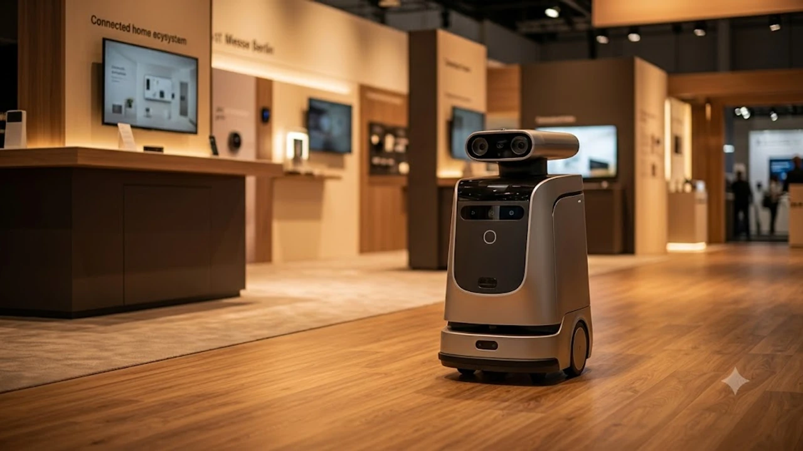

2026년 9월 4일 베를린에서 막을 올린 **IFA 2026** 무대는 인공지능이 화면 속 텍스트를 벗어나 집 안 물리적 공간을 직접 통제하는 현장을 보여준다. 음성 비서가 날씨를 읊어주던 단계를 지나, 센서와 공간 인지 알고리즘이 결합한 차세대 **스마트홈 AI** 생태계가 전시관 전면에 포진했다. 생활 밀착형 기기들이 거주자의 동선을 파악해 스스로 판단하는 피지컬 자동화가 본격적인 현실로 다가왔다.

## 베를린 현지 개막, IFA 2026 무엇이 달라졌나

### 개막 첫날 분위기와 핵심 테마 '일상화된 피지컬 AI'
베를린 메세(Messe Berlin) 전시장 내부에서는 화면 너머의 거대언어모델(LLM)이 아닌, 바퀴와 센서, 로봇 팔을 장착한 실물 기기들이 관람객을 맞이한다. 2026년 가전 시장의 화두는 사용자의 호출을 기다리지 않고 공간 상태를 읽어내 먼저 움직이는 기계적 자율성이다. 

- 센서 기반 실시간 조도 및 공기질 측정 후 능동적 가동
- 집 안 재실자의 이동 경로를 추적하는 초광대역(UWB) 센서 탑재
- 로봇 청소기와 공기청정기가 연동되어 낙하 먼지를 협업 처리하는 동적 시나리오

### 글로벌 주요 제조사 부스 배치와 전년 대비 차별점
전시관 중심부는 대형 디스플레이 대신 허브 역할을 맡은 소형 컨트롤러와 생활 로봇이 차지했다. 과거 관람객의 눈길을 끌던 8K 초고화질 패널 경쟁은 뒤로 밀려났고, 바닥재 재질이나 가구 배치를 입체적으로 스캔하는 센서 모듈 체험 존이 전시장 전면에 배치되었다.

### 단순 음성 명령을 넘어선 자율 행동형 디바이스 전시
"에어컨 켜줘" 같은 단발성 명령어 입력 방식은 전시장에서 자취를 감췄다. 집 안 거주자의 체온 변화와 실내 습도, 창문 개폐 상태를 파악한 허브 기기가 냉난방기와 블라인드를 조절한다. 기계가 사람의 직접적인 개입을 배제한 채 결정을 내리는 환경이 가속화되면서, 기술적 편리함 이면에 놓인 주체성 문제를 다룬 [제로 클릭 2026, 내 자유의지는 진짜 살아있을까?](/posts/humanities/zero-click-era-autonomy-2026/) 논의와 맞닿아 있다.

## 삼성전자 vs LG전자: 거실 패권 쥔 AI 홈 허브 맞대결

### 생성형 AI 기반 스크린 허브 기능 실사용 체감 비교
삼성과 LG는 각각 패밀리허브와 씽큐 온(ThinQ ON)을 무대에 올리며 상반된 접근법을 드러냈다. 삼성전자는 냉장고와 월패드 스크린을 중심으로 거실 공간의 시각적 통합 제어를 강조한다. 반면 LG전자는 음성 인지 전용 소형 원통형 허브를 거실 테이블에 올려두고, 대화의 맥락을 기억해 가족 구성원별 맞춤형 반응을 끌어내는 데 초점을 맞췄다.

### 연결성 생태계 차이: 스마트싱스와 씽큐 온의 진화
두 제조사 모두 글로벌 스마트홈 표준인 매터(Matter) 규격을 지원하지만, 연결 기기를 묶는 방식에서 차이가 난다.

- **스마트싱스(SmartThings)**: 스마트폰, 워치, TV 등 갤럭시 생태계 장치와 연동되어 외출과 귀가 상황을 오차 없이 분기 처리
- **씽큐 온(ThinQ ON)**: 세탁기, 건조기, 스타일러 등 백색가전 모터 구동 데이터를 학습해 기기 간 협업 사이클 최적화

### 전력 소비 최적화 기술이 실제 전기요금에 미치는 영향
두 회사가 앞다퉈 공개한 에너지 절감 알고리즘은 누진제 구간 진입을 사전에 방어하는 능동형 제어를 표방한다. 세탁 시간대를 전력망 요금이 저렴한 시간대로 자동 분산하거나, 냉장고 컴프레서 가동률을 시간대별로 쪼개어 실시간 소비전력을 기존 대비 15~20%가량 낮추는 기술이 현장 데모로 구현되었다.

## 유럽 프리미엄 가전이 던진 에너지 효율과 친환경 화두

### 밀레·보쉬 등 유럽 강자들의 순환 경제 솔루션
밀레(Miele)와 보쉬(Bosch)는 화려한 인터페이스 대신 기기 분해성과 부품 수명 연장에 전시 무게를 실었다. 플라스틱 사출 부품의 재활용 비율을 대폭 끌어올리고, 부품 고장 시 해당 모듈만 원터치로 교체할 수 있는 모듈러 설계를 시연했다.

### 온디바이스 AI 탑재로 달라진 고효율 모터 제어
클라우드 서버와 통신하지 않고 기기 내부 칩셋에서 직접 센서 데이터를 연산하는 온디바이스(On-device) 프로세서가 인버터 모터에 직결되었다. 세탁물 재질과 오염도를 0.1초 단위로 측정해 모터 토크를 순간적으로 가변 제어함으로써, 세탁력 손실 없이 전력 소모를 억제하는 기술적 진보를 이뤄냈다.

> "친환경은 더 이상 마케팅 구호가 아니라, 모터의 극세 제어와 분해 용이성에서 갈리는 엔지니어링의 완성도다." — 현장 테크 세션 발언 중

### 엄격해진 EU 환경 규제와 국내 제조사들의 대응책
유럽연합의 에코디자인 규제와 수리할 권리(Right to Repair) 입법이 강화됨에 따라, 제조사들은 제품 생산부터 폐기까지 전 과정의 탄소 배출량을 디지털 여권 형태로 기록하는 체계를 전시장 키오스크에 구현했다. 이는 국내 프리미엄 라인업에도 즉각 반영되어 내부 부품 배치와 사후 지원 방식의 근본적인 재편을 이끌고 있다.

## 하반기 스마트 가전 구매 가이드 및 교체 타이밍

### 지금 살까 기다릴까: 신제품 라인업 출시 일정 점검
전시장에서 베일을 벗은 플래그십 가전과 허브 기기는 2026년 4분기부터 순차 출시된다. 대형 가전 교체를 염두에 두고 있다면 구형 재고 할인이 시작되는 9월 말 추석 프로모션을 노리거나, 온디바이스 칩셋이 기본 탑재되는 연말 신제품 라인업 출시 시점까지 지켜보는 편이 합리적이다.

### 전시회 공개 핵심 기능의 실제 양산 적용 가능성
전시장에 시연된 로봇 핸드 탑재형 식기세척기나 벽면 자율 이동형 공기청정기는 파일럿 성격이 짙어 1~2년 내 일반 가정에 대중화되기는 어렵다. 반면 스크린 허브 소프트웨어 업데이트와 인버터 최적화 기능은 기존 기기 펌웨어 업그레이드로도 일부 적용되므로 구매 전 펌웨어 지원 로드맵을 반드시 확인해야 한다.

### 내 라이프스타일에 맞는 최적의 AI 가전 선택 기준
단독주택이나 넓은 평형대의 아파트라면 광범위한 센서 연동 범위를 자랑하는 허브 기기 중심 구성이 효율적이다. 1인 가구나 소형 평형에서는 여러 기기를 복잡하게 엮기보다 컴팩트한 온디바이스 일체형 단일 모델을 선택하는 것이 유지비와 초기 비용 면에서 유리하다. 가전 교체와 홈 오피스 환경 구축을 함께 고민 중이라면 [관련 스마트 기기 및 홈오피스 용품 쿠팡에서 보기](https://www.coupang.com/np/search?q=%EC%8A%A4%EB%A7%88%ED%8A%B8%ED%99%88%20AI%EA%B0%80%EC%A0%84&sourceType=affiliate&trackingCode=AF8691300)를 통해 실시간 규격과 호환성을 미리 검토해볼 만하다.

#IFA2026 #스마트홈 #AI가전 #삼성전자스마트싱스 #LG씽큐온 #온디바이스AI #에너지효율 #테크트렌드